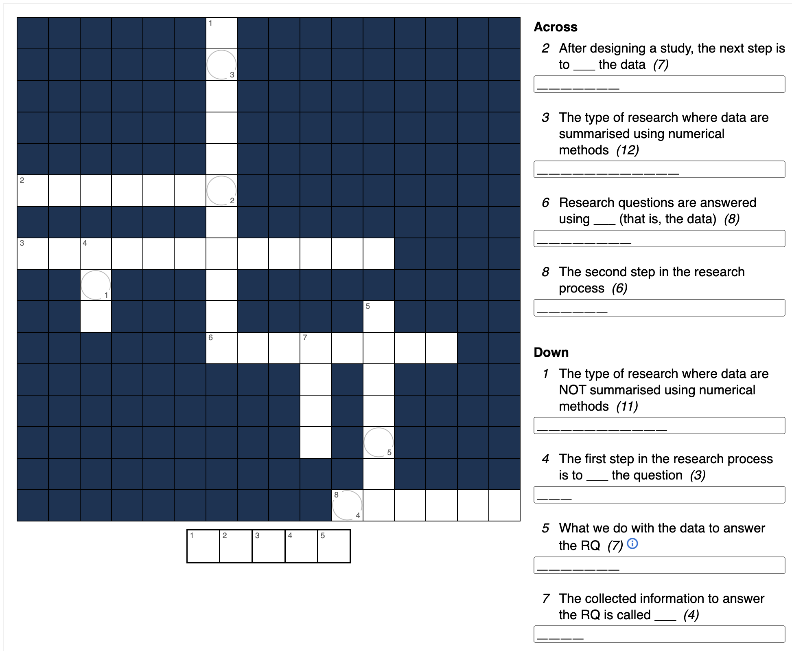

\mainmatter

# (PART) Tutorials {-}


# Teaching Week 1: tutorial {#Lecture1}

::: {.objectivesBox .objectives data-latex="{iconmonstr-target-4-240.png}"}
**Topics** covered in this tutorial:

* Types of research studies.
* Research questions.
* Language used in research.
:::


In this chapter, you will learn and practice the content associated with these chapters of the [textbook](https://bookdown.org/pkaldunn/SRM-Textbook/):

* [Chapter 1 (Research: An introduction)](https://bookdown.org/pkaldunn/SRM-Textbook/Intro.html).
* [Chapter 2 (Research questions)](https://bookdown.org/pkaldunn/SRM-Textbook/RQs.html).
* [Chapter 3 (Types of study designs)](https://bookdown.org/pkaldunn/SRM-Textbook/ResearchDesign.html).


## Quick revision {#QuickRevision-Tutorial1}

::: {.preClassBox .preClass data-latex="{iconmonstr-home-7-240.png}"}
We recommend trying these *Quick revision* questions **before** your tutorial.
:::

Consider this RQ: 

> For London take-away restaurants, is the average amount of salt in a Chinese meal the same as in an Indian meal?
>
> --- Based on @data:jaworowska2012:determination.

1.  What *type* of RQ is this?  
`r if( knitr::is_html_output() ) {webexercises::longmcq( c(
        						  "Descriptive", 
                      answer = "Relational",
                      "Interventional") )}`
1.  What is the *Outcome* in this RQ?  
`r if( knitr::is_html_output() ) {webexercises::longmcq( c(
                      "The amount of salt",
        						   answer = "The average amount of salt", 
                      "The average amount of salt in Chinese and Indian take-away meals",
                      "London take-away restaurants") )}`
1.  What would be the *response variable*?  
`r if( knitr::is_html_output() ) {webexercises::longmcq( c(
        						   "The average amount of salt", 
                      answer = "The amount of salt in each meal",
                      "The type of London take-away restaurant") )}`
1.  What would be the *unit of analysis*?  
`r if( knitr::is_html_output() ) {webexercises::longmcq( c(
        						   "The restaurants", 
                       "The meals",
                       answer = "We need more information about how the data were collected") )}`
1.  What would be the *unit of observation*?  
`r if( knitr::is_html_output() ) {webexercises::longmcq( c(
        						   "The restaurants", 
                      answer = "The meals",
                      "It's hard to know: We need more information about how the data were collected") )}`


`r if (knitr::is_latex_output()) '<!--'`
<iframe src='https://www.ferendum.com/en/embeded.php?pregunta_ID=1265006&sec_digit=609909989&embeded_digit=1998328052' style='width:100%; height:400px; overflow: auto; background: #badaff' frameBorder='0'></iframe><BR>
<A href='https://www.ferendum.com' target='_blank'>Free Online Poll Maker</A>
`r if (knitr::is_latex_output()) '-->'`


::: {.progressBox .progress}
`r if (knitr::is_html_output()) {"**Progress:**"}`
`r webexercises::total_correct()`
:::


`r webexercises::hide()`
1. **Relational**: There is a comparison (between Chinese and Indian meals), but this is **not** an interventional (as the researchers did not determine whether a meal was Chinese or Indian).
1. The **Outcome** refers to something quantitatively measured in a **group** (such as an average or percentage) that is the outcome or result of the comparison.
1. A variable is measured on an **individual**; in this case, the amount of salt in the individual meals.
1. The **unit of analysis** depends on how the data were collected.  
   Any given restaurant probably uses salt in a similar way, so if many meals were taken from each restaurant, the restaurant would be the unit of analysis.  
   Or perhaps restaurant *chains* were used and restaurants in the same chain are likely to operate in a similar way, and the restaurant chain would be the unit of analysis.  
   Or it may be the individual meals. *We need more information.* 
1. The **unit of observation** is the meal, as the salt content must be assessed from each individual meal.
<!-- 1. **Conceptual**: The definition describes what is meant by a 'takeaway meal', not how some quantity will be measured. -->
`r webexercises::unhide()`


## Research process {#ResearchProcess}

<iframe src="https://usc.h5p.com/content/1291014841891101839/embed" width="1088" height="637" frameborder="0" allowfullscreen="allowfullscreen" allow="geolocation *; microphone *; camera *; midi *; encrypted-media *"></iframe><script src="https://usc.h5p.com/js/h5p-resizer.js" charset="UTF-8"></script>


```{r, child = if (knitr::is_latex_output()) './children/TutorialQns/Lect1-Q1.Rmd'}
```


## Forming RQs {#FormingRQs}


<div style="float:right; width: 222x; border: 1px; padding:10px">

</div>


A cafe owner doesn't believe that his customers can taste the difference between diet and regular colas.

As a result, the cafe owner decides to conduct a study of his customers.

1. Two RQs that the cafe owner is considering are given below.
   Which do you prefer, and why?
    
    a. Among my customers, is the *average* customer-taste rating (on a five-point scale) the same for diet and regular cola drinks?
    b. Among my customers, is the *percentage* of customers who prefer diet cola drinks the same as the *percentage* of customers who prefer regular cola drinks?
2. Make some notes about how the cafe owner could answer the question using an **observational study**.  
        
   What would be the best type of observational study: retrospective, prospective, or cross sectional?
3. Make some notes about how the cafe owner could answer the question using an **experimental study**.  
   What would be the best type of experimental study: true or quasi?
4. List some **advantages** and **disadvantages** of the experimental and observational studies.  

   List some **similarities** and **differences** between the two studies.  
   
   Which do you think would be the better study?
   Why?


<!-- // See: https://www.developerdrive.com/allowing-users-to-edit-text-content-with-html5/ -->


<!-- <div id="edit" contenteditable="true"> -->
<!-- Enter your answer here. -->
<!-- </div> -->

<!-- <input type="button" onload="checkEdits()" value="Save my answers" onclick="saveEdits()"/> -->

<!-- <div id="update"> (NOTE: Click the button above to save your answer)</div> -->


## Terminology {#UnderstandingTerminology1}

Explain the *fundamental differences* between the following pairs of often-confused terms (Table \@ref(tab:SimilarTerms)).

```{r SimilarTerms, echo=FALSE}
Terms <- array( dim = c(8, 3))

Terms[1, ] <- c("Hypothesis", 
                "1", 
                "Research question") 
Terms[2, ] <- c("Relational RQ", 
                "2", 
                "Interventional RQ") 
Terms[3, ] <- c("Observational study", 
                "3", 
                "Experimental study") 
Terms[4, ] <- c("Quasi-experiment", 
                "4", 
                "True experiment") 
Terms[5, ] <- c("Response variable", 
                "5", 
                "Explanatory variable") 
Terms[6, ] <- c("Response variable", 
                "6", 
                "Outcome") 
Terms[7, ] <- c("Conceptual definition", 
                "7", 
                "Operational definition")
Terms[8, ] <- c("Unit of observation", 
                "8", 
                "Unit of analysis")

if( knitr::is_latex_output() ) {
  kable(Terms, 
      booktabs = TRUE,
      format = "latex",
      caption = "Distinguish the similar terms",
      linesep = c("", "\\addlinespace", "", "\\addlinespace", "", "\\addlinespace", "", ""), 
      align = c("r", "c", "l")) %>%
  column_spec(2, bold = TRUE) %>%
  kable_styling(full_width = FALSE)
}

if( knitr::is_html_output() ) {
  kable(Terms, 
      booktabs = TRUE,
      format = "html",
      caption = "Distinguish the similar terms",
      linesep = c("", "\\addlinespace", "", "", "\\addlinespace", "", ""), 
      align = c("r", "c", "l")) %>%
  column_spec(2, bold = TRUE) %>%
  kable_styling(full_width = FALSE)
}
```


## Terminology {#UnderstandingTerminology2}

<iframe src="https://usc.h5p.com/content/1291014806925066159/embed" width="1088" height="637" frameborder="0" allowfullscreen="allowfullscreen" allow="geolocation *; microphone *; camera *; midi *; encrypted-media *"></iframe><script src="https://usc.h5p.com/js/h5p-resizer.js" charset="UTF-8"></script>


```{r, child = if (knitr::is_latex_output()) './children/TutorialQns/Lect1-Q4.Rmd'}
```


## Creating research questions and studies {#CreateRQs}


<!-- Text wrap from: https://stackoverflow.com/questions/43551312/wrap-text-around-plots-in-markdown -->
<!-- Trick from: https://blog.earo.me/2019/10/26/reduce-frictions-rmd/ -->
`r if (knitr::is_latex_output()) '<!--'`
```{r, echo=FALSE, out.width= "40%", out.extra='style="float:right; padding:10px"'}
include_graphics("Illustrations/pexels-nappy-936019.jpg")
```
`r if (knitr::is_latex_output()) '-->'`


Consider the following scenario:

> While at Cafe C one day enjoying a small, organic, almond-milk, half-strength, decaffeinated latte (sometimes called a *Why-Bother*...), Nim sighed, 'Exams start next week.  
> I suppose we'll all start feeling stressed soon.'  
> &nbsp;
>
> 'Ah,' Jane said, 'I had better buy more teabags then.'  
> &nbsp;
>
> 'Tea bags? Why?'' asked Nim, not unreasonably.  
> &nbsp;
>
> 'Everyone knows that Earl Grey tea relaxes students...' said Jane, looking upwards then closing her eyes dreamily.   
> &nbsp;
>
> 'How do you know?' Nim retorted, unintentionally aggressive.  
> &nbsp;
>
> 'It *does*,' snapped Jane.
> 'Earl Grey relaxes people.'  
>  
>  &nbsp;


Nim considers studying Jane's assertion as a **practical** SCI110 project.

1. Nim needs to determine a *population* to study.  
   Which of these would be a useful and practical population to use? Or is there a different population that is 'better' to use?  
   Explain your reasoning.
    a. All university students.
    b. Female university students about to do an exam.
    c. USC students.
    d. Queensland university students.      	 

2. Identify an *outcome* that Nim can measure to answer the research question.  
   Justify your answer.
3. Which of these *comparisons* do you think Nim should use? Why?
    a. Between drinking Earl Grey tea and coffee.
    b. Between drinking Earl Grey tea and black (ordinary) tea.
    c. Between drinking Earl Grey tea and water.
    d. Between exam time and other times of the semester.
    e. Between students and non-students.
4. Explain why 'Between before and after drinking Earl Grey tea' is *not* a comparison.
5. Construct a well-worded *interventional* research question that Nim can ask to assess Jane's assertion,
   clearly identifying P, O, C and I.
6. *Briefly* describe how to set up an *experimental* study for answering your proposed research question.
7. Construct a well-worded *relational* research question that Nim can ask to assess Jane's assertion, clearly identifying P, O and C.
8. *Briefly* describe how to set up an *observational* study for answering your proposed research question.
9. List any necessary operational and conceptual definitions. (You do not need to *give* the definitions.)
10. Using this research question, identify the response and explanatory variables, and hence the data that *needs* to be collected to answer the question.

    
    
    
    


## Identifying units of analysis and units of observation {#Units}


<!-- Text wrap from: https://stackoverflow.com/questions/43551312/wrap-text-around-plots-in-markdown -->
<!-- Trick from: https://blog.earo.me/2019/10/26/reduce-frictions-rmd/ -->
`r if (knitr::is_latex_output()) '<!--'`
```{r, echo=FALSE, out.width= "30%", out.extra='style="float:right; padding:10px"'}
include_graphics("Illustrations/chuttersnap-BofgeVFG-_w-unsplash.jpg")
```
`r if (knitr::is_latex_output()) '-->'`


Bamboo is a fast-growing, strong grass often used for green building practices.
A small research study explored the hardness of bamboo when used as flooring material.

The *Janka hardness*^[The Janka hardness measures the force required to embed an 11.28mm steel ball into wood to half the diameter of the ball.]
of bamboo flooring provided by Bamboo Flooring Australia Pty Ltd was measured by the Queensland Department of Primary Industries [@data:Gerber:BambooFlooring].

Five floorboards were taken, and two hardness measurements were taken on each board  (units not given, but probably kilonewtons; Table \@ref(tab:JankaBoards)).


```{r JankaBoards, echo=FALSE}
Janka <- array( dim = c(2, 5))
colnames(Janka) <- c("Board 1", 
                     "Board 2", 
                     "Board 3", 
                     "Board 4", 
                     "Board 5")

Janka[1, ] <- c(10.5, 8.0, 11.5, 10.3, 10.2)
Janka[2, ] <- c( 7.5, 8.0, 11.2, 9.9, 9.3)

if( knitr::is_latex_output() ) {
  kable(Janka,
      format = "latex",
      caption = "Two Janka hardness measurements from five different bamboo boards",
      longtable = FALSE,
      booktabs = TRUE,
      align = "r") %>%
  row_spec(0, bold = TRUE) %>%
  kable_styling(full_width = FALSE)
}
if( knitr::is_html_output() ) {
  kable(Janka,
      format = "html",
      caption = "Two Janka hardness measurements from five different bamboo boards",
      longtable = FALSE,
      booktabs = TRUE,
      align = "r") %>%
  row_spec(0, bold = TRUE) %>%
  kable_styling(full_width = FALSE)
}
```

1. What is the unit of analysis: The test, the board, each measurement, kilonewtons, or something else? Explain your answer.
2. How many units of analysis are there?
3. How many units of observation are there?
4. Suppose the measurements were all taken from 10 *different* places on the *same* board (rather than from five different boards). How many units of analysis are there now? Explain your answer.
5. Comment on the amount of variation *between* the boards compared to the amount of variation *within* boards.


## **Optional**: Identifying different types of studies {#TypesOfStudies}

::: {.optionalBox .optional data-latex="{iconmonstr-help-4-240.png}"}
This question is **optional**; for example, if you need more practice, or you are studying for the exam.
:::

`r if (knitr::is_latex_output()) {
   '*(Answers are available in Sect.\\@ref(Lecture1Answers))*'
}`

<iframe src="https://usc.h5p.com/content/1290971665016398309/embed" width="1088" height="637" frameborder="0" allowfullscreen="allowfullscreen" allow="geolocation *; microphone *; camera *; midi *; encrypted-media *"></iframe><script src="https://usc.h5p.com/js/h5p-resizer.js" charset="UTF-8"></script>


```{r, child = if (knitr::is_latex_output()) './children/TutorialQns/Lect1-Q8.Rmd'}
```


## **Optional**: Terminology {#TerminologyLect1}

::: {.optionalBox .optional data-latex="{iconmonstr-help-4-240.png}"}
This question is **optional**; for example, if you need more practice, or you are studying for the exam.
:::

`r if (knitr::is_latex_output()) {
   '*(Answers are available in Sect.\\@ref(Lecture1Answers))*'
}`

Complete the crossword
`r if (knitr::is_latex_output()){
   'in Fig. \\@ref(fig:Crossword-Week1-Terminology)'
} else {
   'below'
}`
to help you understand some of the words used in this week's content.


<!-- <script src="https://www.puzzlefast.com/en/puzzles/2020032202163752N/nsl-script?width=600px&height=900px" type="text/javascript"></script> -->


<iframe src="https://usc.h5p.com/content/1291418275333983599/embed" width="1088" height="637" frameborder="0" allowfullscreen="allowfullscreen" allow="geolocation *; microphone *; camera *; midi *; encrypted-media *"></iframe><script src="https://usc.h5p.com/js/h5p-resizer.js" charset="UTF-8"></script>


```{r Crossword-Week1-Terminology, echo=FALSE, fig.cap="A crossword to complete", fig.align="center", out.width='85%', eval=is_latex_output()}

```


## **Optional**: Identifying poor RQs {#IdentifyingPoorRQs}

::: {.optionalBox .optional data-latex="{iconmonstr-help-4-240.png}"}
This question is **optional**; for example, if you need more practice, or you are studying for the exam.
:::

`r if (knitr::is_latex_output()) {
   '*(Answers are available in Sect.\\@ref(Lecture1Answers))*'
}`

Critique the following research questions, outlining how and why they can be improved (if at all).

1. Among domestic watertanks used in southeast Queensland, are lead concentrations in water in concrete tanks higher than in poly tanks?
2. Are lower-limb amputees more likely to die? 
3. Is the amount of salt the same for homebrand as for non-homebrand beans?
4. Among zoo animals, is the weight of adult elephants greater than that of juvenile kangaroos (joeys)?
5. Is the average reaction time related to gender?

What terms might need defining for each RQ?


## **Optional**: Understanding the terminology {#TerminologyLead}


::: {.optionalBox .optional data-latex="{iconmonstr-help-4-240.png}"}
This question is **optional**; for example, if you need more practice, or you are studying for the exam.
:::


`r if (knitr::is_latex_output()) {
   '*(Answers are available in Sect.\\@ref(Lecture1Answers))*'
}`


<iframe src="https://usc.h5p.com/content/1291038891992762249/embed" width="1088" height="637" frameborder="0" allowfullscreen="allowfullscreen" allow="geolocation *; microphone *; camera *; midi *; encrypted-media *"></iframe><script src="https://usc.h5p.com/js/h5p-resizer.js" charset="UTF-8"></script>


```{r, child = if (knitr::is_latex_output()) './children/TutorialQns/Lect1-Q10.Rmd'}
```


## **Optional**: Units of analysis, and units of observation {#Units2}

<!-- ADAPTED FROM : Oehlert.pdf, p. 8. -->

::: {.optionalBox .optional data-latex="{iconmonstr-help-4-240.png}"}
This question is **optional**; for example, if you need more practice, or you are studying for the exam.
:::

`r if (knitr::is_latex_output()) {
   '*(Answers are available in Sect.\\@ref(Lecture1Answers))*'
}`


<iframe src="https://usc.h5p.com/content/1290971658775044979/embed" width="1088" height="637" frameborder="0" allowfullscreen="allowfullscreen" allow="geolocation *; microphone *; camera *; midi *; encrypted-media *"></iframe><script src="https://usc.h5p.com/js/h5p-resizer.js" charset="UTF-8"></script>


```{r, child = if (knitr::is_latex_output()) './children/TutorialQns/Lect1-Q11.Rmd'}
```


## **Optional**: Units of analysis, and units of observation {#Units3}

::: {.optionalBox .optional data-latex="{iconmonstr-help-4-240.png}"}
This question is **optional**; for example, if you need more practice, or you are studying for the exam.
:::

`r if (knitr::is_latex_output()) {
   '*(Answers are available in Sect.\\@ref(Lecture1Answers))*'
}`

<iframe src="https://usc.h5p.com/content/1290971662517623069/embed" width="1088" height="480" frameborder="0" allowfullscreen="allowfullscreen" allow="geolocation *; microphone *; camera *; midi *; encrypted-media *"></iframe><script src="https://usc.h5p.com/js/h5p-resizer.js" charset="UTF-8"></script>


```{r, child = if (knitr::is_latex_output()) './children/TutorialQns/Lect1-Q12.Rmd'}
```


