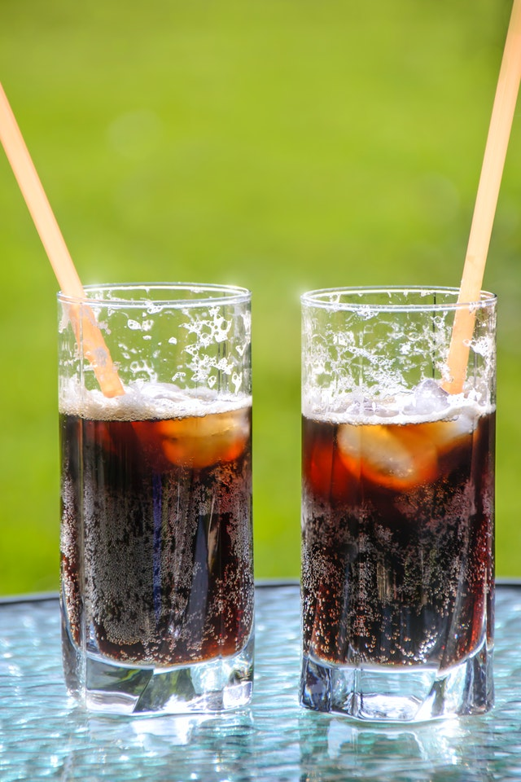
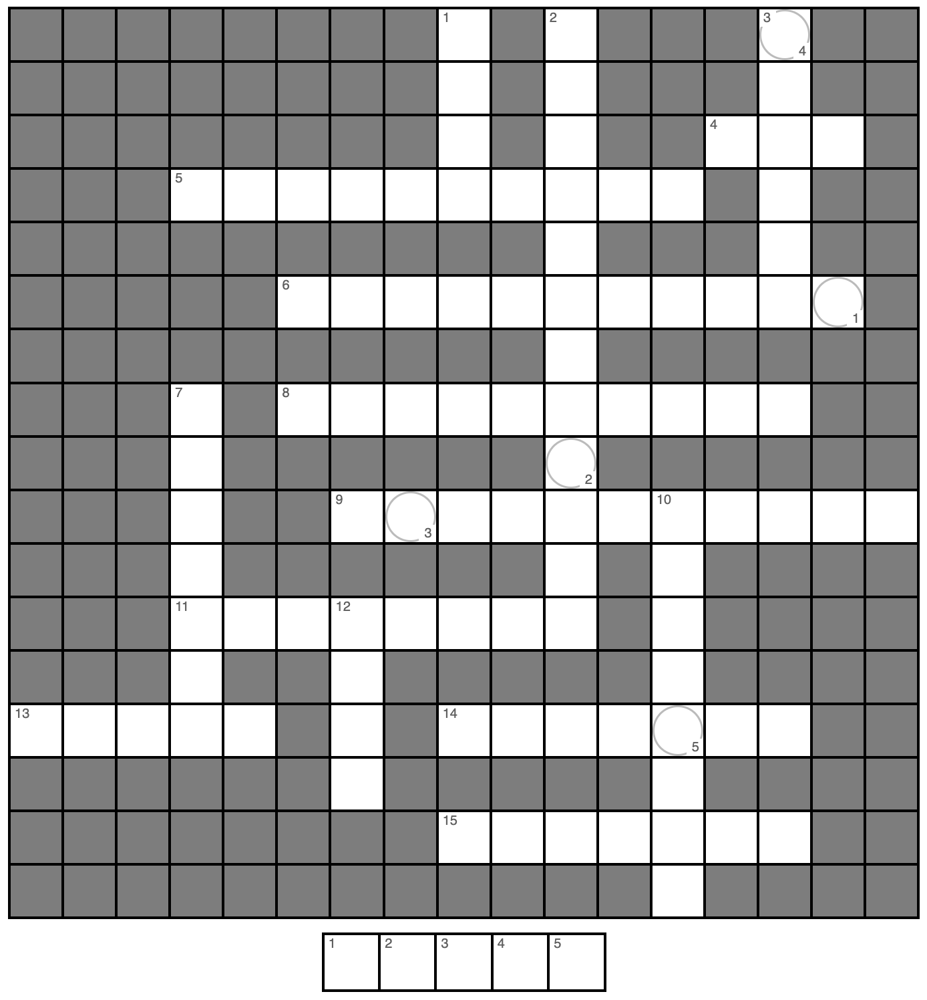

\mainmatter

# Teaching Week 1: tutorial {#Lecture1}

::: {.objectivesBox .objectives data-latex="{iconmonstr-target-4-240.png}"}
You will learn to:

* identify types of research studies.
* ask quantitative research questions.
* use and understand the language used in research.
:::


::: {.assessmentBox .assessment data-latex="{iconmonstr-text-check-list-lined-240.png}"}
The Week\ 1 content is essential for:

* **Task\ 2A**, where you need to *write your own RQ*;
* **Quiz\ 1**, which includes questions about *writing RQs and RQ components*; and
* the **Exam**, which will contain questions about *RQs*
:::


::: {.readBox .read data-latex="{iconmonstr-school-15-240.png}"}
You will learn and practice the content associated with these chapters of the [textbook](https://peterkdunn.github.io/SRM-Textbook/):

* [Chapter 1 (Research: an introduction)](https://peterkdunn.github.io/SRM-Textbook/Intro.html).
* [Chapter 2 (Research questions)](https://peterkdunn.github.io/SRM-Textbook/RQs.html).
* [Chapter 3 (Overview of research design)](https://peterkdunn.github.io/SRM-Textbook/FactorsInfluenceY.html).
* [Chapter 4 (Types of research studies)](https://peterkdunn.github.io/SRM-Textbook/ResearchDesign.html).
:::


\pagebreak


## Quick revision {#QuickRevision-Tutorial1}

::: {.preClassBox .preClass data-latex="{iconmonstr-home-7-240.png}"}
We **strongly** recommend trying these *Quick revision* questions **before** your tutorial.
:::

::: {.webex-check .webex-box}
Consider this RQ (based on @data:jaworowska2012:determination): 

> For London take-away restaurants, is the average amount of salt in a Chinese meal the same as in an Indian meal?

1.  What *type* of RQ is this? 
    Explain.\tightlist
`r if( knitr::is_html_output() ) {webexercises::longmcq( c(
        						  "Descriptive", 
                      answer = "Relational",
                      "Repeated-measures",
                      "Correlational") )} else {'Descriptive, relational, repeated-measures or correlational?'}`
\greyboxlines{1}
2.  What is the *purpose* this RQ? 
    Explain.\tightlist
`r if( knitr::is_html_output() ) {webexercises::longmcq( c(
        						  "Estimation", 
                      answer = "Decision-making") )} else {'Estimation or decision-making?'}`
\greyboxlines{1}
3. Is an *intervention* present? 
   Explain.\tightlist
`r if( knitr::is_html_output() ) {webexercises::longmcq( c(
        						  "Yes", 
                      answer = "No") )} else {'\\null'}`
\greyboxlines{1}
4. What is the *outcome* in this RQ?
   Explain.
`r if( knitr::is_html_output() ) {webexercises::longmcq( c(
                      "The amount of salt in each meal",
        						   answer = "The average amount of salt", 
                      "The average amount of salt in Chinese and Indian take-away meals",
                      "London take-away restaurants") )} else {'\\null'}`
\greyboxlines{1}
5. What is the *response variable*?
`r if( knitr::is_html_output() ) {webexercises::longmcq( c(
        						   "The average amount of salt", 
                      answer = "The amount of salt in each meal",
                      "The type of London take-away restaurant") )} else {'\\null'}`
\greyboxlines{1}
6. What is the *unit of analysis*?
   Explain.
`r if( knitr::is_html_output() ) {  webexercises::longmcq( c(
        						   "Each restaurant", 
                       "Each meal",
                       answer = "We need more information about how the data were collected") )} else {'\\null'}`
\greyboxlines{1}
7. What is the *unit of observation*?
   Explain.
`r if( knitr::is_html_output() ) {webexercises::longmcq( c(
        						   "Each restaurant", 
                      answer = "Each meal",
                      "It's hard to know: we need more information about how the data were collected") )} else {'\\null'}`
\greyboxlines{1}
8. The article states (p. 518) that "a takeaway meal was defined as food purchased from out of home food outlets or ordered for home delivery".
   What *type* of definition is this?
`r if( knitr::is_html_output() ) {webexercises::longmcq( c(
        						   "Operational ", 
                      answer = "Conceptual") )} else {'\\null'}`
\greyboxlines{1}
:::


`r if (knitr::is_latex_output()) '<!--'`
`r webexercises::hide()`
1. **Relational**: there is a comparison (between Chinese and Indian meals).
1. **No**: the researchers did not determine whether a meal was Chinese or Indian.
1. The **Outcome** refers to something quantitatively measured in a **group** (such as an average or percentage) that is the outcome or result of the comparison.
1. A variable is measured on an **individual**; in this case, the amount of salt in the individual meals.
1. The **unit of analysis** depends on how the data were collected.  
   Any given restaurant probably uses salt in a similar way, so if many meals were taken from each restaurant, the restaurant would be the unit of analysis.  
   Or perhaps restaurant *chains* were used and restaurants in the same chain are likely to operate in a similar way, and the restaurant chain would be the unit of analysis.  
   Or it may be the individual meals. *We need more information.* 
1. The **unit of observation** is the meal, as the salt content must be assessed from each individual meal.
1. Conceptual: it defines what a word or term means.
`r webexercises::unhide()`
`r if (knitr::is_latex_output()) '-->'`


## Research process {#ResearchProcess}

<iframe src="https://usc.h5p.com/content/1291014841891101839/embed" width="1088" height="637" frameborder="0" allowfullscreen="allowfullscreen" allow="geolocation *; microphone *; camera *; midi *; encrypted-media *"></iframe><script src="https://usc.h5p.com/js/h5p-resizer.js" charset="UTF-8"></script>


```{r, child = if (knitr::is_latex_output())  './children/TutorialQns/01-ResearchSteps.Rmd'}
```


## Forming RQs {#FormingRQs}


<div style="float:right; width: 222x; border: 1px; padding:10px">

</div>


A `r readr::parse_character( c("café"), locale = locale(encoding = "UTF-8"))` owner doesn't believe that his customers can taste the difference between diet and regular colas.
As a result, the owner decides to conduct a study of his customers.

1. Two RQs that the `r readr::parse_character( c("café"), locale = locale(encoding = "UTF-8"))` owner is considering are given below.
   Which do you prefer, and why? \tightlist
    
    a. Among my customers, is the *average* customer-taste rating (on a five-point scale) the same for diet and regular cola drinks?
    b. Among my customers, is the *percentage* of customers who prefer diet cola drinks the same as the *percentage* of customers who prefer regular cola drinks?
\greyboxlines{2}
1. Develop your own RQ to answer the `r readr::parse_character( c("café"), locale = locale(encoding = "UTF-8"))` owner's question, by carefully and precisely describing P, O, C and I (where relevant).
\greyboxlines{3}
1. Make notes about *how* the `r readr::parse_character( c("café"), locale = locale(encoding = "UTF-8"))` owner could gather data to answer the RQ.
\greyboxlines{3}


<!-- // See: https://www.developerdrive.com/allowing-users-to-edit-text-content-with-html5/ -->


<!-- <div id="edit" contenteditable="true"> -->
<!-- Enter your answer here. -->
<!-- </div> -->

<!-- <input type="button" onload="checkEdits()" value="Save my answers" onclick="saveEdits()"/> -->

<!-- <div id="update"> (NOTE: Click the button above to save your answer)</div> -->


## Terminology {#UnderstandingTerminology1}

Explain the *fundamental differences* between the following pairs of often-confused terms (Table\ \@ref(tab:SimilarTerms)), highlighting the important differences.


```{r SimilarTerms, echo=FALSE}
Terms <- array( dim = c(8, 3))

Terms[1, ] <- c("Hypothesis", 
                "$\\blacktriangleleft$ Pair 1 $\\blacktriangleright$", 
                "Research question") 
Terms[2, ] <- c("Relational RQ", 
                "$\\blacktriangleleft$ Pair 2 $\\blacktriangleright$", 
                "Repeated-measures RQ") 
Terms[3, ] <- c("Response variable", 
                "$\\blacktriangleleft$ Pair 3 $\\blacktriangleright$", 
                "Explanatory variable") 
Terms[4, ] <- c("Response variable", 
                "$\\blacktriangleleft$ Pair 4 $\\blacktriangleright$", 
                "Outcome") 
Terms[5, ] <- c("Observational study", 
                "$\\blacktriangleleft$ Pair 5 $\\blacktriangleright$", 
                "Experimental study") 
Terms[6, ] <- c("Quasi-experiment", 
                "$\\blacktriangleleft$ Pair 6 $\\blacktriangleright$", 
                "True experiment") 
Terms[7, ] <- c("Conceptual definition", 
                "$\\blacktriangleleft$ Pair 7 $\\blacktriangleright$", 
                "Operational definition")
Terms[8, ] <- c("Unit of observation", 
                "$\\blacktriangleleft$ Pair 8 $\\blacktriangleright$", 
                "Unit of analysis")

if( knitr::is_latex_output() ) {
  kable(Terms, 
      booktabs = TRUE,
      format = "latex",
      escape = FALSE,
      caption = "Distinguish the similar terms.",
      linesep = c("", "\\addlinespace", "", "\\addlinespace", "", "\\addlinespace", "", ""), 
      align = c("r", "c", "l")) %>%
  column_spec(2, bold = TRUE) %>%
  kable_styling(full_width = FALSE,
                font_size = 10)
}

if( knitr::is_html_output() ) {
  kable(Terms, 
      booktabs = TRUE,
      format = "html",
      caption = "Distinguish the similar terms.",
      linesep = c("", "\\addlinespace", "", "", "\\addlinespace", "", ""), 
      align = c("r", "c", "l")) %>%
  column_spec(2, bold = TRUE) %>%
  kable_styling(full_width = FALSE)
}
```


## Terminology {#UnderstandingTerminology2}

<iframe src="https://usc.h5p.com/content/1291014806925066159/embed" width="1088" height="637" frameborder="0" allowfullscreen="allowfullscreen" allow="geolocation *; microphone *; camera *; midi *; encrypted-media *"></iframe><script src="https://usc.h5p.com/js/h5p-resizer.js" charset="UTF-8"></script>


```{r, child = if (knitr::is_latex_output()) './children/TutorialQns/01-Terminology-Phones.Rmd'}
```


## Creating research questions and studies {#CreateRQs}


<!-- Text wrap from: https://stackoverflow.com/questions/43551312/wrap-text-around-plots-in-markdown -->
<!-- Trick from: https://blog.earo.me/2019/10/26/reduce-frictions-rmd/ -->
`r if (knitr::is_latex_output()) '<!--'`
```{r, echo=FALSE, out.width= "40%", out.extra='style="float:right; padding:10px"'}

```
`r if (knitr::is_latex_output()) '-->'`


Consider the following scenario:

> While at `r readr::parse_character( c("Café"), locale = locale(encoding = "UTF-8"))`\ C one day enjoying a small, organic, almond-milk, half-strength, decaffeinated latte (sometimes called a *Why-Bother*...), Nim sighed, 'Exams start next week.
> I suppose we'll all start feeling stressed soon.'  
> &nbsp;
>
> 'Ah,' Jane said, 'I had better buy more teabags then.'  
> &nbsp;
>
> 'Tea bags? Why?' asked Nim, eyebrows raised.  
> &nbsp;
>
> 'Everyone knows that Earl Grey tea relaxes students...' said Jane dreamily.   
> &nbsp;
>
> 'How do you know that?' Nim said.  
> &nbsp;
>
> 'It *does*,' snapped Jane.
> 'Earl Grey relaxes people.'  
>  
>  &nbsp;


Nim considers studying Jane's assertion as the basis for a **feasible** and **practical** SCI110 project.

1. Nim needs to determine a *population* to study.
   Which of these would be a useful and practical population to use?
   Or is there a different population that is 'better' to use?
   Explain.
    a. All university students.
    b. Female university students about to do an exam.
    c. UniSC students.
    d. Queensland university students.      	 
2. Identify an *outcome* that Nim can measure to answer the research question.
   Justify your answer.
\greyboxlines{3}
3. Which of these *between-individuals comparisons* do you think Nim should use?
   Why?
    a. Between drinking Earl Grey tea and coffee.
    b. Between drinking Earl Grey tea and black (ordinary) tea.
    c. Between drinking Earl Grey tea and water.
    d. Between exam time and other times of the semester.
    e. Between students and non-students.
4. Explain why 'Between before and after drinking Earl Grey tea' is a *within-individuals* comparison.
\greyboxlines{3}
5. Construct a well-worded *relational* research question *with an intervention* that Nim can ask to assess Jane's assertion, clearly identifying P, O, C and I.
\greyboxlines{3}
6. *Briefly* describe an *experimental* study for answering your proposed research question.
\greyboxlines{3}
7. Construct a well-worded *relational* research question *without an intervention* that Nim can ask to assess Jane's assertion, clearly identifying P, O and C.
\greyboxlines{3}
8. *Briefly* describe an *observational* study for answering your proposed research question.
\greyboxlines{3}
9. List any necessary word or terms that need operational or conceptual definitions. 
   (You do not need to *give* the definitions.)
\greyboxlines{3}
10. Using this research question, identify the response and explanatory variables, and hence the data that *needs* to be collected to answer the question.
\greyboxlines{2}


## Identifying units of analysis and units of observation {#Units}


<!-- Text wrap from: https://stackoverflow.com/questions/43551312/wrap-text-around-plots-in-markdown -->
<!-- Trick from: https://blog.earo.me/2019/10/26/reduce-frictions-rmd/ -->
`r if (knitr::is_latex_output()) '<!--'`
```{r, echo=FALSE, out.width= "30%", out.extra='style="float:right; padding:10px"'}

```
`r if (knitr::is_latex_output()) '-->'`


Bamboo is a fast-growing, strong grass often used for environmentally-friendly building practices.
A small research study explored the hardness of bamboo when used as flooring material.

The *Janka hardness*^[The force required to embed an $11.28\mms$ steel ball into wood to a depth of half the diameter of the ball.] of bamboo flooring provided by Bamboo Flooring Australia Pty Ltd was measured by the Queensland Department of Primary Industries [@data:Gerber:BambooFlooring].
Five floorboards had two hardness measurements taken on *each* board  (units probably kilonewtons; Table\ \@ref(tab:JankaBoards)).


```{r JankaBoards, echo=FALSE}
Janka <- array( dim = c(2, 5))
colnames(Janka) <- c("Board 1", 
                     "Board 2", 
                     "Board 3", 
                     "Board 4", 
                     "Board 5")

Janka[1, ] <- c(10.5, 8.0, 11.5, 10.3, 10.2)
Janka[2, ] <- c( 7.5, 8.0, 11.2, 9.9, 9.3)

if( knitr::is_latex_output() ) {
  kable(pad(Janka,
            decDigits = 1,
            targetLength=c(5, 4, 5, 5, 5)),
      format = "latex",
      escape = FALSE,
      caption = "Two Janka hardness measurements from five different bamboo boards..",
      longtable = FALSE,
      booktabs = TRUE,
      align = "c") %>%
  row_spec(0, bold = TRUE) %>%
  kable_styling(full_width = FALSE,
                font_size = 10)
}
if( knitr::is_html_output() ) {
  kable(Janka,
      format = "html",
      caption = "Two Janka hardness measurements from five different bamboo boards",
      longtable = FALSE,
      booktabs = TRUE,
      align = "r") %>%
  row_spec(0, bold = TRUE) %>%
  kable_styling(full_width = FALSE)
}
```

1. What is the unit of analysis: the test, the board, the Janka hardness, each measurement, kilonewtons, or something else? 
   Explain your answer.
\greyboxlines{2}
2. *How many* units of analysis are there?
\greyboxlines{1}
3. *How many* units of observation are there?
\greyboxlines{1}
4. Suppose the measurements were all taken from $10$\ *different* places on the *same* board (rather than from five different boards).
   How many units of analysis are there now?
   Explain your answer.
\greyboxlines{3}
5. Comment on the amount of variation *between* the boards compared to the amount of variation *within* boards.
\greyboxlines{2}


## **Optional questions** {#OptionalTW1}


::: {.optionalBox .optional data-latex="{iconmonstr-help-4-240.png}"}
These questions are **optional**; e.g., if you need more practice, or you are studying for the exam.
(Answers appear in Sect.\ \@ref(Lecture1Answers).)
:::


### **(Optional)**  Identifying different types of studies {#TypesOfStudies}

<iframe src="https://usc.h5p.com/content/1290971665016398309/embed" width="1088" height="637" frameborder="0" allowfullscreen="allowfullscreen" allow="geolocation *; microphone *; camera *; midi *; encrypted-media *"></iframe><script src="https://usc.h5p.com/js/h5p-resizer.js" charset="UTF-8"></script>


```{r, child = if (knitr::is_latex_output()) './children/TutorialQns/01-IdentifyStudyTypes.Rmd'}
```


\pagebreak


### **(Optional)**  Terminology {#TerminologyLect1}

Complete the crossword
`r if (knitr::is_latex_output()){
   'in Fig. \\@ref(fig:Crossword-Week1-Terminology)'
} else {
   'below'
}`
to help you understand some of the words used in the content.


<!-- <script src="https://www.puzzlefast.com/en/puzzles/2020032202163752N/nsl-script?width=600px&height=900px" type="text/javascript"></script> -->


<iframe src="https://usc.h5p.com/content/1291418275333983599/embed" width="1088" height="637" frameborder="0" allowfullscreen="allowfullscreen" allow="geolocation *; microphone *; camera *; midi *; encrypted-media *"></iframe><script src="https://usc.h5p.com/js/h5p-resizer.js" charset="UTF-8"></script>


```{r Crossword-Week1-Terminology, echo=FALSE, fig.cap="A crossword to complete.", fig.align="center", out.width='70%', eval=is_latex_output()}

```


`r if (knitr::is_html_output()){'<!--'}`
\begin{multicols}{2}\small

\textbf{Across}
\begin{enumerate}\tightlist
  \item[\textbf{4.}] 
  The first step in the research process is to \verb|___| the research question (3)  
  \item[\textbf{5.}]
  RQs in which groups are compared numerically are called \verb|__________| (10)  
  \item[\textbf{6.}]
  `Conceptual' and `Operational' are different types of \verb|___________| (11)  
  \item[\textbf{8.}]
  RQs may be decision making-type RQs or \verb|__________|-type RQs (10)  
  \item[\textbf{9.}]
  The type of research where data are \emph{not} summarised using numerical methods (11)  
  \item[\textbf{11.}]
  Research is used to provide \verb|________|-based answers to RQs (8)  
  \item[\textbf{13.}]
  The sample size is the number of \verb|_____| of analysis (5)  
  \item[\textbf{14.}]
  What we do with the data to find an answer to the RQ (7)  
  \item[\textbf{15.}]
  A confounding variable, but is not measured or recorded, is a \verb|_______| variable (7)

\end{enumerate}

\columnbreak

\textbf{Down}
\begin{itemize}\tightlist
  \item[\textbf{1.}]
  The acronym to remember the four components of a RQ (4)
  \item[\textbf{2.}]
  The type of research where data are summarised using numerical methods (and is studied in SCI110) (12)  
  \item[\textbf{3.}]
  The second step in the research process (6)  
  \item[\textbf{7.}]
  After designing a study, the next step is to \verb|_______| the data (7)  
  \item[\textbf{10.}]
  Independent collections of units of observations are called unit of \verb|________| (8)
  \item[\textbf{12.}]
  The collected information to answer the RQ is called \verb|____| (4)  

\end{itemize}
\end{multicols}
`r if (knitr::is_html_output()){'-->'}`


