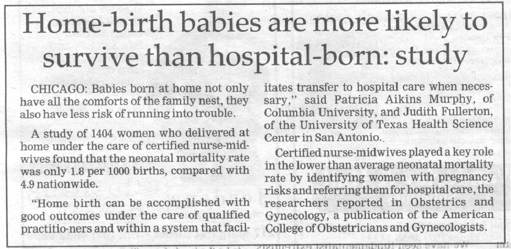
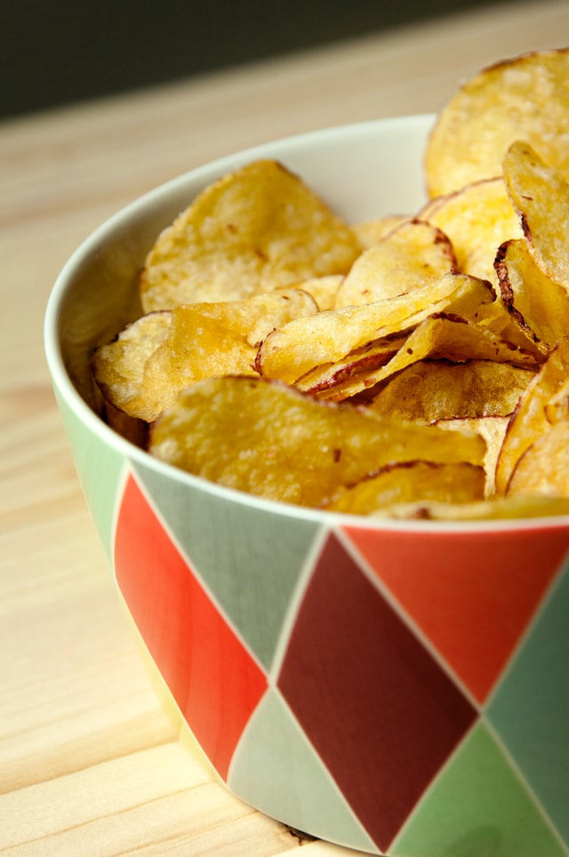
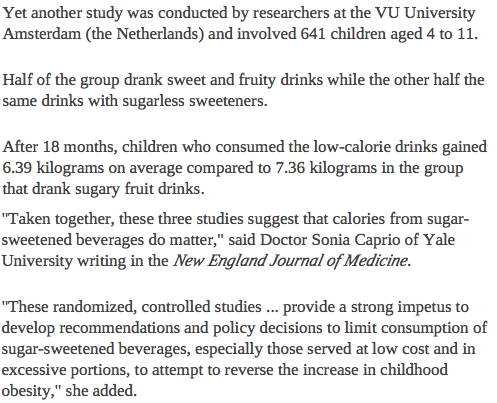

# Teaching Week 2: tutorial {#Lecture2}


```{block2, type="rmdobjectives"}
**Topics** covered in this tutorial:

* Design of studies.
* Language used in research.

```

In this chapter, you will learn and practice the content associated with these chapters of the [textbook](https://bookdown.org/pkaldunn/Book/):

* [Chapter 4 (Ethics in research)](https://bookdown.org/pkaldunn/Book/Ethics.html).
* [Chapter 5 (External validity: Sampling)](https://bookdown.org/pkaldunn/Book/Sampling.html).
* [Chapter 6 (Overview of internal validity)](https://bookdown.org/pkaldunn/Book/FactorsInfluenceY.html).
* [Chapter 7 (Internal validity and experimental studies)](https://bookdown.org/pkaldunn/Book/DesignExperiment.html).
* [Chapter 8 (Internal validity and observational studies)](https://bookdown.org/pkaldunn/Book/DesignObservational.html).
* [Chapter 9 (Identifying study limitations)](https://bookdown.org/pkaldunn/Book/Interpretation.html).
* [Chapter 10 (Procedures for collecting data)](https://bookdown.org/pkaldunn/Book/CollectingDataProcedures.html).


## Quick revision {#QuickRevision-Tutorial2}

```{block2, type = "rmdPreClass"}
We recommend trying these *Quick revision* questions **before** your tutorial.
```

Consider this (qualitative) RQ: 

> What factors are preventing the adoption of household solar technologies in Santiago [Chile]? 
>
> --- @walters2018factors


1. For this RQ, what is the *Population*?  
`r if( knitr::is_html_output() ) {mcq( c(
                      "Households", 
		                  "Households in Chile",
                      answer = "Households in Santiago",
                      "Solar technologies") )}`
2. The study will be *externally valid* if:  
`r if( knitr::is_html_output() ) {mcq( c(
                      "the sample is representative of all households in the world",
		                  "the sample is representative of all solar technologies",
                      answer = "the sample is representative of all households in Santiago",
                      "the sample is representative of all households in Chile") )}`
3.  Suppose the researchers mailed surveys to all households in Santiago, and people returned the survey if they wished to. What is the *best* description of this sampling method?  
`r if( knitr::is_html_output() ) {mcq( c(
                      answer = "Self-selecting", 
                      "Systematic",
                      "Convenience") )}`
4.  Suppose the researchers randomly selected five suburbs in Santiago; then ten streets within each of these suburbs; then ten households within each of these streets. What is the *best* description of this sampling method?  
`r if( knitr::is_html_output() ) {mcq( c(
                      answer = "Multi-stage", 
                      "Systematic",
                      "Stratified") )}`
5.  Suppose the researchers stood outside a busy shopping centre, and surveyed every ninth person who entered. What is the *best* description of this sampling method?  
`r if( knitr::is_html_output() ) {mcq( c(
                      "Systematic", 
                      "Simple random sample",
		      "Stratified",
                      answer = "Convenience") )}`
		      
		      


```{block2, type="fold"}
1. The RQ states that only households in Santiago will be studied.
1. External validity means that the sample represents the intended population (i.e., households in Santiago).
1. Since people only return the survey if they *want* to, this is self-selecting.
1. There are multiple stages of *random* selection, so this is multi-stage.
1. This is convenience sampling, since the researchers will only obtain people who are there at the time the researchers are there (at their *convenience*).  
   Taking every *ninth* person does not make the sample a random (systematic) sample, but I suppose it helps make the sample more representative. 

```

		      
## Language {#LanguageReport}


<!-- Text wrap from: https://stackoverflow.com/questions/43551312/wrap-text-around-plots-in-markdown -->
<!-- Trick from: https://blog.earo.me/2019/10/26/reduce-frictions-rmd/ -->
`r if (knitr::is_latex_output()) '<!--'`
```{r, echo=FALSE, out.width= "30%", out.extra='style="float:right; padding:10px"'}

```
`r if (knitr::is_latex_output()) '-->'`


Patients who have suffered a stroke often have restricted limb movement,
and rehabilitation therapies are looking to using robotic means to assist these patients.

Read the description (line breaks added) of one such study as shown below
[@data:Lo2010:RobotAssistance],
then complete the crossword 
`r if (knitr::is_latex_output()){
   'in Fig. \\@ref(fig:Crossword-Week2-Terminology)'
} else {
   'below'
}`
regarding this information.

> In this multicenter, randomized, controlled trial 
> involving 127 patients with moderate-to-severe upper-limb impairment 6 months or more after a stroke,
> we randomly assigned 49 patients to receive intensive robot-assisted therapy, 
> 50 to receive intensive comparison therapy, and 28 to receive usual care.  
> &nbsp;
>
> Therapy consisted of 36 1-hour sessions over a period of 12 weeks. 
> The primary outcome was a change in motor function, 
> as measured on the Fugl-Meyer Assessment of Sensorimotor Recovery after Stroke, 
> at 12 weeks...  
> &nbsp;
>
> We recruited veterans from four participating VA medical centers who were 18 years of age or older 
> and had long-term, moderate-to-severe motor impairment of an upper limb from a stroke that had occurred at least 6 months before enrollment.  
> &nbsp;
>
> Such impairment was defined as a score of 7 to 38 on the Fugl-Meyer Assessment of Sensorimotor Recovery after Stroke,
> a scale with scores for upper-limb impairment ranging from 0 (no function) to 66 (normal function). 
> All patients provided written informed consent.  
> &nbsp;
>
> Patients were randomly assigned to receive robot-assisted therapy, 
> intensive comparison therapy, or usual care...  
> &nbsp;
>
> Trained evaluators who were unaware of study-group assignments assessed patients 6, 12, 24, and 36 weeks after randomization.
> &nbsp;
>
> The primary outcome was a change in the Fugl-Meyer score at 12 weeks, as compared with the baseline value...
>
> --- @data:Lo2010:RobotAssistance


<iframe src="https://usc.h5p.com/content/1291418096383708349/embed" width="1088" height="637" frameborder="0" allowfullscreen="allowfullscreen" allow="geolocation *; microphone *; camera *; midi *; encrypted-media *"></iframe><script src="https://usc.h5p.com/js/h5p-resizer.js" charset="UTF-8"></script>


<!-- <script src="https://www.puzzlefast.com/en/puzzles/2020032904325184E/embed-script?width=650px&height=1300px" type="text/javascript"></script> -->

<!--     <iframe border="0" src="https://crosswordlabs.com/embed/2020-05-24-264?clue_height=300" height="950" style="flex:1; width:100%; padding:5px 0px 0 5px; border:3px solid black; "></iframe> -->
<!--     <a target="_blank" style="align-self:center; font-size:12px; color:black; padding-top:10px; text-decoration:none;text-align:center" href="https://crosswordlabs.com">Crossword Puzzle Maker</a> -->


<!-- PASSCODE:: SCI10 -->
<!-- I added the  height="800" -->
<!-- I deleted the enclosing <div> ... </div> -->


```{r Crossword-Week2-Terminology, echo=FALSE, fig.cap="A crossword to complete", fig.align="center", out.width='90%', eval=is_latex_output()}

```


## Assessing reports {#AssessReport}

Home-birthing has many supporters and detractors.
But how safe is home-birthing really?

Consider the newspaper report shown in
Fig. \@ref(fig:homebirths),
based on research examining this issue
[@data:Murphy1998:homebirth].
Answer the questions that follow.

```{r homebirths, echo=FALSE, fig.cap="From: The Toowoomba Chronicle, 22 February 1999", fig.align="center", out.width="85%"}
 
```


1. Identify the outcome and response variable.
2. Identify the comparison and explanatory variable.
3. *Explain* whether the study is observational or experimental.
4. Which of the following are likely to be extraneous variables, or confounding variables, or neither? **Explain.**

    a. The maximum temperature on the day of giving birth. 
	  b. The health of the mother.
	  c. The distance to the nearest hospital.
	  d. The number of previous births by the mother.
    e. The gender of the baby.

5. *If the study is experimental*, determine if the principles of 
	 randomization, control, blinding and double-blinding, and blocking
	 have been used.
	 Also,
	 determine if it is a quasi-experiment or a true experiment.
6. *If the study is observational*,
  determine if the study is retrospective, prospective or cross-sectional.
7. Suggest the RQ asked at the start of the study by identifying POCI.
8. Is a cause-and-effect relationship reasonable? Explain.
9. Read the extract from the original article below [@data:Murphy1998:homebirth]. What is the sampling method? Why are these limitations? What other limitations of the study can you think of?

> There are several limitations to note in this report.
> The results reported here reflect a sample of nurse--midwifery
> practices willing to participate in data collection
> and to permit the resulting scrutiny of their
> practices. We cannot draw comparisons to non-participating
> nurse--midwifery practices or to the home birth
> practices of physician and other midwife providers.
>
> --- @data:Murphy1998:homebirth


10. Based on this report, do you or do you not agree that (in general) a home birth is safer than a hospital birth? Explain.
11. Is the article headline consistent with the study conclusions?


`r if (knitr::is_latex_output()) '<!--'`
<iframe src='https://www.ferendum.com/en/embeded.php?pregunta_ID=458376&sec_digit=1584102666&embeded_digit=266427770' style='width:100%; height:550px; overflow: auto; background: #B3919133;' frameBorder='0'></iframe><BR>
<A href='https://www.ferendum.com' target='_blank'>Free Online Poll Maker</A>
`r if (knitr::is_latex_output()) '-->'`
<!-- Admin link: -->
<!-- https://www.ferendum.com/en/admin.php?pregunta_ID=458376&sec_digit=1584102666&edit_code=2061168457 -->


## Planning a research study {#PlanStudy2}

Your tutor will have information.

<!-- Documentation tool?? -->


```{block2, type="rmdtip"}
This activity is very important for your Project.
```


## Study design features {#StudyFeatures}


<!-- Text wrap from: https://stackoverflow.com/questions/43551312/wrap-text-around-plots-in-markdown -->
<!-- Trick from: https://blog.earo.me/2019/10/26/reduce-frictions-rmd/ -->
`r if (knitr::is_latex_output()) '<!--'`
```{r, echo=FALSE, out.width= "30%", out.extra='style="float:right; padding:10px"'}

```
`r if (knitr::is_latex_output()) '-->'`


A study [@data:Truswell1992:crisps]
compared the health benefits of crisps ('potato chips')
when fried in canola oil or palmolein.
The article states (line breaks added):

> Recently canola oil crisps have appeared in the market with the implication that their lower proportion 
> of saturated fatty acids would have beneficial effects on plasma cholesterol.  
> &nbsp;
>
> We decided to examine this experimentally...
> a major manufacturer agreed to fry batches of potato crisps in canola oil or the conventional palmolein for a human trial. 
> This provided an opportunity for us to run a double blind crossover trial.  
>
> --- @data:Truswell1992:crisps

Part of the protocol  for the study is given below:

> Subjects were asked to eat about a third of the day's crisps at the beginning of each meal and then, 
> in the rest of their diets, 
> to eat foods that were low to moderate in fat from a list of such foods...  
> &nbsp;
>
> The crisps were supplied in plain bags, 
> unmarked except for two code characters: 'T4' or 'B9' in 1990 and 'D5' or 'GS' in 1991. 
> Until the end of the experiment, the type of oil was known only by the food scientist who prepared the crisps.  
> &nbsp;
>
> In 1990, 
> 21 subjects (12 men, 9 women) completed the 5 week experiment. 
> They were randomly allocated to take palmolein ('B9') or canola ('T4') crisps for the first 3 weeks,
> then (without a washout period) changed over to the other type, canola or palmolein for another 2 weeks. 
> Thus half the subjects ate (new) canola crisps for 3 weeks and the (usual) palmolein crisps for the next 2 weeks.  
> &nbsp;
>
> The other half of the subjects ate palmolein crisps for 3 weeks and canola crisps for the next 2 weeks. 
> The first week of the 3 weeks served as an adjustment period. 
> Fasting venous bloods were taken once at the start (usual diet), then for the last 3 mornings of both the first and second experimental periods. 
>
> --- @data:Truswell1992:crisps

1. Explain how random *allocation* is used (and why), if at all.
2. Explain how the impact of the Hawthorne effect has been minimised.
3. Explain how the impact of the observer effect has been minimised.
4. Would the carry-over effect play a role? Explain.


## **Optional**: Sampling {#SamplingParking}

Suppose we needed a sample of 80 vehicles parking at USC, 
and we wish to determine the proportion displaying P plates.

Determine a useful way to find a suitable representative sample.
The map below of the USC Sippy Downs campus may prove helpful
(where areas labelled P are car parks).


```{r echo=FALSE}
# From : http://rstudio.github.io/leaflet/

m <- leaflet() %>%
   setView(lng=153.064970, lat=-26.716504, zoom=15.5) %>%
  addTiles() %>%  # Add default OpenStreetMap map tiles
  addMarkers(lng=153.064970, lat=-26.716504, popup="USC (Sippy Downs Campus)")
m 
```


## **Optional**: Understanding terminology {#UnderstandTerminologyStudies}

`r if (knitr::is_latex_output()) {
   '*(Answers are available in Sect.\\@ref(Lecture2Answers))*'
}`

<iframe src="https://usc.h5p.com/content/1290971648565695759/embed" width="1088" height="637" frameborder="0" allowfullscreen="allowfullscreen" allow="geolocation *; microphone *; camera *; midi *; encrypted-media *"></iframe><script src="https://usc.h5p.com/js/h5p-resizer.js" charset="UTF-8"></script>


```{r, child = if (knitr::is_latex_output()) './children/TutorialQns/Lect2-Q5.Rmd'}
```


## **Optional**: Understanding studies {#UnderstandFishoil}

*(Answers are available in Sect. \@ref(Lecture2Answers))*

Fish oil has been touted as helpful to the health of the heart.
A newspaper report of one such study [@data:GISSI1999:Infarction]
is shown in Fig. \@ref(fig:fishoil).


```{r fishoil, echo=FALSE, fig.cap="From The Downs Star, Thursday March 18, 1999", fig.align="center", out.width="80%"}

```


Answer these questions:

1. Identify the variables involved.
2. Explain whether the study is observational or experimental.
3. *If the study is experimental*, 
   determine if the principles of 
   randomization, control, blinding and double-blinding, and blocking
   have been used.
   Also determine if it is a true experiment or a quasi-experiment.  

   *If the study is observational*,
   determine if the study is retrospective, prospective or cross sectional.

4. Which one of the following, if any, would be a potential **lurking** variable?  Explain.
    - The general health of the subject.
    - The average amount of water consumed each day by the subjects.
    - Gender.

5. Is a cause-and-effect relationship reasonable? Explain.
6. What are the limitations of the study?
7. Identify the units of observation, and the units of analysis.
8. What did you learn from this report?


## **Optional**: Random allocation {#RandomAllocation}

*(Answers are available in Sect.\@ref(Lecture2Answers))*

For a small pilot study,
Sam allocated 12 students (6 males and 6 females)
to one of two groups.

In the Report associated with the study,
Sam stated that the 12 students were

> ...randomly allocated to one of two groups (Group A or Group B).

Different interventions were applied to each group.

A reviewer,
however,
noted that *all* the subjects in Group A were male,
and *all* the subjects in Group B were female.

1. Would this be a problem?  Why?
2. Do you agree with Sam, that the subjects really were allocated to the groups *at random*?
	 Explain your answer.


## **Optional**: Evaluating reports {#EvaluatingReportsSugar}


*(Answers are available in Sect.\@ref(Lecture2Answers))*


Many health experts are concerned about the amount of sugary drinks consumed by children.
Part of a newspaper report
about a study into this issue is shown in
Fig. \@ref(fig:SoftDrinks).

```{r SoftDrinks, echo=FALSE, fig.cap="From: www.news.com.au, Tuesday 25 September 2012", fig.align="center", out.width='80%'}

```

Two variables are listed in the extract:

* The type of drink (sweetened with sugar, or with sugarless sweeteners); and
* Weight gain.

What words could be used to describe these variables?

<iframe src="https://usc.h5p.com/content/1291014875599416609/embed" width="1088" height="637" frameborder="0" allowfullscreen="allowfullscreen" allow="geolocation *; microphone *; camera *; midi *; encrypted-media *"></iframe><script src="https://usc.h5p.com/js/h5p-resizer.js" charset="UTF-8"></script>


<!-- Put a tick in the appropriate column(s) of -->
<!-- Table \@ref(tab:SoftDrinkTab). -->

<!-- ```{r SoftDrinkTab, echo=FALSE} -->
<!-- SoftDrinkTable <- array( "", dim=c(7, 3) ) -->

<!-- #rownames(SoftDrinkTable) <- c("Description", "Type of drink", "Weight gain") -->
<!-- rownames(SoftDrinkTable) <- c("Explanatory", "Response",  "Control", "Nominal", "Ordinal", "Quantitative", "Qualitative") -->

<!-- kable(SoftDrinkTable, -->
<!--     col.names=c("Description", "Type of drink", "Weight gain"), -->
<!--     caption="Complete the table", -->
<!--     booktabs=TRUE, -->
<!--     linesep = c("", "\\addlinespace", "", "", "\\addlinespace", "", ""),   ) %>% -->
<!--   column_spec(1, bold=TRUE) %>% -->
<!--   row_spec(0, bold=TRUE) %>% -->
<!--   kable_styling(full_width=FALSE) -->
<!-- ``` -->


## **Optional**: Designing and planning studies {#DesignTrees}
<!-- BASED ON Ruxton and Colegrave p. 128 -->

*(Answers are available in Sect. \@ref(Lecture2Answers))*

To study the progress of an imported species of beetle,
a research group is studying the research question:

> Is the mean number of species of beetle found on trees 
> different between local coniferous and broad leaf forests?

Ten possible forests of each type have been found,
and the research budget allows for 100 trees to be sampled.
Three designs are being considered:

* **A.** Randomly sample 50 trees from one randomly selected coniferous forest, and 50 trees from one randomly selected broad leaf forest.
* **B.** Randomly sample 5 trees from ten randomly sampled coniferous forests, and 5 trees from ten randomly selected broad leaf forests.
* **C.** Randomly sample 10 trees from five randomly sampled coniferous forests, and 10 trees from five randomly selected broad leaf 

The researchers wish to know which design they should use.

1. Identify (with justification) which of these designs will be best for estimating the variation *within* a forest.
2. Identify (with justification) which of these designs will be best for estimating the
   variation that exists *between* the forest (that is, from one forest to the next).
3. Which design do you think would be best for answering the RQ? Explain your answer.
4. Which design do you think would be the easiest design for data collection?

