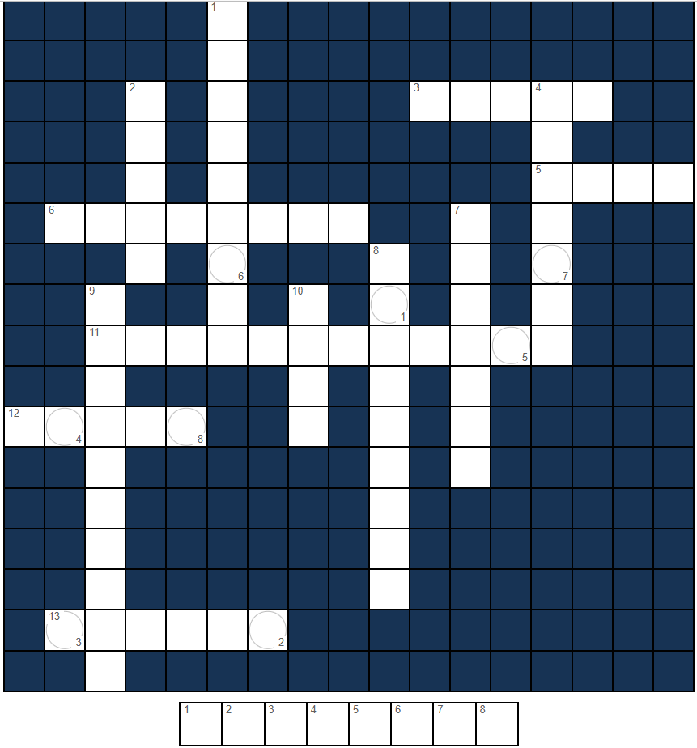

# Teaching Week 2: tutorial {#Lecture2}


::: {.objectivesBox .objectives data-latex="{iconmonstr-target-4-240.png}"}
**Topics** covered in this tutorial:

* Design of studies.
* Language used in research.
:::


::: {.readBox .read data-latex="{iconmonstr-school-15-240.png}"}
You will learn and practice the content associated with these chapters of the [textbook](https://bookdown.org/pkaldunn/SRM-Textbook/):

* [Chapter 5 (Ethics in research)](https://bookdown.org/pkaldunn/SRM-Textbook/Ethics.html).
* [Chapter 6 (External validity: sampling)](https://bookdown.org/pkaldunn/SRM-Textbook/Sampling.html).
* [Chapter 7 (Internal validity)](https://bookdown.org/pkaldunn/SRM-Textbook/DesignInternal.html).
* [Chapter 8 (Research design limitations)](https://bookdown.org/pkaldunn/SRM-Textbook/Interpretation.html).
:::


## Quick revision {#QuickRevision-Tutorial2}


::: {.preClassBox .preClass data-latex="{iconmonstr-home-7-240.png}"}
We **strongly** recommend trying these *Quick revision* questions **before** your tutorial.
:::

::: {.webex-check .webex-box}
Consider this RQ: 'What factors are preventing the adoption of household solar technologies in Santiago [Chile]?' [@walters2018factors].

1. For this RQ, what is the *Population*? \tightlist
`r if( knitr::is_html_output() ) {webexercises::longmcq( c(
                      "Households", 
		      "Households in Chile",
                      answer = "Households in Santiago",
                      "Solar technologies") )} else {'\\null'}`
\greyboxlines{1}
2. `r if( knitr::is_latex_output() ) {'Select the correct option:'}` The study will be *externally valid* if:
`r if( knitr::is_html_output() ) {webexercises::longmcq( c(
                      "the sample is representative of all households in the world",
		      "the sample is representative of all solar technologies",
                      answer = "the sample is representative of all households in Santiago",
                      "the sample is representative of all households in Chile") )}`
`r if (knitr::is_html_output()) {'<!--'}`
   * the sample is representative of all households in the world.
   * the sample is representative of all solar technologies.
   * the sample is representative of all households in Santiago.
   * the sample is representative of all households in Chile.
`r if (knitr::is_html_output()) {'-->'}`
3.  Suppose the researchers mailed surveys to all households in Santiago, and people returned the survey if they wished to. 
    What is the *best* description of this sampling method?
`r if( knitr::is_html_output() ) {webexercises::longmcq( c(
                      answer = "Self-selecting", 
                      "Systematic",
                      "Convenience") )} else {'\\null'}`
\greyboxlines{1}
4.  Suppose the researchers randomly selected five suburbs in Santiago; then ten streets within each of these suburbs; then ten households within each of these streets. 
    What is the *best* description of this sampling method?
`r if( knitr::is_html_output() ) {webexercises::longmcq( c(
                      answer = "Multi-stage", 
                      "Systematic",
                      "Stratified") )} else {'\\null'}`
\greyboxlines{1}
:::


`r if (knitr::is_latex_output()) '<!--'`
`r webexercises::hide()`
1. The RQ states that only households in Santiago will be studied.
1. External validity means that the sample represents the intended population (i.e., households in Santiago).
1. Since people only return the survey if they *want* to, this is self-selecting.
1. There are multiple stages of *random* selection, so this is multi-stage.
`r webexercises::unhide()`
`r if (knitr::is_latex_output()) '-->'`


`r if (knitr::is_latex_output()) '<!--'`
<iframe src='https://www.ferendum.com/en/embeded.php?pregunta_ID=1265008&sec_digit=1374138508&embeded_digit=24312211' style='width:100%; height:400px; overflow: auto; background: #B3919133' frameBorder='0'></iframe><BR>
<A href='https://www.ferendum.com' target='_blank'>Free Online Poll Maker</A>
`r if (knitr::is_latex_output()) '-->'`


## Study design {#StudyDesign}

A student group was studying this RQ (which is **not** appropriate for the SCI110 Project): 'Among Australians, is the average serum cholesterol concentration different for smokers and non-smokers?'

Explain why, according to the *Guidelines*, this RQ is not appropriate for Task\ 2.
\greyboxlines{2}

The students gave the following information about their study.
Explain **why** each of these statements is **incorrect**.

1. "The design is observational, as we cannot manipulate each person's serum cholesterol."
\greyboxlines{2}
1. "The Outcome is '*the average serum cholesterol concentration for smokers and non-smokers*'."
\greyboxlines{2}
1. "The study is not externally valid, as the results may not apply to all people in the world."
\greyboxlines{2}
1. "The response variable is *serum cholesterol*."
\greyboxlines{2}
1. "In this experiment, the population is '*Australians*'."
\greyboxlines{2}
1. "The data file will have two columns: one for smokers, and one for non-smokers."
\greyboxlines{2}
1. "'*Whether or not the person owns a cat*' is likely to be a confounding variable."
\greyboxlines{2}
1. "The *observer effect* is not relevant, as the participants will know they are involved in a study."
\greyboxlines{2}


## Language {#LanguageReport}


<!-- Text wrap from: https://stackoverflow.com/questions/43551312/wrap-text-around-plots-in-markdown -->
<!-- Trick from: https://blog.earo.me/2019/10/26/reduce-frictions-rmd/ -->
`r if (knitr::is_latex_output()) '<!--'`
```{r, echo=FALSE, out.width= "30%", out.extra='style="float:right; padding:10px"'}
include_graphics("Illustrations/thisisengineering-raeng-sbVu5zitZt0-unsplash.jpg")
```
`r if (knitr::is_latex_output()) '-->'`


Patients who have suffered a stroke often have restricted limb movement, and rehabilitation therapies are looking to using robotic means to assist these patients.

Read the description (line breaks added for clarity) of one such study as shown below [@data:Lo2010:RobotAssistance], then complete the crossword 
`r if (knitr::is_latex_output()){
   'in Fig. \\@ref(fig:Crossword-Week2-Terminology)'
} else {
   'below'
}`
regarding this information.

> In this multicenter, randomized, controlled trial involving $127$ patients with moderate-to-severe upper-limb impairment $6$\ months or more after a stroke, we randomly assigned $49$\ patients to receive intensive robot-assisted therapy, $50$ to receive intensive comparison therapy, and $28$\ to receive usual care.  
> &nbsp;
>
> Therapy consisted of $36$ $1$-hour sessions over a period of $12$\ weeks. 
> The primary outcome was a change in motor function, as measured on the Fugl-Meyer Assessment of Sensorimotor Recovery after Stroke, at $12$\ weeks...  
> &nbsp;
>
> We recruited veterans from four participating VA medical centers who were $18$\ years of age or older and had long-term, moderate-to-severe motor impairment of an upper limb from a stroke that had occurred at least $6$ months before enrollment.  
> &nbsp;
>
> Such impairment was defined as a score of $7$ to\ $38$ on the Fugl-Meyer Assessment of Sensorimotor Recovery after Stroke, a scale with scores for upper-limb impairment ranging from\ $0$ (no function) to\ $66$ (normal function). 
> All patients provided written informed consent.  
> &nbsp;
>
> Patients were randomly assigned to receive robot-assisted therapy, intensive comparison therapy, or usual care...  
> &nbsp;
>
> Trained evaluators who were unaware of study-group assignments assessed patients\ $6$, $12$, $24$, and $36$\ weeks after randomization.
> &nbsp;
>
> The primary outcome was a change in the Fugl-Meyer score at $12$\ weeks, as compared with the baseline value...
>
> --- @data:Lo2010:RobotAssistance


<iframe src="https://usc.h5p.com/content/1291418096383708349/embed" width="1088" height="637" frameborder="0" allowfullscreen="allowfullscreen" allow="geolocation *; microphone *; camera *; midi *; encrypted-media *"></iframe><script src="https://usc.h5p.com/js/h5p-resizer.js" charset="UTF-8"></script>


<!-- <script src="https://www.puzzlefast.com/en/puzzles/2020032904325184E/embed-script?width=650px&height=1300px" type="text/javascript"></script> -->

<!--     <iframe border="0" src="https://crosswordlabs.com/embed/2020-05-24-264?clue_height=300" height="950" style="flex:1; width:100%; padding:5px 0px 0 5px; border:3px solid black; "></iframe> -->
<!--     <a target="_blank" style="align-self:center; font-size:12px; color:black; padding-top:10px; text-decoration:none;text-align:center" href="https://crosswordlabs.com">Crossword Puzzle Maker</a> -->


<!-- PASSCODE:: SCI10 -->
<!-- I added the  height="800" -->
<!-- I deleted the enclosing <div> ... </div> -->


\pagebreak


```{r Crossword-Week2-Terminology, echo=FALSE, fig.cap="A crossword to complete.", fig.align="center", out.width='85%', eval=is_latex_output()}

```

`r if (knitr::is_html_output()){'<!--'}`
\begin{multicols}{2}\small
\textbf{Across}

\begin{enumerate}\tightlist
  \item[\textbf{3.}]
  The number of groups being compared (5)  
  \item[\textbf{5.}] 
  Ask if you need \verb|____| (4)  
  \item[\textbf{6.}]
  Patients were assigned \verb|____| to the type of therapy received (8)  
  \item[\textbf{11.}]
  This type of study is called a \verb|____| study (12)  
  \item[\textbf{12.}]
  A lovely place to relax, with sand and surf (5)
  \item[\textbf{13.}]
  The size of the \verb|____| is $127$ (6)
\end{enumerate}

\newcolumn

\textbf{Down}

\begin{enumerate}\tightlist
  \item[\textbf{1.}]
  When individuals may change their behaviour if they think they are being observed is the \verb|____| effect (9)
  \item[\textbf{2.}]
  The evaluators were not aware of which group the patient was in; they were \verb|____| to the treatment applied (5)
  \item[\textbf{4.}]
  For the study, informed consent is to ensure the study is \verb|____| (7)
  \item[\textbf{7.}]
  The treatment of `usual care' would be considered to be the \verb|____| (7)
  \item[\textbf{8.}]
  The type of therapy is called the \verb|____| (9)
  \item[\textbf{9.}]
  The research question is of this type (10)
  \item[\textbf{10.}]
  A riddle: If you give me food, I will live; if you give me water, I will die (4)
\end{enumerate}
\end{multicols}
`r if (knitr::is_html_output()){'-->'}`


## Assessing reports {#AssessReport}

A report in *The Sydney Morning Herald* [@data:Berry:AgedCheese] was entitled 'Aged cheese could help you age well'.
Based on this headline:

1. what are reasonable suggestions for the outcome and response variable? \tightlist
\greyboxlines{2}
2. what are reasonable suggestions for the comparison and explanatory variable? 
\greyboxlines{2}
3. would you expect the study to be observational or experimental?
   Explain.
\greyboxlines{2}
  
Below is an extract from the newspaper article for the mice study that formed part of the research.

> Cheese is not only delicious and nutritious, with its abundance in calcium and vitamin\ B12, it can also slow down the ageing process, according to a new study... \null
> In the study published in the journal *Nature Medicine*, European researchers analysed the effect of a compound found in aged cheese (as well as legumes and whole grains) called spermidine [...]
> the team supplemented the drinking water of mice with spermidine. 
> Control mice drank normal water.

The researchers then found that the addition of spermidine '"significantly extended" the [average] lifespan of the mice...'.

Based on this information, answer the following questions.

4. What are reasonable suggestions for the outcome and response variable for the mice study? \tightlist
\greyboxlines{2}
5. what are reasonable suggestions for the comparison and explanatory variable? 
\greyboxlines{2}
6. Is the study observational or experimental?
   Explain.
\greyboxlines{2}
7. Does the newspaper headline appear reasonable?
\greyboxlines{1}
8. Why do the researchers give some mice plain drinking water?
\greyboxlines{2}

Below is an extract from the newspaper article for the human study that formed part of the research.

> ... the researchers surveyed $800$ Italians about their diet and found that those who reported a higher intake of spermidine had lower blood pressure...

Based on this information, answer the following questions.

9. What are reasonable suggestions for the outcome and response variable for the human study? \tightlist
\greyboxlines{2}
10. What *type* of RQ is suggested: relational, correlational or repeated-measures? 
\greyboxlines{1}
11. Is the study observational or experimental?
    Explain.
\greyboxlines{2}
12. Are the following variables likely to be extraneous variables, confounding variables, or neither? 
    **Explain.**

    a. The sex of the person. 
	  b. The number of siblings.
	  c. The distance to the nearest hospital.
	  d. The amount of exercise per week by the person.
    e. Whether their father had heart problems.
\greyboxlines{5}

The newspaper article is based on a research paper [@eisenberg2016cardioprotection], in which the diets of more than $800$ Italians were recorded in\ 1995, 2000 and\ 2005.
From 1995 to\ 2010, the researchers recorded heart-related events for each subject: incidents of high blood pressure, heart failure, stroke and premature death from heart disease.

Those with the highest spermidine intakes had a $40$% lower risk of heart failure (both fatal and non-fatal) compared to those with the lowest spermidine intakes. 
Those with the highest spermidine intakes also had a significantly lower risk of *any* heart disease, compared to those with the lowest spermidine intakes.

13. Does the newspaper headline appear consistent with the research article?
\greyboxlines{1}

The study reports that the biggest contributor to spermidine intakes was wholemeal foods (accounting for $13.4$% of intake), apples and pears ($13.3$%), salad ($9.8$%), vegetable sprouts ($7.3$%) and potatoes ($6.4$%).
Aged cheese appeared in the list in sixth place ($2.9$% of intake).

14. Based on this information, do you agree with, or not agree with, the newspaper article headline?
    Explain.
\greyboxlines{2}
15. Is a cause-and-effect relationship reasonable? 
    Explain.
\greyboxlines{2}


## Planning a research study {#PlanStudy2}

Your tutor will have information.

<!-- Documentation tool?? -->


::: {.tipBox .tip data-latex="{iconmonstr-info-6-240.png}"}
This activity is very important for your Project.
:::


## Study design features {#StudyFeatures}


<!-- Text wrap from: https://stackoverflow.com/questions/43551312/wrap-text-around-plots-in-markdown -->
<!-- Trick from: https://blog.earo.me/2019/10/26/reduce-frictions-rmd/ -->
`r if (knitr::is_latex_output()) '<!--'`
```{r, echo=FALSE, out.width= "30%", out.extra='style="float:right; padding:10px"'}
include_graphics("Illustrations/emiliano-vittoriosi-ONQ86GlHs3c-unsplash.jpg")
```
`r if (knitr::is_latex_output()) '-->'`


A study [@data:Truswell1992:crisps] compared the health benefits of crisps ('potato chips') when fried in canola oil or palmolein.
The article states (line breaks added):

> Recently canola oil crisps have appeared in the market with the implication that their lower proportion of saturated fatty acids would have beneficial effects on plasma cholesterol.  
> &nbsp;
>
> We decided to examine this experimentally... a major manufacturer agreed to fry batches of potato crisps in canola oil or the conventional palmolein for a human trial. 
> This provided an opportunity for us to run a double blind crossover trial.  

Part of the protocol  for the study is given below:

> Subjects were asked to eat about a third of the day's crisps at the beginning of each meal and then, in the rest of their diets, to eat foods that were low to moderate in fat from a list of such foods...  
> &nbsp;
>
> The crisps were supplied in plain bags, unmarked except for two code characters: 'T4' or 'B9' in 1990 and 'D5' or 'GS' in 1991. 
> Until the end of the experiment, the type of oil was known only by the food scientist who prepared the crisps.  
> &nbsp;
>
> In 1990, $21$ subjects ($12$ men, $9$ women) completed the $5$\ week experiment. 
> They were randomly allocated to take palmolein ('B9') or canola ('T4') crisps for the first $3$ weeks, then (without a washout period) changed over to the other type, canola or palmolein for another $2$ weeks. 
> Thus half the subjects ate (new) canola crisps for $3$ weeks and the (usual) palmolein crisps for the next $2$ weeks.  
> &nbsp;
>
> The other half of the subjects ate palmolein crisps for $3$ weeks and canola crisps for the next $2$ weeks. 
> The first week of the $3$ weeks served as an adjustment period. 
> Fasting venous bloods were taken once at the start (usual diet), then for the last $3$ mornings of both the first and second experimental periods.

1. Explain how random *allocation* is used (and why), if at all.
\greyboxlines{2}
2. Explain how the impact of the Hawthorne effect has been minimised.
\greyboxlines{2}
3. Explain how the impact of the observer effect has been minimised.
\greyboxlines{2}
4. Would the carry-over effect play a role? Explain.
\greyboxlines{2}
5. Describe the blinding that is used.
\greyboxlines{2}

