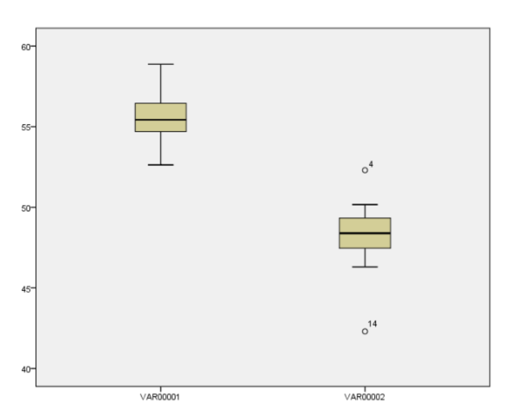
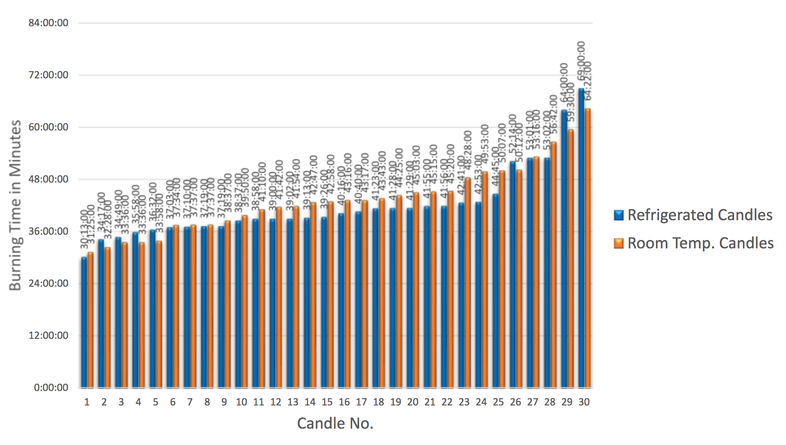
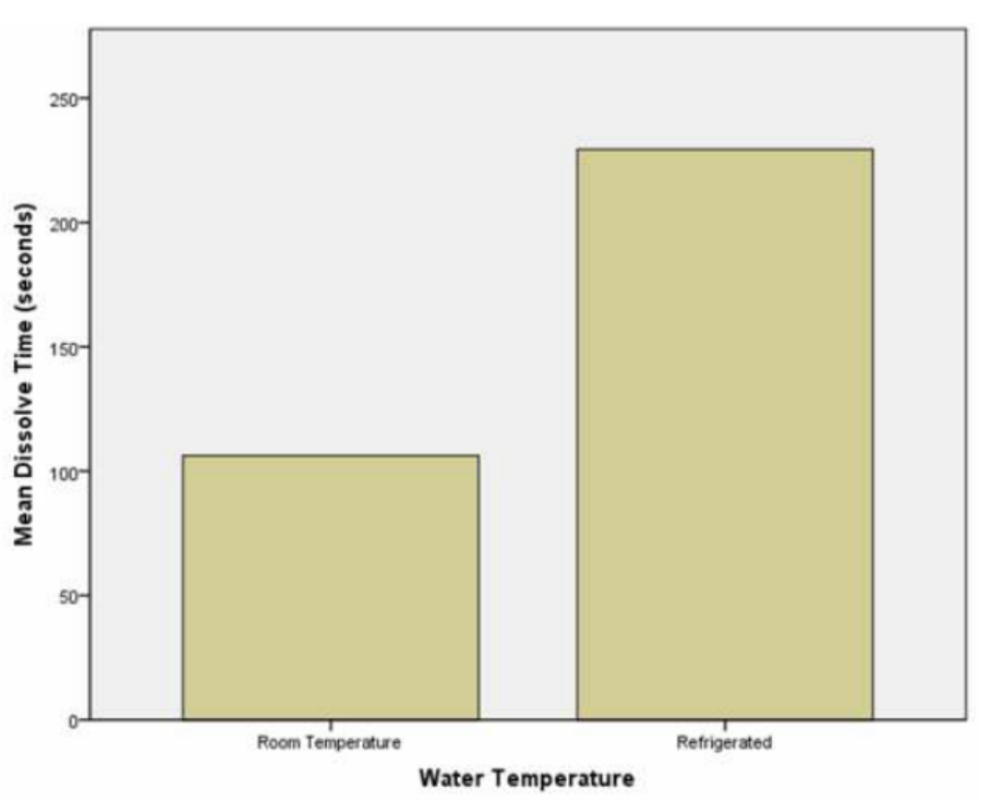
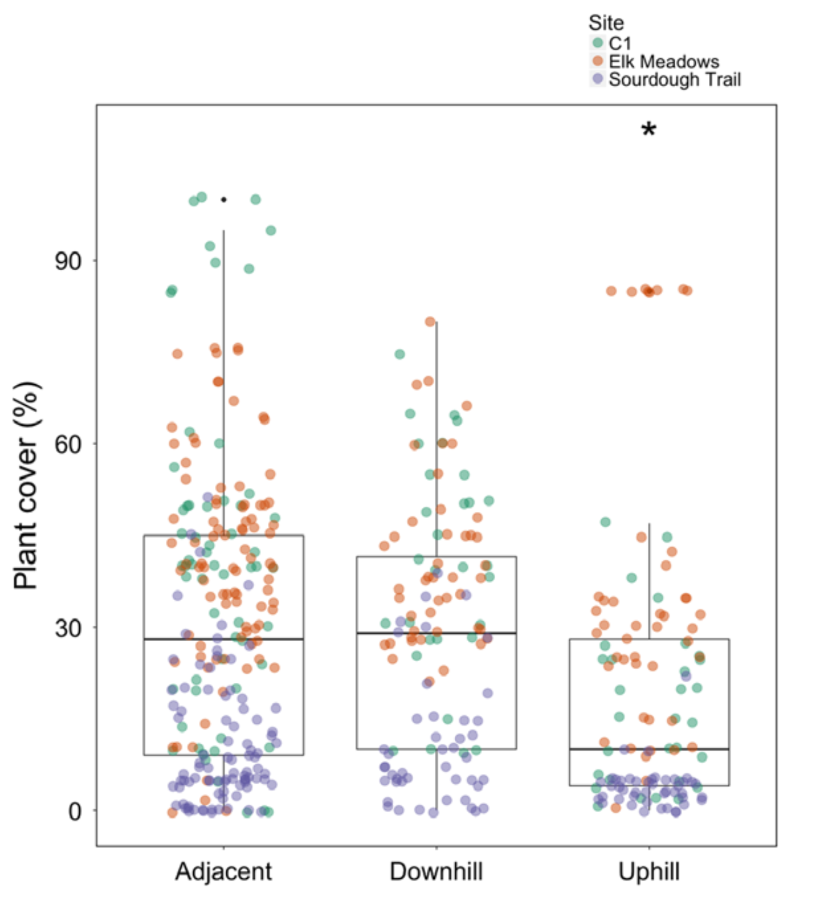
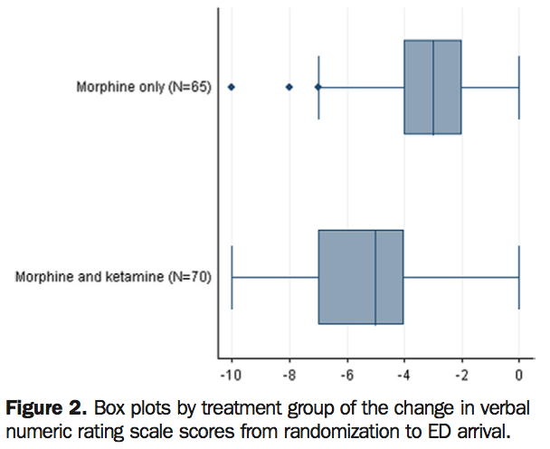

# Teaching Week 3: tutorial {#Lecture3}


::: {.objectivesBox .objectives data-latex="{iconmonstr-target-4-240.png}"}
**Topics** covered in this tutorial:

* Language used in research.
* Graphical summaries.
:::

In this chapter, you will learn and practice the content associated with these chapters of the [textbook](https://bookdown.org/pkaldunn/SRM-Textbook/):

* [Chapter 10 (Procedures for collecting data)](https://bookdown.org/pkaldunn/SRM-Textbook/CollectingDataProcedures.html).
* [Chapter 11 (Describing data)](https://bookdown.org/pkaldunn/SRM-Textbook/DescribingVars.html).
* [Chapter 12 (Graphical summaries of data)](https://bookdown.org/pkaldunn/SRM-Textbook/Graphs.html).


## Quick revision {#QuickRevision-Tutorial3}

```{r echo = FALSE}
OSA <- structure(list(ID = 1:60, Age = c(21L, 24L, 26L, 39L, 21L, 29L, 
20L, 21L, 19L, 27L, 29L, 25L, 20L, 53L, 31L, 22L, 21L, 28L, 19L, 
18L, 18L, 36L, 36L, 38L, 18L, 24L, 21L, 18L, 33L, 19L, 23L, 31L, 
29L, 23L, 35L, 27L, 28L, 20L, 29L, 38L, 22L, 56L, 50L, 24L, 36L, 
44L, 25L, 49L, 18L, 19L, 27L, 31L, 21L, 22L, 20L, 29L, 35L, 22L, 
28L, 32L), Gender = c(1L, 1L, 1L, 2L, 2L, 1L, 1L, 1L, 2L, 1L, 
2L, 1L, 2L, 1L, 1L, 1L, 2L, 2L, 2L, 2L, 1L, 2L, 2L, 1L, 2L, 1L, 
1L, 1L, 1L, 1L, 2L, 1L, 1L, 1L, 2L, 2L, 1L, 1L, 2L, 1L, 2L, 2L, 
2L, 1L, 1L, 2L, 2L, 2L, 1L, 1L, 1L, 1L, 2L, 1L, 2L, 1L, 1L, 2L, 
2L, 2L), BMI = c(20.3, 24.1, 25.2, 40.8, 35, 29.2, 25.8, 20.9, 
20.5, 22.4, 24.4, 20.5, 30.5, 27.3, 32.6, 37.2, 29.9, 36.5, 27.7, 
27.1, 19.5, 36.8, 39.9, 20.3, 28.6, 21.8, 31.9, 29.2, 32, 27, 
25.6, 18.7, 32.5, 24.7, 35.6, 31.1, 24.8, 23.9, 36.8, 34.6, 28, 
29.2, 31.4, 38.3, 26, 34.3, 27, 30.6, 21.6, 37.6, 35.4, 24.2, 
19.3, 27.1, 31.5, 33.8, 31.2, 26, 36.9, 22.1), Neck = c(37, 40.5, 
38, 41, 37, 41, 42, 37, 32, 39, 37.5, 38, 39, 44.5, 46.5, 43, 
34, 37, 34, 36, 39, 41, 37, 38, 38, 36, 40, 41, 46, 42, 40.3, 
38, 47, 38, 36, 36, 44, 43, 40.5, 45, 40, 38, 40, 43, 41, 38, 
40, 40, 38, 48, 46, 39, 35.5, 48, 41, 47, 47, 39, 40, 40), REI = c(46, 
19.3, 12.4, 58.6, 12.7, 38.8, 24.4, 7, 37.6, 21.7, 7.3, 32.4, 
61.3, 25.1, 42.2, 53.6, 13.9, 22.6, 15.6, 8.7, 18.5, 40.7, 25.4, 
11.3, 13.6, 59.4, 26.2, 31, 47.1, 13, 17.5, 17.7, 45.4, 73.3, 
19.7, 23.4, 13.9, 16.9, 13.4, 54.2, 19.9, 16.5, 58.1, 29.3, 41.5, 
48.8, 32.8, 19.4, 15.8, 26.8, 31.6, 60.4, 15.7, 22.5, 18, 97.9, 
22.4, 16.8, 66.1, 19.1), SAOS = c("Severe", "Moderate", "Low", 
"Severe", "Low", "Severe", "Moderate", "Low", "Severe", "Moderate", 
"Low", "Severe", "Severe", "Moderate", "Severe", "Severe", "Low", 
"Moderate", "Moderate", "Low", "Moderate", "Severe", "Moderate", 
"Low", "Low", "Severe", "Moderate", "Severe", "Severe", "Low", 
"Moderate", "Moderate", "Severe", "Severe", "Moderate", "Moderate", 
"Low", "Moderate", "Low", "Severe", "Moderate", "Moderate", "Severe", 
"Moderate", "Severe", "Severe", "Severe", "Moderate", "Moderate", 
"Moderate", "Severe", "Severe", "Moderate", "Moderate", "Moderate", 
"Severe", "Moderate", "Moderate", "Severe", "Moderate")), class = "data.frame", row.names = c(NA, 
-60L))
```

::: {.preClassBox .preClass data-latex="{iconmonstr-home-7-240.png}"}
We recommend trying these *Quick revision* questions **before** your tutorial.
:::

A study of obstructive sleep apnoea (OSA) in adults with Down Syndrome [@carvalho2020stop]
had $n = 60$ adults undergo a sleep study.
`r if( knitr::is_html_output() ) {
  'The data are shown in Fig. \\@ref(fig:OSADT).'
} else
{
  'Part of the data are shown in Table \\@ref(tab:OSAKable).'
}
`

```{r OSAKable, echo=FALSE}
useOSA <- OSA[, c(2:6)]
useOSA$Gender <- factor(useOSA$Gender, 
                        levels = 1:2, 
                        labels = c("Male", "Female"))
    
if( knitr::is_latex_output() ) {
  knitr::kable( head(useOSA, 10),
               format = "latex",
               longtable = FALSE,
               booktabs = TRUE,
               col.names = c("Age",
                            "Gender",
                            "BMI",
                            "Neck circumference (cm)",
                            "REI"),
              caption = "Part of the Obstructive sleep apnoea data set") %>%
    kable_styling(font_size = 10)
}
```

```{r OSADT, echo=FALSE, fig.cap="The Obstructive sleep apnoea data set", fig.align="center"}
if( knitr::is_html_output() ) {
  DT::datatable(useOSA,
              list(scrollX = TRUE, 
                   scrollY = TRUE, 
                   ordering = FALSE),
              caption = "The Obstructive sleep apnoea data set")
}
```

1. What would be the appropriate graph to show the *distribution* of the age of the participants?
`r if( knitr::is_html_output() ) {webexercises::longmcq( c(
                      "Bar chart", 
		                  "Scatterplot",
                      answer = "Histogram",
                      "Boxplot") )}`
1. What would be the appropriate graph to show the *distribution* of the gender of participants?
`r if( knitr::is_html_output() ) {webexercises::longmcq( c(
                      answer = "Bar chart", 
		                  "Scatterplot",
                      "Histogram",
                      "Boxplot") )}`
1. What would be the appropriate graph to show the *relationship* between gender and REI?
`r if( knitr::is_html_output() ) {webexercises::longmcq( c(
                      "Stacked bar chart", 
		                  "Scatterplot",
                      "Pie chart",
                      answer = "Boxplot") )}`
1. What would be the appropriate graph to show the *relationship* between age and REI?
`r if( knitr::is_html_output() ) {webexercises::longmcq( c(
                      "Stacked bar chart", 
		                  answer = "Scatterplot",
                      "Pie chart",
                      "Boxplot") )}`


::: {.progressBox .progress}
`r if (knitr::is_html_output()) {"**Progress:**"}`
`r webexercises::total_correct()`
:::


`r webexercises::hide()`
1. *Age* is quantitative, so histograms or stem-and-leaf plots are appropriate.
1. *Gender* is qualitative, so bar charts or pie charts are appropriate.
1. *Gender* is qualitative, and *REI* is quantitative, so a boxplot is apppropriate.
1. Both *age* and *REI* are quantitative, so a scatterplot is appropriate.
`r webexercises::unhide()`


## Understanding histograms {#UnderstandingHistograms}


::: {.importantBox .important data-latex="{iconmonstr-warning-8-240.png}"}
**NOTE**: The first bar of the histogram is not necessarily at zero; 
it is the **shape** of the histogram that is of interest here:
right skewed, left skewed, symmetric, etc.
:::

<iframe src="https://usc.h5p.com/content/1291014887759753099/embed" width="1088" height="637" frameborder="0" allowfullscreen="allowfullscreen" allow="geolocation *; microphone *; camera *; midi *; encrypted-media *"></iframe><script src="https://usc.h5p.com/js/h5p-resizer.js" charset="UTF-8"></script>


```{r, child = if (knitr::is_latex_output()) './children/TutorialQns/Lect3-Q1.Rmd'}
```


<!-- 1. The time that students remain in the examination room for a two-hour examination. -->
<!-- 2. The heights of female students at USC. -->
<!-- 3. The *starting* salaries of new science graduates employed full-time. -->
<!-- 4. The volume of drink in 375ml cans of soft drink. -->
<!-- 5. Sale prices of houses in Caloundra last year. -->


<!-- ```{r FourHistogramApplication, echo=FALSE, fig.cap="Four histograms.  What might they represent?", fig.align="center", fig.height=6, fig.width=5} -->
<!-- ### Makes a grid of four plots, to assign meaning to -->

<!-- set.seed(8765432) -->

<!-- SS <- 5000 -->

<!-- xA <- runif(SS, min=0, max=400) -->
<!-- xC <- rgamma(SS, 3, 2) -->

<!-- #xBtmp <- rgamma(SS, 3, 2) -->
<!-- xB <- -abs( rnorm(SS, 0, 10) ) -->

<!-- # xB <- max(xBtmp) - xBtmp -->
<!-- xD <- rnorm(SS, mean=177, sd=7) # EG Heights of male students at USC -->


<!-- par(mfrow=c(2,2)) -->
<!--    hist(xA, -->
<!--         main="Graph A", -->
<!--         xlab="Variable", -->
<!--         ylab="Frequency", -->
<!--         col="wheat", -->
<!--         axes=FALSE) -->
<!--     #box() -->

<!--    hist(xB, -->
<!--         main="Graph B", -->
<!--         xlab="Variable", -->
<!--         ylab="Frequency", -->
<!--         col="wheat", -->
<!--         axes=FALSE) -->
<!--   #box() -->
<!--    hist(xC, -->
<!--         main="Graph C", -->
<!--         xlab="Variable", -->
<!--         ylab="Frequency", -->
<!--         col="wheat", -->
<!--         axes=FALSE) -->
<!--   #box() -->

<!--    hist(xD, -->
<!--         main="Graph D", -->
<!--         xlab="Variable", -->
<!--         ylab="Frequency", -->
<!--         col="wheat", -->
<!--         axes=FALSE) -->
<!--   #box() -->
<!-- ``` -->


## Identifying appropriate graphs {#IdentifyingGraphs1}

In each of the following,
determine and justify the most appropriate graph 
for displaying the *relationship* of interest.
In addition,
draw a rough example of what the graph may look like.


1. Meadowfoam is a plant from which oil can be extracted from its flowers, 
   so maximising flowering is important.  
   
   A study [@data:seddigh:flowers]
   examined many individual meadowfoam plants 
   and explored the relationship between
   the number of flowers each plant produced,
   and the number of hours of light each plant received.
   
   
<iframe src="https://usc.h5p.com/content/1291014902846391579/embed" width="1088" height="637" frameborder="0" allowfullscreen="allowfullscreen" allow="geolocation *; microphone *; camera *; midi *; encrypted-media *"></iframe><script src="https://usc.h5p.com/js/h5p-resizer.js" charset="UTF-8"></script>


2. Early in the 21st century,
   moves were made to ban smoking in outdoor areas of restaurants, cafes, pubs and bars.
   However,
   some people thought this was unnecessary,
   as they believed that exposure to second-hand smoke was minimal.  
   
   To study this phenomenon and to inform public policy,
   a New Zealand observational study [@data:Stafford2010:Alfresco]
   examined numerous al fresco (open air) restaurants.  
   
   They collected two pieces of information from each individual restaurant:
   the number of smokers present at the restaurant at the time of observation
   (restaurants with no smokers;
   restaurants with one smoker;
   restaurants with two or more smokers),
   and the concentrations of fine particulate matter (PM)  measured in the restaurant air
   at the same time.
   The researchers wish to compare the PM concentrations 
   across the three groups.
   
<iframe src="https://usc.h5p.com/content/1291014905631385249/embed" width="1088" height="637" frameborder="0" allowfullscreen="allowfullscreen" allow="geolocation *; microphone *; camera *; midi *; encrypted-media *"></iframe><script src="https://usc.h5p.com/js/h5p-resizer.js" charset="UTF-8"></script>
   
   
3. To understand the usage of hospital emergency departments (EDs) in Ireland,
   a study [@data:Curran2011.Stroke]
   examined many individual admissions.  
   
   For each admission to the ED,
   they recorded 
   if the waiting time was short (within 3 hours) or long (3 hours or longer),
   and the time of day of the admission
   (in three divisions: 9am to 5pm; 5pm to midnight; and midnight to 9am).


<iframe src="https://usc.h5p.com/content/1291014908484867689/embed" width="1088" height="637" frameborder="0" allowfullscreen="allowfullscreen" allow="geolocation *; microphone *; camera *; midi *; encrypted-media *"></iframe><script src="https://usc.h5p.com/js/h5p-resizer.js" charset="UTF-8"></script>


4. Stress in children is not as well understood as stress in adults.  

   To examine the issue,
   a study [@data:Saunders1999:Playfulness]
   studied many children,
   and for each child they determined 
   each child's level of playfulness 
   (measured using a quantitative scale called the *Test of Playfulness*)
   and each child's level of 'coping'
   (measured using a quantitative scale called the *Coping Inventory*).

<iframe src="https://usc.h5p.com/content/1291014912258524999/embed" width="1088" height="637" frameborder="0" allowfullscreen="allowfullscreen" allow="geolocation *; microphone *; camera *; midi *; encrypted-media *"></iframe><script src="https://usc.h5p.com/js/h5p-resizer.js" charset="UTF-8"></script>


## Interpreting graphs {#InterpretingGraphs}

A study of Weddell seals [@data:Bryden1984:WeddellSeals] measured, among other things, body length.
A histogram of the body length of 90 female seals is shown in 
Fig. \@ref(fig:Bryden1984Fig3b).

1. Describe this histogram in words (average; variation; shape; outliers).
2. What alternative graphical displays could be used to display these data?
3. Critique the graph.


```{r Bryden1984Fig3b, echo=FALSE, fig.cap="A histogram of the body length of female Weddell seals", fig.align="center", out.width='60%'}
knitr::include_graphics("ArticleImages/Bryden1984-Figure3b.png")
```


## Critiquing students' graphs {#CritiqueStudentGraphs1}

In this activity,
you get to critique actual SCI110 Project submissions,
so you can critique your own before submission.

1. Critique the graph in 
	 Fig. \@ref(fig:StudentsGraphsA),
	 a screenshot from a student Project Report
	 comparing the average burn time
	 between two brands of sparklers.


```{r StudentsGraphsA, echo=FALSE, fig.cap="A graph from a student Project", fig.align="center", out.width='70%'}

```

2. Critique the graph in 
	 Fig. \@ref(fig:StudentsGraphsB),
	 a screenshot from a student Project Report
	 comparing the average burn time 
   of room-temperature and refrigerated candles.
	 

```{r StudentsGraphsB, echo=FALSE, fig.cap="A graph from a student Project", fig.align="center", out.width='75%'}

```


3. Critique the graph in Fig. \@ref(fig:StudentsGraphsC),
   a screenshot from a student Project Report
   comparing the 'mean dissolve' time
   (they probably meant 'mean *dissolving* time') 
   of Panadol in room temperature and cold water.
   Identify ways to improve the graph.


```{r StudentsGraphsC, echo=FALSE, fig.cap="A graph from a student Project", fig.align="center", out.width='70%'}

```


## Collecting data {#PlanStudy3}

Your tutor will have information.


## **Optional**: Understanding graphs {#HistogramBars}

::: {.optionalBox .optional data-latex="{iconmonstr-help-4-240.png}"}
This question is **optional**; for example, if you need more practice, or you are studying for the exam.
:::

*(Answers are available in Sect. \@ref(Lecture3Answers))*

Explain the important differences between a bar chart and a histogram.


## **Optional**: Selecting graphics {#SelectingGraphsH5P}

::: {.optionalBox .optional data-latex="{iconmonstr-help-4-240.png}"}
This question is **optional**; for example, if you need more practice, or you are studying for the exam.
:::

`r if (knitr::is_latex_output()) {
   '*(Answers are available in Sect.\\@ref(Lecture3Answers))*'
}`

<iframe src="https://usc.h5p.com/content/1290971685720511979/embed" width="1088" height="637" frameborder="0" allowfullscreen="allowfullscreen" allow="geolocation *; microphone *; camera *; midi *; encrypted-media *"></iframe><script src="https://usc.h5p.com/js/h5p-resizer.js" charset="UTF-8"></script>


```{r, child = if (knitr::is_latex_output()) './children/TutorialQns/Lect3-Q6.Rmd'}
```


## **Optional**: Evaluating graphics {#EvaluateGraphsAnts}

::: {.optionalBox .optional data-latex="{iconmonstr-help-4-240.png}"}
This question is **optional**; for example, if you need more practice, or you are studying for the exam.
:::

*(Answers are available in Sect. \@ref(Lecture3Answers))*

A study of the impact of ants on plant communities [@data:Sankovitz2018:nests]
produced the boxplot in Fig. \@ref(fig:Sankovitz2018),
showing the percentage of land covered by plants next to the ant nest, uphill from the ant nest, and downhill from the ant nest.


```{r Sankovitz2018, echo=FALSE, fig.align="center", fig.cap="A graphic from Sankovitz et al. (2018", out.width='70%'}

```


1. Identify the type of study: experimental or observational.
2. Identify the units of observation, and the units of analysis.
3. Critique this graph.
4. Do you think that a real difference exists between median plant coverage at different locations around the ant nest? What other interesting features can be seen from the graph?


## **Optional**: Evaluating graphics {#EvaluateGraphs1}

::: {.optionalBox .optional data-latex="{iconmonstr-help-4-240.png}"}
This question is **optional**; for example, if you need more practice, or you are studying for the exam.
:::

*(Answers are available in Sect. \@ref(Lecture3Answers))*

An Australian study [@data:Jennings2012:Morphine]
studied patients in severe pain
and compared two different treatments to determine which to recommend.

Patients were randomly allocated to receive one of two pain treatments:
either morphine, or morphine and ketamine.

The pain reduction for each patient was then measured
(using the 'pain verbal numeric rating scale':
0 is no pain, and 10 the worst pain imaginable, such as Australia losing the Ashes),
by taking pain measurements before and after giving the treatment.

The graph in Fig. \@ref(fig:Jennings2012)
summarises the data.
   
```{r Jennings2012, echo=FALSE, fig.align="center", fig.cap="A graphic from Jennings et al. (2002). 'ED' means 'Emergency Department", out.width='80%'}

```

1. Identify the type of study: experimental or observational.
2. Identify the units of observation, and the units of analysis.
3. Critique this graph.
4. What do you think the negative numbers on the graph mean?
5. Do you think that a real difference exists between the nedian for the two treatments *in the population*? Explain


## **Optional**: Understanding graphics {#UnderstandGraphsPizza}

::: {.optionalBox .optional data-latex="{iconmonstr-help-4-240.png}"}
This question is **optional**; for example, if you need more practice, or you are studying for the exam.
:::

`r if (knitr::is_latex_output()) {
   '*(Answers are available in Sect.\\@ref(Lecture3Answers))*'
}`

<iframe src="https://usc.h5p.com/content/1290973189768027779/embed" width="1088" height="637" frameborder="0" allowfullscreen="allowfullscreen" allow="geolocation *; microphone *; camera *; midi *; encrypted-media *"></iframe><script src="https://usc.h5p.com/js/h5p-resizer.js" charset="UTF-8"></script>


```{r, child = if (knitr::is_latex_output()) './children/TutorialQns/Lect3-Q8.Rmd'}
```


## **Optional**: Selecting graphs {#SelectGraph1}

::: {.optionalBox .optional data-latex="{iconmonstr-help-4-240.png}"}
This question is **optional**; for example, if you need more practice, or you are studying for the exam.
:::

`r if (knitr::is_latex_output()) {
   '*(Answers are available in Sect.\\@ref(Lecture3Answers))*'
}`

<iframe src="https://usc.h5p.com/content/1290973176373971849/embed" width="1088" height="637" frameborder="0" allowfullscreen="allowfullscreen" allow="geolocation *; microphone *; camera *; midi *; encrypted-media *"></iframe><script src="https://usc.h5p.com/js/h5p-resizer.js" charset="UTF-8"></script>


```{r, child = if (knitr::is_latex_output()) './children/TutorialQns/Lect3-Q9.Rmd'}
```


	
