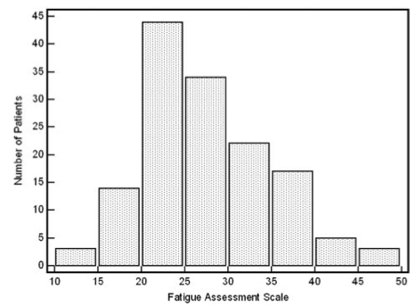

# Teaching Week 3: tutorial {#Lecture3}


::: {.objectivesBox .objectives data-latex="{iconmonstr-target-4-240.png}"}
**Topics** covered in this tutorial:

* Collecting data.
* Classifying data.
* Graphical summaries for quantitative data.
* Numerical summaries for quantitative data.
* Using the **Statistics Mode** of your calculator.
:::

In this chapter, you will learn and practice the content associated with these chapters of the [textbook](https://bookdown.org/pkaldunn/SRM-Textbook/):

* [Chapter 9 (Collecting data)](https://bookdown.org/pkaldunn/SRM-Textbook/CollectingDataProcedures.html).
* [Chapter 10 (Classifying data and variables)](https://bookdown.org/pkaldunn/SRM-Textbook/DescribingVars.html).
* [Chapter 11 (Summarising quantitative data)](https://bookdown.org/pkaldunn/SRM-Textbook/SummariseQuantData.html).


::: {.tipBox .tip data-latex="{iconmonstr-info-6-240.png}"}
You should bring your calculator to tutorials from this week onwards.
:::

`r if( knitr::is_latex_output() ){'<!--'}`
::: {.tipBox .tip data-latex="{iconmonstr-info-6-240.png}"}
You may wish search on YouTube for some tutorials on using your calculator's **Statistics Mode**.
Here are some links that may prove useful.

* [**TI**-30 XS](https://www.youtube.com/watch?v=I437u8PxV2M)
* [**TI**-84](https://www.youtube.com/watch?v=gTOVeAf3HA4)
* [**Casio** fx cp 400](https://www.youtube.com/watch?v=df2hQUVMbMo)
* [**Casio** CG20](https://www.youtube.com/watch?v=O-v00SvwHIE)
* [**Casio** fx82](https://www.youtube.com/embed/PiJ9B7L7V2A)

In YouTube, I searched for `"statistics" "mean" "standard deviation"` together with the calculator make and model; for example:  
`"statistics" "mean" "standard deviation" Casio fx82`
:::
`r if( knitr::is_latex_output() ){'-->'}`


`r if( knitr::is_html_output() ){'<!--'}`
::: {.tipBox .tip data-latex="{iconmonstr-info-6-240.png}"}
You may wish search on YouTube for some tutorials on using your calculator's **Statistics Mode**.
For example, try:

`"statistics" "mean" "standard deviation" Casio fx82`
:::
`r if( knitr::is_html_output() ){'-->'}`


`r if( knitr::is_html_output() ){'For example, see the embedded video below for help in using the Casio fx82:'}`

<div style="text-align:center;">
<iframe width="560" height="315" src="https://www.youtube.com/embed/PiJ9B7L7V2A" frameborder="0" allow="accelerometer; autoplay; encrypted-media; gyroscope; picture-in-picture" allowfullscreen></iframe>
</div>


## Quick revision {#QuickRevision-Tutorial3}

```{r echo = FALSE}
data(OSA)
```

::: {.preClassBox .preClass data-latex="{iconmonstr-home-7-240.png}"}
We **strongly** recommend trying these *Quick revision* questions **before** your tutorial.
:::

::: {.webex-check .webex-box}
A study of obstructive sleep apnoea (OSA) in adults with Down Syndrome [@carvalho2020stop] had $n = 60$ adults undergo a sleep study.
`r if( knitr::is_html_output() ) {
  'The data are shown in Fig.\\ \\@ref(fig:OSADT).'
} else {
  'Part of the data are shown in Table\\ \\@ref(tab:OSAKable).'
}
`

1. How would you *classify* the variable `Age`? \tightlist
`r if( knitr::is_html_output() ) {webexercises::longmcq( c(
                      "Quantitative: discrete", 
		                  answer = "Quantitative: continuous",
                      "Qualitative: nominal",
                      "Qualitative: ordinal") )}`
1. How would you *classify* the variable `Gender`? \tightlist
`r if( knitr::is_html_output() ) {webexercises::longmcq( c(
                      "Quantitative: discrete", 
		                  "Quantitative: continuous",
                      answer = "Qualitative: nominal",
                      "Qualitative: ordinal") )}`
1. How would you *classify* the variable `BMI`? \tightlist
`r if( knitr::is_html_output() ) {webexercises::longmcq( c(
                      "Quantitative: discrete", 
		                  answer = "Quantitative: continuous",
                      "Qualitative: nominal",
                      "Qualitative: ordinal") )}`
:::


```{r OSAKable, echo=FALSE}
useOSA <- OSA[, c(2:6)]
useOSA$Gender <- factor(useOSA$Gender, 
                        levels = 1:2, 
                        labels = c("Male", "Female"))
    
if( knitr::is_latex_output() ) {
  knitr::kable( head(useOSA, 10),
               format = "latex",
               longtable = FALSE,
               booktabs = TRUE,
               align = "c",
               col.names = c("Age",
                            "Gender",
                            "BMI",
                            "Neck circumference (cm)",
                            "REI"),
              caption = "Part of the obstructive sleep apnoea data set ($n = 60$)") %>%
    kable_styling(font_size = 10) %>%
    row_spec(0, bold = TRUE) 
}
```

```{r OSADT, echo=FALSE, fig.cap="The obstructive sleep apnoea data set", fig.align="center"}
if( knitr::is_html_output() ) {
  DT::datatable(useOSA,
              list(scrollX = TRUE, 
                   scrollY = TRUE, 
                   ordering = FALSE),
              caption = "The Obstructive sleep apnoea data set")
}
```


`r if (knitr::is_latex_output()) '<!--'`
`r webexercises::hide()`
1. *Age* is quantitative continuous. 
   (Values are rounded down to the nearest year for convenience, but the *variable* is continuous.
   The age of babies, for example, if often quoted in days, weeks or months.)
2. Qualitative nominal.
3. Quantitative continuous.
:::
`r webexercises::unhide()`
`r if (knitr::is_latex_output()) '-->'`


## Using the calculator statistics mode for a small data set {#StatsMode}

```{r echo=FALSE}
set.seed(2021)
library(GLMsData)
data(polythene)

len <- 8
PT <- polythene$Polythene
PT <- PT[ sample( 1:length(PT), len) ]
```

The data in Table\ \@ref(tab:PolyTable) give the usage, in tonnes, of polythene by eight UK cosmetic companies [@gilchrist2000regression].

1. Using your calculator's *Statistics Mode*, find the **mean** and **standard deviation** of these numbers.
2. Without using a calculator, find the **median** of the data.
3. Without using a calculator, find the **IQR** of the data.

```{r PolyTable, echo=FALSE}

PTTab <- array( "", 
                dim = c(1, length(PT) ) )

PTTab[1, ] <- PT
PTcap <- "The amount of polythene (in tonnes) used by a sample of eight UK cosmetic companies"

if( knitr::is_latex_output() ) {
  kable(pad(PTTab,
            targetLength = 8,
            decDigits = 3),
      format = "latex",
      booktab = TRUE,
      escape = FALSE,
      caption = PTcap) %>%
  kable_styling(full_width = FALSE,
                font_size = 10)
}
if( knitr::is_html_output() ) {
  kable(pad(PTTab,
            targetLength = 8,
            decDigits = 3),
      format = "html",
      escape = FALSE,
      booktab = TRUE,
      caption = PTcap) %>%
  kable_styling(full_width = FALSE)
}
```


::: {.importantBox .important data-latex="{iconmonstr-warning-8-240.png}"}
Most calculators have **two buttons** that compute the standard deviation: one if the data are a sample, and one if the data are a population.
In practice, data are almost *never* a population.  

\  
  
If you are using your calculator correctly, you should get (before rounding) $\bar{x} = 990.0791$ and $s = 1588.514579$.
If you get $s = 1485.919327$ for the *standard deviation*, you are using your calculator incorrectly, so please **ask for help**.
You are probably pressing the incorrect button to get the standard deviation.
:::

   

## Understanding centre and variation {#UnderstandingVariation}


<iframe src="https://usc.h5p.com/content/1290996647109217689/embed" width="1088" height="909" frameborder="0" allowfullscreen="allowfullscreen" allow="geolocation *; microphone *; camera *; midi *; encrypted-media *"></iframe><script src="https://usc.h5p.com/js/h5p-resizer.js" charset="UTF-8"></script>

```{r, child = if (knitr::is_latex_output()) './children/TutorialQns/03-CentreVariation.Rmd'}
```


## Understanding histograms {#UnderstandingHistograms}


<iframe src="https://usc.h5p.com/content/1291014887759753099/embed" width="1088" height="637" frameborder="0" allowfullscreen="allowfullscreen" allow="geolocation *; microphone *; camera *; midi *; encrypted-media *"></iframe><script src="https://usc.h5p.com/js/h5p-resizer.js" charset="UTF-8"></script>


```{r, child = if (knitr::is_latex_output()) './children/TutorialQns/03-HistogramWhereUsed.Rmd'}
```


::: {.importantBox .important data-latex="{iconmonstr-warning-8-240.png}"}
**NOTE**: The first bar of the histogram is not necessarily at zero; it is the **shape** of the histogram that is of interest here: right skewed, left skewed, symmetric, etc.
:::


## Collecting data {#PlanStudy3}

Your tutor will have information.


## Interpreting graphs {#InterpretingGraphs}

A study of Weddell seals [@data:Bryden1984:WeddellSeals] measured, among other things, body length.
A histogram of the body length of $90$\ female seals is shown in Fig.\ \@ref(fig:Bryden1984Fig3b).

1. Describe this histogram in words (average; variation; shape; outliers).
2. What alternative graphical displays could be used to display these data?
3. Critique the graph.


```{r Bryden1984Fig3b, echo=FALSE, fig.cap="A histogram of the body length of female Weddell seals", fig.align="center", out.width='55%'}
knitr::include_graphics("ArticleImages/Bryden1984-Figure3b.png")
```


## **Drills**: computational exercises {#Chapter4Drills}

*(Answers appear in Sect. \@ref(Lecture4Answers))*

::: {.drillBox .drill data-latex="{iconmonstr-pencil-9-240.png}"}
These **Drill** exercises (repeated practice) give you practice at getting computations correct, and using your calculator.
These drill questions are more about practising the underlying *mathematics* rather than the *statistics*.
If you need help, please **ask**.
:::


1. The data in Table\ \@ref(tab:AISTable) give the heights of $n = 7$ female tennis players at the *Australian Institute of Sport* (AIS) in metres [@telford1991sex].
   a. Using your calculator's *Statistics Mode*, find the **mean** and **standard deviation** of the data.
   b. Without using a calculator, find the **median** of the data.
   c. Compute the IQR for the data.


```{r AISTable, echo=FALSE}
data(AIS)

Hts <- subset(AIS$Ht, 
              AIS$Sex == "F" & AIS$Sport == "Tennis")

AISTab <- array( "", 
                 dim = c(1, length(Hts)) )

AISTab[1, ] <- Hts
AIScap <- "The heights (in metres) of female tennis players at the AIS"

if( knitr::is_latex_output() ) {
  kable( pad(AISTab,
             targetLength = 5,
             decDigits = 1),
        format = "latex",
        booktab = TRUE,
        escape = FALSE,
      caption = AIScap) %>%
  kable_styling(full_width = FALSE,
                font_size = 10)
}
if( knitr::is_html_output() ) {
  kable( pad(AISTab,
             targetLength = 5,
             decDigits = 1),
      escape = FALSE,
      format = "html",
      booktab = TRUE,
      caption = AIScap) %>%
  kable_styling(full_width = FALSE)
}
```


2. Bamboo is a fast-growing, strong grass useful for environmentally-friendly building practices.
   A small research study explored the properties of bamboo when used as flooring material, including the bending strength (the Modulus of Rupture, or MOR, in MPa).
   Five different bamboo floorboards were provided by Bamboo Flooring Australia Pty Ltd and assessed by the Queensland Department of Primary Industries [@data:Gerber:BambooFlooring].
   The five MOR test results (in MPa) are shown in Table \@ref(tab:MORTable).
   a. Identify the type of RQ being answered: descriptive, relational, cross-sectional or correlational.
   Justify your answer.
   b. Use your calculator's statistics mode to compute the mean and the standard deviation.

```{r MORTable, echo=FALSE}
MORTab <- array( "", 
                 dim = c(1, 5))

MORTab[1, ] <- c(99.2, 111.2, 97.6, 101.1, 104.0)


if( knitr::is_latex_output() ) {
  kable(MORTab,
      format = "latex",
      booktab = TRUE,
      caption = "The MOR (in MPa) for five bamboo boards") %>%
  kable_styling(full_width = FALSE,
                font_size = 10)
}
if( knitr::is_html_output() ) {
  kable(MORTab,
      format = "html",
      booktab = TRUE,
      caption = "The MOR (in MPa) for five bamboo boards") %>%
  kable_styling(full_width = FALSE)
}
```


3. The data in Table\ \@ref(tab:AISTable) give the percentage body fat of $n = 9$ female swimmers at the *Australian Institute of Sport* (AIS)  [@telford1991sex].
   a. Using your calculator's *Statistics Mode*, find the **mean** and **standard deviation** of the data.
   b. Without using a calculator, find the **median** of the data.
   c. Compute the IQR.
   


```{r AISTable2, echo=FALSE}
library(GLMsData)
data(AIS)

PBF <- subset(AIS$PBF, 
              AIS$Sex == "F" & AIS$Sport == "Swim")

AISTab2 <- array( "", 
                  dim = c(1, length(PBF)) )

AISTab2[1, ] <- PBF
AIScap2 <- "The percentage body fat of female swimmers at the AIS"

if( knitr::is_latex_output() ) {
  kable(AISTab2,
      format = "latex",
      booktab = TRUE,
      caption = AIScap2) %>%
  kable_styling(full_width = FALSE,
                font_size = 10)

}
if( knitr::is_html_output() ) {
  kable(AISTab2,
      format = "html",
      booktab = TRUE,
      caption = AIScap2) %>%
  kable_styling(full_width = FALSE)
}
```


	
	
## **Optional questions** {#OptionalTW3}


::: {.optionalBox .optional data-latex="{iconmonstr-help-4-240.png}"}
These questions are **optional**; e.g., if you need more practice, or you are studying for the exam.
(Answers appear in Sect.\ \@ref(Lecture3Answers).)
:::


### **(Optional)**  Using the calculator Statistics Mode {#CalculatorBatteries}

Batteries are expensive, so comparing the performance of expensive and cheap batteries is helpful.
A test on the lifetime of batteries [@data:ALDIBatteryTesting] compared the time for two brands of $1.5$\ volt batteries to reduce their voltage to $1.0$\ volts under standard testing conditions.

The times (in hours) for nine Energizer Max batteries and nine ALDI brand batteries (Ultracell) are shown in Table\ \@ref(tab:BattTable).

```{r BattTable, echo=FALSE}
BattTab <- array( "", dim = c(2, 9))

BattTab[1, ] <- c(7.58, 7.46, 7.46, 7.59, 7.46, 7.52, 6.83, 6.89, 7.45)
BattTab[2, ] <- c(7.50, 7.48, 7.47, 7.48, 7.48, 7.41, 7.47, 6.96, 7.48)

rownames(BattTab) <- c("Energizer", 
                       "Ultracell")

if( knitr::is_latex_output() ) {
  kable(pad(BattTab,
            targetLength = 4,
            decDigits = 2),
      format = "latex",
      escape = FALSE,
      booktab = TRUE,
      caption = "The times taken for batteries to go from $1.5$ volts to $1.0$ volts, in hours") %>%
  column_spec(1, bold = TRUE) %>%
  kable_styling(full_width = FALSE,
                font_size = 10)
}
if( knitr::is_html_output() ) {
  kable(pad(BattTab,
            targetLength = 4,
            decDigits = 2),
      format = "html",
      escape = FALSE,
      booktab = TRUE,
      caption = "The times taken for batteries to go from $1.5$ volts to $1.0$ volts, in hours)") %>%
  column_spec(1, bold = TRUE) %>%
  kable_styling(full_width = FALSE)
}
```


1. `r if( knitr::is_latex_output() ) {'Is the type of research study a true experimental, quasi-experimental, or observational study?'}`
`r if( knitr::is_html_output() ) {'The type of research study is  '}`
`r if( knitr::is_html_output() ) {webexercises::longmcq( c("a true experimental.", "a quasi-experimental study.",	answer= "an observational study."))}`
   Justify your answer. \tightlist
2. What are the *units of observation* and *units of analysis*?
3. Use your calculator's *Statistics mode* to compute the following. (Check your answers to ensure you are using your calculator correctly.)
   a. Compute the mean times for the *Energizer* batteries (to two decimal places):
   `r if( knitr::is_html_output() ) {webexercises::fitb(num=TRUE, tol=0.01, answer=7.36)}`
   a. Compute the standard deviation of the *Energizer* battery times (to three decimal places):
   `r if( knitr::is_html_output() ) {webexercises::fitb(num=TRUE, tol=0.001, answer=0.289)}`
   a. Compute the mean times for the *Ultracell* batteries (to two decimal places):
   `r if( knitr::is_html_output() ) {webexercises::fitb(num=TRUE, tol=0.01, answer=7.41)}`s
   a. Compute the standard deviation of the *Ultracell* battery times (to three decimal places):
   `r if( knitr::is_html_output() ) {webexercises::fitb(num=TRUE, tol=0.01, answer=0.172)}`

4. Explain what these calculations tell you.
5. Compute the median lifetime for each brand, explain what this tells you. (Many calculators cannot compute medians.)
   a. Compute the median of the *Energizer* batteries (to two decimal places):
   `r if( knitr::is_html_output() ) {webexercises::fitb(num=TRUE, tol=0.01, answer=7.46)}`
   b. Compute the median of the *Ultracell* batteries (to two decimal places):
   `r if( knitr::is_html_output() ) {webexercises::fitb(num=TRUE, tol=0.01, answer=7.48)}`

6. Determine (and justify) if the mean or median would be a more appropriate measure of centre for these data.
7. Do you think evidence exists that the average time for the batteries to reach 1.0 volts is the same for each brand?
   Explain.
8. Information about the cost of the batteries would also be important information to know (see below).
   What advice would you give about buying batteries based on these data?

::: {.tipBox .tip data-latex="{iconmonstr-info-6-240.png}"}
The cost of the batteries, at the time of publication (05 September, 2012), was: 
  
* *Ultracell*: A four-pack cost $2.49 from ALDI online
* *Energizer Max*: A four-pack cost $5.97 from Woolworths online, *on special*; the normal price was $8.01 for the four-pack.
:::


### **(Optional)**  Interpreting histograms {#InterpretHistogram}

To assess various lung diseases, many methods are available (including using a spirometer and the $6$-minute walk test).
The fatigue assessment scale (FAS) is one way to measure the fatigue of the patient.
(A high FAS value means more fatigue [@data:Michielsen2003:FAS].)

The histogram in Fig.\ \@ref(fig:Baughman2007-HistogramFig2) comes from a study [@data:Baughman2007:SixMinuteWalk] examining $n = 142$ sarcoidosis patients using the FAS.

1. Critique this histogram. Identify ways to improve the histogram.
2. Describe this histogram in words: what does it tell you?


```{r Baughman2007-HistogramFig2, echo=FALSE, fig.align="center", fig.width=5, fig.cap="The histogram of FAS scores for patients", out.width='45%'}

```


### **(Optional)**  Understanding graphics {#UnderstandGraphsPizza}


<iframe src="https://usc.h5p.com/content/1290973189768027779/embed" width="1088" height="637" frameborder="0" allowfullscreen="allowfullscreen" allow="geolocation *; microphone *; camera *; midi *; encrypted-media *"></iframe><script src="https://usc.h5p.com/js/h5p-resizer.js" charset="UTF-8"></script>


```{r, child = if (knitr::is_latex_output()) './children/TutorialQns/03-PizzaHistogram.Rmd'}
```


