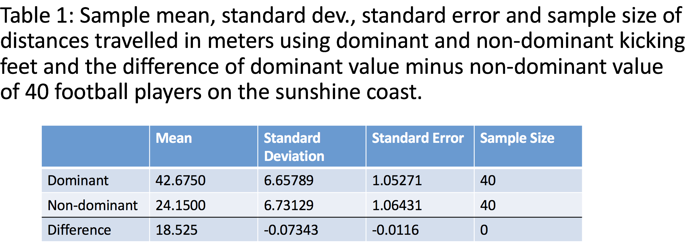
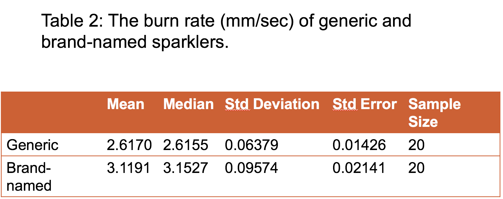
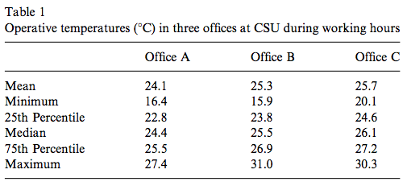
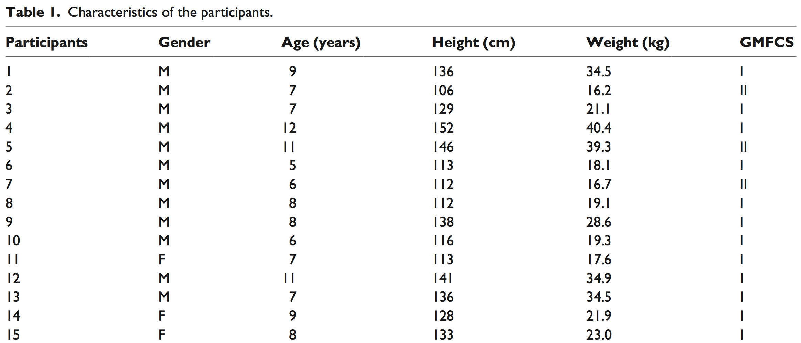

# Teaching Week 4: tutorial  {#Lecture4}


::: {.objectivesBox .objectives data-latex="{iconmonstr-target-4-240.png}"}
**Topics** covered in this tutorial:

* Numerical summaries for quantitative variables.
* More on boxplots.
* Tabular summaries.
* Row and column percentages.
* Two-way tables of counts.
* Odds and odds ratios.
* Using the **Statistics Mode** of your calculator.
:::

In this chapter, you will learn and practice the content associated with this chapter of the [textbook](https://bookdown.org/pkaldunn/Book/):

* [Chapter 13 (Numerical summaries: quantitative data)](https://bookdown.org/pkaldunn/Book/NumericalQuant.html).
* [Chapter 14 (Numerical summaries: qualitative data)](https://bookdown.org/pkaldunn/Book/NumericalQual.html).


*****


::: {.tipBox .tip data-latex="{iconmonstr-info-6-240.png}"}
You may wish search on YouTube for some tutorials on using your calculator's
**Statistics Mode**.

Here are some links that may prove 
useful.

* [**TI**-30 XS](https://www.youtube.com/watch?v=I437u8PxV2M)
* [**TI**-84](https://www.youtube.com/watch?v=gTOVeAf3HA4)
* [**Casio** fx cp 400](https://www.youtube.com/watch?v=df2hQUVMbMo)
* [**Casio** CG20](https://www.youtube.com/watch?v=O-v00SvwHIE)
* [**Casio** fx82](https://www.youtube.com/embed/PiJ9B7L7V2A)

In YouTube, I searched for  
`"statistics" "mean" "standard deviation"`  
together with the calculator make and model; for example:  
`"statistics" "mean" "standard deviation" Casio fx82`
:::

`r if( knitr::is_html_output() ){'For example, see the embedded video below for help in using the Casio fx82:'}`

<div style="text-align:center;">
<iframe width="560" height="315" src="https://www.youtube.com/embed/PiJ9B7L7V2A" frameborder="0" allow="accelerometer; autoplay; encrypted-media; gyroscope; picture-in-picture" allowfullscreen></iframe>
</div>


## Quick revision 1 {#QuickRevision-Tutorial4}

```{r echo = FALSE}
OSA <- structure(list(ID = 1:60, Age = c(21L, 24L, 26L, 39L, 21L, 29L, 
20L, 21L, 19L, 27L, 29L, 25L, 20L, 53L, 31L, 22L, 21L, 28L, 19L, 
18L, 18L, 36L, 36L, 38L, 18L, 24L, 21L, 18L, 33L, 19L, 23L, 31L, 
29L, 23L, 35L, 27L, 28L, 20L, 29L, 38L, 22L, 56L, 50L, 24L, 36L, 
44L, 25L, 49L, 18L, 19L, 27L, 31L, 21L, 22L, 20L, 29L, 35L, 22L, 
28L, 32L), Gender = c(1L, 1L, 1L, 2L, 2L, 1L, 1L, 1L, 2L, 1L, 
2L, 1L, 2L, 1L, 1L, 1L, 2L, 2L, 2L, 2L, 1L, 2L, 2L, 1L, 2L, 1L, 
1L, 1L, 1L, 1L, 2L, 1L, 1L, 1L, 2L, 2L, 1L, 1L, 2L, 1L, 2L, 2L, 
2L, 1L, 1L, 2L, 2L, 2L, 1L, 1L, 1L, 1L, 2L, 1L, 2L, 1L, 1L, 2L, 
2L, 2L), BMI = c(20.3, 24.1, 25.2, 40.8, 35, 29.2, 25.8, 20.9, 
20.5, 22.4, 24.4, 20.5, 30.5, 27.3, 32.6, 37.2, 29.9, 36.5, 27.7, 
27.1, 19.5, 36.8, 39.9, 20.3, 28.6, 21.8, 31.9, 29.2, 32, 27, 
25.6, 18.7, 32.5, 24.7, 35.6, 31.1, 24.8, 23.9, 36.8, 34.6, 28, 
29.2, 31.4, 38.3, 26, 34.3, 27, 30.6, 21.6, 37.6, 35.4, 24.2, 
19.3, 27.1, 31.5, 33.8, 31.2, 26, 36.9, 22.1), Neck = c(37, 40.5, 
38, 41, 37, 41, 42, 37, 32, 39, 37.5, 38, 39, 44.5, 46.5, 43, 
34, 37, 34, 36, 39, 41, 37, 38, 38, 36, 40, 41, 46, 42, 40.3, 
38, 47, 38, 36, 36, 44, 43, 40.5, 45, 40, 38, 40, 43, 41, 38, 
40, 40, 38, 48, 46, 39, 35.5, 48, 41, 47, 47, 39, 40, 40), REI = c(46, 
19.3, 12.4, 58.6, 12.7, 38.8, 24.4, 7, 37.6, 21.7, 7.3, 32.4, 
61.3, 25.1, 42.2, 53.6, 13.9, 22.6, 15.6, 8.7, 18.5, 40.7, 25.4, 
11.3, 13.6, 59.4, 26.2, 31, 47.1, 13, 17.5, 17.7, 45.4, 73.3, 
19.7, 23.4, 13.9, 16.9, 13.4, 54.2, 19.9, 16.5, 58.1, 29.3, 41.5, 
48.8, 32.8, 19.4, 15.8, 26.8, 31.6, 60.4, 15.7, 22.5, 18, 97.9, 
22.4, 16.8, 66.1, 19.1), SAOS = c("Severe", "Moderate", "Low", 
"Severe", "Low", "Severe", "Moderate", "Low", "Severe", "Moderate", 
"Low", "Severe", "Severe", "Moderate", "Severe", "Severe", "Low", 
"Moderate", "Moderate", "Low", "Moderate", "Severe", "Moderate", 
"Low", "Low", "Severe", "Moderate", "Severe", "Severe", "Low", 
"Moderate", "Moderate", "Severe", "Severe", "Moderate", "Moderate", 
"Low", "Moderate", "Low", "Severe", "Moderate", "Moderate", "Severe", 
"Moderate", "Severe", "Severe", "Severe", "Moderate", "Moderate", 
"Moderate", "Severe", "Severe", "Moderate", "Moderate", "Moderate", 
"Severe", "Moderate", "Moderate", "Severe", "Moderate")), class = "data.frame", row.names = c(NA, 
-60L))
```


::: {.preClassBox .preClass data-latex="{iconmonstr-home-7-240.png}"}
We recommend trying these *Quick revision* questions **before** your tutorial.
:::

A study of obstructive sleep apnoea (OSA) in adults with Down Syndrome [@carvalho2020stop]
had $n = 60$ adults undergo a sleep study.
`r if( knitr::is_html_output() ) {
  'The data are shown in Fig. \\@ref(fig:OSADT).'
} else
{
  'Part of the data are shown in Table \\@ref(tab:OSAKable2).'
}
`

```{r OSAKable2, echo=FALSE}
useOSA <- OSA[, c(2:6)]
useOSA$Gender <- factor(useOSA$Gender, 
                        levels = 1:2, 
                        labels = c("Male", 
                                   "Female"))
    
if( knitr::is_latex_output() ) {
  knitr::kable( head(useOSA, 10),
               format = "latex",
               longtable = FALSE,
               booktabs = TRUE,
               col.names = c("Age",
                            "Gender",
                            "BMI",
                            "Neck circumference (cm)",
                            "REI"),
              caption = "Part of the Obstructive sleep apnoea data set") %>%
    kable_styling(font_size = 10)
}
```

```{r OSADT2, echo=FALSE, fig.cap="The Obstructive sleep apnoea data set", fig.align="center"}
if( knitr::is_html_output() ) {
  DT::datatable(useOSA,
              list(scrollX = TRUE, 
                   scrollY = TRUE, 
                   ordering = FALSE),
              caption = "The Obstructive sleep apnoea data set")
}
```

1. What would **not** be an appropriate numerical summary for the age of the participants?  
`r if( knitr::is_html_output() ) {webexercises::longmcq( c(
                      "Median", 
		                  "Mean",
                      answer = "Odds",
                      "Standard deviation") )}`
1. What might be an appropriate way to numerically describe the amount of *variation* in the ages of participants?  
`r if( knitr::is_html_output() ) {webexercises::longmcq( c(
                      answer = "Standard deviation", 
		                  "Median",
                      "Mean",
                      "Odds") )}`
1. What might be an appropriate way to numerically describe the average REI of participants?  
`r if( knitr::is_html_output() ) {webexercises::longmcq( c(
                      "Standard deviation", 
		                  answer = "Median",
                      "Odds",
                      "Percentages") )}`
1. What might be an appropriate way to numerically describe the gender of the participants?  
`r if( knitr::is_html_output() ) {webexercises::longmcq( c(
                      "Standard deviation", 
		                  "Median",
                      "IQR",
                      answer = "Percentages") )}`


`r webexercises::hide()`
1. *Age* is quantitative, so odds are not appropriate (odds are used with qualitative data).
1. Variation is measured using standard deviation or IQR.
1. The average value (of a quantitative variable) can be described using a mean or a median.
1. Percentages or odds can be used to numerically summarise a qualitative variable like *gender*.
`r webexercises::unhide()`

**Progress:** `r webexercises::total_correct()`


## Quick revision 2 {#QuickRevision-Tutorial5}


::: {.preClassBox .preClass data-latex="{iconmonstr-home-7-240.png}"}
We recommend trying these *Quick revision* questions **before** your tutorial.
:::

A study of how well emergency dispatchers recognised signs of stroke [@oostema2018emergency]
collected the data shown below.

| Sex of patients | Dispatcher suspected stroke | Dispatcher missed stroke
|----------------:+:---------------------------:+:-------------------------:
| Male            | 67                          | 43
| Female          | 97                          | 39


1. What *percentage* of *male* patients had their stroke symptoms missed by the dispatcher?  
`r if( knitr::is_html_output() ) {webexercises::longmcq( c(
                      answer = "39.1%", 
		                  "60.9%",
                      "52.4%",
                      "33.3%") )}`
1. What *percentage* of *female* patients had their stroke symptoms missed by the dispatcher?  
`r if( knitr::is_html_output() ) {webexercises::longmcq( c(
		                  "71.3%",
                      "47.6%",
                      answer = "28.7%", 
                      "33.3%") )}`
1. What are the *odds* that a *male* patients had their stroke symptoms missed by the dispatcher?  
`r if( knitr::is_html_output() ) {webexercises::longmcq( c(
                      "39.1", 
		                  answer = "0.642",
                      "0.907",
                      "0.50") )}`
1. What are the *odds* that a *female* patients had their stroke symptoms missed by the dispatcher?  
`r if( knitr::is_html_output() ) {webexercises::longmcq( c(
                      answer = "0.402", 
		                  "2.49",
                      "1.10",
                      "1.24") )}`
1. What is the *odds ratio* that a patients had their stroke symptoms missed by the dispatcher, comparing *males* to *females*?  
`r if( knitr::is_html_output() ) {webexercises::longmcq( c(
		                  "0.63",
                      "0.402",
                      "0.50",
                      answer = "1.6") )}`


`r webexercises::hide()`
1. $43\div (43 + 67) \times 100 = 39.1$%. 
1. $39\div (97 + 39) \times 100 = 28.7$%.
1. $43\div 67 = 0.642$.
1. $39\div 97 = 0.402$.
1. $0.642 \div 0.402 = 1.6$.
`r webexercises::unhide()`

**Progress:** `r webexercises::total_correct()`


## Understanding histograms and boxplots {#UnderstandingBoxplots}


<div style="float:right; width: 222x; border: 1px; padding:10px">

</div>


An Australian study 
[@others:lunn:cida]
compared the dimensions of jellyfish at two sites at Hawkesbury River, NSW
(Dangar Island; Salamander Bay)
to determine how the jellyfish were different at each site.

A histogram of the breadth of jellyfish at Dangar Island Bay is shown in 
Fig. \@ref(fig:JellyfishHist).

```{r JellyfishHist, echo=FALSE, fig.cap="A histogram of the breadth of jellyfish at Dangar Island", fig.align="center", fig.width=5}

JF <- structure(list(Location = structure(c(1L, 1L, 1L, 1L, 1L, 1L, 
1L, 1L, 1L, 1L, 1L, 1L, 1L, 1L, 1L, 1L, 1L, 1L, 1L, 1L, 1L, 1L, 
2L, 2L, 2L, 2L, 2L, 2L, 2L, 2L, 2L, 2L, 2L, 2L, 2L, 2L, 2L, 2L, 
2L, 2L, 2L, 2L, 2L, 2L, 2L, 2L), .Label = c("Dangar", "Salamander"
), class = "factor"), Width = c(6, 6.5, 6.5, 7, 7, 7, 8, 8, 8, 
8, 9, 10, 11, 11, 11, 12, 13, 14, 15, 15, 15, 16, 12, 13, 14, 
14, 15, 15, 15, 15, 15, 15, 16, 16, 16, 16, 16, 16.5, 17, 18, 
18, 18, 19, 19, 20, 21), Length = c(9, 8, 9, 9, 10, 11, 9.5, 
10, 10, 11, 11, 13, 13, 14, 14, 13, 14, 16, 16, 16, 19, 16, 14, 
17, 16.5, 19, 16, 17, 18, 18, 19, 21, 18, 19, 20, 20, 21, 19, 
20, 19, 19, 20, 20, 22, 22, 21)), class = "data.frame", row.names = c(NA, 
-46L))


ns <- c( length(JF$Width[JF$Location == "Dangar"]),
         length(JF$Width[JF$Location == "Salamander"])
) 


out <- hist(JF$Width[JF$Location == "Dangar"], 
            las = 1, 
            xlab = "Breadth (in mm)",
            ylab = "Number of jellyfish",
            col = plot.colour, 
            main = paste("Breadth of jellyfish at Dangar Island"),
            sub = paste("(n =", ns[1], "jellyfish)"),
            ylim = c(0, 12))
```


1. Two students are arguing about the median breadth.  

**Student 1** says:  

> The bars in the histogram have heights of 10, 2, 4, 2 and 4.  
> When these numbers are put in order, they are:
> 2, 2, 4, 4, 10.  
> The median breadth is the median of these numbers,
> so the median breadth is the middle one: 4mm is the median.  

**Student 2** responds:  

> You have the correct answer, but for the wrong reason!  
> There are five bars, and the middle bar is the third bar.  
> Since the third bar has a height of 4, 
> the median breadth is 4mm.  

   Who is correct?
   Explain.


`r if (knitr::is_latex_output()) '<!--'`
<iframe src='https://www.ferendum.com/en/embeded.php?pregunta_ID=458355&sec_digit=1244149825&embeded_digit=426794483' style='width:100%; height:550px; overflow: auto; background: #B3919133' frameBorder='0'></iframe><BR>
<A href='https://www.ferendum.com' target='_blank'>Free Online Poll Maker</A>
`r if (knitr::is_latex_output()) '-->'`

<!-- Admin link: -->
<!-- https://www.ferendum.com/en/admin.php?pregunta_ID=458355&sec_digit=1244149825&edit_code=1611489288 -->

<!-- https://www.ferendum.com/en/admin.php?pregunta_ID=458354&sec_digit=629109217&edit_code=780185403 -->


2. Describe the histogram.
3. A boxplot comparing the breadths of jellyfish at Dangar Island and Salamander Bay is shown in
   Fig. \@ref(fig:JellyfishBoxplots).
	 Which box represents the Dangar Island jellyfish (shown in Fig. \@ref(fig:JellyfishHist))?  
	 
   Describe and compare the breadths of the jellyfish.


```{r JellyfishBoxplots, echo=FALSE, fig.cap="A boxplot of the breadth of jellyfish at two sites", fig.align="center", fig.width=5}
JF <-structure(list(Location = structure(c(1L, 1L, 1L, 1L, 1L, 1L, 
1L, 1L, 1L, 1L, 1L, 1L, 1L, 1L, 1L, 1L, 1L, 1L, 1L, 1L, 1L, 1L, 
2L, 2L, 2L, 2L, 2L, 2L, 2L, 2L, 2L, 2L, 2L, 2L, 2L, 2L, 2L, 2L, 
2L, 2L, 2L, 2L, 2L, 2L, 2L, 2L), .Label = c("Dangar", "Salamander"
), class = "factor"), Width = c(6, 6.5, 6.5, 7, 7, 7, 8, 8, 8, 
8, 9, 10, 11, 11, 11, 12, 13, 14, 15, 15, 15, 16, 12, 13, 14, 
14, 15, 15, 15, 15, 15, 15, 16, 16, 16, 16, 16, 16.5, 17, 18, 
18, 18, 19, 19, 20, 21), Length = c(9, 8, 9, 9, 10, 11, 9.5, 
10, 10, 11, 11, 13, 13, 14, 14, 13, 14, 16, 16, 16, 19, 16, 14, 
17, 16.5, 19, 16, 17, 18, 18, 19, 21, 18, 19, 20, 20, 21, 19, 
20, 19, 19, 20, 20, 22, 22, 21)), class = "data.frame", row.names = c(NA, 
-46L))

ns <- c( length(JF$Width[JF$Location == "Dangar"]),
         length(JF$Width[JF$Location == "Salamander"])
) 

boxplot(Width ~ Location, 
        data = JF,
        col = plot.colour,
        las = 1,
        ylim = c(5, 25),
        names = c("Site A", 
                  "Site B"),
        xlab = "Site",
        ylab = "Breadth (in mm)",
        main = "Breadth of a sample of jellyfish at two sites")
```


## Using the calculator statistics mode {#StatsMode}


<div style="float:right; width: 222x; border: 1px; padding:10px">

</div>


Bamboo is a fast-growing, strong grass useful for green building practices.
A small research study
explored the properties of bamboo when used as flooring material,
including the bending strength (the Modulus of Rupture, or MOR, in MPa).

Five different bamboo floorboards were provided by Bamboo Flooring Australia Pty Ltd
and assessed by the Queensland Department of Primary Industries [@data:Gerber:BambooFlooring].

The five MOR test results (in MPa) are shown in Table \@ref(tab:MORTable).

```{r MORTable, echo=FALSE}
MORTab <- array( "", 
                 dim = c(1, 5))

MORTab[1, ] <- c(99.2, 111.2, 97.6, 101.1, 104.0)


if( knitr::is_latex_output() ) {
  kable(MORTab,
      format = "latex",
      booktab = TRUE,
      caption = "The MOR (in MPa) for five bamboo boards") %>%
  kable_styling(full_width = FALSE)
}
if( knitr::is_html_output() ) {
  kable(MORTab,
      format = "html",
      booktab = TRUE,
      caption = "The MOR (in MPa) for five bamboo boards") %>%
  kable_styling(full_width = FALSE)
}
```


1. Identify the type of RQ being answered: descriptive, relational, or interventional. Justify your answer.
2. Use your calculator's statistics mode to compute the mean and the standard deviation.

::: {.importantBox .important data-latex="{iconmonstr-warning-8-240.png}"}
Most calculators have **two buttons** that compute the standard deviation:
one if the data are a sample, and one if the data are a population.

In practice, data are almost *never* a population.

If you are using your calculator correctly, you should get $\bar{x}=102.62$ and $s=5.356$. 
If you get $s=4.790157$ for the *standard deviation*, 
you are using your calculator incorrectly, so please **ask for help**.
You are probably pressing the incorrect button to get the standard deviation.
:::


3. Compute the median MOR of the flooring. (Most calculators cannot compute the median; you will need to do this by hand.)
4. Compute the range of the MOR values.
5. What specifications would you report about the MOR of bamboo flooring based on these data?
6. What would be the implication if all five values were from the *same* floorboard?


## Understanding variation {#UnderstandingVariation}


<iframe src="https://usc.h5p.com/content/1290996647109217689/embed" width="1088" height="909" frameborder="0" allowfullscreen="allowfullscreen" allow="geolocation *; microphone *; camera *; midi *; encrypted-media *"></iframe><script src="https://usc.h5p.com/js/h5p-resizer.js" charset="UTF-8"></script>

```{r, child = if (knitr::is_latex_output()) './children/TutorialQns/Lect4-Q3.Rmd'}
```


## Critiquing students' numerical summaries {#CritiqueStudentSummaries}

In this activity,
you get to critique actual Project submissions,
so you can critique your own before submission.

1. Critique the numerical summary in Fig. \@ref(fig:StudentsNumSumA), a screenshot from a student Project Report.
   Identify ways to improve the numerical summary.  
   
   The RQ is 
   '*What is the mean difference between the kicking distance 
    using dominant and non-dominant legs?*'

	
::: {.importantBox .important data-latex="{iconmonstr-warning-8-240.png}"}
You don't know what 'standard error' means yet, so don't worry about that column.
:::
	

```{r StudentsNumSumA, echo=FALSE, fig.cap="A numerical summary from a student Project", fig.align="center", out.width="70%"}

```

2. Critique the numerical summary in 
	 Fig. \@ref(fig:StudentsNumSumB),
	 a screenshot from a student Project Report.
	 (You don't know what 'standard error' means yet, so don't worry about that column.)
	 Identify ways to improve the numerical summary.

	 The RQ is 
	 '*What is the difference between the mean burn rates of generic and brand-name sparklers?*'
	 

```{r StudentsNumSumB, echo=FALSE, fig.cap="A numerical summary from a student Project", fig.align="center", out.width="60%"}

```


## Numerical summary for ruler-drop data {#PlanStudy4}

Your tutor will have information.


## **Optional**: Using the calculator statistics mode {#CalculatorBatteries}

*(Answers are available in Sect. \@ref(Lecture4Answers))*

Batteries are expensive,
so comparing the performance of expensive and cheap batteries is helpful.

A test on the lifetime of batteries [@data:ALDIBatteryTesting]
compared the time for two brands of 1.5 volt batteries to reduce their voltage to 1.0 volts under standard testing conditions.

The times (in hours) for nine Energizer Max batteries and 
nine ALDI brand batteries (Ultracell)
are shown in Table \@ref(tab:BattTable).

```{r BattTable, echo=FALSE}
BattTab <- array( "", dim=c(2, 9))

BattTab[1, ] <- c(7.58, 7.46, 7.46, 7.59, 7.46, 7.52, 6.83, 6.89, 7.45)
BattTab[2, ] <- c(7.50, 7.48, 7.47, 7.48, 7.48, 7.41, 7.47, 6.96, 7.48)

rownames(BattTab) <- c("Energizer", 
                       "Ultracell")

if( knitr::is_latex_output() ) {
  kable(BattTab,
      format = "latex",
      booktab = TRUE,
      caption = "The times taken for batteries to go from 1.5 volts to 1.0 volts, in hours)") %>%
  column_spec(1, bold = TRUE) %>%
  kable_styling(full_width = FALSE)
}
if( knitr::is_html_output() ) {
  kable(BattTab,
      format = "html",
      booktab = TRUE,
      caption = "The times taken for batteries to go from 1.5 volts to 1.0 volts, in hours)") %>%
  column_spec(1, bold = TRUE) %>%
  kable_styling(full_width = FALSE)
}
```


1. `r if( knitr::is_latex_output() ) {'Is the type of research study a true experimental, quasi-experimental, or observational study?'}`
`r if( knitr::is_html_output() ) {'The type of research study is  '}`
`r if( knitr::is_html_output() ) {webexercises::longmcq( c("a true experimental.", "a quasi-experimental study.",	answer= "an observational study."))}`  
   Justify your answer.

2. What are the *units of observation* and *units of analysis*?
3. Use your calculator's *Statistics mode* to compute the following. (Check your answers to ensure you are using your calculator correctly.)
   a. Compute the mean of the *Energizer* batteries (to two decimal places):
   `r if( knitr::is_html_output() ) {webexercises::fitb(num=TRUE, tol=0.01, answer=7.36)}`
   a. Compute the standard deviation of the *Energizer* batteries (to three decimal places):
   `r if( knitr::is_html_output() ) {webexercises::fitb(num=TRUE, tol=0.001, answer=0.289)}`
   a. Compute the mean of the *Ultracell* batteries (to two decimal places):
   `r if( knitr::is_html_output() ) {webexercises::fitb(num=TRUE, tol=0.01, answer=7.41)}`
   a. Compute the standard deviation of the *Ultracell* batteries (to three decimal places):
   `r if( knitr::is_html_output() ) {webexercises::fitb(num=TRUE, tol=0.01, answer=0.172)}`

4. Explain what these calculations tell you.
5. Compute the median lifetime for each brand, explain what this tells you. (Many calculators cannot compute medians.)
   a. Compute the median of the *Energizer* batteries (to two decimal places):
   `r if( knitr::is_html_output() ) {webexercises::fitb(num=TRUE, tol=0.01, answer=7.46)}`
   b. Compute the median of the *Ultracell* batteries (to two decimal places):
   `r if( knitr::is_html_output() ) {webexercises::fitb(num=TRUE, tol=0.01, answer=7.48)}`

6. Determine (and justify) if the mean or median would be a more appropriate measure of centre for these data.
7. Do you think evidence exists that the average time for the batteries to reach 1.0 volts is the same for each brand?
   Explain.
8. Decide if outliers exist in the data. Explain.
	 If so, identify them.
9. Explain whether the cost of the batteries would also be important information to know. (See below.)
10. What advice would you give about buying batteries based on these data?

::: {.tipBox .tip data-latex="{iconmonstr-info-6-240.png}"}
The cost of the batteries,
at the time of publication (05 September 2012),
was: 
  
* *Ultracell*: A four-pack cost $2.49 from ALDI online
* *Energizer Max*: A four-pack cost $5.97 from Woolworths online, *on special*;
the normal price was $8.01 for the four-pack.
:::


## **Optional**: Interpreting histograms {#InterpretHistogram}

*(Answers are available in Sect. \@ref(Lecture4Answers))*


To assess various lung diseases,
many methods are available
(including using a spirometer and the 6-minute walk test).

The fatigue assessment scale (FAS)
is one way to measure the fatigue of the patient.
(A high FAS value means more fatigue [@data:Michielsen2003:FAS].)

The histogram in 
Fig. \@ref(fig:Baughman2007-HistogramFig2)
comes from a study [@data:Baughman2007:SixMinuteWalk]
examining $n=142$ sarcoidosis patients using the FAS.

1. Critique this histogram. Identify ways to improve the histogram.
2. Describe this histogram in words: what does it tell you?
3. Draw a rough boxplot that corresponds approximately to the histogram,
   explaining your reasoning.


```{r Baughman2007-HistogramFig2, echo=FALSE, fig.align="center", fig.cap="The histogram of FAS scores for patients", out.width='55%'}
include_graphics("ArticleImages/Baughman2007-HistogramFig2.png")
```


## **Optional**: Interpreting and drawing boxplots {#DrawBoxplot}

*(Answers are available in Sect. \@ref(Lecture4Answers))*

Environmentally-friendly buildings are often assumed to
have a better indoor environmental quality
(when occupants rate the comfort) than conventional buildings;
in turn,
this is assumed to have a positive impact on productivity.

One group of researchers decided to test this assertion.
Figure \@ref(fig:Paul2008Table1)
is taken from a study of office temperatures [@data:Paul2008:Comfort]
in an environmentally-friendly building at Charles Sturt University.

Operative temperatures were measured in three offices
between 8am to 6pm during four weeks near the end of summer;
Office A is located on the ground floor,
while Offices B and C are located on the top floor.
The building is not air conditioned.

1. Use this information to construct a boxplot of the range of office temperatures for the three offices.
2. In words, describe the relationship.
3. Do the offices appear to provide a 'comfortable' temperature?

```{r Paul2008Table1, echo=FALSE, fig.align="center", fig.cap="Table 1 from Paul et al. (2008)", out.width='75%'}

```


## **Optional**: Selecting the correct graph {#SelectGraphs1}

`r if (knitr::is_latex_output()) {
   '*(Answers are available in Sect.\\@ref(Lecture4Answers))*'
}`

<iframe src="https://usc.h5p.com/content/1291016626996338939/embed" width="1088" height="637" frameborder="0" allowfullscreen="allowfullscreen" allow="geolocation *; microphone *; camera *; midi *; encrypted-media *"></iframe><script src="https://usc.h5p.com/js/h5p-resizer.js" charset="UTF-8"></script>


```{r, child = if (knitr::is_latex_output()) './children/TutorialQns/Lect4-Q9.Rmd'}
```


## **Drills**: computational exercises {#Chapter4Drills}

*(Answers are available in Sect. \@ref(Lecture4Answers))*

::: {.drillBox .drill data-latex="{iconmonstr-pencil-9-240.png}"}
These **Drill** exercises (repeated practice) give you practice at getting computations correct,
and using your calculator.
These drill questions are more about practising the underlying *mathematics* rather than the *statistics*.

If you need help, please **ask**.
:::

1. The data in Table \@ref(tab:AISTable) give the heights of female tennis players at the Australian Institute of Sport (AIS) in metres [@telford1991sex].
   a. Using your calculator's *Statistics Mode*, find the **mean** and **standard deviation** of these numbers.
   b. Without using a calculator, find the **median** of these numbers.

```{r AISTable, echo=FALSE}
library(GLMsData)
data(AIS)

Hts <- subset(AIS$Ht, 
              AIS$Sex == "F" & AIS$Sport == "Tennis")

AISTab <- array( "", 
                 dim = c(1, length(Hts)) )

AISTab[1, ] <- Hts
AIScap <- "The heights (in metres) of females tennis players at the AIS"

if( knitr::is_latex_output() ) {
  kable(AISTab,
      format = "latex",
      booktab = TRUE,
      caption = AIScap) %>%
  kable_styling(full_width = FALSE)
}
if( knitr::is_html_output() ) {
  kable(AISTab,
      format = "html",
      booktab = TRUE,
      caption = AIScap) %>%
  kable_styling(full_width = FALSE)
}
```


```{r echo=FALSE}
set.seed(2021)
library(GLMsData)
data(polythene)

len <- 8
PT <- polythene$Polythene
PT <- PT[ sample( 1:length(PT), len) ]
```

2. The data in Table \@ref(tab:PolyTable) give the usage, in tonnes, of polythene by `r len` UK cosmetic companies [@gilchrist2000regression].
   a. Using your calculator's *Statistics Mode*, find the **mean** and **standard deviation** of these numbers.
   b. Without using a calculator, find the **median** of these numbers.

```{r PolyTable, echo=FALSE}

PTTab <- array( "", 
                dim = c(1, length(PT) ) )

PTTab[1, ] <- PT
PTcap <- "The amount of polythene (in tonnes) used by a sample of UK cosmetic companies"

if( knitr::is_latex_output() ) {
  kable(PTTab,
      format = "latex",
      booktab = TRUE,
      caption = PTcap) %>%
  kable_styling(full_width = FALSE)
}
if( knitr::is_html_output() ) {
  kable(PTTab,
      format = "html",
      booktab = TRUE,
      caption = PTcap) %>%
  kable_styling(full_width = FALSE)
}
```


3. The data in Table \@ref(tab:AISTable) give the percentage body fat of females swimmers at the Australian Institute of Sport (AIS)  [@telford1991sex].
   a. Using your calculator's *Statistics Mode*, find the **mean** and **standard deviation** of these numbers.
   b. Without using a calculator, find the **median** of these numbers.

```{r AISTable2, echo=FALSE}
library(GLMsData)
data(AIS)

PBF <- subset(AIS$PBF, 
              AIS$Sex == "F" & AIS$Sport == "Swim")

AISTab2 <- array( "", 
                  dim = c(1, length(PBF)) )

AISTab2[1, ] <- PBF
AIScap2 <- "The percentage body fat of females swimmers players at the AIS"

if( knitr::is_latex_output() ) {
  kable(AISTab2,
      format = "latex",
      booktab = TRUE,
      caption = AIScap2) %>%
  kable_styling(full_width = FALSE)
}
if( knitr::is_html_output() ) {
  kable(AISTab2,
      format = "html",
      booktab = TRUE,
      caption = AIScap2) %>%
  kable_styling(full_width = FALSE)
}
```


## Percentages and odds {#PercentagesOdds}

Endotracheal intubation (ETI)
is a method for maintaining an open airway or as a method for administering certain drugs for ill patients.

ETI is widely used for airway management of children in the out-of-hospital setting, 
but for many years little evidence was available on the effect of using ETI.

Table \@ref(tab:AirwayTable)
comes from a study [@data:Gausche200:Endotracheal] of using different types of endotracheal intubation
on children.

Use the table to answer the questions that follow.


```{r AirwayTable, echo=FALSE}
Airways <- array( dim = c(8, 4))

colnames(Airways) <- c("Number", 
                       "%", 
                       "Number", 
                       "%")
rownames(Airways) <- c("Normal, no change from baseline",
                       "No change from baseline",
                       "Mild disability",
                       "Moderate disability",
                       "Severe disability",
                       "Coma/vegetative",
                       "Death",
                       "Total")

Airways[1, ] <- c("39", "(10%)", "33", "(8%)")
Airways[2, ] <- c("33", "(8%)", "25", "(6%)")
Airways[3, ] <- c("20", "(5%)", "27", "(6%)")
Airways[4, ] <- c("6", "(1%)", "7", "(2%)")
Airways[5, ] <- c("10", "(2%)", "6", "(1%)")
Airways[6, ] <- c("15", "(4%)", "12", "(3%)")
Airways[7, ] <- c("281", "(70%)", "306", "(74%)")
Airways[8, ] <- c("404", "", "416", "")

if( knitr::is_latex_output() ) {
  kable(Airways,
      format = "latex",
      align = rep("r", 4),
      booktabs = TRUE,
      linesep = c("", "\\addlinespace", "", "", "\\addlinespace", "","\\addlinespace", ""), 
      caption = "Airway management data") %>%
  add_header_above(header = c("  " = 1, 
                              "BVM group " = 2, 
                              " ETI group" = 2), 
                   align = "c", 
                   bold = TRUE  ) %>%
  column_spec(1, bold = TRUE) %>%
  row_spec(0, bold = TRUE) %>%
  row_spec(8, bold = TRUE) %>%
  kable_styling(full_width = FALSE)
}
if( knitr::is_html_output() ) {
  kable(Airways,
      format = "html",
      align = rep("r", 4),
      booktabs = TRUE,
      linesep = c("", "\\addlinespace", "", "", "\\addlinespace", "","\\addlinespace", ""), 
      caption = "Airway management data") %>%
  add_header_above(header = c("  " = 1, 
                              "BVM group " = 2, 
                              " ETI group" = 2), 
                   align = "c", 
                   bold = TRUE  ) %>%
  column_spec(1, bold = TRUE) %>%
  row_spec(0, bold = TRUE) %>%
  row_spec(8, bold = TRUE) %>%
  kable_styling(full_width = FALSE)
}

```


1. Among people treated with BVM ('ball valve mask'),
   compute the *percentage* that died (to the nearest percent).  
`r if( knitr::is_html_output() ) {fitb(num=TRUE, tol=0.1, answer=70)}`

2. Among the people treated with BVM,
   what are the *odds* that
   someone died?
   Explain which one of the following calculations is correct,
   and **explain what the other calculations compute,
   and hence why they are wrong**.  
`r if( knitr::is_html_output() ) {longmcq(
    c(answer = "281/(404-281) = 2.28",
               "(404-281)/404 = 0.304",
               "281/404 = 0.696",
               "(281+306) / ( 404+416) = 0.716",
               "281/306 = 0.918"
     ))}`

3. Among people treated with ETI,
   the *odds* that someone died is 2.78.
   What does this mean?  
`r if( knitr::is_html_output() ) {longmcq(
  c(         "A patient treated with ETI has a 2.78% chance of dying.",
             "2.78% of patients treated with ETI in the study died.",
    answer = "For patients treated with ETI, about 278 die for every 100 that survive.",
             "For patients treated with ETI, about 278 live for every 100 that die."
  ))}`
  
4. How many times greater is the odds that a person treated with 
   ETI died compared to the odds that a person treated 
   with BVM died?  
`r if( knitr::is_html_output() ) {fitb(num=TRUE, tol = 0.01, answer = 1.22)}`


## Which summary measures to use {#WhichSummaryToUse}

A study of different orthoses (orthotic devices)
in children with 
cerebral palsy [@data:Swinnen2017:orthoses]
produced the demographic data of the participants.

[GMFCS](https://en.wikipedia.org/wiki/Gross_Motor_Function_Classification_System) 
is the 
'[Gross Motor Function Classification System](https://en.wikipedia.org/wiki/Gross_Motor_Function_Classification_System)', 
which is:

> ... a 5 level clinical classification system that describes the gross motor function 
> of people with cerebral palsy on the basis of self-initiated movement abilities.
>
> --- [Wikipedia](https://en.wikipedia.org/wiki/Gross_Motor_Function_Classification_System)


`r if (knitr::is_latex_output()) 'The table is shown in	Fig.&nbsp;\\@ref(fig:Orthoses).'`


`r if (knitr::is_html_output()) '<!--'`

```{r Orthoses, echo=FALSE, fig.cap="The data collected from a study of orthoses (GMFCS: Gross Motor Function Classification System)", fig.align="center", out.width="80%"}

```
`r if (knitr::is_html_output()) '-->'`


```{r, child = if (knitr::is_latex_output()) './children/TutorialQns/Lect4-Q5.Rmd'}
```


<iframe src="https://usc.h5p.com/content/1291015706670675039/embed" width="1088" height="637" frameborder="0" allowfullscreen="allowfullscreen" allow="geolocation *; microphone *; camera *; midi *; encrypted-media *"></iframe><script src="https://usc.h5p.com/js/h5p-resizer.js" charset="UTF-8"></script>


<!-- 1. What are the variables? How many variables are there? -->
<!-- 1. Which variables are **quant**itative? Which are discrete and which are continuous? -->
<!-- 1. Which are **qual**itative? Which are nominal and which are ordinal? -->
<!-- 1. Explain which *numerical* summaries you would use  -->
<!--  	 to summarise the data collected for *each*  -->
<!--  	 variable individually. -->
<!-- 2. Explain which *graphical* summaries you would use  -->
<!--  	 to summarise the data collected for *each*  -->
<!--  	 variable individually.   -->

<!--  	 (You don't have to *produce* the summaries,  -->
<!--  	 just explain which would be appropriate. -->
<!--  	 GMFCS is the 'Gross Motor Classification System', an ordinal classification system.) -->
<!-- 3. What graphs would you use to display the *relationship* -->
<!--    between Gender and Height?   -->

<!--  	 What graphs would you use to display the *relationship* -->
<!--    between Gender and GMFCS? -->

<!-- ```{r Orthoses, echo=FALSE, fig.cap="The data collected from a study of orthoses (GMFCS: Gross Motor Function Classification System)",  fig.align="center", out.width="90%"} -->
<!--  -->
<!-- ``` -->


## Two-way tables {#TwoWayTables}


<div style="float:right; width: 222x; border: 1px; padding:10px">

</div>


Soccer is a unique in that one aspect is 

> ...the purposeful use of the unprotected head for controlling and advancing the ball...
>
>  --- @data:Gausche200:Endotracheal

Some researchers suspect that repeatedly 'heading' the ball may impair brain function. 

A study 
[@data:Gausche200:Endotracheal]
was conducted to determine

> ...whether long-term or chronic neuropsychological dysfunction (i.e. concussion)
> was present in collegiate soccer players
>
> --- @data:Gausche200:Endotracheal, p. 157.

Data were collected from 
240 college students:

* The student type:
  One of 'soccer players' (63 students),
  'non-soccer athletes' (96 students),    
  or 'non-athletes' (81 students).
* The number of head concussions:
  Each student was asked
  about the number of head concussions they had experienced;
  'zero' (158 students),
  'one' (45 students), 
  or 
  'two or more'  (37 students) concussions.

Use the study data
(Table \@ref(tab:SoccerTable))
to answer the following questions.
	     
	     
```{r SoccerTable, echo=FALSE}
SoccerTab <- array(dim=c(4, 4))
rownames(SoccerTab) <- c("Soccer players",
                         "Non-soccer athletes",
                         "Non-athletes",
                         "Total")
colnames(SoccerTab) <- c("0", 
                         "1", 
                         "2 or more", 
                         "Total")

SoccerTab[1, ] <- c(45, 5, 13, 63)
SoccerTab[2, ] <- c(68, 25, 3, 96)
SoccerTab[3, ] <- c(45, 15, 21, 81)
SoccerTab[4, ] <- c(158, 45, 37, 240)

if( knitr::is_latex_output() ) {
  kable(SoccerTab,
      format = "latex",
      booktabs = TRUE,
      caption = "Data on concussions experienced by college students") %>%
  column_spec(1, bold = TRUE) %>%
  column_spec(5, bold = TRUE) %>%
  row_spec(0, bold = TRUE) %>%
  row_spec(4, bold = TRUE) %>%
  kable_styling(full_width = FALSE)
}
if( knitr::is_html_output() ) {
  kable(SoccerTab,
      format = "html",
      booktabs = TRUE,
      caption = "Data on concussions experienced by college students") %>%
  column_spec(1, bold = TRUE) %>%
  column_spec(5, bold = TRUE) %>%
  row_spec(0, bold = TRUE) %>%
  row_spec(4, bold = TRUE) %>%
  kable_styling(full_width = FALSE)
}
```
   
1. Compute the percentage of college students in the *sample* overall that 
   have received exactly one concussion.
2. Many possible graphs exists to display the data; 
   four are shown in Fig. \@ref(fig:SoccerGraph).
   What is the main message from each graph?
   Which graph do you think is best?  Why?

```{r SoccerGraph, echo=FALSE, fig.cap="Four different graphs displaying the soccer-data. 'S' mean a soccer player; 'NS' means a non-soccer athlete; 'NA' means a non-athlete", fig.height=8.5, fig.width=6.5, out.width="85%", fig.align="center"}

SP <- matrix( nrow = 3, 
              ncol = 3, 
              data = c(45, 5, 13, 68, 25, 3, 45, 15, 21), 
              byrow = TRUE,
              dimnames = list( c("S", "NS", "NA"),
                              c("0", "1", "2+") )
              )

SP.pc1 <- prop.table(SP,  
                     margin = 1) * 100
SP.pc2 <- prop.table(SP,  
                     margin = 2) * 100

#cols <- c( grey(0.2),
#           grey(0.5),
#           grey(0.8))

cols <- viridis(3, # Three colours
                alpha = 0.5,
                option = "E") # See  ?viridis: The pallete to use

par( mfrow=c(2,2), 
     xpd = NA, # A logical value or NA. If FALSE, all plotting is clipped to the plot region, 
               # if TRUE, all plotting is clipped to the figure region, and 
               # if NA, all plotting is clipped to the device region. See also clip.
     mar = c(3, 4, 12, 4) + 0.1 )
#     mar=c(5.1, 4.1, 4.1, 9.1))
#par(mar = c(10, 4, 4, 0.5) + 0.1,

barplot(SP,     
        las = 1,
        ylim = c(0, 160),
        axes = FALSE,
        col = cols,
        ylab = "Number of students", 
        args.legend=list(x = "right", 
                         title = "Student:", 
                         xpd = TRUE, 
                         inset = c(-0.6, 0) ), 
        xlab = "Number of concussions",
        main = "Student types by occurrence\nof concussions")
axis(side = 2, 
     at = seq(0, 160, by = 40),
     las = 1)
#axis(side=1)
# Add the labels meanings
legend("top",
       fill = cols,
       bty = "o",
       box.col = "grey",
       cex = 1,
       ncol = 2,
       #lwd = 2,
       #horiz=TRUE,
       inset = c(0, -0.40),
       legend = c("Soccer", 
                  "Athlete", 
                  "Non-athlete") )

barplot( t(SP.pc1), 
         las = 1, 
         col = cols,
         ylab = "Percentage of students", 
         args.legend = list(x = "right", 
                            title = "Concussions:", 
                            bg = "white", 
                            xpd = TRUE, 
                            inset = c(-0.7, 0)), 
         xlab = "Student type",
         main = "Occurrence of concussions\nby student type")
legend("top",
       fill = cols,
       bty = "o",
       box.col = "grey",
       cex = 1,
       ncol=2,
       #lwd = 2,
       #horiz=TRUE,
       inset = c(0, -0.40),
       legend = c("0", 
                  "1", 
                  "2+") )
barplot( t(SP.pc1), 
         beside = TRUE, 
         col = cols,
         las = 1, 
         ylim = c(0, 80),
         ylab = "Percentage of students", 
         args.legend = list(title = "Concussions:", 
                            bg = "white", 
                            x = "right", 
                            xpd = TRUE, 
                            inset = c(-0.7, 0)), 
         xlab = "Student type",
         main = "Occurrence of concussions\nby student type")
legend("top",
       fill = cols,
       bty = "o",
       box.col = "grey",
       cex = 1,
       ncol=2,
       #lwd = 2,
       #horiz=TRUE,
       inset = c(0, -0.40),
       legend = c("0", 
                  "1", 
                  "2+") )
barplot(SP.pc2, 
        beside = TRUE, 
        las = 1,         
        col = cols,
        ylim = c(0, 60),
        ylab = "Percentage of students", 
        args.legend = list(title = "Student:", 
                           bg = "white",
                           x = "right",
                           xpd = TRUE, 
                           inset = c(-0.6, 0)), 
        xlab = "Number of concussions",
        main = "Student types by\noccurrence of concussions")
legend("top",
       fill = cols,
       bty = "o",
       box.col = "grey",
       cex = 1,
       ncol = 2,
       #lwd = 2,
       #horiz=TRUE,
       inset = c(0, -0.40),
       legend = c("Soccer", 
                  "Athlete", 
                  "Non-athlete") )
```

3. Among the **non-athletes**, 
   compute the odds of receiving two or more concussions.
   Interpret what this means.
4. Among the **soccer players**, 
   compute the odds of receiving two or more concussions.
   (Refer to Table \@ref(tab:SoccerTable).)
   Interpret what this means.
5. Compute the odds ratio
	 comparing the odds of a non-athlete player receiving two or more concussions
	 to the odds of a soccer player receiving two or more concussions.
6. Create a table of **column** percentages.
	 What do these tell you?
7. Create a table of **row** percentages.
	 What do these tell you?
8. Which one of these tables is probably more sensible, and why?


`r if (knitr::is_latex_output()) '<!--'`
<iframe src='https://www.ferendum.com/en/embeded.php?pregunta_ID=458368&sec_digit=866310140&embeded_digit=144702422' style='width:100%; height:550px; overflow: auto; background: #B3919133' frameBorder='0'></iframe><BR>
<A href='https://www.ferendum.com' target='_blank'>Free Online Poll Maker</A>
`r if (knitr::is_latex_output()) '-->'`


## Odds {#Odds1}


```{r, child = if (knitr::is_latex_output()) './children/TutorialQns/Lect5-Q5.Rmd'}
```


<iframe src="https://usc.h5p.com/content/1290968278235165709/embed" width="1088" height="637" frameborder="0" allowfullscreen="allowfullscreen" allow="geolocation *; microphone *; camera *; midi *; encrypted-media *"></iframe><script src="https://usc.h5p.com/js/h5p-resizer.js" charset="UTF-8"></script>


##  **Optional**: Working with odds {#WorkingWithOdds}


`r if (knitr::is_latex_output()) {
   '*(Answers are available in Sect.\\@ref(Lecture5Answers))*'
}`


```{r, child = if (knitr::is_latex_output()) './children/TutorialQns/Lect5-Q6.Rmd'}
```


<iframe src="https://usc.h5p.com/content/1291091497189826599/embed" width="1088" height="637" frameborder="0" allowfullscreen="allowfullscreen" allow="geolocation *; microphone *; camera *; midi *; encrypted-media *"></iframe><script src="https://usc.h5p.com/js/h5p-resizer.js" charset="UTF-8"></script>


## **Optional**: Odds ratios {#OddsRatioSMND}

*(Answers are available in Sect. \@ref(Lecture5Answers))*

::: {.videoSolutionBox .videoSolution data-latex="{iconmonstr-youtube-10-240.png}"}
This question has a video solution in the online book, so you can hear and see the solution.
:::

	
The impact of environmental toxins is not well understood.
A 2012 Australian observational study [@data:Pamphlett:toxins]
examined the association between the environmental exposure of toxins
and sporadic motor neuron disease (SMND).

A total of 380 SMND cases were studied, and 377 controls.
Of the 380 SMND cases, 60 had worked with metal; of the 377 controls, 33 had worked with metal.
	
1. Construct a two-way table showing the relationship between disease group,
   and whether not the specific person had worked with metal, in the sample.
2. Using your table, compute the *odds* that a person *with* SMND had worked with metal.
	 Interpret what this means.
3. Using your table, compute the *odds* that a person *without* SMND had worked with metal.
	 Interpret what this means.
4. How many times greater is the odds that a person *with* SMND having worked with metal,
	 compared to the odds that a person *without* SMND having worked with metal?
	 (This is an *odds ratio*.)
5. Using your table, compute the *percentage* of people *with* SMND that had worked with metal.
6. Using your table, compute the *percentage* of people *without* SMND that had worked with metal.
7. A newspaper report states SMND rates are almost the same between those worked with metal
	 and those who did not.  
	 
	 Do you agree or disagree?


## **Optional**: Percentages { #PercentagesOdour}

*(Answers are available in Sect. \@ref(Lecture5Answers))*

Industries often produce unpleasant odours,
but the effects on the health of those impacted is not always clear.

Furthermore,
different communities are impacted in different ways.
One study [@data:Deane:OdorRefineries]
researched the RQ:

> In Carson, California,
> does the odour from nearby petroleum refineries impact residents in different areas differently?

One aim of the study was to determine if the reports of unpleasant odours
were related to measurements made by a dynamic olfactometer (an 'electronic nose').
Part of the data collected are shown in 
Table \@ref(tab:Odour).

```{r Odour, echo=FALSE}
OdourTab <- array( dim=c(4, 4))

colnames(OdourTab) <- c("Area I", 
                        "Area II",
                        "Area III",
                        "Total")
rownames(OdourTab) <- c("At least once a week", 
                        "Between once a week and once a month", 
                        "Less often than once a month", 
                        "Not at all")

OdourTab[1, ] <- c(48, 48, 16, 112)
OdourTab[2, ] <- c(23, 21, 10, 54)
OdourTab[3, ] <- c(14, 14, 20, 48)
OdourTab[4, ] <- c(12, 12, 53, 77)

if( knitr::is_latex_output() ) {
  kable(OdourTab,
      format = "latex",
      booktabs = TRUE,
      caption = "Data on the impact of a local industry") %>%
  column_spec(1, bold = TRUE) %>%
  column_spec(5, bold = TRUE) %>%
  row_spec(0, bold = TRUE) %>%
  kable_styling(full_width = FALSE)
}
if( knitr::is_html_output() ) {
  kable(OdourTab,
      format = "html",
      booktabs = TRUE,
      caption = "Data on the impact of a local industry") %>%
  column_spec(1, bold = TRUE) %>%
  column_spec(5, bold = TRUE) %>%
  row_spec(0, bold = TRUE) %>%
  kable_styling(full_width = FALSE)
}
```
      
1. Explain whether the study is observational or experimental (true or quasi).
2. What would be the meaning of *column* percentages for this table?
3. What would be the meaning of *row* percentages for this table?
4. Would row or column percentages probably be more sensible to use? Why?
5. Compute the percentage of residents in the sample overall not detecting the odour at all.


## **Drills**: Computational exercises {#Chapter5Drills}

*(Answers are available in Sect. \@ref(Lecture5Answers))*

::: {.drillBox .drill data-latex="{iconmonstr-pencil-9-240.png}"}
These **Drill** exercises (repeated practice) give you practice at getting computations correct,
and using your calculator.
These drill questions are more about practising the underlying *mathematics* rather than the *statistics*.

If you need help, please **ask**.
:::


1. A study of drivers in [@data:mcevoy2006:phoneuse] in New South Wales (NSW) and Western Australia (WA) were asked if they use their phone while driving (Table \@ref(tab:PDTable)).

   a. What **percentage** of people use their phone while driving?
   b. What are the **odds** that a person uses their phone while driving?
   c. What are the **odds** that a WA resident uses their phone while driving?
   d. What are the **odds** that a NSW resident uses their phone while driving?
   e. What are is the **odds ratio** that a person uses their phone while driving, comparing WA residents to NSW residents?

```{r PDTable, echo=FALSE}
PDTab <- array( dim = c(2, 2))

rownames(PDTab) <- c("NSW", 
                     "WA")
colnames(PDTab) <- c("Uses phone", 
                     "Does not use phone")

PDTab[1, ] <- c(381, 295) 
PDTab[2, ] <- c(345, 326)

PDcap <- "The number of drivers who use their phone while driving"

if( knitr::is_latex_output() ) {
  kable(PDTab,
      format = "latex",
      booktab = TRUE,
      caption = PDcap) %>%
  kable_styling(full_width = FALSE)
}
if( knitr::is_html_output() ) {
  kable(PDTab,
      format = "html",
      booktab = TRUE,
      caption = PDcap) %>%
  kable_styling(full_width = FALSE)
}
```


2. The data in Table \@ref(tab:RSTable) give the number of plum cuttings that were alive or dead, and whether the rootstock was long or short [@bartlett1935contingency].
   a. Compute the **percentage** of cuttings that were *alive* at the end of the study.
   b. Compute the **percentage** of cuttings that were *dead* at the end of the study.
   c. Compute the **percentage** of cuttings that were *long*.
   d. Compute the **odds** that a cuttings was *alive* at the end of the study.
   e. Compute the **odds** that a cuttings was *alive* at the end of the study, only for the *long* cuttings.
   f. Compute the **odds** that a cuttings was *alive* at the end of the study, only for the *short* cuttings.
   g. Compute the **odds ratio** that a cutting was *alive* at the end of the study, comparing the *short* cuttings to the *long* cuttings.
   

```{r RSTable, echo=FALSE}
library(GLMsData)
data(rootstock)

RSTab <- xtabs( Count ~ Length + Condition, 
                data = rootstock)

RScap <- "The relationship between length and condition of plum rootstocks"

if( knitr::is_latex_output() ) {
  kable(RSTab,
      format = "latex",
      booktab = TRUE,
      caption = RScap) %>%
  kable_styling(full_width = FALSE)
}
if( knitr::is_html_output() ) {
  kable(RSTab,
      format = "html",
      booktab = TRUE,
      caption = RScap) %>%
  kable_styling(full_width = FALSE)
}
```


