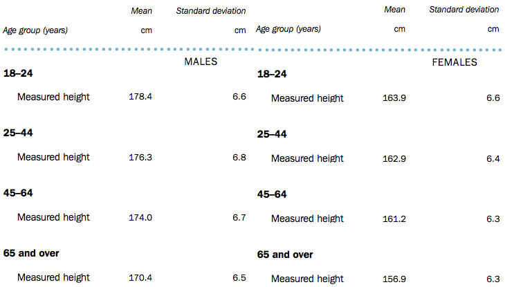
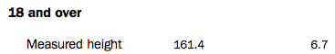
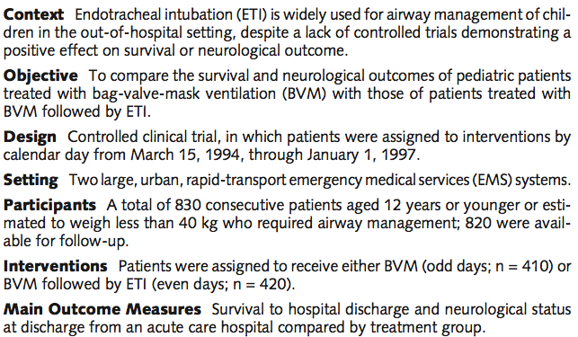

# Teaching Week 6: tutorial {#Lecture6}

```{block2, type="rmdobjectives"}
**Topics** covered in this tutorial:

* Models.
* Sampling variation.
* The normal distribution.
* CIs for one proportion.

```

In this chapter, you will learn and practice the content associated with these chapters of the [textbook](https://bookdown.org/pkaldunn/Book/):

* [Chapter 17 (Distributions and models)](https://bookdown.org/pkaldunn/Book/SamplingDistributions.html).
* [Chapter 18 (Sampling variation)](https://bookdown.org/pkaldunn/Book/SamplingVariation.html).
* [Chapter 19 (Introducing confidence intervals)](https://bookdown.org/pkaldunn/Book/CIIntro.html).
* [Chapter 20 (Confidence intervals for one proportions)](https://bookdown.org/pkaldunn/Book/CIOneProportion.html).
* [Chapter 21 (More about forming CIs)](https://bookdown.org/pkaldunn/Book/AboutCIs.html).


## Quick revision {#QuickRevision-Tutorial6}

A new method for evaluating bridges load [@obrien2018probabilistic] used a simulation to compare the new method to an existing method.
For the simulation, 
they modelled the gross vehicle mass (GVM) of trucks as having a normal distribution,
with a mean of 13&nsp;tonnes and a standard deviation of 1.3&nbsp;tonnes.

The Isuzu F-Series trucks are rated as having a GVM between 10.7 and 26.0 tonnes (depending on the configuration). 

1. What is the $z$-score for the lower limit of 10.7&nbsp;tonnes?  
`r if( knitr::is_html_output() ) {
   mcq( c("1.77",
          answer = "-1.77", 
          "-0.7",
          "0.7") )}`
1. What is the $z$-score for the upper limit of 26.0&nbsp;tonnes?  
`r if( knitr::is_html_output() ) {
   mcq( c(answer ="10",
          "-10", 
	  "-16"
	  "16") )}`
1. A negative $z$-score means that the mean has a *smaller* value than the standard deviation. True of false?  
`r if( knitr::is_html_output() ) {torf(FALSE) }`
1. A *standard error* is measures the size of the difference between the sample proportion and the population proportion. True of false?  
`r if( knitr::is_html_output() ) {torf(FALSE) }`


## Normal distributions and IQs {#NormalIQs}

Standard IQs in current use are designed
so that the IQ scores of the *population* 
have a normal distribution with a mean of 100,
and a standard deviation of 15.


```{r, child = if (knitr::is_latex_output()) './children/TutorialQns/Lect6-Q1.Rmd'}
```


`r if (knitr::is_html_output()) {"Use this information to answer the following questions."}`

`r if (knitr::is_html_output()) {"Would you call someone with an IQ of 110 an absolute genius? Explain."}`

<iframe src="https://usc.h5p.com/content/1290968343185265779/embed" width="1088" height="637" frameborder="0" allowfullscreen="allowfullscreen" allow="geolocation *; microphone *; camera *; midi *; encrypted-media *"></iframe><script src="https://usc.h5p.com/js/h5p-resizer.js" charset="UTF-8"></script>


## Normal distributions and heights {#NormalHeights}

In the \textit{National Nutrition Survey} (NNS) 
(conducted with the 1995 *National Health Survey* (NHS)),
trained nutritionists measured the heights of the respondents [@data:ABS1995:MeasureUp].

The values quoted are used for modelling purposes,
and are essentially the population means $\mu$ and standard deviations $\sigma$. 

1. Take a wild guess: What percentage of your peers (people your age and gender) do you think would be *shorter* than you? _______
2. Write down your own height: ________
3. From Fig. \@ref(fig:Ht), write down the mean and standard deviation for people in your *age group* and *gender*.  
   Using this information, compute the $z$-score for your height, relative to people in your age group and gender.
   Explain what this means.

```{r Ht, echo=FALSE, fig.cap="Part of the ABS report on heights of Australians", fig.align="center", out.width='85%'}

```
   
4. Heights have an approximate normal (bell-shape) distribution, so the 68--95--99.7 rule applies.  
   &nbsp;  
   **Using the 68--95--99.7 rule**,
   *roughly* estimate the percentage of people of your age and gender that are *shorter* than you.
   (Hint: Draw a picture!)
5. Using [**the normal distribution tables**](#ZTablesOnline),
   together with the information from **Fig. \@ref(fig:Ht)**,
   compute the percentage of people of your age and gender that are *shorter* than you.
6. Using the 68--95--99.7 rule,
   the middle 95\% of females 18 and over (using the **Fig. \@ref(fig:Ht2)**) 
   are within what height range?
	
```{r Ht2, echo=FALSE, fig.cap="Part of the ABS report on heights of females Australians", fig.align="center", out.width='55%'}

```


7. For this part,
   we want to just look at **females over 18**;
   from **Fig. \@ref(fig:Ht2)**,
   for this group, the mean is $\mu=161.4$&nbsp;cm, and 
   the standard deviation is $\sigma=6.7$&nbsp;cm.
   Use this information to answer the following questions.

    - Compute the *percentage* of females 18 and over that are *shorter* than 171&nbsp;cm.
    - What are the *odds* that a female 18 and over is *shorter* than 171&nbsp;cm?
    - Compute the *percentage* of females 18 and over that are *taller* than 171&nbsp;cm?
    - What are the *odds* that a female 18 and over is *taller* than 171&nbsp;cm?
    - Compute the *percentage* of females  18  and over that are *between* 170 and 180&nbsp;cm?
    - What are the *odds* that a female  18 and over is *between* than 170 and 180&nbsp;cm?
	  
8. For this part,
   use the data in **Fig. \@ref(fig:Ht2)**.
   Approximately 20\% of females 18 and over are shorter than what height?
     
     

## Standard error for proportions {#SEproportions}


```{r, child = if (knitr::is_latex_output()) './children/TutorialQns/Lect6-Q3.Rmd'}
```


<iframe src="https://usc.h5p.com/content/1291039013241820579/embed" width="1088" height="637" frameborder="0" allowfullscreen="allowfullscreen" allow="geolocation *; microphone *; camera *; midi *; encrypted-media *"></iframe><script src="https://usc.h5p.com/js/h5p-resizer.js" charset="UTF-8"></script>


## Confidence intervals for one proportion {#CIPropBVM}

Endotracheal intubation (ETI)
is a method for maintaining an open airway or as a method for administering certain drugs for ill patients.

ETI is widely used for airway management of children in the out-of-hospital setting, 
but for many years little evidence was available on the effect of using ETI.

A study
examined the use of ETI
for airway management of children in the out-of-hospital 
setting [@data:Gausche200:Endotracheal].

```{r Gausche2000Abstract, echo=FALSE, fig.cap="Part of the Abstract from Gausche et al. (2000)", fig.align="center", out.width='70%'}

```


1. For the **BVM sample**,
   123 out of the 404 patients survived.
   For those receiving BVM,
   compute the sample *odds* of a patient who survived.
2. For the **BVM sample**,
   123 out of the 404 patients survived.
   For those receiving BVM,
   compute an estimate of the population *proportion* of patients who survive.
3. Explain the difference between the meaning of the two above calculations.
4. In another sample of 404 patients who received the BVM treatment,
   would we expect to find *exactly* 123 surviving?
   Why or why not?
5. Compute the *standard error*,
   which indicates the sampling variability in the estimate of $p$.
   Explain what is meant by the term 'sampling variation' in this context.
6. Every time a new sample is chosen,
   the sample will likely yield a different value for $\hat{p}$.
   Sketch the distribution that shows how much the value of $\hat{p}$ is likely to change
   from one sample to the next.
7. Compute an approximate 95% confidence interval for the population proportion based on the sample proportion.
8. Write a sentence communicating this confidence interval.
9. Confirm that the conditions necessary for this calculation to be statistically valid are met.
10. If the researchers wished to estimate the true survival proportion
    to within give-or-take 0.01 with 95% confidence,
    would a larger or smaller sample be needed?
    Explain.
11. If the researchers wished to estimate the true survival proportion
    to within give-or-take 0.01 with 95% confidence,
    estimate the size sample that would be needed.
12. For the ETI sample,
    110 out of 416 patients survived.
    Use this information to construct a two-way table of treatment against survival.
13. Select a graphical summary that could be used to display the information.
    Sketch this display.
14. From this table,
    compute the odds ratio of a BVM patient *not* surviving compared to an ETI patient *not* surviving.
    Interpret this value.
15. What did you learn about using ETI on children?
    Would you prefer to recommend ETI or BVM on children?
    What other information would you need to help make your decision?
   
   
   
## **Optional**: Working with normal distributions {#NormalSOI}

*(Answers are available in Sect. \@ref(Lecture6Answers))*

```{block2, type = "rmdVideoSolution"}
This question has a video solution in the online book, so you can hear and see the solution.
```


The Southern Oscillation Index (SOI) is a 
unitless^[That is, it is not measured in kilograms or seconds etc.  It is just a number; in fact, it is a bit like a $z$-score.]
climatological measure that is easily computed,
and has been shown to be related to the weather conditions in eastern Australia 
[@climate:stone:1992; @mypapers:Dunn:bootstrap:2001].

The daily SOI has an approximate normal distribution,
and is designed to have a mean of 0 and a standard deviation of 10.

1. Draw a rough, labelled sketch of the theoretical distribution of the SOI values.
2. What is the probability that the daily SOI exceeds $20$?
3. What are the *odds* that the daily SOI exceeds 20?
4. What is the probability that the daily SOI is less than $-25$?
5. What is the probability that the daily SOI is greater than $-12$?
6. What is the probability that the daily SOI is between $-10$ and $20$?
7. The SOI is *less than* what value about 80% of the time?
8. The SOI is *greater* than what value about 35% of the time?


## **Optional**: Confidence intervals for one proportion {#HM:Maturing}

*(Answers are available in Sect. \@ref(Lecture6Answers))*

```{block2, type = "rmdVideoSolution"}
This question has a video solution in the online book, so you can hear and see the solution.
```


The timing of pubertal maturation can vary, which can have impacts upon behaviour.
One research project studied 

> ...the relationships between maturational timing and body image, school behavior, and deviance
>
> --- @data:duncan:maturity, (p. 231)

Sample data were collected from 

> ...children and youth of the entire United States drawn by the National Center for Health Statistics...
> known as the National Health Examination Survey (1966--1970). 
> Data were collected on 5,735 adolescents' physical and psychological status...


1. What type of research question is being answered: Descriptive, relational or interventional? Explain.
2. For the 2864 males in the sample, 352 were classified as maturing late.
   Compute the sample estimate of the *population* proportion of males who mature late.
3. Compute the precision of this estimate (that is, the *standard error*).
4. Compute an approximate 95% confidence interval for the population proportion 
   of boys that mature late based on the sample proportion.
5. Confirm that the conditions necessary for this calculation to be statistically valid are met.
6. If the researchers wished to estimate the true proportion of boys that mature late
   to within give-or-take 0.02 with 95% confidence, would a larger or smaller sample be needed?
   Explain.
7. If the researchers wished to estimate the proportion of boys maturing late
   within give-or-take 0.02 with 95% confidence, what size sample would be needed?
   


## **Drills**: Computational exercises {#Chapter6Drills}

*(Answers are available in Sect. \@ref(Lecture6Answers))*

```{block2, type="rmdDrills"}
These **Drill** exercises (repeated practice) give you practice at getting computations correct,
and using your calculator.
These drill questions are more about practising the underlying *mathematics* rather than the *statistics*.

If you need help, please **ask**.
```

The *standard error* for a sample proportion is calculated as 

\[
   \text{s.e.}(\hat{p}) = \sqrt{\frac{\hat{p} \times (1 - \hat{p})}{n}}.
\]
The standard error quantifies how much the sample proportion is likely to vary from sample to sample.

Compute the standard error in these situations:

1. When $n = 25$ and $\hat{p} = 0.70$.
1. When $n = 100$ and $\hat{p} = 0.25$.
1. When $n = 32$ and $\hat{p} = 0.42$.
1. When $n = 53$ and $\hat{p} = 0.814$.


