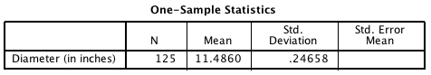
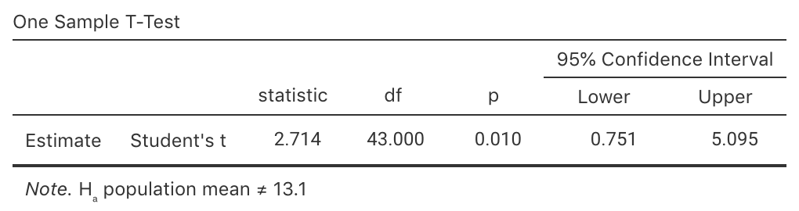
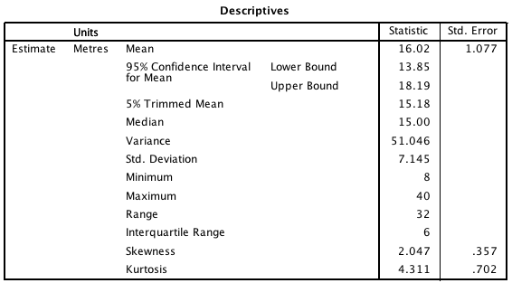

# Teaching Week 6: tutorial {#Lecture6}

::: {.objectivesBox .objectives data-latex="{iconmonstr-target-4-240.png}"}
**Topics** covered in this tutorial:

* CIs for one proportion.
* Confidence intervals for one mean.
* Confidence intervals for mean differences (paired means).
:::

In this chapter, you will learn and practice the content associated with these chapters of the [textbook](https://bookdown.org/pkaldunn/Book/):

* [Chapter 19 (Introducing confidence intervals)](https://bookdown.org/pkaldunn/Book/CIIntro.html).
* [Chapter 20 (Confidence intervals for one proportions)](https://bookdown.org/pkaldunn/Book/CIOneProportion.html).
* [Chapter 21 (More about forming CIs)](https://bookdown.org/pkaldunn/Book/AboutCIs.html).
* [Chapter 22 (Confidence intervals for one mean)](https://bookdown.org/pkaldunn/Book/OneMeanConfInterval.html).
* [Chapter 23 (Confidence intervals for mean differences (paired data))](https://bookdown.org/pkaldunn/Book/PairedCI.html).


## Quick revision {#QuickRevision-Tutorial7}


::: {.preClassBox .preClass data-latex="{iconmonstr-home-7-240.png}"}
We recommend trying these *Quick revision* questions **before** your tutorial.
:::

1. A *confidence interval* is used to find an interval that probably (but not certainly) contains the *sample* value. True or false?  
`r if( knitr::is_html_output() ) {
   webexercises::torf( FALSE)}`
1. All *confidence interval* are 95% confidence intervals. True or false?  
`r if( knitr::is_html_output() ) {
   webexercises::torf( FALSE)}`
1. A *standard error* is calculated from population data, but a *standard deviation* is calculated from sample data. True or false?  
`r if( knitr::is_html_output() ) {
   webexercises::torf( FALSE)}`
   
   

`r webexercises::hide()`
1. **FALSE**. A CI is an interval which probably contains the **population** value. We already know the **sample** value... we don't need an interval for it.
1. **FALSE**. Confidence intervals can be any percentage (though 90%, 95% and 99% CIs are the most common, and 95% easily the most common of all).
1. **FALSE**. A *standard deviation* is a measure of variation in the *individuals*; a *standard error* is a measure of how much a sample summary value (such as the sample mean, or sample proportion) varies between samples.
`r webexercises::unhide()`

**Progress:** `r webexercises::total_correct()`

   
   
   


## Standard error for proportions {#SEproportions}


```{r, child = if (knitr::is_latex_output()) './children/TutorialQns/Lect6-Q3.Rmd'}
```


<iframe src="https://usc.h5p.com/content/1291039013241820579/embed" width="1088" height="637" frameborder="0" allowfullscreen="allowfullscreen" allow="geolocation *; microphone *; camera *; midi *; encrypted-media *"></iframe><script src="https://usc.h5p.com/js/h5p-resizer.js" charset="UTF-8"></script>


## CIs for one proportion {#CIPropBVM}

Endotracheal intubation (ETI)
is a method for maintaining an open airway or as a method for administering certain drugs for ill patients.

ETI is widely used for airway management of children in the out-of-hospital setting, 
but for many years little evidence was available on the effect of using ETI.

A study
examined the use of ETI
for airway management of children in the out-of-hospital 
setting [@data:Gausche200:Endotracheal].

```{r Gausche2000Abstract, echo=FALSE, fig.cap="Part of the Abstract from Gausche et al. (2000)", fig.align="center", out.width='70%'}
knitr::include_graphics("ArticleImages/Gausche2000-PartialAbstract.png")
```


1. For the **BVM sample**,
   123 out of the 404 patients survived.
   For those receiving BVM,
   compute the sample *odds* of a patient who survived.
2. For the **BVM sample**,
   123 out of the 404 patients survived.
   For those receiving BVM,
   compute an estimate of the population *proportion* of patients who survive.
3. Explain the difference between the meaning of the two above calculations.
4. In another sample of 404 patients who received the BVM treatment,
   would we expect to find *exactly* 123 surviving?
   Why or why not?
5. Compute the *standard error*,
   which indicates the sampling variability in the estimate of $p$.
   Explain what is meant by the term 'sampling variation' in this context.
6. Every time a new sample is chosen,
   the sample will likely yield a different value for $\hat{p}$.
   Sketch the distribution that shows how much the value of $\hat{p}$ is likely to change
   from one sample to the next.
7. Compute an approximate 95% confidence interval for the population proportion based on the sample proportion.
8. Write a sentence communicating this confidence interval.
9. Confirm that the conditions necessary for this calculation to be statistically valid are met.
10. If the researchers wished to estimate the true survival proportion
    to within give-or-take 0.01 with 95% confidence,
    would a larger or smaller sample be needed?
    Explain.
11. If the researchers wished to estimate the true survival proportion
    to within give-or-take 0.01 with 95% confidence,
    estimate the size sample that would be needed.
12. For the ETI sample,
    110 out of 416 patients survived.
    Use this information to construct a two-way table of treatment against survival.
13. Select a graphical summary that could be used to display the information.
    Sketch this display.
14. From this table,
    compute the odds ratio of a BVM patient *not* surviving compared to an ETI patient *not* surviving.
    Interpret this value.
15. What did you learn about using ETI on children?
    Would you prefer to recommend ETI or BVM on children?
    What other information would you need to help make your decision?
   
   
   
## CIs for one mean {#CIPizzas}


<!-- Text wrap from: https://stackoverflow.com/questions/43551312/wrap-text-around-plots-in-markdown -->
<!-- Trick from: https://blog.earo.me/2019/10/26/reduce-frictions-rmd/ -->
`r if (knitr::is_latex_output()) '<!--'`
```{r, echo=FALSE, out.width= "50%", out.extra='style="float:right; padding:10px"'}
include_graphics("Illustrations/aurelien-lemasson-theobald-x00CzBt4Dfk-unsplash.jpg")
```
`r if (knitr::is_latex_output()) '-->'`


In 2011,
*Eagle Boy's Pizza*
ran a campaign
that claimed
(among many other claims) 
that Eagle Boy's pizzas were 
'Real size 12-inch large pizzas'
in an effort to out-market *Domino's Pizza*.

Eagle Boy's made the data behind the campaign publicly available [@mypapers:Dunn:PizzaSize].
A summary of the diameters of a sample of 125 of Eagle Boys' large pizzas is shown in
Fig. \@ref(fig:PizzaCIjamovi) (jamovi)
and
Fig. \@ref(fig:PizzaCISPSS) (SPSS).

```{r PizzaCIjamovi, echo=FALSE, fig.cap="Summary statistics for the diameter of Eagle Boys' large pizzas; jamovi", fig.align="center", fig.align="center", out.width='45%'}
knitr::include_graphics( "SoftwareImages/PizzaDiameters-jamovi.png" )
```


```{r PizzaCISPSS, echo=FALSE, fig.cap="Summary statistics for the diameter of Eagle Boys' large pizzas; SPSS, slightly edited", fig.align="center", out.width='65%'}

```


1. What do $\mu$ and $\bar{x}$ represent in this context?
2. Write down the *values* of $\mu$ and $\bar{x}$.
3. Write down the *values* of $\sigma$ and $s$.
4. Compute the value of the standard error of the mean.
5. Explain the difference in *meaning* between $s$ and $\text{s.e.}(\bar{x})$ here.
6. If someone else takes a sample of $125$ Eagle Boy's pizzas,
   will the sample mean be $11.486$ inches again (as it is in this sample)?
   Why or why not?
7. Draw a picture of the approximate sampling distribution for $\bar{x}$.
8. Compute an approximate 95% confidence interval 
   for the mean pizza diameter.
9. Write a statement that communicates your 95% CI for the mean pizza diameter.
10. What are the **statistical** validity conditions?
11. Which of these conditions must we **assume** are met for this CI to be **statistically** valid?
    Is it necessary to use Fig. \@ref(fig:PizzaHistoCI)? Explain.
    
    - The sample size is greater than about 25.
    - The population has a normal distribution.
    - The population standard deviation is known.
    - The sample has a normal distribution.

   
```{r PizzaHistoCI, echo=FALSE, fig.cap="Histogram for the diameter of Eagle Boys' large pizzas", fig.width=6}
PS <- structure(list(ID = c(1, 2, 3, 4, 5, 6, 7, 8, 9, 10, 11, 12, 
13, 14, 15, 16, 17, 18, 19, 20, 21, 22, 23, 24, 25, 26, 27, 28, 
29, 30, 31, 32, 33, 34, 35, 36, 37, 38, 39, 40, 41, 42, 43, 44, 
45, 46, 47, 48, 49, 50, 51, 52, 53, 54, 55, 56, 57, 58, 59, 60, 
61, 62, 63, 64, 65, 66, 67, 68, 69, 70, 71, 72, 73, 74, 75, 76, 
77, 78, 79, 80, 81, 82, 83, 84, 85, 86, 87, 88, 89, 90, 91, 92, 
93, 94, 95, 96, 97, 98, 99, 100, 101, 102, 103, 104, 105, 106, 
107, 108, 109, 110, 111, 112, 113, 114, 115, 116, 117, 118, 119, 
120, 121, 122, 123, 124, 125, 126, 127, 128, 129, 130, 131, 132, 
133, 134, 135, 136, 137, 138, 139, 140, 141, 142, 143, 144, 145, 
146, 147, 148, 149, 150, 151, 152, 153, 154, 155, 156, 157, 158, 
159, 160, 161, 162, 163, 164, 165, 166, 167, 168, 169, 170, 171, 
172, 173, 174, 175, 176, 177, 178, 179, 180, 181, 182, 183, 184, 
185, 186, 187, 188, 189, 190, 191, 194, 195, 196, 197, 198, 199, 
200, 201, 202, 203, 204, 205, 206, 207, 208, 209, 210, 211, 212, 
213, 214, 215, 216, 217, 218, 219, 220, 221, 222, 223, 224, 225, 
226, 227, 228, 229, 230, 231, 232, 233, 234, 235, 236, 237, 238, 
239, 240, 241, 242, 243, 244, 245, 246, 247, 248, 249, 250, 251, 
252), Store = structure(c(1L, 1L, 1L, 1L, 1L, 1L, 2L, 2L, 2L, 
2L, 2L, 2L, 2L, 2L, 2L, 2L, 2L, 2L, 2L, 2L, 1L, 1L, 1L, 1L, 1L, 
1L, 1L, 1L, 1L, 1L, 1L, 1L, 1L, 1L, 1L, 1L, 1L, 1L, 1L, 2L, 2L, 
2L, 2L, 2L, 2L, 2L, 2L, 2L, 2L, 2L, 2L, 2L, 2L, 2L, 2L, 1L, 1L, 
1L, 1L, 1L, 1L, 1L, 1L, 1L, 1L, 2L, 2L, 2L, 2L, 1L, 1L, 2L, 1L, 
1L, 1L, 1L, 1L, 1L, 1L, 2L, 2L, 2L, 2L, 2L, 1L, 1L, 1L, 1L, 1L, 
1L, 2L, 2L, 2L, 2L, 2L, 2L, 2L, 2L, 2L, 2L, 2L, 2L, 2L, 2L, 2L, 
2L, 2L, 1L, 1L, 1L, 1L, 1L, 1L, 2L, 2L, 2L, 2L, 2L, 2L, 2L, 2L, 
2L, 2L, 2L, 2L, 2L, 1L, 2L, 1L, 1L, 1L, 2L, 2L, 2L, 2L, 2L, 1L, 
1L, 1L, 1L, 1L, 1L, 1L, 1L, 1L, 1L, 1L, 1L, 1L, 1L, 2L, 2L, 2L, 
2L, 2L, 2L, 2L, 2L, 2L, 2L, 2L, 2L, 2L, 2L, 2L, 2L, 2L, 2L, 2L, 
2L, 2L, 2L, 2L, 2L, 1L, 1L, 1L, 1L, 1L, 1L, 1L, 1L, 1L, 1L, 1L, 
1L, 1L, 1L, 1L, 1L, 2L, 2L, 2L, 2L, 1L, 1L, 1L, 1L, 1L, 1L, 1L, 
1L, 1L, 1L, 1L, 1L, 1L, 1L, 2L, 2L, 2L, 2L, 2L, 2L, 1L, 1L, 1L, 
2L, 2L, 2L, 1L, 1L, 1L, 1L, 1L, 1L, 1L, 1L, 1L, 2L, 2L, 2L, 2L, 
2L, 2L, 2L, 2L, 2L, 1L, 1L, 1L, 2L, 2L, 2L, 1L, 1L, 1L, 1L, 1L, 
1L), .Label = c("Dominos", "EagleBoys"), class = "factor"), StoreNum = c(1L, 
1L, 1L, 1L, 1L, 1L, 2L, 2L, 2L, 2L, 2L, 2L, 2L, 2L, 2L, 2L, 2L, 
2L, 2L, 2L, 1L, 1L, 1L, 1L, 1L, 1L, 1L, 1L, 1L, 1L, 1L, 1L, 1L, 
1L, 1L, 1L, 1L, 1L, 1L, 2L, 2L, 2L, 2L, 2L, 2L, 2L, 2L, 2L, 2L, 
2L, 2L, 2L, 2L, 2L, 2L, 1L, 1L, 1L, 1L, 1L, 1L, 1L, 1L, 1L, 1L, 
2L, 2L, 2L, 2L, 1L, 1L, 2L, 1L, 1L, 1L, 1L, 1L, 1L, 1L, 2L, 2L, 
2L, 2L, 2L, 1L, 1L, 1L, 1L, 1L, 1L, 2L, 2L, 2L, 2L, 2L, 2L, 2L, 
2L, 2L, 2L, 2L, 2L, 2L, 2L, 2L, 2L, 2L, 1L, 1L, 1L, 1L, 1L, 1L, 
2L, 2L, 2L, 2L, 2L, 2L, 2L, 2L, 2L, 2L, 2L, 2L, 2L, 1L, 2L, 1L, 
1L, 1L, 2L, 2L, 2L, 2L, 2L, 1L, 1L, 1L, 1L, 1L, 1L, 1L, 1L, 1L, 
1L, 1L, 1L, 1L, 1L, 2L, 2L, 2L, 2L, 2L, 2L, 2L, 2L, 2L, 2L, 2L, 
2L, 2L, 2L, 2L, 2L, 2L, 2L, 2L, 2L, 2L, 2L, 2L, 2L, 1L, 1L, 1L, 
1L, 1L, 1L, 1L, 1L, 1L, 1L, 1L, 1L, 1L, 1L, 1L, 1L, 2L, 2L, 2L, 
2L, 1L, 1L, 1L, 1L, 1L, 1L, 1L, 1L, 1L, 1L, 1L, 1L, 1L, 1L, 2L, 
2L, 2L, 2L, 2L, 2L, 1L, 1L, 1L, 2L, 2L, 2L, 1L, 1L, 1L, 1L, 1L, 
1L, 1L, 1L, 1L, 2L, 2L, 2L, 2L, 2L, 2L, 2L, 2L, 2L, 1L, 1L, 1L, 
2L, 2L, 2L, 1L, 1L, 1L, 1L, 1L, 1L), CrustDescription = structure(c(5L, 
5L, 2L, 5L, 1L, 2L, 3L, 2L, 4L, 2L, 4L, 3L, 3L, 4L, 3L, 4L, 4L, 
4L, 3L, 4L, 5L, 5L, 2L, 1L, 2L, 1L, 2L, 1L, 5L, 2L, 1L, 1L, 2L, 
5L, 5L, 5L, 2L, 1L, 1L, 2L, 2L, 2L, 3L, 3L, 2L, 2L, 3L, 4L, 2L, 
2L, 3L, 2L, 4L, 4L, 3L, 2L, 5L, 5L, 2L, 1L, 5L, 2L, 5L, 2L, 2L, 
4L, 3L, 2L, 2L, 1L, 2L, 2L, 5L, 5L, 2L, 1L, 1L, 1L, 5L, 4L, 3L, 
4L, 3L, 2L, 5L, 5L, 1L, 2L, 1L, 2L, 2L, 4L, 3L, 3L, 3L, 3L, 4L, 
2L, 3L, 3L, 4L, 4L, 2L, 3L, 2L, 4L, 3L, 1L, 5L, 2L, 1L, 5L, 2L, 
4L, 3L, 2L, 4L, 2L, 2L, 2L, 3L, 4L, 3L, 2L, 4L, 2L, 5L, 3L, 1L, 
1L, 5L, 2L, 3L, 4L, 2L, 3L, 2L, 5L, 1L, 1L, 5L, 2L, 1L, 1L, 2L, 
5L, 5L, 2L, 1L, 2L, 3L, 4L, 2L, 4L, 3L, 2L, 2L, 4L, 4L, 2L, 3L, 
4L, 4L, 3L, 2L, 3L, 2L, 3L, 4L, 4L, 3L, 2L, 2L, 3L, 2L, 5L, 1L, 
2L, 1L, 1L, 2L, 1L, 1L, 2L, 5L, 5L, 1L, 5L, 2L, 5L, 2L, 2L, 3L, 
4L, 1L, 2L, 1L, 2L, 5L, 1L, 2L, 5L, 5L, 5L, 1L, 2L, 1L, 5L, 2L, 
4L, 3L, 4L, 2L, 3L, 5L, 2L, 1L, 2L, 3L, 4L, 1L, 2L, 1L, 5L, 5L, 
2L, 5L, 2L, 1L, 4L, 2L, 3L, 2L, 3L, 2L, 3L, 4L, 4L, 5L, 1L, 2L, 
2L, 4L, 3L, 1L, 5L, 2L, 2L, 5L, 1L), .Label = c("ClassicCrust", 
"DeepPan", "MidCrust", "ThinCrust", "ThinNCrispy"), class = "factor"), 
    Topping = structure(c(4L, 1L, 2L, 4L, 2L, 1L, 3L, 2L, 1L, 
    1L, 3L, 2L, 1L, 2L, 2L, 3L, 3L, 2L, 1L, 2L, 4L, 2L, 1L, 2L, 
    4L, 4L, 4L, 1L, 2L, 4L, 1L, 2L, 4L, 2L, 4L, 1L, 2L, 1L, 1L, 
    3L, 1L, 3L, 1L, 2L, 2L, 3L, 1L, 1L, 3L, 1L, 3L, 3L, 2L, 2L, 
    1L, 1L, 2L, 2L, 4L, 1L, 2L, 4L, 4L, 4L, 1L, 2L, 3L, 2L, 3L, 
    4L, 2L, 2L, 1L, 1L, 2L, 4L, 1L, 1L, 2L, 2L, 1L, 3L, 2L, 1L, 
    2L, 4L, 2L, 1L, 1L, 4L, 3L, 1L, 3L, 2L, 1L, 1L, 2L, 2L, 1L, 
    2L, 3L, 3L, 1L, 1L, 3L, 2L, 1L, 4L, 1L, 2L, 2L, 4L, 1L, 1L, 
    2L, 3L, 2L, 1L, 1L, 2L, 3L, 3L, 1L, 3L, 2L, 1L, 2L, 3L, 2L, 
    1L, 2L, 2L, 1L, 1L, 2L, 3L, 4L, 1L, 1L, 1L, 2L, 4L, 1L, 1L, 
    4L, 2L, 4L, 1L, 2L, 2L, 3L, 3L, 1L, 1L, 3L, 2L, 1L, 3L, 1L, 
    1L, 2L, 3L, 3L, 3L, 2L, 2L, 2L, 3L, 1L, 1L, 2L, 2L, 1L, 2L, 
    2L, 4L, 2L, 1L, 2L, 4L, 2L, 4L, 2L, 1L, 4L, 4L, 2L, 1L, 1L, 
    4L, 2L, 1L, 2L, 3L, 4L, 2L, 2L, 1L, 1L, 4L, 2L, 1L, 4L, 1L, 
    4L, 1L, 4L, 1L, 2L, 1L, 2L, 3L, 2L, 3L, 1L, 2L, 4L, 2L, 3L, 
    1L, 2L, 2L, 4L, 1L, 2L, 4L, 2L, 4L, 1L, 2L, 3L, 1L, 1L, 1L, 
    1L, 3L, 1L, 2L, 4L, 1L, 1L, 3L, 3L, 2L, 2L, 4L, 1L, 2L, 1L, 
    4L), .Label = c("BBQMeatlovers", "Hawaiian", "SuperSupremo", 
    "Supreme"), class = "factor"), Diameter = c(29.4, 29.63, 
    27.06, 27.45, 26.59, 27.16, 29.15, 28.78, 30.05, 29.38, 29.14, 
    29.24, 28.97, 29.98, 28.93, 29.47, 30, 30.01, 28.66, 30.44, 
    26.38, 28.86, 26.6, 26.65, 26.5, 26.55, 26.64, 26.15, 28.92, 
    26.87, 26.56, 26.65, 26.61, 28.75, 29.33, 29, 26.34, 27.2, 
    26.61, 28.73, 28.48, 29.01, 28.73, 28.6, 29.59, 29.04, 29.03, 
    29.75, 28.95, 29.38, 28.72, 28.6, 29.9, 29.4, 28.99, 25.98, 
    29.04, 29.01, 26.67, 26.97, 29.37, 26.09, 29.32, 27.12, 26.37, 
    30.35, 29.08, 28.29, 28.97, 26.83, 26.74, 29.82, 28.67, 29.11, 
    26.45, 27.04, 26.93, 26.41, 29.19, 29.42, 28.65, 30.51, 29.32, 
    28.68, 29.66, 29.17, 26.78, 26.58, 27.27, 27.14, 28.98, 29.43, 
    28.54, 28.8, 29.47, 29.38, 28.54, 29.68, 29.19, 28.79, 30.08, 
    29.4, 28.63, 28.76, 28.76, 30.31, 28.86, 27.04, 28.71, 27, 
    26.77, 29.19, 26.59, 29.48, 28.15, 28.98, 29.91, 28.94, 29.38, 
    28.86, 28.47, 29.4, 28.85, 29.35, 30.17, 28.54, 28.95, 26.58, 
    26.7, 25.51, 29.09, 29.92, 28.34, 30.67, 29.21, 29.08, 26.26, 
    29.43, 26.78, 26.28, 29.21, 26.16, 26.47, 26.71, 26.7, 29.14, 
    28.78, 26.73, 26.28, 26.42, 28.42, 31.06, 28.68, 29.34, 29.01, 
    29.16, 29.53, 29.51, 28.75, 28.19, 28.98, 29.57, 29.27, 28.8, 
    28.48, 28.2, 29.04, 28.79, 29.68, 29.51, 28.93, 29.19, 28.61, 
    28.29, 26.48, 29.33, 26.58, 26.27, 26.65, 27.27, 27.04, 28.9, 
    27.15, 27.22, 29.14, 29.23, 26.64, 28.82, 26.77, 28.32, 29, 
    29.78, 29.81, 29.86, 27.12, 26.55, 26.53, 26.77, 28.64, 27.05, 
    26.7, 28.52, 28.44, 29.41, 26.97, 26.6, 27.52, 27.04, 29.3, 
    30.16, 28.79, 29.45, 28.77, 28.36, 29.04, 26.76, 26.79, 29.34, 
    28.96, 29.71, 26.3, 26.6, 26.54, 28.94, 28.86, 26.7, 25.58, 
    28.79, 26.6, 28.71, 30.37, 28.63, 29.09, 28.67, 30.02, 28.76, 
    29.86, 28.73, 28.97, 26.81, 27.1, 29.36, 29.34, 28.9, 25.78, 
    28.84, 26.36, 26.11, 29.14, 26.71), DiameterInches = c(11.5748031496063, 
    11.6653543307087, 10.6535433070866, 10.8070866141732, 10.4685039370079, 
    10.6929133858268, 11.4763779527559, 11.3307086614173, 11.8307086614173, 
    11.5669291338583, 11.4724409448819, 11.511811023622, 11.4055118110236, 
    11.8031496062992, 11.3897637795276, 11.6023622047244, 11.8110236220472, 
    11.8149606299213, 11.2834645669291, 11.9842519685039, 10.3858267716535, 
    11.3622047244094, 10.4724409448819, 10.492125984252, 10.4330708661417, 
    10.4527559055118, 10.488188976378, 10.2952755905512, 11.3858267716535, 
    10.5787401574803, 10.4566929133858, 10.492125984252, 10.4763779527559, 
    11.3188976377953, 11.5472440944882, 11.4173228346457, 10.3700787401575, 
    10.7086614173228, 10.4763779527559, 11.3110236220472, 11.2125984251969, 
    11.4212598425197, 11.3110236220472, 11.259842519685, 11.6496062992126, 
    11.4330708661417, 11.4291338582677, 11.7125984251969, 11.3976377952756, 
    11.5669291338583, 11.3070866141732, 11.259842519685, 11.7716535433071, 
    11.5748031496063, 11.4133858267717, 10.2283464566929, 11.4330708661417, 
    11.4212598425197, 10.5, 10.6181102362205, 11.5629921259843, 
    10.2716535433071, 11.5433070866142, 10.6771653543307, 10.3818897637795, 
    11.9488188976378, 11.4488188976378, 11.1377952755906, 11.4055118110236, 
    10.5629921259843, 10.5275590551181, 11.740157480315, 11.2874015748031, 
    11.4606299212598, 10.4133858267717, 10.6456692913386, 10.6023622047244, 
    10.3976377952756, 11.492125984252, 11.5826771653543, 11.2795275590551, 
    12.011811023622, 11.5433070866142, 11.2913385826772, 11.6771653543307, 
    11.4842519685039, 10.5433070866142, 10.4645669291339, 10.7362204724409, 
    10.6850393700787, 11.4094488188976, 11.5866141732283, 11.2362204724409, 
    11.3385826771654, 11.6023622047244, 11.5669291338583, 11.2362204724409, 
    11.6850393700787, 11.492125984252, 11.3346456692913, 11.8425196850394, 
    11.5748031496063, 11.2716535433071, 11.3228346456693, 11.3228346456693, 
    11.9330708661417, 11.3622047244094, 10.6456692913386, 11.3031496062992, 
    10.6299212598425, 10.5393700787402, 11.492125984252, 10.4685039370079, 
    11.6062992125984, 11.0826771653543, 11.4094488188976, 11.7755905511811, 
    11.3937007874016, 11.5669291338583, 11.3622047244094, 11.2086614173228, 
    11.5748031496063, 11.3582677165354, 11.5551181102362, 11.8779527559055, 
    11.2362204724409, 11.3976377952756, 10.4645669291339, 10.511811023622, 
    10.0433070866142, 11.4527559055118, 11.7795275590551, 11.1574803149606, 
    12.0748031496063, 11.5, 11.4488188976378, 10.3385826771654, 
    11.5866141732283, 10.5433070866142, 10.3464566929134, 11.5, 
    10.2992125984252, 10.4212598425197, 10.5157480314961, 10.511811023622, 
    11.4724409448819, 11.3307086614173, 10.5236220472441, 10.3464566929134, 
    10.4015748031496, 11.1889763779528, 12.2283464566929, 11.2913385826772, 
    11.5511811023622, 11.4212598425197, 11.4803149606299, 11.6259842519685, 
    11.6181102362205, 11.3188976377953, 11.0984251968504, 11.4094488188976, 
    11.6417322834646, 11.5236220472441, 11.3385826771654, 11.2125984251969, 
    11.1023622047244, 11.4330708661417, 11.3346456692913, 11.6850393700787, 
    11.6181102362205, 11.3897637795276, 11.492125984252, 11.2637795275591, 
    11.1377952755906, 10.4251968503937, 11.5472440944882, 10.4645669291339, 
    10.3425196850394, 10.492125984252, 10.7362204724409, 10.6456692913386, 
    11.3779527559055, 10.6889763779528, 10.7165354330709, 11.4724409448819, 
    11.507874015748, 10.488188976378, 11.3464566929134, 10.5393700787402, 
    11.1496062992126, 11.4173228346457, 11.7244094488189, 11.7362204724409, 
    11.755905511811, 10.6771653543307, 10.4527559055118, 10.4448818897638, 
    10.5393700787402, 11.2755905511811, 10.6496062992126, 10.511811023622, 
    11.2283464566929, 11.1968503937008, 11.5787401574803, 10.6181102362205, 
    10.4724409448819, 10.8346456692913, 10.6456692913386, 11.5354330708661, 
    11.8740157480315, 11.3346456692913, 11.5944881889764, 11.3267716535433, 
    11.1653543307087, 11.4330708661417, 10.5354330708661, 10.5472440944882, 
    11.5511811023622, 11.4015748031496, 11.6968503937008, 10.3543307086614, 
    10.4724409448819, 10.4488188976378, 11.3937007874016, 11.3622047244094, 
    10.511811023622, 10.0708661417323, 11.3346456692913, 10.4724409448819, 
    11.3031496062992, 11.9566929133858, 11.2716535433071, 11.4527559055118, 
    11.2874015748031, 11.8188976377953, 11.3228346456693, 11.755905511811, 
    11.3110236220472, 11.4055118110236, 10.5551181102362, 10.6692913385827, 
    11.5590551181102, 11.5511811023622, 11.3779527559055, 10.1496062992126, 
    11.3543307086614, 10.3779527559055, 10.2795275590551, 11.4724409448819, 
    10.5157480314961), filter_. = c(0L, 0L, 0L, 0L, 0L, 0L, 1L, 
    1L, 1L, 1L, 1L, 1L, 1L, 1L, 1L, 1L, 1L, 1L, 1L, 1L, 0L, 0L, 
    0L, 0L, 0L, 0L, 0L, 0L, 0L, 0L, 0L, 0L, 0L, 0L, 0L, 0L, 0L, 
    0L, 0L, 1L, 1L, 1L, 1L, 1L, 1L, 1L, 1L, 1L, 1L, 1L, 1L, 1L, 
    1L, 1L, 1L, 0L, 0L, 0L, 0L, 0L, 0L, 0L, 0L, 0L, 0L, 1L, 1L, 
    1L, 1L, 0L, 0L, 1L, 0L, 0L, 0L, 0L, 0L, 0L, 0L, 1L, 1L, 1L, 
    1L, 1L, 0L, 0L, 0L, 0L, 0L, 0L, 1L, 1L, 1L, 1L, 1L, 1L, 1L, 
    1L, 1L, 1L, 1L, 1L, 1L, 1L, 1L, 1L, 1L, 0L, 0L, 0L, 0L, 0L, 
    0L, 1L, 1L, 1L, 1L, 1L, 1L, 1L, 1L, 1L, 1L, 1L, 1L, 1L, 0L, 
    1L, 0L, 0L, 0L, 1L, 1L, 1L, 1L, 1L, 0L, 0L, 0L, 0L, 0L, 0L, 
    0L, 0L, 0L, 0L, 0L, 0L, 0L, 0L, 1L, 1L, 1L, 1L, 1L, 1L, 1L, 
    1L, 1L, 1L, 1L, 1L, 1L, 1L, 1L, 1L, 1L, 1L, 1L, 1L, 1L, 1L, 
    1L, 1L, 0L, 0L, 0L, 0L, 0L, 0L, 0L, 0L, 0L, 0L, 0L, 0L, 0L, 
    0L, 0L, 0L, 1L, 1L, 1L, 1L, 0L, 0L, 0L, 0L, 0L, 0L, 0L, 0L, 
    0L, 0L, 0L, 0L, 0L, 0L, 1L, 1L, 1L, 1L, 1L, 1L, 0L, 0L, 0L, 
    1L, 1L, 1L, 0L, 0L, 0L, 0L, 0L, 0L, 0L, 0L, 0L, 1L, 1L, 1L, 
    1L, 1L, 1L, 1L, 1L, 1L, 0L, 0L, 0L, 1L, 1L, 1L, 0L, 0L, 0L, 
    0L, 0L, 0L)), class = "data.frame", row.names = c(NA, -250L
))


hist( PS$DiameterInches[PS$Store=="EagleBoys"],
      col=plot.colour,
      las=1,
      xlab="Pizza diameter (in inches)",
      ylab="Number of pizzas",
      main="Histogram of pizza diameters",
      xlim=c(10, 12.5))
```

12. If we wanted to estimate the population mean diameter to within 1&nbsp;mm (or $0.04$&nbsp;inches) with 95% confidence,
    what size sample would we need?  
    What is a reasonable level of accuracy with which we could measure the diameter of a pizza?
13. Do you think that,
    on average,
    the pizzas do have a mean diameter of 12&nbsp;inches in the population,
    as Eagle Boy's claim?
    Explain.
    
`r if (knitr::is_latex_output()) '<!--'`
<iframe src='https://www.ferendum.com/en/embeded.php?pregunta_ID=458369&sec_digit=776424948&embeded_digit=21580733' style='width:100%; height:575px; overflow: auto; background: #B3919133' frameBorder='0'></iframe><BR>
<A href='https://www.ferendum.com' target='_blank'>Free Online Poll Maker</A>
`r if (knitr::is_latex_output()) '-->'`


<!-- Admin link: -->
<!-- https://www.ferendum.com/en/admin.php?pregunta_ID=458369&sec_digit=776424948&edit_code=13483820 -->


## CIs for mean differences (paired data) {#CIImplant}


<!-- Text wrap from: https://stackoverflow.com/questions/43551312/wrap-text-around-plots-in-markdown -->
<!-- Trick from: https://blog.earo.me/2019/10/26/reduce-frictions-rmd/ -->
`r if (knitr::is_latex_output()) '<!--'`
```{r, echo=FALSE, out.width= "35%", out.extra='style="float:right; padding:10px"'}
include_graphics("Illustrations/pexels-shotpot-4046557.jpg")
```
`r if (knitr::is_latex_output()) '-->'`

A study [@data:Guirao2017:amputees]
examined the difference between 2-minute walk times (2MWT) for 10 patients
before *and* after receiving a 
prosthetic implant.
(The 2MWT measures how far participants can walk in two minutes.)

The 2MWT for ten amputees *with* and *without* an implant are shown in Fig. \@ref(fig:Guirao2MWT).
	
```{r Guirao2MWT, echo=FALSE, fig.cap="Two-minute Walk Times (2MWT) for 10 patients with implants (With Imp) and without implants (Without Imp), in metres", fig.align="center", out.width="70%"}
knitr::include_graphics("ArticleImages/Guirao2017-Table2.png")
```

1. What type of RQ is implied: Descriptive, relational, or interventional?
2. What do $\mu_d$ and $\bar{d}$ represent in this context?
3. Explain why these data should be analysed as *paired* data.
4. Compute the *changes* in 2MWT for each patient.
5. Although it doesn't really matter,
   *why* does it probably makes more sense to compute the **With Imp** values minus the **Without Imp** values?
6. Using the statistics mode on your calculator,
   compute the sample mean difference $\bar{d}$ and the sample standard deviation of the differences $s_d$.
7. Compute the standard error of the mean difference $\text{s.e.}(\bar{d})$. 
   Explain what this tells us in this context.
8. If another sample of ten subjects were studied,
   would the same sample mean difference $\bar{d}$ be computed?
   How much variation would be expected in the sample mean differences
   found from different samples?
9. Draw the approximate sampling distribution of $\bar{d}$.
10. Compute an approximate 95% confidence interval for the population mean difference in 2MWT.
11. Construct a one-sentence statement that communicates a 95% CI for the population change in 2MWT.
12. What conditions must be met for this CI to be statistically valid?
13. Is it reasonable to assume the CI is statistically valid? 
    Construct a stem-and-leaf plot to help.
14. Suppose the researchers wished to estimate the change in 2MWT to within $5$m, with 95% confidence.
    What size sample would be necessary?
15. Do you think the population 2MWT changes because of the prosthetic, on average?
    Explain and discuss.
    
`r if (knitr::is_latex_output()) '<!--'`
<iframe src='https://www.ferendum.com/en/embeded.php?pregunta_ID=458370&sec_digit=963714428&embeded_digit=2120791150' style='width:100%; height:575px; overflow: auto; background: #B3919133;' frameBorder='0'></iframe><BR>
<A href='https://www.ferendum.com' target='_blank'>Free Online Poll Maker</A>
`r if (knitr::is_latex_output()) '-->'`
    
<!-- Admin link: -->
<!-- https://www.ferendum.com/en/admin.php?pregunta_ID=458370&sec_digit=963714428&edit_code=725207259 -->


	
	
	
## CI for the ruler-drop {#PlanStudy7}

Your tutor *may* decide to do this activity.


## **Optional**: CI for one mean {#RoomWidthCI}

*(Answers are available in Sect. \@ref(Lecture7Answers))*
	
::: {.videoSolutionBox .videoSolution data-latex="{iconmonstr-youtube-10-240.png}"}
This question has a video solution in the online book, so you can hear and see the solution.
:::


Shortly after metric units were introduced to Australia in 1977,
a lecturer wondered how accurately students could estimate lengths using the 
metric measurements [@data:hand:handbook].

The aim of the study was to determine if, 
on average,
students could correctly guess the width of the hall (which was 13.1&nbsp;m).


To answer the RQ,
a group of $n=44$ students were asked to estimate the width of the lecture hall
to the nearest metre
(data provided by Prof. Lewis).
The data are given in Table \@ref(tab:Guesses).  
   
The data were entered into software,
producing the output in
Fig. \@ref(fig:LengthsHallOutputjamovi1) (jamovi)
and
Fig. \@ref(fig:LengthsHallOutput) (SPSS).


```{r Guesses, echo=FALSE}
GuessTab <- array( dim=c(3, 15) )

GuessTab[1, ] <- c(8,  9, 10, 10, 10, 10, 10, 10, 11, 11, 11, 11, 12, 12, 13)
GuessTab[2, ] <- c(13, 13, 14, 14, 14, 15, 15, 15, 15, 15, 15, 15, 15, 16, 16)
GuessTab[3, ] <- c(16, 17, 17, 17, 17, 18, 18, 20, 22, 25, 27, 35, 38, 40, "")

if( knitr::is_latex_output() ) {
  kable(GuessTab,
      format = "latex",
      booktabs = TRUE,
      caption = "Guess of the width of a room 13.1 metres wide",
      align = "r")
}
if( knitr::is_html_output() ) {
  kable(GuessTab,
      format = "html",
      booktabs = TRUE,
      caption = "Guess of the width of a room 13.1 metres wide",
      align = "r")
}
```

1. What is the value of $\bar{x}$?
2. What are the values of $s$ and $\text{s.e.}(\bar{x})$? Explain the difference in the meaning of the two terms.
3. Write down the 95% CI for the population estimate
   (see Fig. \@ref(fig:LengthsHallOutputjamovi1) (jamovi) or Fig. \@ref(fig:LengthsHallOutput) (SPSS)).
4. What conditions must be met for this test to be statistically valid?
5. Is it reasonable to assume the statistical validity conditions are satisfied? 
   The histogram in  Fig. \@ref(fig:LengthsHallHisto1) may help.
6. Do you think students were very good at estimating the width of the hall using metric units? Explain.
   
   
```{r echo=FALSE}
GuessM <- c(8, 9, 10, 10, 10, 10, 10, 10, 11, 11, 11, 11, 12, 12, 13, 13, 
13, 14, 14, 14, 15, 15, 15, 15, 15, 15, 15, 15, 16, 16, 16, 17, 
17, 17, 17, 18, 18, 20, 22, 25, 27, 35, 38, 40)
```

```{r LengthsHallHisto1, echo=FALSE, fig.cap="Histogram for the estimates of the width of a hall", fig.align="center", fig.width=6}
hist( GuessM, 
      las = 1,
      main = "Histogram of guesses",
      xlab = "Guess (in metres)",
      col = plot.colour)
```

```{r LengthsHallOutputjamovi1, echo=FALSE, fig.cap="jamovi output for the estimates of the width of a hall in metres", fig.align="center", out.width="80%"}

```

```{r LengthsHallOutput, echo=FALSE, fig.cap="SPSS output for the estimates of the width of a hall in metres", fig.align="center", out.width='80%'}

```


## **Optional**: CI for one proportion {#HMMaturing}

*(Answers are available in Sect. \@ref(Lecture6Answers))*

::: {.videoSolutionBox .videoSolution data-latex="{iconmonstr-youtube-10-240.png}"}
This question has a video solution in the online book, so you can hear and see the solution.
:::


The timing of pubertal maturation can vary, which can have impacts upon behaviour.
One research project studied 

> ...the relationships between maturational timing and body image, school behavior, and deviance
>
> --- @data:duncan:maturity, (p. 231)

Sample data were collected from 

> ...children and youth of the entire United States drawn by the National Center for Health Statistics...
> known as the National Health Examination Survey (1966--1970). 
> Data were collected on 5,735 adolescents' physical and psychological status...


1. What type of research question is being answered: Descriptive, relational or interventional? Explain.
2. For the 2864 males in the sample, 352 were classified as maturing late.
   Compute the sample estimate of the *population* proportion of males who mature late.
3. Compute the precision of this estimate (that is, the *standard error*).
4. Compute an approximate 95% confidence interval for the population proportion 
   of boys that mature late based on the sample proportion.
5. Confirm that the conditions necessary for this calculation to be statistically valid are met.
6. If the researchers wished to estimate the true proportion of boys that mature late
   to within give-or-take 0.02 with 95% confidence, would a larger or smaller sample be needed?
   Explain.
7. If the researchers wished to estimate the proportion of boys maturing late
   within give-or-take 0.02 with 95% confidence, what size sample would be needed?
   


## **Optional**: CI for mean differences (paired data) {#CIPairedWaves}

*(Answers are available in Sect. \@ref(Lecture7Answers))*
	
Wave power has been considered as a 
[source of energy since 1890](http://www.outsidelands.org/wave-tidal3.php),
but the engineering necessary to successfully and practically harness this energy is complex. 

To understand one method of harnessing this energy,
one study [@data:hand:handbook]
examined the bending stress (in Newton--metres)
in part of a device used to generate electricity from wave power.

Two different mooring types were compared
(Table \@ref(tab:mooringCI))
in 18 different sea states.


```{r echo=FALSE}
inTableWebex <- function(x){
  # Fixes the output of  webex  when used in a table.
  # It appear to replace the leading and trailing <  and  >
  # with the html codes:  &lt;  and  &gt;
  # This function restores them to  <  and  >
 x <- sub("&lt;", "<", x)
 x <- sub("&gt;", ">", x)
 x
}
```

```{r mooringCI, echo=FALSE}
WaveTab <- array( dim = c(18, 3) )

WaveTab[, 1] <- c(2.23,  2.55,  7.99,  4.09,  9.62,  1.59,  8.98,  0.82, 10.83,  1.54, 10.75,  5.79,  5.91,  5.79,  5.50,  9.96,  1.92,  7.38)
WaveTab[, 2] <- c(1.82,  2.42,  8.26,  3.46,  9.77,  1.40,  8.88,  0.87, 11.20,  1.33, 10.32,  5.87,  6.44,  5.87,  5.30,  9.82,  1.69,  7.41)

WaveTab[, 3] <- round(WaveTab[, 1] - WaveTab[, 2], 2)


colnames(WaveTab) <- c("Method 1",
                       "Method 2",
                       "Differences")
  
if( knitr::is_html_output() ) {
  WaveTab[15, 3] <- inTableWebex(webexercises::fitb(num = TRUE, 
                                                    tol = 0.001, 
                                                    width = 6, 
                                                    answer = WaveTab[15, 3]))
  WaveTab[16, 3] <- inTableWebex(webexercises::fitb(num = TRUE, 
                                                    tol = 0.001, 
                                                    width = 6, 
                                                    answer = WaveTab[16, 3]))
  WaveTab[17, 3] <- inTableWebex(webexercises::fitb(num = TRUE, 
                                                    tol = 0.001, 
                                                    width = 6, 
                                                    answer = WaveTab[17, 3]))
  WaveTab[18, 3] <- inTableWebex(webexercises::fitb(num = TRUE, 
                                                    tol = 0.001, 
                                                    width = 6, 
                                                    answer = WaveTab[18, 3]))
} else {
  WaveTab[c(15:18), 3 ] <- "\\_\\_\\_\\_"
}

if( knitr::is_latex_output() ) {
  kable(WaveTab,
      format = "latex",
      booktabs = TRUE,
      escape = FALSE,
      align = c("r", "r", "r"),
      caption = "The bending stress using two different mooring methods") %>%
  row_spec(0, bold = TRUE) %>%
  kable_styling(full_width = FALSE)
}
if( knitr::is_html_output() ) {
  kable(WaveTab,
      format = "html",
      booktabs = TRUE,
      escape = FALSE,
      align = c("r", "r", "r"),
      caption = "The bending stress using two different mooring methods") %>%
  row_spec(0, bold = TRUE) %>%
  kable_styling(full_width = FALSE)
}
```


	
1. Explain *why* these data should be analysed as mean differences.
2. Compute the sample differences (most have been done for you).
3. Using the statistics mode on your calculator, compute the sample mean and the sample standard deviation of these differences.
4. Compute the standard error of the mean difference. What does this value mean?
5. Compute an approximate 95% confidence interval for the population mean difference in two methods.
6. What conditions must be met for this CI to be statistically valid?
7. Is it reasonable to assume the CI is statistically valid?  Draw a stem-and-leaf plot to check.
8. Do you think the mooring types are really different? Explain.
		


## **Optional**: CI for mean differences (paired data) {#CIPairedRunners}

*(Answers are available in Sect. \@ref(Lecture7Answers))*

::: {.videoSolutionBox .videoSolution data-latex="{iconmonstr-youtube-10-240.png}"}
This question has a video solution in the online book, so you can hear and see the solution.
:::

	
After a number of runners collapsed near the finish of the Tyneside annual Great North Run,
researchers decided to study the role of $\beta$ endorphins as a factor in the collapses.
($\beta$ endorphins are a peptide which suppress pain.) 

A study [@data:Dale:FunRun]
examined what happened with plasma $\beta$ endorphins during fun runs:
how much do the concentrations change, on average?

The researchers recorded the plasma $\beta$ concentrations in fun runners
(participating in the Tyneside Great North Run).
Eleven runners (who did not collapse) had their plasma $\beta$ concentrations measured
(in pmol/litre)
before and after the race
(Table \@ref(tab:RunnerTab).)

```{r RunnerTab, echo=FALSE}
RunnerTab <- array( dim=c(11, 3))

RunnerTab[, 1] <- c( 4.3,  4.6,  5.2,  5.2,  6.6,  7.2,  8.4,  9.0, 10.4, 14.0, 17.8)
RunnerTab[, 2] <- c(29.6, 25.1, 15.5, 29.6, 24.1, 37.8, 20.1, 21.9, 14.2, 34.6, 46.2)
RunnerTab[, 3] <- RunnerTab[, 2] - RunnerTab[, 1]

colnames(RunnerTab) <- c("Before race", 
                         "After race",
                         "Difference")
if( knitr::is_latex_output() ) {
  kable(RunnerTab,
      format = "latex",
      booktabs = TRUE,
      linesep = c("", "", "", "\\addlinespace", "", "", "\\addlinespace", "", "", "", ""),
      caption = "Plasma-beta concentration for runners, before and after the race") %>%
  row_spec(0, bold = TRUE) %>%
  kable_styling(full_width = FALSE)
}
if( knitr::is_html_output() ) {
  kable(RunnerTab,
      format = "html",
      booktabs = TRUE,
      linesep = c("", "", "", "\\addlinespace", "", "", "\\addlinespace", "", "", "", ""),
      caption = "Plasma-beta concentration for runners, before and after the race") %>%
  row_spec(0, bold = TRUE) %>%
  kable_styling(full_width = FALSE)
}
```


The 'usual' value for $\beta$ endorphines is usually less than about 11&nbsp;pmol/litre. 
      
1. What do $\mu_d$ and $\bar{d}$ represent in this context?
2. Explain why these data should be analysed as mean differences.
3. Compute the changes in plasma $\beta$ endorphin concentration during the run (i.e. the 'differences').
   (Although it doesn't really matter,
   why does it probably makes more sense to compute the *after* values minus the *before* values?)
4. Using the statistics mode on your calculator,
   compute the sample mean difference $\bar{d}$ and the sample standard deviation of the differences.
5. Compute the standard error of the mean difference. 
   Explain what this means in this context.
6. If another sample of eleven runners were studied,
   would the same sample mean difference be computed?
   How much variation would be expected in the sample means
   found from different samples?
7. Compute an approximate 95% confidence interval for the population mean
   difference in plasma $\beta$ concentrations.
8. Construct a one-sentence statement that communicates a 95% CI
   for the population difference in plasma $\beta$ concentrations.
9. What conditions must be met for this CI to be statistically valid?
10. Is it reasonable to assume the CI is statistically valid? 
    Construct a stem-and-leaf plot to help.
11. Do you think the population plasma $\beta$ concentration changes 
    during the race, on average?
    Explain.
12. Suppose the researchers wished to estimate the change in plasma $\beta$ endorphin concentrations
    to within $2.5$&nbsp;pmol/litre, with 95% confidence.
    What size sample would be necessary?


## **Drills**: Computational exercises {#Chapter6Drills}

*(Answers are available in Sect. \@ref(Lecture6Answers))*

::: {.drillBox .drill data-latex="{iconmonstr-pencil-9-240.png}"}
These **Drill** exercises (repeated practice) give you practice at getting computations correct,
and using your calculator.
These drill questions are more about practising the underlying *mathematics* rather than the *statistics*.

If you need help, please **ask**.
:::

The *standard error* for a sample proportion is calculated as 

\[
   \text{s.e.}(\hat{p}) = \sqrt{\frac{\hat{p} \times (1 - \hat{p})}{n}}.
\]
The standard error quantifies how much the sample proportion is likely to vary from sample to sample.

Compute the standard error in these situations:

1. When $n = 25$ and $\hat{p} = 0.70$.
1. When $n = 100$ and $\hat{p} = 0.25$.
1. When $n = 32$ and $\hat{p} = 0.42$.
1. When $n = 53$ and $\hat{p} = 0.814$.


