# Teaching Week 7: tutorial {#Lecture7}

::: {.objectivesBox .objectives data-latex="{iconmonstr-target-4-240.png}"}
**Topics** covered in this tutorial:

* Confidence intervals for two independent means.
* Confidence intervals for an odds ratio.
* Estimating sample sizes.
:::
   
In this chapter, you will learn and practice the content associated with these chapters of the [textbook](https://bookdown.org/pkaldunn/SRM-Textbook/):

* [Chapter 24 (Confidence intervals for two independent means)](https://bookdown.org/pkaldunn/SRM-Textbook/CITwoMeans.html).
* [Chapter 25 (Confidence intervals for odds ratios)](https://bookdown.org/pkaldunn/SRM-Textbook/OddsRatiosCI.html).
* [Chapter 26 (Estimating sample sizes)](https://bookdown.org/pkaldunn/SRM-Textbook/EstimatingSampleSize.html)


## Quick revision {#QuickRevision-Tutorial7}

::: {.preClassBox .preClass data-latex="{iconmonstr-home-7-240.png}"}
We recommend trying these *Quick revision* questions **before** your tutorial.
:::

Researchers studied the impact of a gluten-free diet on dental cavities [@khalaf2020caries].

Some of the summary information regarding the number decayed, missing and filled teeth (DMFT) is shown below.
 
Diet         | Sample size | Mean | Standard deviation | Standard error
-------------:+:-----------:+:----:+:------------------:+:----------------:
Coeliac      |  23         | 8.39 | 4.4                | 0.92
Non-coeliac  |  23         | 8.17 | 4.1                | 0.86
**Difference** |           | 0.22 | &nbsp;             | 1.3

A 95% CI is given as for the difference is -2.32 to 2.76.

1. The difference is computed as the the number of DMFT for coeliacs minus non-coeliacs. True or false?  
`r if( knitr::is_html_output() ) { webexercises::torf(TRUE) }`
1. One of the values for the CI is a negative value, which must be an error, since a negative number of DMFT is impossible. True or false?  
`r if( knitr::is_html_output() ) { webexercises::torf(FALSE) }`
1. We are 95% confidence that the difference between the population means is:   
`r if( knitr::is_html_output() ) {
   webexercises::longmcq( c("Larger for coeliacs", 
          "Smaller for coeliacs",
          answer = "Between 2.32 higher for non-coeliacs to 2.76 higher for coeliacs.",
          "Between 2.76 higher for non-coeliacs to 2.32 higher for coeliacs.")
	  )
}`
1. Both samples sizes are less than 25. What does this mean for the statistical validity of the CI?  
`r if( knitr::is_html_output() ) {
   webexercises::longmcq( c("The CI is worthless", 
          answer = "The CI will probably be statistically valid, as both sample sizes are just smaller than 25.",
          "If the sample is a random sample, the CI will be statistically valid." )
          )
}`


::: {.progressBox .progress}
`r if (knitr::is_html_output()) {"**Progress:**"}`
`r webexercises::total_correct()`
:::


`r webexercises::hide()`
1. **TRUE**. If we take the *coeliac* mean minus the *non-coeliac* mean, we would have $8.39 - 8.17 = 0.22$, which is what is given in the table.
1. **FALSE**. The CI is for the *difference* in the DMFT. The value is **not** about the *number* of teeth; it is about the *difference* in the number of teeth between coeliacs and non-coeliacs. A negative value is fine if we understand what the CI is estimating.
1. The *positive* value of 2.76 means (as we saw in the first Quick Revision question) that coeliacs have a mean of 2.76 more DMFT.  
   So the *negative* value of $-2.32$ means that *non*-coeliacs have a mean of 2.32 more DMFT.
1. The sample sizes are *just* less than 25, so the CI will *probably* be statistically valid (but we'd more certain about this if the sample sizes were 25 or more).
`r webexercises::unhide()`


## Concepts {#ConceptsMatches}


<!-- Text wrap from: https://stackoverflow.com/questions/43551312/wrap-text-around-plots-in-markdown -->
<!-- Trick from: https://blog.earo.me/2019/10/26/reduce-frictions-rmd/ -->
`r if (knitr::is_latex_output()) '<!--'`
```{r, echo=FALSE, out.width= "30%", out.extra='style="float:right; padding:10px"'}

```
`r if (knitr::is_latex_output()) '-->'`


Claire and Jake were wondering about the mean number of matches in a box.
The boxes contain this statement:

> An average of 45 matches per box.

They purchased a carton containing 25 boxes of matches,
and Jake counted the number of matches in *one* of those 25 boxes.
There was 44 matches.

'Oh wow.  Just wow.' said Jake.
'They lie.  There's only 44 in this box.'


1. What is Jake's misunderstanding?
2. Then, 
   they counted the number of matches in *each* of the twenty-five boxes.  
   
   Claire found that the mean number of matches per box
   was 44.9 matches,
   and the standard deviation was $0.124$.  
   
   Jake notes that the mean is 44.9 matches per box, and says: 
   'You can't have 0.9 of a match.  That's dumb.'
   How would you respond?
3. 'Wow!' said Jake.
   'The claim is 45 matches per box on average, but the mean really is 44.9!
   They're liars!  Liar, liar, pants on...'  
   
   What is Jake's misunderstanding?
4. What two broad reasons could explain why the sample mean is *not* 45?
5. 'Come on, Jake,' said Claire.
   'As if the mean will be *exactly* 45 in a sample every single time.
   Let's work out the confidence interval.'  
   
   Why does Claire think a CI is needed?
   What will it tell them?
6. What is an approximate 95% confidence interval for the mean for Claire's sample?
7. 'Aha---I told you so!  They *are* absolutely lying!
   Your confidence interval doesn't even include their mean of $45$!' said Jake.
   'The manufacturer *must* be lying!'  
   
   Is Jake correct?  Why or why not?
   What does the CI *mean*?
8. In this scenario, what does $\bar{x}$ represent?  What is the *value* of $\bar{x}$?
9. In this scenario, what does $\mu$ represent?  What is the *value* of $\mu$?


## CIs for difference between two independent samples {#CIRatLifetimes}

<!-- Text wrap from: https://stackoverflow.com/questions/43551312/wrap-text-around-plots-in-markdown -->
<!-- Trick from: https://blog.earo.me/2019/10/26/reduce-frictions-rmd/ -->
`r if (knitr::is_latex_output()) '<!--'`
```{r, echo=FALSE, out.width= "35%", out.extra='style="float:right; padding:10px"'}
include_graphics("Illustrations/pexels-alexas-fotos-2189599.jpg")
```
`r if (knitr::is_latex_output()) '-->'`


Researchers were interested in the impact of diet on the lifetime of rats:

> For rats, is the mean lifetime *shorter* for rats on a *free-choice* diet compared to 
> rats on a *healthy, restricted* diet?

A study [@data:Berger1988:RatsData]
compared the lifetime of rats on a healthy, restricted diet (106 rats)
and on a free-eating diet (89 rats).

The data set is large,
so we only show an extract of the data 
(Fig. \@ref(fig:RatLifetimesDatajamovi-SPSS)).

1. Explain why this study compares two *independent* samples.
2. What is the **parameter** of interest?
3. Use the numerical summary
   (Fig. \@ref(fig:Berger1988SummaryCIjamovi) (jamovi); Fig. \@ref(fig:Berger1988SummaryCI) (SPSS))
   and the output from the analysis
   (Fig. \@ref(fig:Berger1988SummaryCIjamovi) (jamovi); Fig. \@ref(fig:RatLifetimesOutputCI) (SPSS))
   to write down the appropriate 95% CI,
   to estimate
   the *difference* between the population means.


```{r RatLifetimesDatajamovi-SPSS, echo=FALSE, fig.show="hold", fig.cap="Part of the data for the rat lifetime example: jamovi (left panel) and SPSS (right panel)", fig.align="center", out.width='32%'}
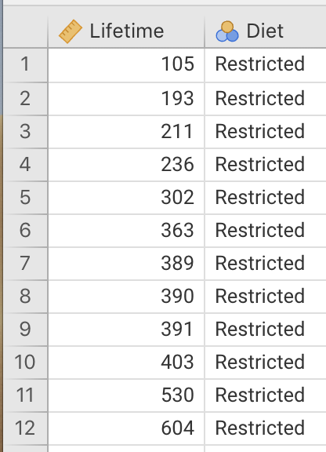
knitr::include_graphics("Images/Spacer.png")
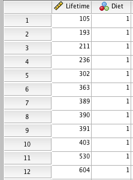
```


4. Which of these short statements best communicates this CI? **Why** are the other statements incorrect?

    a. The sample mean lifetime is between $223.34$ and $346.13$ days.
    b. The population mean difference in lifetimes is between $223.34$ and $346.13$ days.
    c. We are 95% sure that the sample mean difference in lifetimes is between $223.34$ and $346.13$ days.
    d. We are 95% sure that the difference between the population mean lifetimes is between $223.34$ and $346.13$ days.
    e. If we repeated everything many times, 95% of the CIs constructed would contain the difference between the population mean.


```{r Berger1988SummaryCIjamovi, echo=FALSE, fig.cap="The jamovi output summarising the rat lifetimes data", fig.align="center", out.width="95%"}
knitr::include_graphics("SoftwareImages/RatLivesOutput-jamovi.png")
```


```{r Berger1988SummaryCI, echo=-FALSE, fig.cap="The SPSS output summarising the rat lifetimes data", fig.align="center", out.width="70%"}
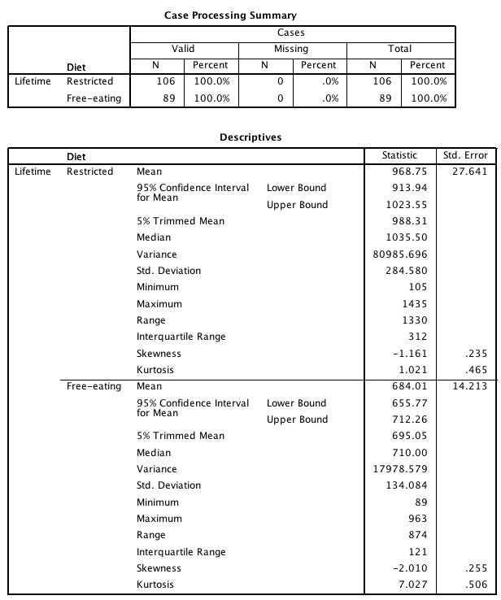
```

   
```{r RatLifetimesOutputCI, echo=FALSE, fig.cap="The SPSS output summarising the rat lifetimes data", fig.align="center", out.width="80%"}
knitr::include_graphics("SoftwareImages/RatLivesOutput.png")
```


   
     
5. The above statement communicating the CI isn't perfect. Why not?
   Write an improved statement communicating the CI.
6. What conditions must be met for this CI to be statistically valid?
   Is it reasonable to assume the CI is statistically valid?
   (You may, or may not, need to refer to Fig. \@ref(fig:SPSSOutputBoxplotsCI).)
7. Explain the difference between the *meaning* of what is displayed in the two graphs shown in 
   Fig. \@ref(fig:SPSSOutputBoxplotsCI).


```{r SPSSOutputBoxplotsCI, echo=FALSE, fig.show="hold", fig.cap="Boxplot (left panel) and error-bar chart (right panel) for the rat lifetime example", fig.align="center", out.width=c("40%", "10%", "40%")}
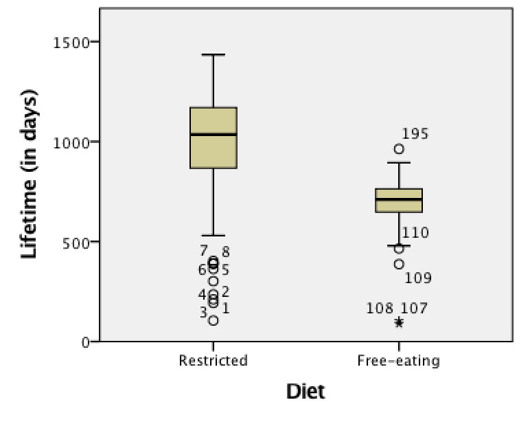
knitr::include_graphics( "Images/spacer.png" )
knitr::include_graphics( "SoftwareImages/RatLivesErrorBar.png" )
```
   

   
   
   
## CI for odds ratios {#OddsSoftware}

*(This question continues Question \@ref(HMMaturing).)*


<!-- Text wrap from: https://stackoverflow.com/questions/43551312/wrap-text-around-plots-in-markdown -->
<!-- Trick from: https://blog.earo.me/2019/10/26/reduce-frictions-rmd/ -->
`r if (knitr::is_latex_output()) '<!--'`
```{r, echo=FALSE, out.width= "40%", out.extra='style="float:right; padding:10px"'}

```
`r if (knitr::is_latex_output()) '-->'`


The timing of pubertal maturation can vary, which can have impacts upon behaviour.

A large study [@data:duncan:maturity]
studied
'the relationships between maturational timing and body image, school behavior, and deviance.'

Sample data were collected from 

> ...children and youth of the entire United States drawn 
> by the National Center for Health Statistics...
> known as the National Health Examination Survey (1966--1970). 
> Data were collected on... adolescents' physical and psychological status...
>
> --- @data:duncan:maturity

The researchers asked the RQ;

> For US children,
> is the odds of a boy maturing late the *same* as the odds of a girl maturing late?


Part of the data are shown entered into
jamovi and SPSS (Fig. \@ref(fig:MaturationData-jamova-SPSS))


```{r MaturationData-jamova-SPSS, echo=FALSE, fig.show="hold", fig.cap="Some of the maturation-data entered into jamovi (left) and SPSS (right)", fig.align="center", out.width='33%'}
knitr::include_graphics( c("SoftwareImages/BoysMatureData-jamovi.png",
                           "Images/Spacer.png",
                           "SoftwareImages/BoysMatureData-SPSS.png") )
```


1. For the 2,864 males in the sample,
   352 were classified as maturing late.  
   For the girls,
   336 of the 2,664 matured late.  
   
   Use this information to construct a two-way table of sex against maturation time
   (Table \@ref(tab:MaturationData)).
   
```{r echo=FALSE, MaturationData}
MaturationData <- array( "", dim=c(3, 3) )
colnames(MaturationData) <- c("Matured late", 
                              "Did not mature late", 
                              "Total")
rownames(MaturationData) <- c("Males", 
                              "Females", 
                              "Total")

MaturationData[3,3] <- 2864 + 2664
MaturationData[1,1] <- ""
   
if( knitr::is_latex_output() ) {
   kable(MaturationData,
        format = "latex",
        longtable = FALSE,
        booktabs = TRUE,
        # escape = FALSE, # For latex to work in \rightarrow
        linesep = c( "\\addlinespace"), # Add a bit of space between all rows. 
        caption = "Maturation and gender",
        align = c("r", "r", "r", "r"))   %>%
   kable_styling(full_width = FALSE, 
                 font_size = 10) %>%
  row_spec(0, bold = TRUE) #%>% # Columns headings in bold
#   column_spec(column=1, width="3cm") %>% 
#   column_spec(column=2, width="5cm") %>%
#   column_spec(column=3, width="5cm") %>%
#   column_spec(column=4, width="2cm")
}

if( knitr::is_html_output() ) {
  MaturationData[1,3] <- webexercises::fitb(num=TRUE, 
                                            tol = 0.001, 
                                            width = 6, 
                                            answer = 2864 )
  MaturationData[2,3] <- webexercises::fitb(num = TRUE, 
                                            tol = 0.001, 
                                            width = 6, 
                                            answer = 2664 )
  MaturationData[3,1] <- webexercises::fitb(num = TRUE, 
                                            tol = 0.001, 
                                            width = 6, 
                                            answer = 352+336 )
  MaturationData[3,2] <- webexercises::fitb(num=TRUE, 
                                            tol = 0.001, 
                                            width = 6, 
                                            answer = (2864 - 352) + (2664 - 336) )

  MaturationData[1,1] <- webexercises::fitb(num = TRUE, 
                                            tol = 0.001, 
                                            width = 6, 
                                            answer = 352)
  MaturationData[2,1] <- webexercises::fitb(num = TRUE, 
                                            tol = 0.001, 
                                            width = 6, 
                                            answer = 336)
  MaturationData[1,2] <- webexercises::fitb(num = TRUE, 
                                            tol = 0.001, 
                                            width = 6, 
                                            answer = 2864 - 352)
  MaturationData[2,2] <- webexercises::fitb(num  =TRUE, 
                                            tol = 0.001, 
                                            width = 6, 
                                            answer = 2664 - 336)
  
  kable(MaturationData,
        format = "html",
        align = c("r", "r", "r"),
        escape = FALSE,
        longtable = FALSE,
       caption = "Maturation and gender",
      booktabs = TRUE) # %>%
   #row_spec(row=1, bold=TRUE) %>%
#   column_spec(column=1, bold=TRUE)
   
}

```

2. What graphical summary could be used to display the information?
   Sketch this display.
3. Among the boys,
   compute the *odds* of maturing late.
   Interpret this value.
4. Among the girls, 
   compute the *odds* of maturing late.
   Interpret this value.
5. From the table, compute the odds ratio of a boy maturing late compared to a girl maturing late.
   Interpret this value, using the software output (Fig. \@ref(fig:BoysMaturejamovi); Fig. \@ref(fig:BoysMatureSPSS)).
  
```{r BoysMaturejamovi, echo=FALSE, fig.cap="The jamovi output from the maturation study", fig.align="center", out.width="50%"}
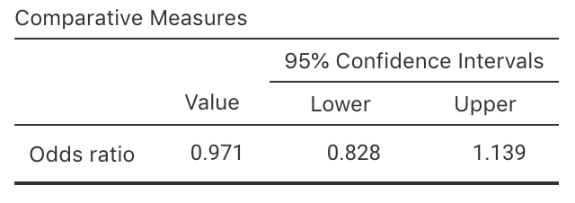
```
```{r BoysMatureSPSS, echo=FALSE, fig.cap="The SPSS output from the maturation study", fig.align="center", out.width="65%"}
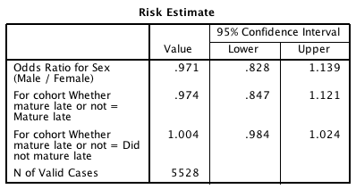
```

6. What is the **parameter** of interest?
7. Write down the OR and the 95% CI for the OR from the jamovi or SPSS output. What does it mean?
8. Compile the numerical summary table for these data (Table \@ref(tab:MaturationSummary)).
9. Are boys generally more likely to mature later than girls?  `r if (knitr::is_html_output()) '**Vote below.**'`  Justify your answer.


```{r echo=FALSE, MaturationSummary}
MaturationSumm <- array( "", 
                         dim = c(3, 3) )
colnames(MaturationSumm) <- c("Percentage maturing late", 
                              "Odds  maturing late", 
                              "Sample size")
rownames(MaturationSumm) <- c("Males", 
                              "Females", 
                              "Odds ratio")

MaturationSumm[3,3] <- "626"
   
if( knitr::is_latex_output() ) {
   kable(MaturationSumm,
        format = "latex",
        longtable = FALSE,
        booktabs = TRUE,
       # escape=FALSE, # For latex to work in \rightarrow
       linesep = c( "\\addlinespace"), # Add a bit of space between all rows. 
       caption = "Maturation and gender: Numerical summary",
        align=c("r", "r", "r", "r"))   %>%
   kable_styling(full_width = FALSE, 
                 font_size = 10) %>%
  row_spec(0, bold=TRUE) #%>% # Columns headings in bold
#   column_spec(column=1, width="3cm") %>% 
#   column_spec(column=2, width="5cm") %>%
#   column_spec(column=3, width="5cm") %>%
#   column_spec(column=4, width="2cm")
}

if( knitr::is_html_output() ) {
  MaturationSumm[3,1] <- ""
  MaturationSumm[3,3] <- ""
  
  MaturationSumm[1,3] <- webexercises::fitb(num = TRUE, 
                                            tol = 0.1, 
                                            width = 6, 
                                            answer = 2864 )
  MaturationSumm[2,3] <- webexercises::fitb(num = TRUE, 
                                            tol = 0.1, 
                                            width = 6, 
                                            answer = 2664 )
  
#  MaturationSumm[3,1] <- webexercises::fitb(num=TRUE, tol=0.001, width=6, answer=47 )
#  MaturationSumm[3,2] <- webexercises::fitb(num=TRUE, tol=0.001, width=6, answer=579 )

  MaturationSumm[1,1] <- webexercises::fitb(num = TRUE, 
                                            tol = 0.1, 
                                            width = 6, 
                                            answer = round(352 / 2864 * 100, 1) )
  MaturationSumm[2,1] <- webexercises::fitb(num = TRUE, 
                                            tol = 0.1, 
                                            width = 6, 
                                            answer = round(336 / 2664 * 100, 1) )

  MaturationSumm[1,2] <- webexercises::fitb(num = TRUE, 
                                            tol = 0.001, 
                                            width = 6, 
                                            answer = round(352 / 2512, 3) )
  MaturationSumm[2,2] <- webexercises::fitb(num = TRUE, 
                                            tol = 0.001, 
                                            width = 6, 
                                            answer = round(336 / 2328, 3) )

  MaturationSumm[3,2] <- webexercises::fitb(num = TRUE, 
                                            tol = 0.005, 
                                            width = 6, 
                                            answer = round( (352 / 2512) / (336 / 2328), 3) )

  kable(MaturationSumm,
        format = "html",
        align = c("r", "r", "r"),
        escape = FALSE,
        longtable = FALSE,
        caption = "Maturation and gender: Numerical summary (Enter percentages to one decimal place. Enter odds and odds ratio to three decimal places)",
        booktabs = TRUE) # %>%
   #row_spec(row=1, bold=TRUE) %>%
#   column_spec(column=1, bold=TRUE)
   
}

```

`r if (knitr::is_latex_output()) '<!--'`
<iframe src='https://www.ferendum.com/en/embeded.php?pregunta_ID=458372&sec_digit=1721642515&embeded_digit=1306731425' style='width:100%; height:550px; overflow: auto; background: #B3919133;' frameBorder='0'></iframe><BR>
<A href='https://www.ferendum.com' target='_blank'>Free Online Poll Maker</A>
`r if (knitr::is_latex_output()) '-->'`
<!-- Admin link: -->
<!-- https://www.ferendum.com/en/admin.php?pregunta_ID=458372&sec_digit=1721642515&edit_code=1217450775 -->


## Sample size calculations {#RoomWidthCISampleSize}

::: {.videoSolutionBox .videoSolution data-latex="{iconmonstr-youtube-10-240.png}"}
This question has a video solution in the online book, so you can hear and see the solution.
:::


Shortly after metric units were introduced to Australia in 1977,
a lecturer wondered how accurately students could estimate lengths using the 
metric measurements [@data:hand:handbook].

The aim of the study was to determine if, 
on average,
students could correctly guess the width of the hall (which was 13.1&nbsp;m).


The 44 individual students' guesses had a standard deviation of $7.145$.
Suppose the Professor wanted to try the study again with another groups of students,
and wanted to estimate the population mean to within 0.5&nbsp;m.

What size sample would Prof. Lewis need?
	


## **Optional**: Understanding the language of research and statistics {#LanguageOfSStats}

::: {.optionalBox .optional data-latex="{iconmonstr-help-4-240.png}"}
This question is **optional**; for example, if you need more practice, or you are studying for the exam.
:::

`r if (knitr::is_latex_output()) {
   '*(Answers are available in Sect.\\@ref(Lecture7Answers))*'
}`

```{r, child = if (knitr::is_latex_output()) './children/TutorialQns/Lect7-Q6.Rmd'}
```


<iframe src="https://usc.h5p.com/content/1290972273872030009/embed" width="1088" height="375" frameborder="0" allowfullscreen="allowfullscreen" allow="geolocation *; microphone *; camera *; midi *; encrypted-media *"></iframe><script src="https://usc.h5p.com/js/h5p-resizer.js" charset="UTF-8"></script>


   
   

## **Optional**: CI for differences between means {#PizzaHT}

::: {.optionalBox .optional data-latex="{iconmonstr-help-4-240.png}"}
This question is **optional**; for example, if you need more practice, or you are studying for the exam.
:::

*(Answers are available in Sect. \@ref(Lecture9Answers))*

::: {.videoSolutionBox .videoSolution data-latex="{iconmonstr-youtube-10-240.png}"}
This question has a video solution in the online book, so you can hear and see the solution.
:::

	  
In 2011, *Eagle Boy's Pizza*
ran a campaign [@mypapers:Dunn:PizzaSize]
that claimed that Eagle Boy's pizzas were larger than *Domino's* large pizzas.
Eagle Boy's made the data behind the campaign publicly available.

Each sample contained similar pizzas types 
(the three toppings were: supreme, Hawaiian, meat-lovers;
the three base types were deep, thin, mid).

Some output from a sample of 125 of Eagle Boys' and Domino's large pizzas is shown in
Fig. \@ref(fig:PizzaSizeComparejamovi) (jamovi) 
and
Fig. \@ref(fig:PizzaSizeCompare) (SPSS).

```{r PizzaSizeComparejamovi, echo=FALSE, fig.cap="Summary statistics for the diameter of Eagle Boy's and Domino's large pizzas, from jamovi", fig.align="center", out.width="98%"}
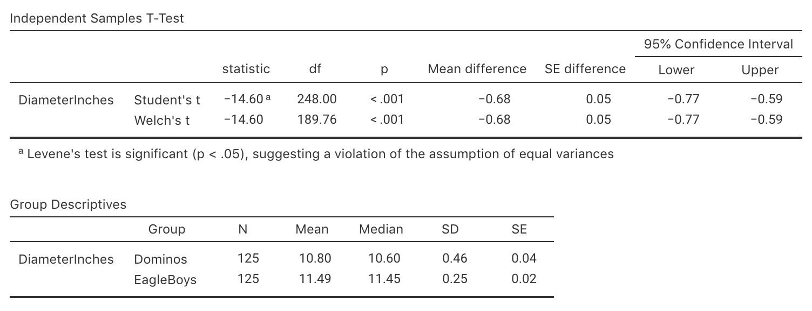
```

```{r PizzaSizeCompare, echo=FALSE, fig.cap="Summary statistics for the diameter of Eagle Boy's and Domino's large pizzas, from SPSS", fig.align="center", out.width='85%'}
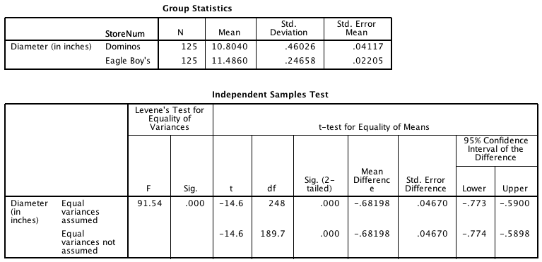
```

1. Explain whether the study is observational or experimental (true or quasi).
2. Identify the type of research question is being answered:
   Descriptive, relational or interventional. Explain.
3. Two students are arguing about this study.  

   One claims that the study compares *two independent samples*,
   because the pizzas have come from two different companies completely.  

   The other student argues that the study has *paired samples*,
   because each store has the same types of pizzas in the sample
	 (e.g.\ both have supreme, Hawaiian and meat-lovers pizzas).  
	 
   With whom do you agree?
   Why?
4. Write down the CI to estimate the difference in population means.
5. Write a statement communicating the confidence interval.
6. What does the right panel of Fig. \@ref(fig:PizzaSizeBoxplots) communicate?
7. What condition must hold for the CI to be statistically 
valid?
8. Is it reasonable to assume these conditions are satisfied? 
   (You may need to refer Fig. \@ref(fig:PizzaSizeBoxplots).)
9. *Eagle Boy's* claimed that 
   their pizzas are 'larger' than Domino's pizzas.
   Do you agree or disagree?  Why?
   What other information would be helpful for answering this question?


```{r PizzaSizeBoxplots, echo=FALSE, fig.cap="Boxplot (left panel) and error-bar chart (right panel) for the pizza size data", fig.show="hold", fig.align="center", out.width=c("40%", "8%", "40%")}
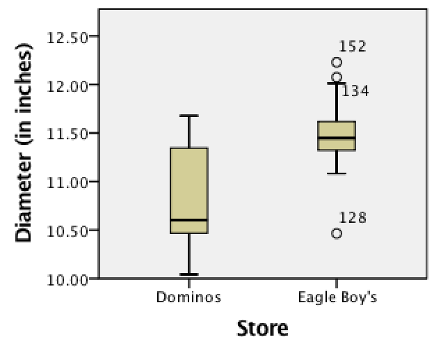
include_graphics("Images/Spacer.png")
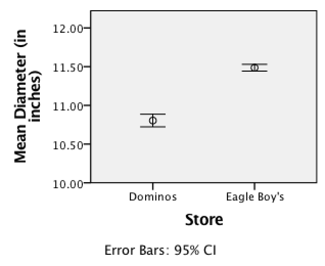
```


## **Optional**: Odds and odds ratio {#OddsGMfood}

::: {.optionalBox .optional data-latex="{iconmonstr-help-4-240.png}"}
This question is **optional**; for example, if you need more practice, or you are studying for the exam.
:::

*(Answers are available in Sect. \@ref(Lecture9Answers))*

::: {.videoSolutionBox .videoSolution data-latex="{iconmonstr-youtube-10-240.png}"}
This question has a video solution in the online book, so you can hear and see the solution.
:::


The use of genetically modified (GM) foods is controversial.
An Australian study [@data:luo:gm]
decided to study:

> ...whether income level and attitude to genetic engineering of food are dependent.

To answer this relational RQ,
the researcher asked 894 Australians about
their income (low or high), and 
their attitude to GM foods (for or against).

1. Propose the null and alternative hypotheses about the *population*.
2. The data collected are given in  Table \@ref(tab:GMfoods).
   Compute the odds that,
   among *high*-income earners,
   someone is in favour of GM foods.
1. Compute the odds that, among *low*-income earners,
     someone is in favour of GM foods.   
     Interpret what this means.
2. The odds of a high-income earner being in favour of GM foods
   is how many times more than a low-income earner being in favour of GM food?
   This value is called the **odds ratio**.
3. For these data,
   the output is shown in
	 Fig. \@ref(fig:GMfoodsjamovi) (from jamovi).
   Write down the confidence interval for the odds ratio,
   and interpret what this means.
4. A politician stated that 
   'any attempt to suggest that the acceptance of GM foods is related to income are clearly bogus'.
   Do you agree or disagree?


```{r GMfoods, echo=FALSE}
GMfoodTab <- array(dim=c(2, 2))

colnames(GMfoodTab) <- c("High income", "Low income")
rownames(GMfoodTab) <- c("For GM foods", "Against GM foods")

GMfoodTab[1, ] <- c(263, 258)
GMfoodTab[2, ] <- c(151, 222)

if( knitr::is_latex_output() ) {
  kable(GMfoodTab,
      format="latex",
      booktabs=TRUE,
      caption="Opinions of Australians about GM food") %>%
  column_spec(1, bold=TRUE) %>%
  row_spec(0, bold=TRUE) %>%
  kable_styling(full_width=FALSE)
}
if( knitr::is_html_output() ) {
  kable(GMfoodTab,
      format="html",
      booktabs=TRUE,
      caption="Opinions of Australians about GM food") %>%
  column_spec(1, bold=TRUE) %>%
  row_spec(0, bold=TRUE) %>%
  kable_styling(full_width=FALSE)
}
```


     
```{r GMfoodsjamovi, echo=FALSE, fig.cap="jamovi output for the GM foods data", fig.align="center", out.width="50%"}
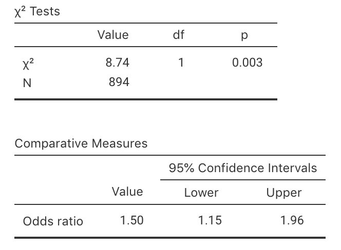
```


