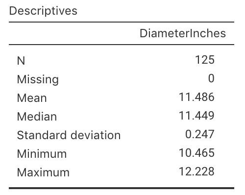

# Teaching Week 7: tutorial {#Lecture7}


::: {.objectivesBox .objectives data-latex="{iconmonstr-target-4-240.png}"}
**Topics** covered in this tutorial:

* Confidence intervals for one proportion.
* Confidence intervals for one mean.
:::


::: {.readBox .read data-latex="{iconmonstr-school-15-240.png}"}
You will learn and practice the content associated with these chapters of the [textbook](https://bookdown.org/pkaldunn/SRM-Textbook/):

* [Chapter\ 21 (Introducing inference)](https://bookdown.org/pkaldunn/SRM-Textbook/IntroducingInference.html).
* [Chapter\ 22 (Confidence intervals: one proportions)](https://bookdown.org/pkaldunn/SRM-Textbook/CIOneProportion.html).
* [Chapter\ 23 (Confidence intervals: one mean)](https://bookdown.org/pkaldunn/SRM-Textbook/OneMeanConfInterval.html).
* [Chapter\ 24 (More details about CIs)](https://bookdown.org/pkaldunn/SRM-Textbook/AboutCIs.html).
:::


## Quick revision {#QuickRevision-Tutorial7}


::: {.preClassBox .preClass data-latex="{iconmonstr-home-7-240.png}"}
We **strongly** recommend trying these *Quick revision* questions **before** your tutorial.
:::

::: {.webex-check .webex-box}
1. A *confidence interval* is used to find an interval that probably (but not certainly) contains the *sample* value. \tightlist 
   True or false?  
`r if( knitr::is_html_output() ) {
   webexercises::torf( FALSE)}`
1. All *confidence interval* are $95$% confidence intervals. 
   True or false?  
`r if( knitr::is_html_output() ) {
   webexercises::torf( FALSE)}`
1. A *standard error* is calculated from population data, but a *standard deviation* is calculated from sample data. 
   True or false?  
`r if( knitr::is_html_output() ) {
   webexercises::torf( FALSE)}`
1. CIs answers estimation-type RQs.
   True or false?  
`r if( knitr::is_html_output() ) {
   webexercises::torf( TRUE)}`
:::

`r if (knitr::is_latex_output()) '<!--'`
`r webexercises::hide()`
1. **FALSE**. 
   A CI is an interval which probably contains the **population** value. 
   We already know the **sample** value... we don't need an interval for it.
1. **FALSE**. 
   Confidence intervals can be any percentage (though $90$%, $95$% and $99$% CIs are the most common, and $95$% easily the most common of all).
1. **FALSE**.
   A *standard deviation* is a measure of variation in the *individuals*; a *standard error* is a measure of how much a sample summary value (such as the sample mean, or sample proportion) varies between samples.
1. **TRUE**.
`r webexercises::unhide()`
`r if (knitr::is_latex_output()) '-->'`


`r if (knitr::is_latex_output()) '<!--'`
<iframe src='https://www.ferendum.com/en/embeded.php?pregunta_ID=1265022&sec_digit=1542537483&embeded_digit=1153605398' style='width:100%; height:350px; overflow: auto; background: #B3919133' frameBorder='0'></iframe><BR>
<A href='https://www.ferendum.com' target='_blank'>Free Online Poll Maker</A>
`r if (knitr::is_latex_output()) '-->'`


## Concepts {#ConceptsMatches}


<!-- Text wrap from: https://stackoverflow.com/questions/43551312/wrap-text-around-plots-in-markdown -->
<!-- Trick from: https://blog.earo.me/2019/10/26/reduce-frictions-rmd/ -->
`r if (knitr::is_latex_output()) '<!--'`
```{r, echo=FALSE, out.width= "30%", out.extra='style="float:right; padding:10px"'}
include_graphics("Illustrations/pexels-john-finkelstein-1602905.jpg")
```
`r if (knitr::is_latex_output()) '-->'`


Claire and Jake were wondering about the mean number of matches in a box.
The boxes contain this statement:

> An average of $45$ matches per box.

They purchased a carton containing $25$\ boxes of matches, and Jake counted the number of matches in *one* of those $25$\ boxes.
There was $44$\ matches.

'Oh wow.  Just wow.' said Jake.
'They lie.  
There's only $44$\ matches in this box.'


1. What is Jake's misunderstanding? \tightlist
\greyboxlines{2}
2. Then, they counted the number of matches in *each* of the twenty-five boxes.
   Claire found that the mean number of matches per box was $44.9$\ matches, and the standard deviation was $0.124$.
   
   Jake notes that the mean is $44.9$\ matches per box, and says: 'You can't have $0.9$ of a match.  That's dumb.'
   How would you respond?
\greyboxlines{2}
3. 'Wow!' said Jake.
   'The claim is $45$\ matches per box on average, but the mean really is $44.9$!
   They're liars!  Liar, liar, pants on...'  
   
   What is Jake's misunderstanding?
\greyboxlines{2}
4. What two broad reasons could explain why the sample mean is *not* $45$?
\greyboxlines{2}
5. 'Come on, Jake,' said Claire.
   'As if the mean will be *exactly* $45$ in a sample every single time.
   Let's work out the confidence interval.'  
   
   Why does Claire think a CI is needed?
   What will it tell them?
\greyboxlines{2}
6. What is an approximate $95$% confidence interval for the mean for Claire's sample?
\greyboxlines{2}
7. 'Aha---I told you so!  They *are* absolutely lying!
   Your confidence interval doesn't even include their mean of $45$!' said Jake.
   'The manufacturer *must* be lying!'  
   
   Is Jake correct?
   Why or why not?
   What does the CI *mean*?
\greyboxlines{2}
8. In this scenario, what does\ $\bar{x}$ represent?
   What is the *value* of\ $\bar{x}$?
\greyboxlines{2}
9. In this scenario, what does\ $\mu$ represent?
   What is the *value* of\ $\mu$?
\greyboxlines{2}


## Standard error for a proportion {#SEproportions}


```{r, child = if (knitr::is_latex_output()) './children/TutorialQns/07-StdErrorProportion.Rmd'}
```


<iframe src="https://usc.h5p.com/content/1291039013241820579/embed" width="1088" height="637" frameborder="0" allowfullscreen="allowfullscreen" allow="geolocation *; microphone *; camera *; midi *; encrypted-media *"></iframe><script src="https://usc.h5p.com/js/h5p-resizer.js" charset="UTF-8"></script>


## CIs for one proportion {#CIPropBVM}

Endotracheal intubation (ETI) is a method for maintaining an open airway or as a method for administering certain drugs for ill patients.
ETI is widely used for airway management of children in the out-of-hospital setting, but for many years little evidence was available on the effect of using ETI.
The BVM ('ball valve mask') method is also used.

@data:Gausche200:Endotracheal examined the use of ETI for airway management of children in the out-of-hospital setting.

```{r Gausche2000Abstract, echo=FALSE, fig.cap="Part of the Abstract from Gausche et al. (2000).", fig.align="center", out.width='70%'}
knitr::include_graphics("ArticleImages/Gausche2000-PartialAbstract.png")
```


1. For the **BVM sample**, $123$ out of the $404$\ patients survived.
   For those receiving BVM, compute the sample *odds* of a patient who survived.
\greyboxlines{2}
2. For the **BVM sample**, $123$ out of the $404$\ patients survived.
   For those receiving BVM, compute an estimate of the population *proportion* of patients who survive.
\greyboxlines{2}
3. Explain the difference between the meaning of the two above calculations.
\greyboxlines{2}
4. In another sample of $404$\ patients who received the BVM treatment, would we expect to find *exactly* $123$ surviving?
   Why or why not?
\greyboxlines{2}
5. Compute the *standard error* of\ $\hat{p}$, which indicates the sampling variability in the estimate of\ $p$.
   Explain what is meant by the term 'sampling variation' in this context.
\greyboxlines{2}
6. Every time a new sample is chosen, the sample will likely yield a different value for\ $\hat{p}$.
   Sketch the distribution that shows how much the value of\ $\hat{p}$ is likely to change from one sample to the next.
\greyboxlines{4}
7. Compute an approximate $95$% confidence interval for the population proportion based on the sample proportion.
\greyboxlines{4}
8. Write a sentence communicating this confidence interval.
\greyboxlines{3}
9. If the researchers wished to estimate the true survival proportion to within give-or-take $0.01$ with $95$% confidence, would the sample size need to be *larger* or *smaller*?
\greyboxlines{2}
10. Confirm that the conditions necessary for this calculation to be statistically valid are met.
\greyboxlines{2}
   
   
   
## CIs for one mean {#CIPizzas}


<!-- Text wrap from: https://stackoverflow.com/questions/43551312/wrap-text-around-plots-in-markdown -->
<!-- Trick from: https://blog.earo.me/2019/10/26/reduce-frictions-rmd/ -->
`r if (knitr::is_latex_output()) '<!--'`
```{r, echo=FALSE, out.width= "50%", out.extra='style="float:right; padding:10px"'}

```
`r if (knitr::is_latex_output()) '-->'`


In 2011, *Eagle Boy's Pizza* ran a campaign that claimed (among many other claims) that Eagle Boy's pizzas were  'Real size $12$-inch large pizzas' in an effort to out-market *Domino's Pizza*.

Eagle Boy's made the data behind the campaign publicly available [@mypapers:Dunn:PizzaSize].
A summary of the diameters of a sample of $125$ of Eagle Boys' large pizzas is shown in Fig.\ \@ref(fig:PizzaCIjamovi).

```{r PizzaCIjamovi, echo=FALSE, fig.cap="Summary statistics for the diameter of Eagle Boys' large pizzas; jamovi.", fig.align="center", fig.align="center", out.width='42%'}

```

1. What do\ $\mu$ and\ $\bar{x}$ represent in this context? \tightlist 
\greyboxlines{2}
2. Write down the *values* of\ $\mu$ and\ $\bar{x}$.
\greyboxlines{2}
3. Write down the *values* of\ $\sigma$ and\ $s$.
\greyboxlines{2}
4. Compute the value of the standard error of the mean.
\greyboxlines{2}
5. Explain the difference in *meaning* between $s$ and $\text{s.e.}(\bar{x})$ here.
\greyboxlines{2}
6. If someone else takes a sample of $125$\ Eagle Boy's pizzas, will the sample mean be $11.486$\ inches again (as it is in this sample)?
   Why or why not?
\greyboxlines{2}
7. Draw a picture of the approximate sampling distribution for\ $\bar{x}$.
\greyboxlines{4}
8. Compute an approximate $95$% confidence interval for the mean pizza diameter.
\greyboxlines{4}
9. Write a statement that communicates your $95$%\ CI for the mean pizza diameter.
\greyboxlines{4}
10. What are the **statistical** validity conditions?
\greyboxlines{2}
11. Which of these conditions must we **assume** are met for this CI to be **statistically** valid?
    How does Fig.\ \@ref(fig:PizzaHistoCI) help, if at all? 
    Explain.
    
    - The sample size is greater than about\ $25$.
    - The population has a normal distribution.
    - The population standard deviation is known.
    - The sample has a normal distribution.

\greyboxlines{2}
   
```{r PizzaHistoCI, echo=FALSE, fig.cap="Histogram for the diameter of Eagle Boys' large pizzas. The cross is the claimed diameter of 12 inches.", fig.width=6, fig.height = 4}
data(PizzaSize)

hist( PizzaSize$DiameterInches[PizzaSize$Store == "EagleBoys"],
      col = plot.colour,
      las = 1,
      xlab = "Pizza diameter (in inches)",
      ylab = "Number of pizzas",
      main = "Histogram of pizza diameters",
      xlim = c(10, 12.5))

points(x = 12,
       y = 0,
       pch = 4, 
       cex = 1.5)
```

12. Do you think that, on average, the pizzas do have a mean diameter of $12$\ inches in the population, as Eagle Boy's claim?
    Explain.
\greyboxlines{2}
    
`r if (knitr::is_latex_output()) '<!--'`
<iframe src='https://www.ferendum.com/en/embeded.php?pregunta_ID=458369&sec_digit=776424948&embeded_digit=21580733' style='width:100%; height:500px; overflow: auto; background: #B3919133' frameBorder='0'></iframe><BR>
<A href='https://www.ferendum.com' target='_blank'>Free Online Poll Maker</A>
`r if (knitr::is_latex_output()) '-->'`


<!-- Admin link: -->
<!-- https://www.ferendum.com/en/admin.php?pregunta_ID=458369&sec_digit=776424948&edit_code=13483820 -->


## **Drills**: Computational exercises {#Chapter6Drills}

*(Answers appear in Sect. \@ref(Lecture6Answers))*

::: {.drillBox .drill data-latex="{iconmonstr-pencil-9-240.png}"}
These *optional* **Drill** exercises (repeated practice) give you practice at getting computations correct, and using your calculator.
These drill questions are more about practising the underlying *mathematics* rather than the *statistics*.
If you need help, please **ask**.
:::

The *standard error* for a sample proportion is calculated as  
$$
   \text{s.e.}(\hat{p}) = \sqrt{\frac{\hat{p} \times (1 - \hat{p})}{n}}.
$$
The standard error quantifies how much the sample proportion is likely to vary from sample to sample.

Compute the standard error in these situations:

1. When $n = 25$ and $\hat{p} = 0.70$.
\greyboxlines{3}
1. When $n = 100$ and $\hat{p} = 0.25$.
\greyboxlines{3}
1. When $n = 32$ and $\hat{p} = 0.42$.
\greyboxlines{3}
1. When $n = 53$ and $\hat{p} = 0.814$.
\greyboxlines{3}

Will the CIs be statistically valid in the above situations?
\greyboxlines{3}


