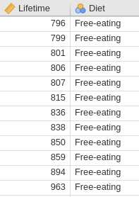

# Teaching Week 9 tutorial  {#Lecture9}


::: {.objectivesBox .objectives data-latex="{iconmonstr-target-4-240.png}"}
You will learn to:

* construct CIs and conduct hypothesis tests for the mean difference in paired situations.
* construct CIs and conduct hypothesis tests for comparing two independent means.
:::


::: {.assessmentBox .assessment data-latex="{iconmonstr-text-check-list-lined-240.png}"}
The Week\ 9 content is essential for:

* **Task\ 2B**, which requires you to *produce CIs and conduct a hypothesis test for your data*;
* **Quiz\ 4**, which includes questions about *understanding and producing CIs, and understanding and conducting hypothesis tests*; and
* the **Exam**, which will contain questions about *understanding and producing CIs, and understanding and conducting hypothesis tests*.
:::


::: {.readBox .read data-latex="{iconmonstr-school-15-240.png}"}
You will learn and practice the content associated with these chapters of the [textbook](https://peterkdunn.github.io/SRM-Textbook/):


* [Chapter\ 29 (CIs and tests: mean differences (paired data))](https://peterkdunn.github.io/SRM-Textbook/AnalysisPaired.html).
* [Chapter\ 30 (CIs and tests: comparing two means)](https://peterkdunn.github.io/SRM-Textbook/AnalysisTwoMeans.html)
:::


\pagebreak


## Quick revision {#QuickRevision-Tutorial9}

`r if (!tutorVersion) '<!--'`
::: {.mentiQuestion data-latex=""}
\null
:::
`r if (!tutorVersion) '-->'`


::: {.webex-box}
Some of the summary information regarding the number of decayed, missing and filled teeth (DMFT) is shown below.
The researchers wanted to compare the mean DMFT for coeliacs and non-coeliacs.

```{r Coeliac, echo=FALSE}
Coeliac <- array( dim = c(3, 4))
colnames(Coeliac) <- c("Sample size",
                       "Mean",
                       "Standard deviation",
                       "Standard error")
rownames(Coeliac) <- c("Coeliac (C)",
                       "Non-coeliac (NC)",
                       "Difference")

Coeliac[1, ] <- c(23, 8.39, 4.4, 0.92)
Coeliac[2, ] <- c(23, 8.17, 4.1, 0.86)
Coeliac[3, ] <- c("", 0.22, "", 1.3)

if( knitr::is_latex_output() ) {
  knitr::kable( Coeliac,
                format = "latex",
                longtable = FALSE,
                booktabs = TRUE,
                align = "c", 
                caption = "Coeliacs and dental cavities.") %>%
    kable_styling(font_size = 10) %>%
    row_spec(0, 
             bold = TRUE) %>%
    row_spec(2,
             hline_after = TRUE)
}
if( knitr::is_html_output() ) {
  knitr::kable( Coeliac,
                format = "html",
                longtable = FALSE,
                booktabs = TRUE,
                align = "c", 
                caption = "Coeliacs and dental cavities.") %>%
    row_spec(0, 
             bold = TRUE)
}
```


An *exact* $95$%\ CI is given as for the difference is $-2.32$ to $2.76$.

1. Using the $68$--$95$--$99.7$ rule gives a slightly different CI.
  Why?
\greyboxlines{2}
2. True or false: 
   The difference is computed as the number of DMFT for coeliacs minus non-coeliacs. \tightlist 
\greyboxlines{1}
3. True or false:
   One of the values for the CI is a negative value, which must be an error, since a negative number of DMFT is impossible. 
\greyboxlines{1}
4. We are $95$% confident that the difference between the population means is:
\greyboxlines{2}
5. True or false:
   The *null* hypothesis is $H_0$: $\mu_{C} - \mu_{NC} = 0$. 
\greyboxlines{1}
6. True or false:
   The *alternative* hypothesis is $H_0$: $\mu_{C} - \mu_{NC} > 0$. 
\greyboxlines{1}
7. True or false:
   Since the two sample means are different, we reject the null hypothesis. 
\greyboxlines{1}
8. Suppose the difference between the means was computed as $\mu_C - \mu_{NC}$. 
   What does this *measure*?
\greyboxlines{2}
9. Both samples sizes are less than $25$. 
   What does this mean for the statistical validity of the CI?
\greyboxlines{2}
:::


## Class discussion {#TW9-Class-Discussion}

::: {.discussBox .discuss data-latex="{iconmonstr-speech-bubble-26-240.png}"}
**Discuss**: If the mean of Group\ A is $\bar{x}_1 = 12.0\cms$ and the mean of Group\ B is $\bar{x}_2 = 14.2\cms$, then the two means are clearly different.
:::


## Matching RQs and hypotheses {#MatchRQHypothesis}


<!-- Text wrap from: https://stackoverflow.com/questions/43551312/wrap-text-around-plots-in-markdown -->
<!-- Trick from: https://blog.earo.me/2019/10/26/reduce-frictions-rmd/ -->
`r if (knitr::is_latex_output()) '<!--'`
```{r, echo=FALSE, out.width= "30%", out.extra='style="float:right; padding:10px"'}
include_graphics("Illustrations/raphael-nogueira-Znvxeud6sDc-unsplash.jpg")
```
`r if (knitr::is_latex_output()) '-->'`


`r if (knitr::is_html_output()) 'Match the RQs with the appropriate *null hypothesis* (where the symbols are defined as expected).'`

<iframe src="https://usc.h5p.com/content/1291042384744155759/embed" width="1088" height="637" frameborder="0" allowfullscreen="allowfullscreen" allow="geolocation *; microphone *; camera *; midi *; encrypted-media *"></iframe><script src="https://usc.h5p.com/js/h5p-resizer.js" charset="UTF-8"></script>


`r if (knitr::is_html_output()) 'Now, match the RQs with the appropriate *alternative hypothesis* (where the symbols are defined as expected).'`

<iframe src="https://usc.h5p.com/content/1291042402737889249/embed" width="900" height="600" frameborder="0" allowfullscreen="allowfullscreen" allow="geolocation *; microphone *; camera *; midi *; encrypted-media *"></iframe><script src="https://usc.h5p.com/js/h5p-resizer.js" charset="UTF-8"></script>


```{r, child = if (knitr::is_latex_output()) './children/TutorialQns/10-MatchHypothesesRQ.Rmd'}
```


## CIs and tests for mean differences (paired data) {#CIImplant}

```{r echo=FALSE}
Without <- c(112, 84, 96, 78, 132, 72, 80, 106, 108, 116)
With    <- c(144, 96, 120, 108, 140, 86, 94, 134, 146, 165)
Improve <- With - Without
```

<!-- Text wrap from: https://stackoverflow.com/questions/43551312/wrap-text-around-plots-in-markdown -->
<!-- Trick from: https://blog.earo.me/2019/10/26/reduce-frictions-rmd/ -->
`r if (knitr::is_latex_output()) '<!--'`
```{r, echo=FALSE, out.width= "35%", out.extra='style="float:right; padding:10px"'}
include_graphics("Illustrations/pexels-shotpot-4046557.jpg")
```
`r if (knitr::is_latex_output()) '-->'`

@data:Guirao2017:amputees examined the difference between $2$-minute walk test score (2MWT) for $10$\ patients before *and* after receiving a prosthetic implant.
(The 2MWT measures how far participants can walk in two minutes, in metres.)

The 2MWT for ten amputees *with* and *without* an implant are shown in Fig.\ \@ref(fig:Guirao2MWT).
The researchers asked:

> For this type of amputee, is the mean 2MWT **improved** (i.e., longer distances walked) after using the implant?	


```{r Guirao2MWT, echo=FALSE, fig.cap="Two-minute Walk Times (2MWT) for $10$ patients with implants (With Imp) and without implants (Without Imp), in metres.", fig.align="center", out.width="70%"}
knitr::include_graphics("ArticleImages/Guirao2017-Table2.png")
```


1. Suppose the difference were computed as **With Imp** values *minus* the **Without Imp** values, what would this measure?
\greyboxlines{2}
2. What type of RQ is implied: descriptive, relational, repeated-measures or correlational?
\greyboxlines{1}
3. What do\ $\mu_d$ and\ $\bar{d}$ represent in this context?
\greyboxlines{2}
4. Explain why these data should be analysed as *paired* data.
\greyboxlines{2}
5. Compute the *changes* in 2MWT for each patient.
6. Although it doesn't really matter, *why* does it probably makes more sense to compute the **With Imp** values minus the **Without Imp** values?
\greyboxlines{2}
7. Using the statistics mode on your calculator, compute the sample mean difference\ $\bar{d}$ and the sample standard deviation of the differences\ $s_d$.
\greyboxlines{2}
8. Compute the standard error of the mean difference $\text{s.e.}(\bar{d})$. 
\greyboxlines{2}
9. Explain the *meaning* of the standard error of the mean difference in this context.
\greyboxlines{2}
10. If another sample of ten subjects were studied, would the same sample mean difference\ $\bar{d}$ be computed?
   How much variation would be expected in the sample mean differences found from different samples?
\greyboxlines{2}
11. Draw the approximate sampling distribution of\ $\bar{d}$ that shows how the value of\ $\bar{d}$ varies.
\greyboxlines{4}
12. Compute an approximate $95$% confidence interval for the population mean difference in 2MWT.
\greyboxlines{4}
13. Do you think the population 2MWT changes because of the prosthetic, on average?
\greyboxlines{3}
14. Which of the following is the correct null hypothesis for this RQ? \tightlist
   **Why** are the others incorrect?
   Is the test one- or two-tailed?
   What is the alternative hypothesis?

    - $\mu_{\text{Without Implant}} - \mu_{\text{With implant}} = 0$
    - $\mu_{\text{Difference}} = 0$
    - $\mu_{\text{Difference}} > 0$
    - $\mu_{\text{Without Implant}} = 0$
    - $\mu_{\text{With implant}} = 0$
    - $\mu_{\text{Without Implant}} - \mu_{\text{With implant}} < 0$
    - $\mu_{\text{Difference}} < 0$
    - $\mu_{\text{Without Implant}} < 0$
    - $\mu_{\text{With implant}} > 0$

15. Write down the value of the $t$-statistic, then estimate the $P$-value for testing the hypotheses (using Fig.\ \@ref(fig:2MWTjamovi)).
\greyboxlines{3}
16. Explain why the $t$-score from jamovi is a negative value, but the $t$-score from SPSS (Fig.\ \@ref(fig:2MWTSPSS)) is a positive value.
\greyboxlines{2}
17. Write a statement that communicates the result of the test.
\greyboxlines{2}
18. What conditions must be met for this test to be valid?
\greyboxlines{2}
19. Is it reasonable to assume the assumptions are satisfied?
    How does Fig.\ \@ref(fig:2MWTHisto) help, if at all?
\greyboxlines{2}
20. What did you learn from this study?
\greyboxlines{2}

```{r 2MWTjamovi, echo=FALSE, fig.cap="Output from jamovi for the 2MWT example, partially edited.", fig.align="center", out.width="100%"}
knitr::include_graphics("ArticleImages/TwoMinuteWalk-edit.png")
```

```{r 2MWTSPSS, echo=FALSE, fig.cap="Output from SPSS for the 2MWT example, partially edited.", fig.align="center", out.width="95%"}
knitr::include_graphics("ArticleImages/Guirao2017-SPSSoutput-blind.png")
```


```{r 2MWTHisto, echo=FALSE, fig.height = 4, fig.width = 5, out.wdth="60%", fig.align="center", fig.cap="Histogram of differences for the increases in 2MWT with implant."}
hist(Improve,
     las = 1,
     xlab = "Change in 2MWT (in m)",
     ylab = "Number",
     main = "Improvements in 2MWT")
```

	
	
## CI and test for the ruler-drop {#PlanStudy7}

Your tutor *may* decide to do this activity.


## CIs and test for difference between two sample means {#CIRatLifetimes}

```{r, echo=FALSE}
RL <- read.csv("Data/ratlives.csv")
```

<!-- Text wrap from: https://stackoverflow.com/questions/43551312/wrap-text-around-plots-in-markdown -->
<!-- Trick from: https://blog.earo.me/2019/10/26/reduce-frictions-rmd/ -->
`r if (knitr::is_latex_output()) '<!--'`
```{r, echo=FALSE, out.width= "35%", out.extra='style="float:right; padding:10px"'}
include_graphics("Illustrations/pexels-alexas-fotos-2189599.jpg")
```
`r if (knitr::is_latex_output()) '-->'`


Researchers were interested in the impact of diet on the lifetime of rats:

> For rats, is the mean lifetime *shorter* for rats on a *free-choice* diet compared to rats on a *healthy, restricted* diet?

@data:Berger1988:RatsData compared the lifetime of rats on a healthy, restricted diet ($106$\ rats) and on a free-eating diet ($89$\ rats).
The data set is large, so only an extract of the data is shown (Fig.\ \@ref(fig:RatLifetimesDatajamovi)).

1. Explain why this study compares two *independent* groups. \tightlist
\greyboxlines{2}
2. Carefully define **parameter** of interest, including the *direction*.
   What does this definition of the difference measure?
\greyboxlines{2}
3. Use the jamovi output (Fig.\ \@ref(fig:Berger1988SummaryHTjamovi1)) to prepare a numerical summary table.
\greyboxlines{4}
4. Use the jamovi output to write down the appropriate $95$%\ CI, to estimate the *difference* between the population means.
\greyboxlines{4}
5. Which of these short statements best communicates this CI? 
   **Why** are the other statements incorrect?

    a. The sample mean lifetime is between $223.34$ and $346.13$\ days.
    b. The difference between the population mean lifetimes is between $223.34$ and $346.13$\ days.
    c. We are $95$% sure that the difference between the sample mean lifetimes is between $223.34$ and $346.13$\ days.
    d. We are $95$% sure that the difference between the population mean lifetimes is between $223.34$ and $346.13$\ days.
    e. If we repeated everything many times, $95$% of the CIs constructed would contain the difference between the population means.

6. The best statement above for communicating the CI is missing an important piece of information. 
   Write an improved statement communicating the CI.
\greyboxlines{2}
7. Explain the difference between the *meaning* of what is displayed in the two graphs in Fig.\ \@ref(fig:RatsBoxErrorbar).
\greyboxlines{2}
8. Write down the hypotheses being tested. 
   Is this a one- or a two-tailed test? Explain.
\greyboxlines{2}
9. What are *two* possible reasons why the sample mean lifetimes of rats on the two diets are different?
\greyboxlines{2}
10. Write down the $t$-score and the appropriate $P$-value, using the output in Fig.\ \@ref(fig:Berger1988SummaryHTjamovi1) .
\greyboxlines{3}
11. Calculate the $t$-score (using the standard error as given in the output), and show it is the same value as given in the output.
\greyboxlines{3}
12. Make a conclusion, in context.
\greyboxlines{2}
13. What conditions are necessary for the CI and test to be statistically valid?
\greyboxlines{2}
14. Is it reasonable to assume these conditions are satisfied?
    How does Fig.\ \@ref(fig:RatsBoxErrorbar). help, if at all?
\greyboxlines{2}
15. What if all these rats only came from only $20$ litters?
\greyboxlines{2}

   

```{r RatLifetimesDatajamovi, echo=FALSE, fig.show="hold", fig.cap="Part of the data for the rat lifetime example (left: the start of the data; right: the end of the data).", fig.align="center", out.width=c('27%', '10%','26%')}
knitr::include_graphics("SoftwareImages/RatLivesData-jamovi.png")
knitr::include_graphics("images/SPACER.png")

```

```{r RatsBoxErrorbar, echo=FALSE,  fig.cap="Boxplot (left panel) and error-bar chart (right panel) for the rat lifetime data.", fig.align="center", fig.width=7, out.width='80%', fig.height = 3.5}
par( mfrow = c(1, 2))

# Boxplot
boxplot(Lifetime ~ Diet, 
        data = RL,
        las = 1,
        names = c("Restricted",
                  "Free-eating"),
        main = "Boxplot for rat\nlifetime data",
        xlab = "Diet",
        ylab = "Lifetime (days)")

# Error bar chart
ebline <- 0.15

mns <- tapply( RL$Lifetime,
               list(RL$Diet),
               "mean")
ses <- tapply( RL$Lifetime,
               list(RL$Diet),
               function(x){ sd(x)/sqrt(length(x))} )
groups <- 1:2

plot( mns ~ groups,
      main = "Error bar chart for rat\nlifetime data",
      ylim = c(600, 1100),
      xlim = c(0.5, 2.5),
      axes = FALSE,
      las = 1,
      xlab = "Diet",
      ylab = "Lifetime (days)")
axis(side = 2, 
     las = 1)
axis(side = 1,
     at = c(1, 2),
     label = c("Restricted",
               "Free-eating"))
box()
# Left error bar
lines( x = c(1, 1),
       y = c(mns[1] - 2 * ses[1],
             mns[1] + 2 * ses[1]) )

lines(x = c(1 - ebline,
            1 + ebline),
      y = c(mns[1] - 2 * ses[1],
            mns[1] - 2 * ses[1]) )
lines(x = c(1 - ebline,
            1 + ebline),
      y = c(mns[1] + 2 * ses[1],
            mns[1] + 2 * ses[1]) )

# Right error bar
lines( x = c(2, 2),
       y = c(mns[2] - 2 * ses[2],
             mns[2] + 2 * ses[2]) )
lines(x = c(2 - ebline,
            2 + ebline),
      y = c(mns[2] - 2 * ses[2],
            mns[2] - 2 * ses[2]) )
lines(x = c(2 - ebline,
            2 + ebline),
      y = c(mns[2] + 2 * ses[2],
            mns[2] + 2 * ses[2]) )
```


```{r Berger1988SummaryHTjamovi1, echo=FALSE, fig.cap="The jamovi output summarising the rat lifetimes data.", fig.align="center", fig.align="center", out.width="100%"}
knitr::include_graphics("SoftwareImages/RatLivesOutput-jamovi.png")
```


##  **Optional questions** {#OptionalTW9}


::: {.optionalBox .optional data-latex="{iconmonstr-help-4-240.png}"}
These questions are **optional**; e.g., if you need more practice, or you are studying for the exam.
(Answers appear in Sect.\ \@ref(Lecture9Answers).)
:::


### **(Optional)**  Paired $t$-test {#JumpingInference}

@hebert2023effect recorded double-legged jumping distance for\ $80$ healthy people, when they wore shoes and were barefoot.
The data are too large to show here, but use the jamovi output (Fig.\ \@ref(fig:JumpingDatajamovi)) to answer the following questions.

1. What do the differences *mean* (as given in the output)?
2. Create a numerical summary table for the data.
3. Determine $95$%\ CI for the difference in height of the two jumps.
4. Conduct a hypothesis test to determine if a mean difference exists in the population.


```{r JumpingDatajamovi, echo=FALSE, fig.cap="The jamovi output summarising the jumping data.", fig.align="center", fig.align="center", out.width="100%"}
knitr::include_graphics("SoftwareImages/JumpingOutput.png")
```


### **(Optional)**  Two-sample $t$-test {#ReactionTimeInference}

@data:Strayer2001:phones examined the reaction times, while driving, for students from the University of Utah [@agresti2007statistics].
In one study, students were randomly allocated to one of two groups: 

* one group *used* a mobile phone while driving in a driving simulator; and 
* one group *did not use* a mobile phone while driving in a driving simulator.

The reaction time for each student was measured.
The data are shown below.
Use the information in Table\ \@ref(tab:PhoneSummary) to answer this RQ:

> For students, is there a  difference between the mean reaction time while driving when using a mobile phone and when *not* using a mobile phone?

Be sure to include an approximate $95$%\ CI as well as the hypothesis test results.


```{r PhoneDataTable, echo=FALSE}
data(ReactionTime) ### Exercise

if( knitr::is_latex_output() ) {
  tb1 <- cbind( ReactionTime$Reaction[ReactionTime$Group == "Phone"][1:5],
                ReactionTime$Reaction[ReactionTime$Group == "Phone"][6:10],
                ReactionTime$Reaction[ReactionTime$Group == "Phone"][11:15],
                ReactionTime$Reaction[ReactionTime$Group == "Phone"][16:20],
                ReactionTime$Reaction[ReactionTime$Group == "Phone"][21:25],
                ReactionTime$Reaction[ReactionTime$Group == "Phone"][26:30],
                c(ReactionTime$Reaction[ReactionTime$Group == "Phone"][31:32], NA, NA, NA) )
  
  T1 <- knitr::kable( pad(tb1,
                          surroundMaths = TRUE,
                          targetLength = rep(3, 7),
                          decDigits = 0),
                      format = "latex",
                      #col.names = c("Reaction time: using phone",
                      #              "Reaction time: not using phone"),
                      valign = 't',
                      align = c("c", "c"),
                      #table.env = "@empty",
                      linesep = "",
                      row.names = FALSE,
                      escape = FALSE,
                      booktabs = TRUE) %>%
    row_spec(0, bold = TRUE) %>%
    add_header_above( c("Reaction time: using phone" = 7),
                      bold = TRUE)
  
  tb2 <- cbind( ReactionTime$Reaction[ReactionTime$Group == "Control"][1:5],
                ReactionTime$Reaction[ReactionTime$Group == "Control"][6:10], 
                ReactionTime$Reaction[ReactionTime$Group == "Control"][11:15], 
                ReactionTime$Reaction[ReactionTime$Group == "Control"][16:20], 
                ReactionTime$Reaction[ReactionTime$Group == "Control"][21:25], 
                ReactionTime$Reaction[ReactionTime$Group == "Control"][26:30], 
                c(ReactionTime$Reaction[ReactionTime$Group == "Control"][31:32], NA, NA, NA))
  T2 <- knitr::kable( pad(tb2,
                          surroundMaths = TRUE,
                          targetLength = rep(3, 7),
                          decDigits = 0),
                      format = "latex",
                      #col.names = c("Using phone",
                      #              "Not using phone"),
                      align = c("c", "c"),
                      valign = 't',
                      #table.env = "@empty",
                      linesep = "",
                      row.names = FALSE,
                      escape = FALSE,
                      booktabs = TRUE) %>%
    row_spec(0, bold = TRUE) %>%
    add_header_above( c("Reaction time: not using phone" = 7),
                      bold = TRUE)
  
  out <- knitr::kables(list(T1, T2),
                       format = "latex",
                       label = "PhoneDataTable",
                       caption = "Reaction times (in milliseconds) for students using, and not using, mobile phones while driving.") %>% 
    kable_styling(font_size = 10)
  out2 <- prepareSideBySideTable(out)
  out2
} 

if( knitr::is_html_output() ) {
  RT.DataTableHTML <- cbind( "Use phone" = ReactionTime$Reaction[ReactionTime$Group == "Phone"], 
                             "Not using phone" = ReactionTime$Reaction[ReactionTime$Group == "Control"])
  
  DT::datatable(RT.DataTableHTML,
                fillContainer = FALSE, # Make more room, so we don't just have ten values
                colnames = c("Reaction time: using phone", 
                             "Reaction time: not using phone"),
                filter = "none",
                options = list(searching = FALSE), # Remove searching: See: https://stackoverflow.com/questions/35624413/remove-search-option-but-leave-search-columns-option
                caption = "Reaction times (in milliseconds) for students using, and not using, mobile phones, while driving.")
}
```

```{r PhoneSummary,  echo=FALSE}
Phone.DataSummary <- Phone.DataSummary.rnd <- array(NA, 
                                                    dim = c(3, 4) )

Phone.DataSummary[1:2, 1] <- aggregate( Reaction ~ Group, 
                                        data = ReactionTime, 
                                        FUN = "mean")[, 2]
Phone.DataSummary[1:2, 2] <- aggregate( Reaction ~ Group, 
                                        data = ReactionTime, 
                                        FUN = "length")[, 2] 
Phone.DataSummary[1:2, 3] <- aggregate( Reaction ~ Group, 
                                        data = ReactionTime, 
                                        FUN = "sd")[, 2]
Phone.DataSummary[1:2, 4] <- aggregate( Reaction ~ Group, 
                                        data = ReactionTime, 
                                        FUN = function(x){ sd(x)/sqrt(length(x))})[, 2] 

Phone.DataSummary[3, 1] <- Phone.DataSummary[2, 1] - Phone.DataSummary[1, 1]
Phone.DataSummary[3, 4] <- sqrt( Phone.DataSummary[1, 3]^2/Phone.DataSummary[1, 2] +
                                   Phone.DataSummary[2, 3]^2/Phone.DataSummary[2, 2]  )
rownames(Phone.DataSummary) <- c("Using phone", 
                                 "Not using phone", 
                                 "Differences")
opts <- options(knitr.kable.NA = "")

if( knitr::is_latex_output() ) {
  knitr::kable( pad( Phone.DataSummary,
                     decDigits = c(2, 0, 2, 3),
                     targetLength = c(6, 2, 5, 6),
                     surroundMaths = TRUE),
                format = "latex",
                booktabs = TRUE,
                escape = FALSE,
                longtable = FALSE,
                align = "c",
                col.names = c("Mean",
                              "Sample size",
                              "Std dev.",
                              "Std error"),
                caption = "Summary information for the reaction-time data.") %>%
  row_spec(0, bold = TRUE) %>%
  row_spec(2, hline_after = TRUE)
} else {
  knitr::kable( pad( Phone.DataSummary,
                     decDigits = c(2, 0, 2, 3),
                     targetLength = c(6, 2, 5, 6),
                     surroundMaths = TRUE),
                format = "html",
                align = "c",
                booktabs = TRUE,
                longtable = FALSE,
                escape = FALSE,
                col.names = c("Mean",
                              "Sample size",
                              "Std dev.",
                              "Std error"),
                caption = "Summary information for the reaction-time data.") %>%
    row_spec(0, bold = TRUE) 
} 
```

