# Teaching Week 10: tutorial  {#Lecture9}

```{block2, type="rmdobjectives"}
**Topics** covered in this tutorial:

* Tests for independent sample means.
* Tests for paired sample means.
* Tests for ORs.

```

In this chapter, you will learn and practice the content associated with these chapters of the [textbook](https://bookdown.org/pkaldunn/Book/):

* [Chapter 28 (More about hypothesis testing)](https://bookdown.org/pkaldunn/Book/MoreAboutTests.html).
* [Chapter 29 (Hypothesis tests for the mean difference)](https://bookdown.org/pkaldunn/Book/TestPairedMeans.html).
* [Chapter 30 (Hypothesis tests for the means of two independent groups)](https://bookdown.org/pkaldunn/Book/TestTwoMeans.html).
* [Chapter 31 (Hypothesis tests for odds ratios)](https://bookdown.org/pkaldunn/Book/TestsOddsRatio.html).
* [Chapter 32 (Selecting a hypothesis test)](https://bookdown.org/pkaldunn/Book/SelectTest.html).


## Quick revision {#QuickRevision-Tutorial10}

A study compared the arrivals-on-scene time for two groups of paramedics [@tuttle2018paramedic]:

* Those with fewer than 15 out-of-hospital cardiac arrest (OHCA) resuscitations in the past five years (the *inexperienced* group, IE), and 
* Those paramedics with 15 OHCAs or greater (the *experienced* group, E).

The researchers wanted to see if there was a *difference* in the mean time from scene arrival to starting the first advanced airway procedure for the two groups.

The mean time from scene arrival to starting the first advanced airway procedure was 10.05&nbsp;m for the inexperienced group (IE), and 10.21&nbsp;m for the experienced group (E).

1. The *null* hypothesis is $H_0$: $\mu_{IE} = \mu_{E}$. True or false?  
`r if( knitr::is_html_output() ) { torf(TRUE) }`
1. The *alternative* hypothesis is $H_0$: $\mu_{IE} < \mu_{IE}$. True or false?  
`r if( knitr::is_html_output() ) { torf(FALSE) }`
1. Since the two sample means are different, we reject the null hypothesis. True or false?  
`r if( knitr::is_html_output() ) { torf(FALSE) }`
1. The article quotes the $P$-value as 0.51; this means there is a 51% chance that the null hypothesis is true. True or false?  
`r if( knitr::is_html_output() ) { torf(FALSE) }`


## Hypothesis tests for two means {#HT-TwoMeans-A}

<!-- Text wrap from: https://stackoverflow.com/questions/43551312/wrap-text-around-plots-in-markdown -->
<!-- Trick from: https://blog.earo.me/2019/10/26/reduce-frictions-rmd/ -->
`r if (knitr::is_latex_output()) '<!--'`
```{r, echo=FALSE, out.width= "35%", out.extra='style="float:right; padding:10px"'}
include_graphics("Illustrations/pexels-alexas-fotos-2189599.jpg")
```
`r if (knitr::is_latex_output()) '-->'`

(This continues from Sect. \@ref(CIRatLifetimes).)

Researchers were interested in the impact of diet on the lifetime of rats:

> For rats, is the mean lifetime *shorter* for rats on a *free-choice* diet compared to 
> rats on a *healthy, restricted* diet?

A study [@data:Berger1988:RatsData]
compared the total lifetime of rats on restricted ($n=106$ rats)
free-eating diets ($n=89$ rats).

1. Explain why these are two *independent* samples, and not *paired*.
2. Write down the hypotheses being tested. Is this a one- or a two-tailed test? Explain.
3. Explain what the 'standard error of the difference' would mean here.
4. What does the error bar chart in Fig. \@ref(fig:SPSSOutputErrorBar) tell us?
5. What are *two* possible reasons why the sample mean lifetimes of rats on the two diets are different?
6. Write down the $t$-score and the appropriate $P$-value, using the output in Fig. \@ref(fig:Berger1988SummaryHTjamovi1) (jamovi) or Fig. \@ref(fig:RatLifetimesOutputHT) (SPSS).
7. Calculate the $t$-score (using the standard error as given in the output), and show it is the same value as given in the output.
8. How are the differences defined? What do these *mean*?

```{r SPSSOutputErrorBar, echo=FALSE, fig.cap="Error bar chart for the rat lifetime example", fig.align="center", out.width="50%"}
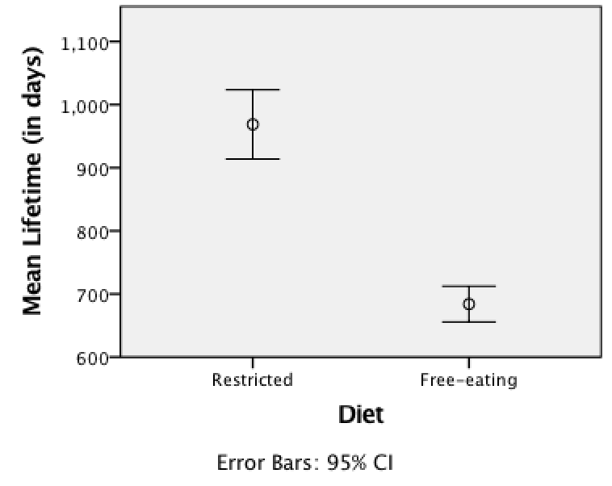
```

```{r Berger1988SummaryHTjamovi1, echo=FALSE, fig.cap="The jamovi output summarising the rat lifetimes data", fig.align="center", fig.align="center", out.width="100%"}
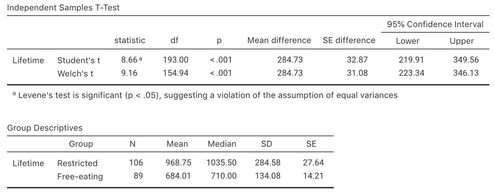
```


```{r RatLifetimesOutputHT, echo=FALSE, fig.cap="The SPSS output summarising the rat lifetimes data", fig.align="center", fig.align="center", out.width="90%"}
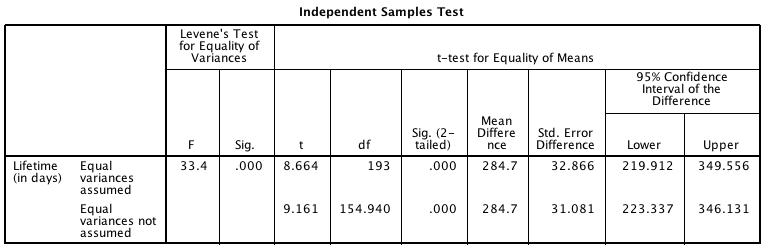
```

8. Make a conclusion, in context.
9. What conditions are necessary for the test to be statistically valid?
10. Is it reasonable to assume these conditions are satisfied?  (You may, or may not, need to refer to Fig. \@ref(fig:SPSSOutputBoxplotsCI).)
11. What if all these rats only came from only 20 litters?

`r if (knitr::is_latex_output()) '<!--'`
<iframe src='https://www.ferendum.com/en/embeded.php?pregunta_ID=458373&sec_digit=1517251076&embeded_digit=7616543' style='width:100%; height:560px; overflow: auto; background: #B3919133;' frameBorder='0'></iframe><BR>
<A href='https://www.ferendum.com' target='_blank'>Free Online Poll Maker</A>
`r if (knitr::is_latex_output()) '-->'`
<!-- Admin link: -->
<!-- https://www.ferendum.com/en/admin.php?pregunta_ID=458373&sec_digit=1517251076&edit_code=840817696 -->


## $P$-values {#PValues}

In a *two-tailed* $t$-test where $n=49$,
what is the approximate $P$-value for the test
if:

1. $t=-2.14$.
2. $t=1.90$.
3. $t=3.15$.
4. $t=-1.20$.
5. $t=-1.59$.
6. $t=6.71$.

(**Hint**: Use the 68--95--99.7 rule.)

How would your answers change if these $t$-scores came from a *one-tailed* test?


`r if (knitr::is_latex_output()) '<!--'`
<iframe src='https://www.ferendum.com/en/embeded.php?pregunta_ID=458374&sec_digit=1695234792&embeded_digit=1183575621' style='width:100%; height:560px; overflow: auto; background: #B3919133;' frameBorder='0'></iframe><BR>
<A href='https://www.ferendum.com' target='_blank'>Free Online Poll Maker</A>
`r if (knitr::is_latex_output()) '-->'`
<!-- Admin link: -->
<!-- https://www.ferendum.com/en/admin.php?pregunta_ID=458374&sec_digit=1695234792&edit_code=97870029 -->


## Tests for paired samples {#TestsPairedImplants}


<!-- Text wrap from: https://stackoverflow.com/questions/43551312/wrap-text-around-plots-in-markdown -->
<!-- Trick from: https://blog.earo.me/2019/10/26/reduce-frictions-rmd/ -->
`r if (knitr::is_latex_output()) '<!--'`
```{r, echo=FALSE, out.width= "35%", out.extra='style="float:right; padding:10px"'}

```
`r if (knitr::is_latex_output()) '-->'`

(This continues from Sect. \@ref(CIImplant).)

A study [@data:Guirao2017:amputees]
examined the 2-minute walk times (2MWT) before and after receiving a 
prosthetic implant.
The 2MWT measures how far participants can walk in two minutes.

The RQ was:

> For this type of amputee,
> is the mean 2MWT **improved** (i.e., longer distances walked)
> after using the implant?


1. Explain why these data should be analysed as a paired situation.
2. Which of the following is the correct null hypothesis for this question?
   **Why** are the others incorrect?
   Is the test one- or two-tailed?
   What is the alternative hypothesis?

    - $\mu_{\text{Without Implant}} = \mu_{\text{With implant}}$
    - $\mu_{\text{Difference}} = 0$
    - $\mu_{\text{Difference}} > 0$
    - $\mu_{\text{Without Implant}} = 0$
    - $\mu_{\text{With implant}} = 0$
    - $\mu_{\text{Without Implant}} < \mu_{\text{With implant}}$
    - $\mu_{\text{Difference}} < 0$
    - $\mu_{\text{Without Implant}} < 0$
    - $\mu_{\text{With implant}} > 0$

3. Explain the *meaning* of the standard error of the mean difference in this context.
4. The data for the ten amputee subjects are shown in Fig. \@ref(fig:Guirao2MWTb).
	 Write down the mean difference, standard deviation of the difference,
   and standard error of the mean differences, using
	 Fig. \@ref(fig:2MWTjamovi) or Fig. \@ref(fig:2MWTSPSS).


```{r Guirao2MWTb, echo=FALSE, fig.cap="Two-minute Walk Times (2MWT) for 10 patients with implants (With Imp) and without implants (Without Imp), in metres", fig.align="center", out.width="70%"}
knitr::include_graphics("ArticleImages/Guirao2017-Table2.png")
```


```{r 2MWTjamovi, echo=FALSE, fig.cap="Output from jamovi for the 2MWT example, partially edited", fig.align="center", out.width="100%"}
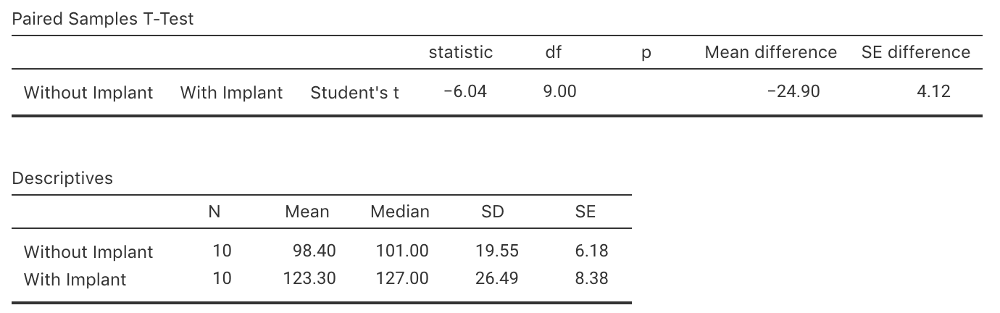
```

```{r 2MWTSPSS, echo=FALSE, fig.cap="Output from SPSS for the 2MWT example, partially edited", fig.align="center", out.width="95%"}
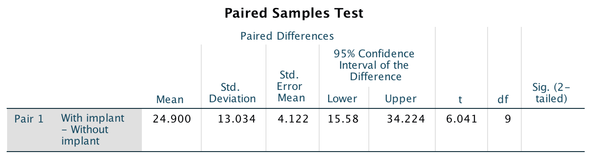
```


5. Write down the value of the $t$-statistic,
   then estimate the $P$-value for testing the hypotheses.  
   
   Explain why the $t$-scores from jamovi and SPSS have different signs
   (in jamovi: negative value; in SPSS: positive value).
6. Write a statement that communicates the result of the test.
7. What conditions must be met for this test to be valid?
8. Is it reasonable to assume the assumptions are satisfied?
   Use the histogram of the data  in Fig. \@ref(fig:2MWTHisto) to help.

```{r 2MWTHisto, echo=FALSE, fig.cap="Histogram of differences for the increases in 2MWT with implant", fig.align="center", out.width="40%"}
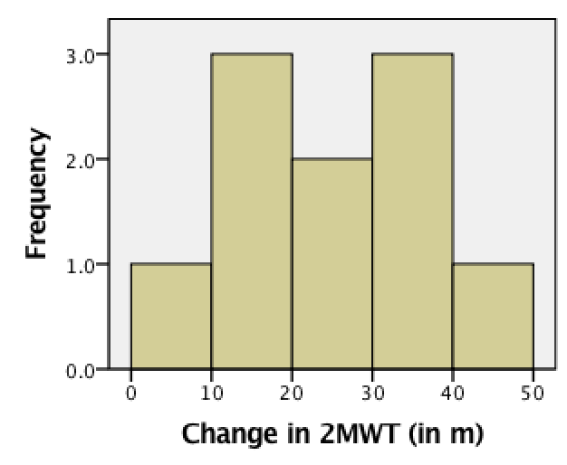
```


## Matching RQs and hypotheses {#MatchRQHypothesis}


<!-- Text wrap from: https://stackoverflow.com/questions/43551312/wrap-text-around-plots-in-markdown -->
<!-- Trick from: https://blog.earo.me/2019/10/26/reduce-frictions-rmd/ -->
`r if (knitr::is_latex_output()) '<!--'`
```{r, echo=FALSE, out.width= "30%", out.extra='style="float:right; padding:10px"'}
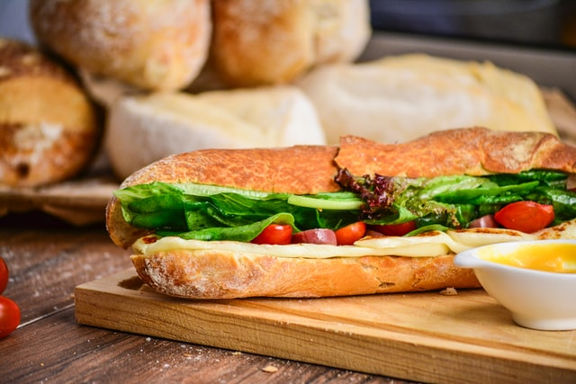
```
`r if (knitr::is_latex_output()) '-->'`


`r if (knitr::is_html_output()) 'Match the RQs with the appropriate *null hypothesis* (where the symbols are defined as expected).'`

<iframe src="https://usc.h5p.com/content/1291042384744155759/embed" width="1088" height="637" frameborder="0" allowfullscreen="allowfullscreen" allow="geolocation *; microphone *; camera *; midi *; encrypted-media *"></iframe><script src="https://usc.h5p.com/js/h5p-resizer.js" charset="UTF-8"></script>


`r if (knitr::is_html_output()) 'Now, match the RQs with the appropriate *alternative hypothesis* (where the symbols are defined as expected).'`

<iframe src="https://usc.h5p.com/content/1291042402737889249/embed" width="900" height="600" frameborder="0" allowfullscreen="allowfullscreen" allow="geolocation *; microphone *; camera *; midi *; encrypted-media *"></iframe><script src="https://usc.h5p.com/js/h5p-resizer.js" charset="UTF-8"></script>


```{r, child = if (knitr::is_latex_output()) './children/TutorialQns/Lect9-Q4.Rmd'}
```


<!-- ```{r echo=FALSE} -->
<!-- SubwayHyp <- array( NA, dim=c(11, 2)) -->

<!-- SubwayHyp[1, ] <- c("1. At Subway, is the mean length of a 12-inch sub really 12 inches?", -->
<!--                     "A. $p_\\textrm{white} = p_\\textrm{wholemeal}$") -->
<!-- SubwayHyp[2, ] <- c("2. At Subway, is the mean length of a 12-inch sub different for white and wholemeal subs?", -->
<!--                     "B. $\\mu_\\textrm{white} = \\mu_\\textrm{wholemeal}$") -->
<!-- SubwayHyp[3, ] <- c("3. At Subway, is the proportion of 12-inch subs that are shorter than 12 inches different for white and wholemeal subs?", -->
<!--                     "C. $\\mu_\\textrm{white} = \\mu_\\textrm{wholemeal} = 12$") -->
<!-- SubwayHyp[4, ] <- c("4. At Subway, is the mean length of a 12-inch sub longer for white and  wholemeal subs?", -->
<!--                     "D. $\\bar{x}_\\textrm{white} = \\bar{x}_\\textrm{wholemeal}$") -->
<!-- SubwayHyp[5, ] <- c("", -->
<!--                     "E. $\\bar{x}_\\textrm{white} = \\bar{x}_\\textrm{wholemeal} = 12$") -->
<!-- SubwayHyp[6, ] <- c("", -->
<!--                     "F. $\\mu = 12$") -->
<!-- SubwayHyp[7, ] <- c("", -->
<!--                     "G. $\\mu_\\textrm{white} \\ne \\mu_\\textrm{wholmeal}$") -->
<!-- SubwayHyp[8, ] <- c("", -->
<!--                     "H. $p_\\textrm{white} = p_\\textrm{wholemeal} \\le 12$") -->
<!-- SubwayHyp[9, ] <- c("", -->
<!--                     "I. $\\mu \\ne 12$") -->
<!-- SubwayHyp[10, ] <- c("", -->
<!--                      "J. $p_\\textrm{white} = p_\\textrm{wholemeal} = 12$") -->
<!-- SubwayHyp[11, ] <- c("", -->
<!--                      "K. $\\bar{x} \\ne 12$") -->

<!-- kable(SubwayHyp, -->
<!--       align=c("r", "l"), -->
<!--       escape=FALSE, -->
<!--       linesep="\\addlinespace", -->
<!--      booktabs=TRUE) %>% -->
<!--   column_spec(1, width="0.6\\\\textwidth") %>% -->
<!--   column_spec(2, width="0.35\\\\textwidth") -->
<!-- #  column_spec(2, width="1cm") %>% -->
<!-- #  column_spec(1, width="0.8\\textwidth") %>% -->
<!-- #  column_spec(2, width="0.2\\textwidth") %>% -->
<!-- #  kable_styling(full_width=TRUE) -->
<!-- ``` -->


## Tests for ORs {#TestsForORs}


<!-- Text wrap from: https://stackoverflow.com/questions/43551312/wrap-text-around-plots-in-markdown -->
<!-- Trick from: https://blog.earo.me/2019/10/26/reduce-frictions-rmd/ -->
`r if (knitr::is_latex_output()) '<!--'`
```{r, echo=FALSE, out.width= "35%", out.extra='style="float:right; padding:10px"'}
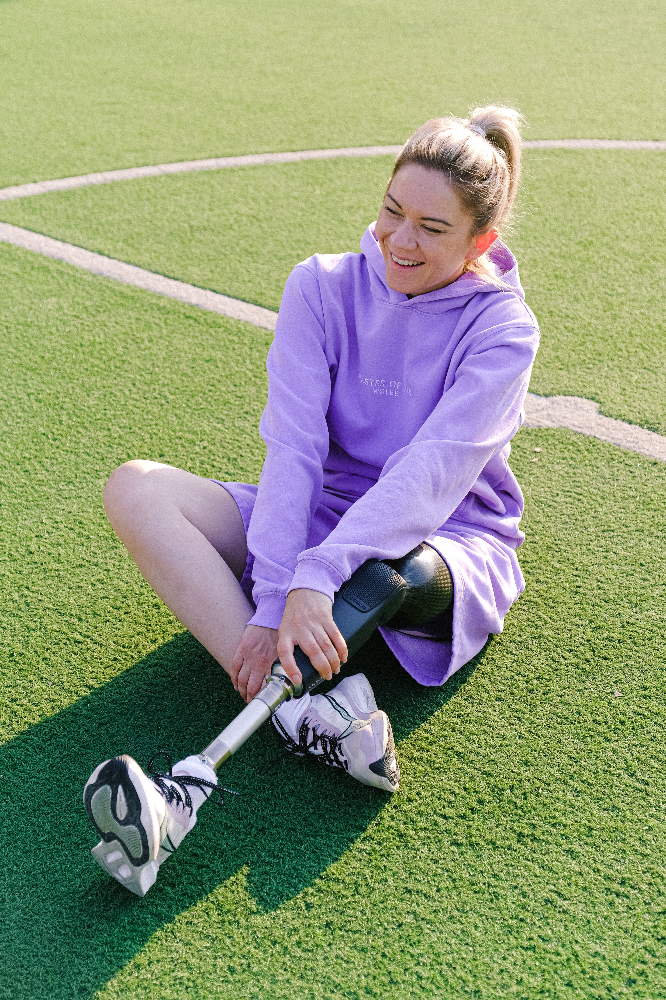
```
`r if (knitr::is_latex_output()) '-->'`


A study examined the mortality rates of lower-limb amputation,
and factors that may be associated with mortality [@data:Singh:lowerlimb].

As part of the study,
the researchers recorded the five-year mortality rate (the number of amputees who died within five years of amputation)
and whether or not the person used an artificial limb.

The RQ was:

> For this type of amputees,
> is the odds of being alive after five years the same for
> those who used an artificial limb, and those who did not?

A total of 105 subjects were used:
35 died within five years, and 70 were still alive after five years.

In addition,
65 subjects used an artificial limb,
and 40 did not.
	
1. After five years, 49 people using an artificial limb were alive.  

   Construct the $2\times 2$ table (Table \@ref(tab:ArtLimbMortality))
   displaying the number of people alive or dead after five years (in columns, say)
   and whether or not they used an artificial limb or not (in rows).

```{r echo=FALSE, ArtLimbMortality}
ArtLimb <- array( "", dim=c(3, 3) )
colnames(ArtLimb) <- c("Alive", "Dead", "Total")
rownames(ArtLimb) <- c("Used artificial limb", "Did not use artificial limb", "Total")

ArtLimb[3,3] <- "105"
   
if( knitr::is_latex_output() ) {
   kable(ArtLimb,
        format="latex",
        longtable=FALSE,
        booktabs=TRUE,
       # escape=FALSE, # For latex to work in \rightarrow
       linesep = "\\addlinespace", # Add a bit of space between all rows. 
       caption="Five-year mortality for artifical limb users",
        align="r")   %>%
   kable_styling(full_width=FALSE, font_size=10) %>%
  row_spec(0, bold=TRUE)  %>%
  row_spec(3, bold=TRUE) #%>% # Columns headings in bold
#   column_spec(column=1, width="3cm") %>% 
#   column_spec(column=2, width="5cm") %>%
#   column_spec(column=3, width="5cm") %>%
#   column_spec(column=4, width="2cm")
}

if( knitr::is_html_output() ) {
  ArtLimb[1,3] <- webex::fitb(num=TRUE, tol=0.001, width=6, answer=65 )
  ArtLimb[2,3] <- webex::fitb(num=TRUE, tol=0.001, width=6, answer=40 )
  ArtLimb[3,1] <- webex::fitb(num=TRUE, tol=0.001, width=6, answer=70 )
  ArtLimb[3,2] <- webex::fitb(num=TRUE, tol=0.001, width=6, answer=35 )

  ArtLimb[1,1] <- webex::fitb(num=TRUE, tol=0.001, width=6, answer=49)
  ArtLimb[2,1] <- webex::fitb(num=TRUE, tol=0.001, width=6, answer=21)
  ArtLimb[1,2] <- webex::fitb(num=TRUE, tol=0.001, width=6, answer=16)
  ArtLimb[2,2] <- webex::fitb(num=TRUE, tol=0.001, width=6, answer=19)
  
  kable(ArtLimb,
        format="html",
        align="r",
        escape=FALSE,
        longtable=FALSE,
       caption="Five-year mortality for artifical limb users",
      booktabs=TRUE) %>%
  row_spec(3, bold=TRUE)
   #row_spec(row=1, bold=TRUE) %>%
#   column_spec(column=1, bold=TRUE)
   
}

```

2. For a person using an artificial limb, compute the odds of being alive after five years.  

   For a person *not* using an artificial limb, compute the odds of being alive after five years.  
   
   Then compute the odds ratio,
   complete Table \@ref(tab:ArtLimbSummary),
   and carefully explain what the OR means.
3. Write down the 95% CI for the population OR using the software output
	 (jamovi: Fig. \@ref(fig:limbsOutputjamovi);
	 SPSS: Fig. \@ref(fig:limbsOutput)). 
4. Perform a hypothesis test to compare the odds of being alive after five years for both groups
   (jamovi: Fig. \@ref(fig:limbsOutputjamovi);
	 SPSS: Fig. \@ref(fig:limbsOutput)):

    a. Write the hypotheses.
    b. Write down the value of $\chi^2$.
    c. What $z$-score is this approximately equivalent to?
    d. What is the approximate $P$-value using the 68--95--99.7 rule?
    e. What is the exact $P$-value as reported by software?
    f. Write a conclusion.


```{r echo=FALSE, ArtLimbSummary}
ArtLimbSumm <- array( "", dim=c(3, 3) )
colnames(ArtLimbSumm) <- c("after 5 years", "after 5 years", "size") # Rest of table headers added using  add_header_above
rownames(ArtLimbSumm) <- c("Use artificial limb", "Did not use artifical limb", "Odds ratio")

ArtLimbSumm[3,3] <- "626"
   
if( knitr::is_latex_output() ) {

   kable(ArtLimbSumm,
        format="latex",
        longtable=FALSE,
        booktabs=TRUE,
       # escape=FALSE, # For latex to work in \rightarrow
       linesep = "\\addlinespace", # Add a bit of space between all rows. 
       caption="Five-year mortality and use of an artificial limb: Numerical summary",
        align=c("r", "r", "r", "r"))   %>%
   kable_styling(full_width=FALSE, font_size=10) %>%
  row_spec(0, bold=TRUE) %>% # Columns headings in bold
  add_header_above( c( " " = 1, "Percentage alive" = 1, "Odds of being alive" = 1, "Sample" = 1), 
                    bold = TRUE, 
                    line = FALSE,
                    align = "r")
#   column_spec(column=1, width="3cm") %>% 
#   column_spec(column=2, width="5cm") %>%
#   column_spec(column=3, width="5cm") %>%
#   column_spec(column=4, width="2cm")
}

if( knitr::is_html_output() ) {
  ArtLimbSumm[3,1] <- ""
  ArtLimbSumm[3,3] <- ""
  
  ArtLimbSumm[1,3] <- webex::fitb(num=TRUE, tol=0.1, width=6, answer=65 )
  ArtLimbSumm[2,3] <- webex::fitb(num=TRUE, tol=0.1, width=6, answer=40 )
  
  ArtLimbSumm[1,1] <- webex::fitb(num=TRUE, tol=0.1, width=6, answer=round(49/65*100, 1) )
  ArtLimbSumm[2,1] <- webex::fitb(num=TRUE, tol=0.1, width=6, answer=round(21/40*100, 1) )

  ArtLimbSumm[1,2] <- webex::fitb(num=TRUE, tol=0.1, width=6, answer=round(49/16, 2) )
  ArtLimbSumm[2,2] <- webex::fitb(num=TRUE, tol=0.1, width=6, answer=round(21/19, 2) )

  ArtLimbSumm[3,2] <- webex::fitb(num=TRUE, tol=0.005, width=6, answer=2.771 )

  kable(ArtLimbSumm,
        format="html",
        align=c("r", "r", "r"),
        escape=FALSE,
        longtable=FALSE,
       caption="Five-year mortality and use of an artificial limb: Numerical summary",
      booktabs=TRUE) %>%
  add_header_above( c( " " = 1, "Percentage alive" = 1, "Odds of being alive" = 1, "Sample" = 1), 
                    bold = TRUE, 
                    line = FALSE,
                    align = "r") 
   #row_spec(row=1, bold=TRUE) %>%
#   column_spec(column=1, bold=TRUE)
   
}

```


```{r echo=FALSE, limbsOutputjamovi, fig.cap="The jamovi output for the question on lower-limb amputees", fig.align="center", out.width="50%"}
knitr::include_graphics("SoftwareImages/Singh2016-ChiSq-jamovi.png")
```


```{r echo=FALSE, limbsOutput, fig.show="hold", fig.cap="The SPSS output for the question on lower-limb amputees", fig.align="center", out.width=c("75%", "65%")}
knitr::include_graphics( c("SoftwareImages/Singh2016-ChiSq-SPSS.png",
                           "SoftwareImages/Singh2016-SPSS-CI.png") )
```


	

## Hypothesis test for the ruler-drop {#PlanStudy8}

Your tutor *may* decide to do this activity.

      
      
	
	


## **Optional**: $P$-values {#PvalueStatement}

*(Answers available in Sect. \@ref(Lecture9Answers))*

An ecologist is studying two different grasses to help combat soil salinity,
by comparing to a new grass (Grass A) to a native grass (Grass B).

She uses 50 different sites, 
allocating the two grasses at random to the sites (25 sites for each grass).

After 12 months,
the ecologist records whether the soil salinity at each site has improved,
and hence computes the *odds* that each grass will improve the salinity.
   
She finds a statistically significant difference between the odds in the two groups.

Which of these statements is *consistent* with this conclusion?

1. The $\text{OR}=4.1$ and $P=0.36$  
   `r if( knitr::is_html_output() ) {webex::mcq(
    c(         "Consistent with conclusion",
      answer = "NOT consistent with conclusion"))}`
2. The $\text{OR}=4.1$ and $P=0.0001$  
   `r if( knitr::is_html_output() ) {webex::mcq(
    c(answer = "Consistent with conclusion",
               "NOT consistent with conclusion"))}`
3. The $\text{OR}=0.91$ and $P=0.36$  
   `r if( knitr::is_html_output() ) {webex::mcq(
    c(         "Consistent with conclusion",
      answer = "NOT consistent with conclusion"))}`
4. The $\text{OR}=0.91$ and $P=0.0001$  
   `r if( knitr::is_html_output() ) {webex::mcq(
    c(answer = "Consistent with conclusion",
               "NOT consistent with conclusion"))}`
   
How would the other statements be interpreted then?


## **Optional**: Two-way tables {#TablesHepC}

*(Answers available in Sect. \@ref(Lecture9Answers))*

Applying tattoos carries health risks as the skin is broken during application.
An American study examined if a relationship existed between
having hepatitis C and having tattoos [@data:Haley2001:Tattoos].

To study this,
626 people were interviewed as part of an observational study,
and asked about two issues:
Whether they had hepatitis C (47 people) or not (579 people); 
and if they had a tattoo (113 people), or no tattoos (513 people).


1. Which **one** of these five sets of hypotheses is *not* valid for this situation? Why?

    a. $H_0$: No association between having hepatitis C and having a tattoo *in the population*;  
      $H_1$:  An association between having hepatitis C and having a tattoo *in the population*.
    b. $H_0$: The odds of having hepatitis C is the same with or without a tattoo *in the population*;  
      $H_1$:  The odds of having hepatitis C is *not* the same with or without a tattoo *in the population*.
    c. $H_0$: The mean number of people having hepatitis C is the same for those with and without a tattoo *in the population*;  
      $H_1$:  The mean number of people having hepatitis C is *not* the same for those with and without a tattoo *in the population*.
    d. $H_0$: The odds ratio of having hepatitis C, comparing those with or without a tattoo, is one *in the population*;  
      $H_1$:  The odds ratio of having hepatitis C, comparing those with or without a tattoo, is *not* one *in the population*.
    e. $H_0$: The proportion having hepatitis C is the same with or without a tattoo *in the population*;  
      $H_1$:  The proportion having hepatitis C is *not* the same with or without a tattoo *in the population*.

2. Compute the percentage of people overall in the sample with a tattoo.
3. Assuming the null hypothesis about the population is true,
	compute the number of people in the sample *with* hepatitis C that you would *expect* 
	have a tattoo.
	Use the information above to answer the question.
4. In the sample,
   25 people had Hep. C *and* a tattoo.
   Use this information to create the two-way table summarising the data (Table \@ref(tab:TattHepTab)).

```{r echo=FALSE, TattHepTab}
TattHep <- array( "", dim=c(3, 3) )
colnames(TattHep) <- c("Had Hep. C", "Did not have Hep. C", "Total")
rownames(TattHep) <- c("Had tattoo", "Did not have tattoo", "Total")

TattHep[3,3] <- "626"
   
if( knitr::is_latex_output() ) {
   kable(TattHep,
        format="latex",
        longtable=FALSE,
        booktabs=TRUE,
       # escape=FALSE, # For latex to work in \rightarrow
       linesep = "\\addlinespace", # Add a bit of space between all rows. 
       caption="Five-year mortality for artifical limb users",
        align=c("r", "r", "r", "r"))   %>%
   kable_styling(full_width=FALSE, font_size=10) %>%
  row_spec(0, bold=TRUE) %>% # Columns headings in bold
  row_spec(3, bold=TRUE) 
#   column_spec(column=1, width="3cm") %>% 
#   column_spec(column=2, width="5cm") %>%
#   column_spec(column=3, width="5cm") %>%
#   column_spec(column=4, width="2cm")
}

if( knitr::is_html_output() ) {
  TattHep[1,3] <- webex::fitb(num=TRUE, tol=0.001, width=6, answer=113 )
  TattHep[2,3] <- webex::fitb(num=TRUE, tol=0.001, width=6, answer=513 )
  TattHep[3,1] <- webex::fitb(num=TRUE, tol=0.001, width=6, answer=47 )
  TattHep[3,2] <- webex::fitb(num=TRUE, tol=0.001, width=6, answer=579 )

  TattHep[1,1] <- webex::fitb(num=TRUE, tol=0.001, width=6, answer=25)
  TattHep[2,1] <- webex::fitb(num=TRUE, tol=0.001, width=6, answer=22)
  TattHep[1,2] <- webex::fitb(num=TRUE, tol=0.001, width=6, answer=88)
  TattHep[2,2] <- webex::fitb(num=TRUE, tol=0.001, width=6, answer=491)
  
  kable(TattHep,
        format="html",
        align=c("r", "r", "r"),
        escape=FALSE,
        longtable=FALSE,
       caption="Five-year mortality for artifical limb users",
      booktabs=TRUE) # %>%
   #row_spec(row=1, bold=TRUE) %>%
#   column_spec(column=1, bold=TRUE)
   
}

```


5. In the sample,
	 what are the odds that someone has Hep. C,
	 among those with a tattoo?
6. In the sample,
   what are the odds that someone has Hep. C,
	 among those *without* a tattoo?
7. From the sample information,
   compute the odds ratio of having Hep. C, comparing students with a tattoo to those without a tattoo.
   Carefully explain what this value means.


## **Optional**: Identify the correct analyses {#IdentifyCorrectAnalyses}

`r if (knitr::is_latex_output()) {
   '*(Answers are available in Sect.\\@ref(Lecture9Answers))*'
}`

```{r, child = if (knitr::is_latex_output()) './children/TutorialQns/Lect9-Q8.Rmd'}
```

<iframe src="https://usc.h5p.com/content/1290972415580046319/embed" width="1088" height="511" frameborder="0" allowfullscreen="allowfullscreen" allow="geolocation *; microphone *; camera *; midi *; encrypted-media *"></iframe><script src="https://usc.h5p.com/js/h5p-resizer.js" charset="UTF-8"></script>


## **Optional**: Comparing two independent means {#TwoMeansHurricanes}

*(Answers available in Sect. \@ref(Lecture9Answers))*

A study compared the number of deaths
reported from hurricanes with male and female names [@data:Smith2016:hurricanes].

One of the tables in the paper is shown in
Fig. \@ref(fig:Smith2016hurricanes).
Explain in everyday language what this means.
	
	
```{r Smith2016hurricanes, echo=FALSE, fig.cap="Table 4 from Smith (2016)", fig.align="center", out.width="80%"}
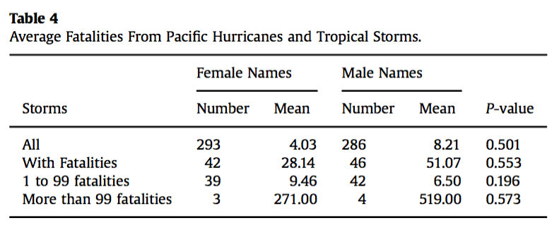
```


## **Optional**: Assumptions {#AssumptionsGraphs}


```{r, child = if (knitr::is_latex_output()) './children/TutorialQns/Lect9-Q10.Rmd'}
```

<iframe src="https://usc.h5p.com/content/1290972425279403419/embed" width="1088" height="637" frameborder="0" allowfullscreen="allowfullscreen" allow="geolocation *; microphone *; camera *; midi *; encrypted-media *"></iframe><script src="https://usc.h5p.com/js/h5p-resizer.js" charset="UTF-8"></script>


## **Optional**: Tests for comparing the mean from two independent samples {#TwoMeansBatteriesHT}

*(Answers available in Sect. \@ref(Lecture9Answers))*
	
```{block2, type = "rmdVideoSolution"}
This question has a video solution in the online book, so you can hear and see the solution.
```


Batteries are expensive,
so comparing the performance of expensive and cheap batteries is helpful.

A test on the lifetime of batteries [@data:ALDIBatteryTesting]
compared the time for two brands of 1.5 volt batteries to reduce their voltage to 1.0 volts under standard testing conditions.

The times (in hours) for nine Energizer Max batteries and 
nine ALDI brand batteries (Ultracell)
are shown in Table \@ref(tab:BattTableHT).

```{r BattTableHT, echo=FALSE}
BattTab <- array( "", dim=c(2, 9))

BattTab[1, ] <- c(7.58, 7.46, 7.46, 7.59, 7.46, 7.52, 6.83, 6.89, 7.45)
BattTab[2, ] <- c(7.50, 7.48, 7.47, 7.48, 7.48, 7.41, 7.47, 6.96, 7.48)

rownames(BattTab) <- c("Energizer", "Ultracell")

if( knitr::is_latex_output() ) {
  kable(BattTab,
      format="latex",
      booktabs=TRUE,
      caption="The times taken for batteries to go from 1.5 volts to 1.0 volts, in hours)") %>%
  column_spec(1, bold=TRUE)
}
if( knitr::is_html_output() ) {
  kable(BattTab,
      format="html",
      booktabs=TRUE,
      caption="The times taken for batteries to go from 1.5 volts to 1.0 volts, in hours)") %>%
  column_spec(1, bold=TRUE)
}
```


1. Write the hypotheses for testing the research question of interest. Is the test one- or two-tailed?
2. Explain the meaning of the standard error of the mean in this context.
3. The software output for the analysis is shown in
   Fig. \@ref(fig:ALDIBatteriesTwoSampleTjamovi) (jamovi)
   and
   Fig. \@ref(fig:ALDIBatteriesTwoSampleTSPSS) (SPSS).
   Determine the value of the $t$-statistic and the $P$-value for testing the hypotheses.
4. Write a statement that communicates the result of the test.
5. What conditions must be met for this test to be valid?
6. Is it reasonable to assume the assumptions are satisfied? 
7. What did you learn from this study?  

   At the time of this analysis,
   a four-pack of the Ultracell Max batteries cost $2.49 from ALDI online, 
   while a four pack of Energizer Max from Woolworths online cost $5.97 on special 
   (usually $8.01)^[Data from 05 September 2012.].  
   
   On the basis of this information,
   would you be prepared to try the Ultracell batteries?
   Explain your reasoning.
   

```{r ALDIBatteriesTwoSampleTjamovi, echo=FALSE, fig.cap="Output from jamovi for the battery data", fig.align="center", out.width="100%"}
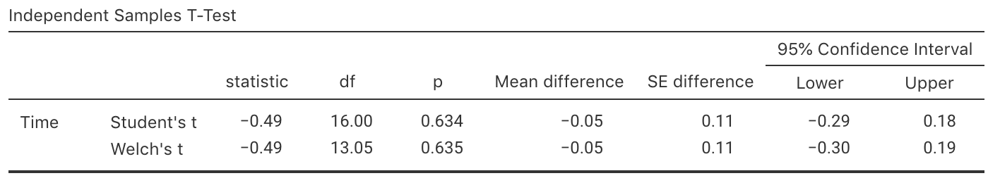
```

```{r ALDIBatteriesTwoSampleTSPSS, echo=FALSE, fig.cap="Output from SPSS for the battery data", fig.align="center", out.width="100%"}
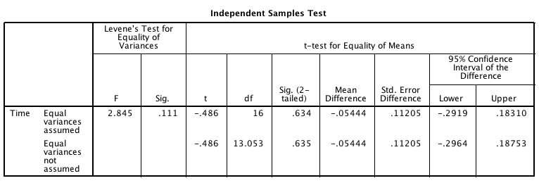
```


## **Optional**: Tests for ORs {#ORTestsByss}

*(Answers available in Sect. \@ref(Lecture9Answers))*

A study [@data:higgins:cotton] studied byssinosis
(a respiratory complaint) among workers in the textile industry.

The researchers were interested,
among other things, in exploring the relationship between smoking status and
the presence of byssinosis.

More specifically, they wanted to see if the proportion of smokers with byssinosis
was *greater* than
the proportion of non-smokers with byssinosis,
among all textile workers.

The researchers used an observational study.

1. Which one of these is correct as a null hypothesis? Why are the others incorrect?

    a. The odds of having byssinosis is the same in the sample of smokers and the sample of non-smokers.
    b. The mean number of workers having byssinosis is the same for smokers and non-smokers.
    c. The population odds of having byssinosis is the same in among smokers and non-smokers.

2. Among those randomly selected to appear in the study,
   165 workers had byssinosis 
   (40 were non-smokers)
   and 5254 did not
   (2190 were non-smokers).  
   
   Construct the two-way table showing the number of workers 
   with byssinosis among smokers and non-smokers.
3. Compute the sample *proportion* of workers with byssinosis,
   among smokers.
   Then,
   compute the sample *proportion* of workers with byssinosis, among non-smokers.
4. Compute the odds of having byssinosis, among *smokers*.
   Then compute the odds of having byssinosis, among *non-smokers*.
   What do these odds mean?
5. Compute the odds ratio comparing smokers to non-smokers.
   What does this odds ratio mean?
6. A report states that the odds ratio is not one
   simply due to sampling variation,
   and not due to smoking.  
   
   Do you agree or disagree?
   Why?
7. Use the software output in 
   Fig. \@ref(fig:ByssOutputjamovi) (jamovi) 
   or
   Fig. \@ref(fig:ByssOutputSPSS1) and  Fig. \@ref(fig:ByssOutputSPSS2) (SPSS),
   to test the hypotheses.
   Write a proper conclusion to communicate the results.
8. Are the results likely to be statistically valid? Explain.


```{r ByssOutputjamovi, echo=FALSE, fig.cap="Output from jamovi for the byssinosis example", fig.align="center", out.width="50%"}
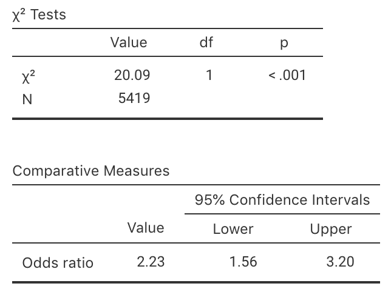
```


```{r ByssOutputSPSS1, echo=FALSE, fig.cap="Output from SPSS for the byssinosis example", fig.align="center", out.width="80%"}
include_graphics("SoftwareImages/ByssChisq.png")
```

```{r ByssOutputSPSS2, echo=FALSE, fig.cap="More output from SPSS for the byssinosis example", fig.align="center", out.width="65%"}
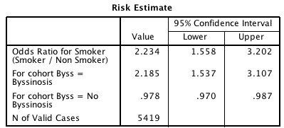
```


## **Optional**: Tests for ORs {#ORAirways}

*(Answers available in Sect. \@ref(Lecture9Answers))*
	
```{block2, type = "rmdVideoSolution"}
This question has a video solution in the online book, so you can hear and see the solution.
```

	
A study [@data:Tanagawa:AirwayDevices]
examined the choice
of airway devices used for nontraumatic, 
out-of-hospital cardiac arrest patients,
to evaluate the success and failure of insertion for various devices.

The data for success and failure at insertion is given in Table \@ref(tab:AirwayTab),
taken from available patient documentation.

```{r AirwayTab, echo=FALSE}
AirwayTab <- array( dim=c(2, 2))

colnames(AirwayTab) <- c("Succeed", "Fail" )
rownames(AirwayTab) <- c("Esophageal gastric tube airway (EGTA)",
                         "Laryngeal mask (LM)")

AirwayTab[1, ] <- c(545,   49)
AirwayTab[2, ] <- c(2701, 315)

if( knitr::is_latex_output() ) {
  kable(AirwayTab,
      format="latex",
      booktabs=TRUE,
      caption="Data from the airways study") %>%
  row_spec(0, bold=TRUE) %>%
  column_spec(1, bold=TRUE)
}
if( knitr::is_html_output() ) {
  kable(AirwayTab,
      format="html",
      booktabs=TRUE,
      caption="Data from the airways study") %>%
  row_spec(0, bold=TRUE) %>%
  column_spec(1, bold=TRUE)
}

```

1. Define $p$ as the population proportion of successful attempts at insertion.
   Write the hypotheses to be tested.
2. Use the software output in 
   Fig. \@ref(fig:Tanagawa1998jamoviCrossTabs) (jamovi)
   or
   Fig. \@ref(fig:Tanagawa1998SPSSCrossTabs) (SPSS)
   to test the hypotheses.
   Write a proper conclusion to communicate the results.
3. Are the results likely to be statistically valid? Explain.
4. The study was designed to enable medics to choose the best airway device.  

   Would you recommend EGTA or LM?
   Why?
   Would you like any more information before making your choice?
   Explain.


```{r Tanagawa1998jamoviCrossTabs, echo=FALSE, fig.cap="The jamovi output for the table from Tanagawa and Shigematsu (1998)", fig.align="center", out.width="55%"}
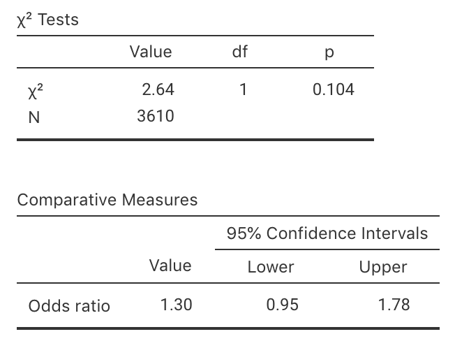
```


```{r Tanagawa1998SPSSCrossTabs, echo=FALSE, fig.cap="The SPSS output for the table from Tanagawa and Shigematsu (1998)", fig.align="center", out.width="80%"}
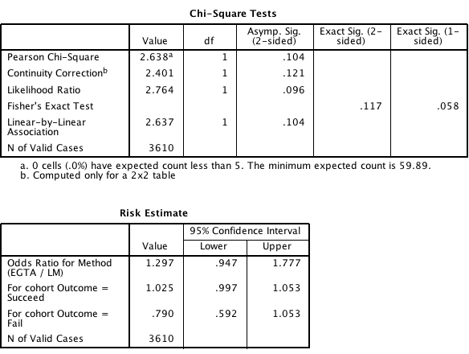
```


## **Optional**: Tests for paired samples {#PairedTestRunners}

*(Answers available in Sect. \@ref(Lecture9Answers))*

	```{block2, type = "rmdVideoSolution"}
This question has a video solution in the online book, so you can hear and see the solution.
```


After a number of runners collapsed near the finish of the Tyneside annual Great North Run,
researchers decided to study the role of $\beta$ endorphins as a factor in the collapses.
($\beta$ endorphins are a peptide which suppress pain.) 

A study [@data:Dale:FunRun]
examined what happened with plasma $\beta$ endorphins during fun runs:
does the concentration of plasma $\beta$ endorphins *increase*, on average,
during fun runs.

The researchers recorded the plasma $\beta$ concentrations in fun runners
(participating in the Tyneside Great North Run).
Eleven runners (who did not collapse) had their plasma $\beta$ concentrations measured
(in pmol/litre)
before and after the race (Table \@ref(tab:RunnerTabHT).)
A 'typical' value for $\beta$ endorphines is usually under about 11 pmol/litre. 
 
1. Explain why these data should be analysed as a paired means situation.
2. Which of the following is the correct null hypothesis for this question? **Why** are the others incorrect?
   Is the test one- or two-tailed?

    a. $\mu_{\text{Before}} = \mu_{\text{After}}$
    b. $\mu_{\text{Difference}} = 0$
    c. $\mu_{\text{Before}} = 0$
    d. $\mu_{\text{After}} = 0$
    e. $\mu_{\text{Before}} < \mu_{\text{After}}$
    f. $\mu_{\text{Difference}} > 0$
    g. $\mu_{\text{Before}} < 0$
    h. $\mu_{\text{After}} > 0$

3. Write down the mean, standard deviation
   and standard error,
   using
   Fig. \@ref(fig:FunRunjamovi) (jamovi)
   or
   Fig. \@ref(fig:FunRunSPSS) (SPSS).
4. Write down the value of the $t$-statistic, then estimate the $P$-value (using the 68--95--99.7 rule).
5. Write a statement that communicates the result of the test.
6. What conditions must be met for this test to be valid?
7. Is it reasonable to assume the assumptions are satisfied? 
   Use the histogram of the data  in Fig. \@ref(fig:FunRunSPSSHisto) to help, if necessary.


```{r RunnerTabHT, echo=FALSE}
RunnerTab <- array( dim=c(11, 3))

RunnerTab[, 1] <- c(4.3, 4.6, 5.2, 5.2, 6.6, 7.2, 8.4, 9.0, 10.4, 14.0, 17.8)
RunnerTab[, 2] <- c(29.6, 25.1, 15.5, 29.6, 24.1, 37.8, 20.1, 21.9, 14.2, 34.6, 46.2)
RunnerTab[, 3] <- RunnerTab[, 2] - RunnerTab[, 1]

colnames(RunnerTab) <- c("Before", "After", "Difference")


if( knitr::is_latex_output() ) {
  kable(RunnerTab,
      format="latex",
      booktabs=TRUE,
      linesep=c("","","\\addlinespace", "", "", "", "\\addlinespace", "", "", ""),
      caption="Plasma-beta concentration for runners, before and after the race") %>%
  row_spec(0, bold=TRUE)
}
if( knitr::is_html_output() ) {
  kable(RunnerTab,
      format="html",
      booktabs=TRUE,
      linesep=c("","","\\addlinespace", "", "", "", "\\addlinespace", "", "", ""),
      caption="Plasma-beta concentration for runners, before and after the race") %>%
  row_spec(0, bold=TRUE)
}

```


```{r FunRunjamovi, echo=FALSE, fig.cap="Output from jamovi for the fun run example, partially edited", fig.align="center", out.width="100%"}
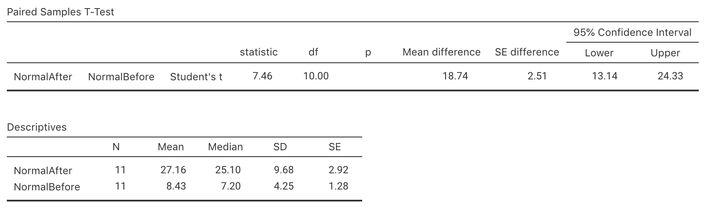
```

```{r FunRunSPSS, echo=FALSE, fig.cap="Output from SPSS for the fun run example, partially edited", fig.align="center", out.width="90%"}
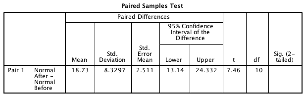
```

```{r FunRunSPSSHisto, echo=FALSE, fig.cap="Histogram of differences for the fun run example", fig.align="center", out.width="40%"}
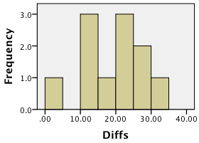
```


