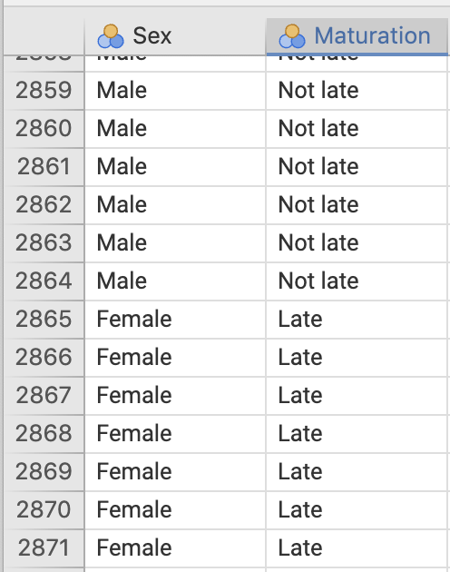

# Teaching Week 10: tutorial  {#Lecture10}

::: {.objectivesBox .objectives data-latex="{iconmonstr-target-4-240.png}"}
**Topics** covered in this tutorial:

* Tests for ORs.
* Estimating sample sizes for finding CIs.
* Selecting an analysis.
:::


::: {.readBox .read data-latex="{iconmonstr-school-15-240.png}"}
You will learn and practice the content associated with these chapters of the [textbook](https://bookdown.org/pkaldunn/SRM-Textbook/):

* [Chapter\ 31 (CIs and tests: comparing two odds or proportions)](https://bookdown.org/pkaldunn/SRM-Textbook/AnalysisOddsRatio.html)
* [Chapter\ 32 (Finding sample sizes for CIs)](https://bookdown.org/pkaldunn/SRM-Textbook/EstimatingSampleSize.html)
* [Chapter\ 34 (Selecting an analysis)](https://bookdown.org/pkaldunn/SRM-Textbook/SelectTest.html)

Take careful note of which chapters are covered in this tutorial!
:::


::: {.tipBox .tip data-latex="{iconmonstr-info-6-240.png}"}
Some of this week's content may be needed for your Task\ 2B.
:::


## Quick revision {#QuickRevision-Tutorial10}

::: {.preClassBox .preClass data-latex="{iconmonstr-home-7-240.png}"}
We **strongly** recommend trying these *Quick revision* questions **before** your tutorial.
:::


::: {.webex-check .webex-box}
An ecologist is studying two different grasses to help combat soil salinity, by comparing to a new grass (Grass\ A) to a native grass (Grass\ B).
She uses $50$\ different sites, allocating the two grasses at random to the sites ($25$\ sites for each grass).

After $12$\ months, the ecologist records whether the soil salinity at each site has improved, and hence computes the *odds* that each grass will improve the salinity.
She finds a statistically significant difference between the odds in the two groups.
Which of these statements is *consistent* with this conclusion?

1. The $\text{OR} = 4.1$ and $P = 0.36$. \tightlist 
   `r if( knitr::is_html_output() ) {webexercises::longmcq(
    c(         "Consistent with conclusion",
      answer = "NOT consistent with conclusion"))}`
2. The $\text{OR} = 4.1$ and $P = 0.0001$.  
   `r if( knitr::is_html_output() ) {webexercises::longmcq(
    c(answer = "Consistent with conclusion",
               "NOT consistent with conclusion"))}`
3. The $\text{OR} = 0.91$ and $P = 0.36$.  
   `r if( knitr::is_html_output() ) {webexercises::longmcq(
    c(         "Consistent with conclusion",
      answer = "NOT consistent with conclusion"))}`
4. The $\text{OR} = 0.91$ and $P = 0.0001$.  
   `r if( knitr::is_html_output() ) {webexercises::longmcq(
    c(answer = "Consistent with conclusion",
               "NOT consistent with conclusion"))}`
\greyboxlines{4}

How would the other statements be interpreted then?
\greyboxlines{4}
:::


`r if (knitr::is_latex_output()) '<!--'`
`r webexercises::hide()`
Statements\ 2 and\ 4 are **both* consistent with the information (small $P$-value).
`r webexercises::unhide()`
`r if (knitr::is_latex_output()) '-->'`


## Consistency {#Consistency}

Suppose a researcher asked the RQ:

> For Australians, are the *odds* of people with mosquito bites the same for people sitting near a citronella candle as for people sitting near an ordinary wax candle?

1. Which would be the appropriate null hypothesis?
`r if( knitr::is_html_output() ) {webexercises::longmcq(
    c(answer = "The odds of a person being bitten by a mosquito is the same for people near citronella candles and wax candles",
               "The proportion of people being bitten by a mosquito is the same for people near citronella candles and wax candles",
               "Either of the above"))} else {'\\null'}`
`r if( knitr::is_html_output() ) {'<!--'}`
   a. The odds of a person being bitten by a mosquito is the same for people near citronella candles and wax candles.
   b. The proportion of people being bitten by a mosquito is the same for people near citronella candles and wax candles. 
   c. Either of the above.
`r if( knitr::is_html_output() ) {'-->'}`
1. Which would be the appropriate CI to produce?
`r if( knitr::is_html_output() ) {webexercises::longmcq(
    c(answer = "A CI for the odds ratio",
               "A CI for the difference in proportions",
               "Either of the above"))} else {'\\null'}`
`r if( knitr::is_html_output() ) {'<!--'}`
   a. A CI for the odds ratio.
   b. A CI for the difference in proportions.
   c. Either of the above.
`r if( knitr::is_html_output() ) {'-->'}`
1. Which would be the appropriate hypothesis test?
`r if( knitr::is_html_output() ) {webexercises::longmcq(
    c(         "A hypothesis tests for the difference between proportions",
      answer = "A hypothesis tests for the odds ratio",
               "Either of the above"))} else {'\\null'}`
`r if( knitr::is_html_output() ) {'<!--'}`
   a. A hypothesis tests for the difference between proportions.
   b. A hypothesis tests for the odds ratio.
   c. Either of the above.
`r if( knitr::is_html_output() ) {'-->'}`

   
## CI and test for odds ratios {#OddsSoftware}

<!-- Text wrap from: https://stackoverflow.com/questions/43551312/wrap-text-around-plots-in-markdown -->
<!-- Trick from: https://blog.earo.me/2019/10/26/reduce-frictions-rmd/ -->
`r if (knitr::is_latex_output()) '<!--'`
```{r, echo=FALSE, out.width= "40%", out.extra='style="float:right; padding:10px"'}
include_graphics("Illustrations/thomas-park-qnFFfsrxzIk-unsplash.jpg")
```
`r if (knitr::is_latex_output()) '-->'`


The timing of pubertal maturation can vary, which can have impacts upon behaviour.
@data:duncan:maturity studied 'the relationships between maturational timing and body image, school behavior, and deviance.'
Sample data were collected from

> ...children and youth of the entire United States drawn by the National Center for Health Statistics... known as the National Health Examination Survey (1966--1970). 
> Data were collected on... adolescents' physical and psychological status...

The researchers asked the RQ;

> For US children, is the odds of a boy maturing late the *same* as the odds of a girl maturing late?

Part of the data are shown entered into jamovi (Fig.\ \@ref(fig:MaturationData-jamova-SPSS))


```{r MaturationData-jamova-SPSS, echo=FALSE, fig.show="hold", fig.cap="Some of the maturation-data entered into jamovi.", fig.align="center", out.width='33%'}

```


1. For the $2\,864$ males in the sample, $352$ were classified as maturing late.  
   For the girls, $336$ of the $2\,664$ matured late.
   Use this information to construct a two-way table of sex against maturation time (Table\ \@ref(tab:MaturationData)).
   
```{r echo=FALSE, MaturationData}
MaturationData <- array( "", dim = c(3, 3) )
colnames(MaturationData) <- c("Matured late", 
                              "Did not mature late", 
                              "Total")
rownames(MaturationData) <- c("Males", 
                              "Females", 
                              "Total")

MaturationData[3,3] <- 2864 + 2664
MaturationData[1,1] <- ""
   
if( knitr::is_latex_output() ) {
   kable(MaturationData,
        format = "latex",
        longtable = FALSE,
        booktabs = TRUE,
        # escape = FALSE, # For latex to work in \rightarrow
        # linesep = "\\addlinespace", # Add a bit of space between all rows. 
        caption = "Maturation and gender.",
        align = c("r", "r", "r", "r"))   %>%
   kable_styling(full_width = FALSE, 
                 font_size = 10) %>%
  row_spec(0, 
           bold = TRUE) %>% # Columns headings in bold
  row_spec(3, 
           bold = TRUE) %>% # Columns headings in bold
  row_spec(2, 
           hline_after = TRUE) 
#   column_spec(column=1, width="3cm") %>% 
#   column_spec(column=2, width="5cm") %>%
#   column_spec(column=3, width="5cm") %>%
#   column_spec(column=4, width="2cm")
}

if( knitr::is_html_output() ) {
  MaturationData[1,3] <- webexercises::fitb(num=TRUE, 
                                            tol = 0.001, 
                                            width = 6, 
                                            answer = 2864 )
  MaturationData[2,3] <- webexercises::fitb(num = TRUE, 
                                            tol = 0.001, 
                                            width = 6, 
                                            answer = 2664 )
  MaturationData[3,1] <- webexercises::fitb(num = TRUE, 
                                            tol = 0.001, 
                                            width = 6, 
                                            answer = 352+336 )
  MaturationData[3,2] <- webexercises::fitb(num=TRUE, 
                                            tol = 0.001, 
                                            width = 6, 
                                            answer = (2864 - 352) + (2664 - 336) )

  MaturationData[1,1] <- webexercises::fitb(num = TRUE, 
                                            tol = 0.001, 
                                            width = 6, 
                                            answer = 352)
  MaturationData[2,1] <- webexercises::fitb(num = TRUE, 
                                            tol = 0.001, 
                                            width = 6, 
                                            answer = 336)
  MaturationData[1,2] <- webexercises::fitb(num = TRUE, 
                                            tol = 0.001, 
                                            width = 6, 
                                            answer = 2864 - 352)
  MaturationData[2,2] <- webexercises::fitb(num  =TRUE, 
                                            tol = 0.001, 
                                            width = 6, 
                                            answer = 2664 - 336)
  
  kable(MaturationData,
        format = "html",
        align = c("r", "r", "r"),
        escape = FALSE,
        longtable = FALSE,
       caption = "Maturation and gender.",
      booktabs = TRUE) # %>%
   #row_spec(row=1, bold=TRUE) %>%
#   column_spec(column=1, bold=TRUE)
   
}
```


2. What graphical summary could be used to display the information?
   Sketch this display.
\greyboxlines{4}
3. Among the boys, compute the *odds* of maturing late.
   Interpret this value.
\greyboxlines{2}
4. Among the girls, compute the *odds* of maturing late.
   Interpret this value.
\greyboxlines{2}
5. From the table, compute the odds ratio of a boy maturing late compared to a girl maturing late.
   Interpret this value, using the software output (Fig.\ \@ref(fig:BoysMaturejamovi)).
\greyboxlines{2}
6. What is the **parameter** of interest (make sure you specify the direction)?
\greyboxlines{2}
7. Write down the OR and the $95$%\ CI for the OR from the jamovi output. 
   What does it mean?
\greyboxlines{2}
8. Compile the numerical summary table for these data (Table\ \@ref(tab:MaturationSummary)).
9. Are boys generally more likely to mature later than girls? 
   Perform a hypothesis test.
\greyboxlines{4}

   `r if (knitr::is_html_output()) '**Vote below.**'`

  
```{r BoysMaturejamovi, echo=FALSE, fig.cap="The jamovi output from the maturation study", fig.align="center", out.width="50%"}
knitr::include_graphics( "SoftwareImages/BoysMatureTestsCI-jamovi.png")
```


(ref:MaturationSummaryCaption) Maturation and gender: numerical summary. (Enter proportions, odds and odds ratios **rounded** to **three** decimal places.)

```{r echo=FALSE, MaturationSummary}
MaturationSumm <- array( "", 
                         dim = c(3, 3) )
colnames(MaturationSumm) <- c("Proportion maturing late", 
                              "Odds  maturing late", 
                              "Sample size")
rownames(MaturationSumm) <- c("Males", 
                              "Females", 
                              " ")

MaturationSumm[3,3] <- " "
   
if( knitr::is_latex_output() ) {
   MaturationSumm[3, 1] <- "Diff.:"
   MaturationSumm[3, 2] <- "Odds ratio:"

   kable(MaturationSumm,
        format = "latex",
        longtable = FALSE,
        booktabs = TRUE,
       # escape=FALSE, # For latex to work in \rightarrow
       # linesep = c( "\\addlinespace"), # Add a bit of space between all rows. 
       caption = "Maturation and gender: Numerical summary",
        align=c("l", "l", "l", "r"))   %>%
   kable_styling(full_width = FALSE, 
                 font_size = 10) %>%
  row_spec(2, 
           hline_after = TRUE) %>% # Columns headings in bold
  row_spec(0, 
           bold = TRUE) #%>% # Columns headings in bold
#   column_spec(column=1, width="3cm") %>% 
#   column_spec(column=2, width="5cm") %>%
#   column_spec(column=3, width="5cm") %>%
#   column_spec(column=4, width="2cm")
}

if( knitr::is_html_output() ) {
  MaturationSumm[3,1] <- " "
  MaturationSumm[3,3] <- " "
  
  MaturationSumm[1,3] <- webexercises::fitb(num = TRUE, 
                                            tol = 0.1, 
                                            width = 6, 
                                            answer = 2864 )
  MaturationSumm[2,3] <- webexercises::fitb(num = TRUE, 
                                            tol = 0.1, 
                                            width = 6, 
                                            answer = 2664 )
  
#  MaturationSumm[3,1] <- webexercises::fitb(num=TRUE, tol=0.001, width=6, answer=47 )
#  MaturationSumm[3,2] <- webexercises::fitb(num=TRUE, tol=0.001, width=6, answer=579 )

  MaturationSumm[1, 1] <- webexercises::fitb(num = TRUE, 
                                            tol = 0.1, 
                                            width = 6, 
                                            answer = round(352 / 2864, 3) )
  MaturationSumm[2, 1] <- webexercises::fitb(num = TRUE, 
                                            tol = 0.1, 
                                            width = 6, 
                                            answer = round(336 / 2664, 3) )

  MaturationSumm[1, 2] <- webexercises::fitb(num = TRUE, 
                                            tol = 0.001, 
                                            width = 6, 
                                            answer = round(352 / 2512, 3) )
  MaturationSumm[2, 2] <- webexercises::fitb(num = TRUE, 
                                            tol = 0.001, 
                                            width = 6, 
                                            answer = round(336 / 2328, 3) )

  MaturationSumm[3, 1] <- paste("Diff:",
                           webexercises::fitb(num = TRUE, 
                                            tol = 0.0025, 
                                            width = 6, 
                                            answer = round( (352 / 2864) - (336 / 2664), 3) ) )
  MaturationSumm[3, 2] <- paste("OR:",
                           webexercises::fitb(num = TRUE, 
                                            tol = 0.0025, 
                                            width = 6, 
                                            answer = round( (352 / 2512) / (336 / 2328), 3) ) )

  kable(MaturationSumm,
        format = "html",
        align = c("r", "r", "r"),
        escape = FALSE,
        longtable = FALSE,
        caption = "(ref:MaturationSummaryCaption)",
        booktabs = TRUE) # %>%
   #row_spec(row=1, bold=TRUE) %>%
#   column_spec(column=1, bold=TRUE)
   
}

```

`r if (knitr::is_latex_output()) '<!--'`
<iframe src='https://www.ferendum.com/en/embeded.php?pregunta_ID=458372&sec_digit=1721642515&embeded_digit=1306731425' style='width:100%; height:425px; overflow: auto; background: #B3919133;' frameBorder='0'></iframe><BR>
<A href='https://www.ferendum.com' target='_blank'>Free Online Poll Maker</A>
`r if (knitr::is_latex_output()) '-->'`
<!-- Admin link: -->
<!-- https://www.ferendum.com/en/admin.php?pregunta_ID=458372&sec_digit=1721642515&edit_code=1217450775 -->


## Tests for ORs {#TestsForORs}


<!-- Text wrap from: https://stackoverflow.com/questions/43551312/wrap-text-around-plots-in-markdown -->
<!-- Trick from: https://blog.earo.me/2019/10/26/reduce-frictions-rmd/ -->
`r if (knitr::is_latex_output()) '<!--'`
```{r, echo=FALSE, out.width= "35%", out.extra='style="float:right; padding:10px"'}
include_graphics("Illustrations/pexels-anna-shvets-5068676.jpg")
```
`r if (knitr::is_latex_output()) '-->'`


@data:Singh:lowerlimb examined the mortality rates of lower-limb amputation, and factors that may be associated with mortality.
As part of the study, the researchers recorded the five-year mortality rate (the number of amputees who died within five years of amputation) and whether or not the person used an artificial limb.

The RQ was:

> For this type of amputees, is the odds of being alive after five years the same for those who used an artificial limb, and those who did not?

A total of $105$ subjects were used: $35$ died within five years, and $70$ were still alive after five years.
In addition, $65$ subjects used an artificial limb, and $40$ did not.
	
1. After five years, $49$ people using an artificial limb were alive.
   Construct the $2\times 2$ table (Table\ \@ref(tab:ArtLimbMortality)) displaying the number of people alive or dead after five years (in columns, say) and whether or not they used an artificial limb or not (in rows).

```{r echo=FALSE, ArtLimbMortality}
ArtLimb <- array( "", dim = c(3, 3) )
colnames(ArtLimb) <- c("Alive", 
                       "Dead", 
                       "Total")
rownames(ArtLimb) <- c("Used artificial limb", 
                       "Did not use artificial limb", 
                       "Total")

ArtLimb[3,3] <- "105"
   
if( knitr::is_latex_output() ) {
   kable(ArtLimb,
        format = "latex",
        longtable = FALSE,
        booktabs = TRUE,
       # escape=FALSE, # For latex to work in \rightarrow
       linesep = "\\addlinespace", # Add a bit of space between all rows. 
       caption = "Five-year mortality for artifical limb users.",
        align = "r")   %>%
   kable_styling(full_width = FALSE, 
                 font_size = 10) %>%
  row_spec(2, 
           hline_after = TRUE)  %>%
  row_spec(0, 
           bold = TRUE)  %>%
  row_spec(3, 
           bold = TRUE) #%>% # Columns headings in bold
#   column_spec(column=1, width="3cm") %>% 
#   column_spec(column=2, width="5cm") %>%
#   column_spec(column=3, width="5cm") %>%
#   column_spec(column=4, width="2cm")
}

if( knitr::is_html_output() ) {
  ArtLimb[1,3] <- webexercises::fitb(num = TRUE, 
                                     tol = 0.001, 
                                     width = 6, 
                                     answer = 65 )
  ArtLimb[2,3] <- webexercises::fitb(num = TRUE, 
                                     tol = 0.001, 
                                     width = 6, 
                                     answer = 40 )
  ArtLimb[3,1] <- webexercises::fitb(num = TRUE, 
                                     tol = 0.001, 
                                     width = 6, 
                                     answer = 70 )
  ArtLimb[3,2] <- webexercises::fitb(num = TRUE, 
                                     tol = 0.001, 
                                     width = 6, 
                                     answer = 35 )

  ArtLimb[1,1] <- webexercises::fitb(num = TRUE, 
                                     tol = 0.001, 
                                     width = 6, 
                                     answer = 49)
  ArtLimb[2,1] <- webexercises::fitb(num = TRUE, 
                                     tol = 0.001, 
                                     width = 6, 
                                     answer = 21)
  ArtLimb[1,2] <- webexercises::fitb(num = TRUE, 
                                     tol = 0.001, 
                                     width = 6, 
                                     answer = 16)
  ArtLimb[2,2] <- webexercises::fitb(num = TRUE, 
                                     tol = 0.001, 
                                     width = 6, 
                                     answer = 19)
  
  kable(ArtLimb,
        format = "html",
        align = "r",
        escape = FALSE,
        longtable = FALSE,
        caption = "Five-year mortality for artifical limb users.",
        booktabs = TRUE) %>%
  row_spec(3, bold = TRUE)
   #row_spec(row=1, bold=TRUE) %>%
#   column_spec(column=1, bold=TRUE)
   
}
```

2. In Table\ \@ref(tab:ArtLimbMortality), *why* are males and females listed in the rows (rather than the columns)?
3. For a person using an artificial limb, compute the odds of being alive after five years.
   For a person *not* using an artificial limb, compute the odds of being alive after five years.
   Then compute the odds ratio, complete Table\ \@ref(tab:ArtLimbSummary), and carefully explain what the OR means.
\greyboxlines{4}
4. Write down the $95$%\ CI for the population OR using the software output (Fig.\ \@ref(fig:limbsOutputjamovi)). 
\greyboxlines{2}
5. Perform a hypothesis test to compare the odds of being alive after five years for both groups (Fig.\ \@ref(fig:limbsOutputjamovi)):

    a. Write the hypotheses.
\greyboxlines{2}
    b. Write down the value of\ $\chi^2$.
\greyboxlines{2}
    c. What $z$-score is this equivalent to?
\greyboxlines{2}
    d. What is the approximate $P$-value using the $68$--$95$--$99.7$ rule?
\greyboxlines{2}
    e. What is the exact $P$-value as reported by software?
\greyboxlines{2}
    f. Write a conclusion.
\greyboxlines{2}


```{r echo=FALSE, ArtLimbSummary}
ArtLimbSumm <- array( "", 
                      dim = c(3, 3) )
colnames(ArtLimbSumm) <- c("after 5 years", 
                           "after 5 years", 
                           "size") # Rest of table headers added using  add_header_above
rownames(ArtLimbSumm) <- c("Use artificial limb",
                           "Did not use artifical limb", 
                           " ")

ArtLimbSumm[3, 1] <- "Diff.: "
ArtLimbSumm[3, 2] <- "Odds ratio: "
ArtLimbSumm[3, 3] <- " "
   
if( knitr::is_latex_output() ) {

   kable(ArtLimbSumm,
        format = "latex",
        longtable = FALSE,
        booktabs = TRUE,
        # escape=FALSE, # For latex to work in \rightarrow
        linesep = "\\addlinespace", # Add a bit of space between all rows. 
        caption = "Five-year mortality and use of an artificial limb: Numerical summary.",
        align = c("l", "l", "l", "l"))   %>%
   kable_styling(full_width = FALSE, 
                 font_size = 10) %>%
  row_spec(2, 
           hline_after = TRUE) %>% # Columns headings in bold
  row_spec(0, 
           bold = TRUE) %>% # Columns headings in bold
  add_header_above( c( " " = 1, 
                       "Percentage alive" = 1, 
                       "Odds of being alive" = 1, "Sample" = 1), 
                    bold = TRUE, 
                    line = FALSE,
                    align = "r")
#   column_spec(column=1, width="3cm") %>% 
#   column_spec(column=2, width="5cm") %>%
#   column_spec(column=3, width="5cm") %>%
#   column_spec(column=4, width="2cm")
}

if( knitr::is_html_output() ) {
  ArtLimbSumm[3, 1] <- ""
  ArtLimbSumm[3, 3] <- ""
  
  ArtLimbSumm[1, 3] <- webexercises::fitb(num = TRUE, 
                                          tol = 0.1, 
                                          width = 6, 
                                          answer = 65 )
  ArtLimbSumm[2, 3] <- webexercises::fitb(num = TRUE, 
                                          tol = 0.1, 
                                          width = 6,
                                          answer = 40 )
  
  ArtLimbSumm[1, 1] <- webexercises::fitb(num = TRUE, 
                                          tol = 0.1, 
                                          width = 6,
                                          answer = round(49 / 65 * 100, 1) )
  ArtLimbSumm[2, 1] <- webexercises::fitb(num = TRUE, 
                                          tol = 0.1, 
                                          width = 6, 
                                          answer = round(21 / 40 * 100, 1) )

  ArtLimbSumm[1, 2] <- webexercises::fitb(num = TRUE, 
                                          tol = 0.1, 
                                          width = 6, 
                                          answer = round(49 / 16, 2) )
  ArtLimbSumm[2, 2] <- webexercises::fitb(num = TRUE, 
                                          tol = 0.1, 
                                          width = 6, 
                                          answer = round(21 / 19, 2) )

  ArtLimbSumm[3, 1] <- paste("Diff in percentages:",
                             webexercises::fitb(num = TRUE, 
                                          tol = 0.005, 
                                          width = 6, 
                                          answer = 22.9 ) )
  ArtLimbSumm[3, 2] <- paste("OR: ",
                             webexercises::fitb(num = TRUE, 
                                          tol = 0.005, 
                                          width = 6, 
                                          answer = 2.771 ) )


  kable(ArtLimbSumm,
        format = "html",
        align = c("r", "r", "r"),
        escape = FALSE,
        longtable = FALSE,
        caption = "Five-year mortality and use of an artificial limb: Numerical summary.",
        booktabs = TRUE) %>%
  add_header_above( c( " " = 1, 
                       "Percentage alive" = 1, 
                       "Odds of being alive" = 1, "Sample" = 1), 
                    bold = TRUE, 
                    line = FALSE,
                    align = "r") 
   #row_spec(row=1, bold=TRUE) %>%
#   column_spec(column=1, bold=TRUE)
   
}

```


```{r echo=FALSE, limbsOutputjamovi, fig.cap="The jamovi output for the question on lower-limb amputees.", fig.align="center", out.width="50%"}
knitr::include_graphics("SoftwareImages/Singh2016-ChiSq-jamovi.png")
```


## Identify the correct test {#IdentifyCorrectAnalyses}


```{r, child = if (knitr::is_latex_output()) './children/TutorialQns/10-IdentifyAnalysis.Rmd'}
```

<iframe src="https://usc.h5p.com/content/1290972415580046319/embed" width="1088" height="511" frameborder="0" allowfullscreen="allowfullscreen" allow="geolocation *; microphone *; camera *; midi *; encrypted-media *"></iframe><script src="https://usc.h5p.com/js/h5p-resizer.js" charset="UTF-8"></script>


## Sample size calculations {#RoomWidthCISampleSize}

::: {.videoSolutionBox .videoSolution data-latex="{iconmonstr-youtube-10-240.png}"}
This question has a video solution in the online book, so you can hear and see the solution.
:::


Shortly after metric units were introduced to Australia in 1977, a lecturer wondered how accurately students could estimate lengths using the metric measurements [@data:hand:handbook].

The aim of the study was to determine if, on average, students could correctly guess the width of the hall (which was $13.1\ms$).

The $44$ individual students' guesses had a standard deviation of $7.145\ms$.
Suppose the Professor wanted to try the study again with another groups of students, and wanted to estimate the population mean to within $0.5\ms$.

What size sample would Prof. Lewis need?
\greyboxlines{4}


