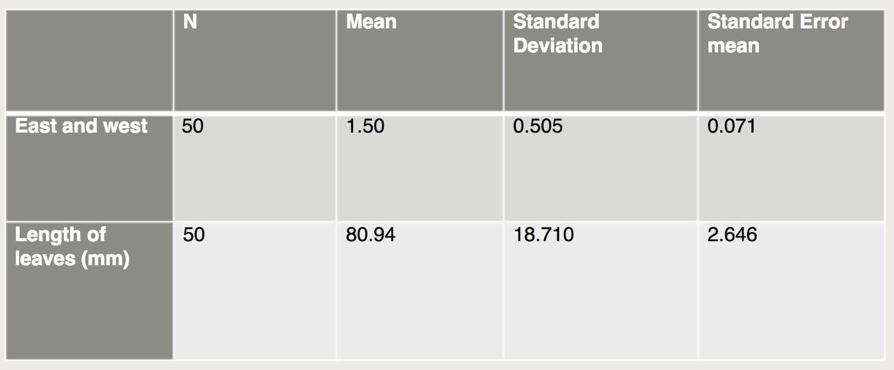

# Teaching Week 11: Tutorial  {#Lecture11}

::: {.objectivesBox .objectives data-latex="{iconmonstr-target-4-240.png}"}
You will learn to:
  
* read and understand research.
* write about research.
:::


::: {.assessmentBox .assessment data-latex="{iconmonstr-text-check-list-lined-240.png}"}
The Week\ 11 content is essential for:

* **Task\ 2B**, which requires you to *write about your own research*;
* **Quiz\ 4**, which includes questions about *understanding the language of research, and understanding extracts from published research*; and
* the **Exam**, which will contain questions about *understanding the language of research, and understanding extracts from published research*.
:::


::: {.readBox .read data-latex="{iconmonstr-school-15-240.png}"}
You will learn and practice the content associated with these chapters of the [textbook](https://peterkdunn.github.io/SRM-Textbook/):

* [Chapter\ 35 (Reporting and writing research)](https://peterkdunn.github.io/SRM-Textbook/WritingResearch.html).
* [Chapter\ 36 (Reading and critiquing research)](https://peterkdunn.github.io/SRM-Textbook/Reading.html).
:::


\pagebreak


## Quick revision {#QuickRevision-Tutorial11}

::: {.preClassBox .preClass data-latex="{iconmonstr-home-7-240.png}"}
We **strongly** recommend trying these *Quick revision* questions **before** your tutorial.
:::

In a study of high strength--high ductile concrete, @data:Ranada2015:Concrete measured (among other things) the load required to create the first visible cracks in concrete samples under various strains rates.

Under a strain rate of $10\secs^{-1}$, the $n = 6$ concrete samples produced a **mean** first-crack strength of $12.4\MPas$ with a **standard deviation** of $2.8\MPas$.

One student computes the approximate $95$%\ CI for the mean first-crack strength as $12.4\pm 2.8\MPas$.
Another student computes the approximate $95$%\ CI for the mean first-crack strength as $12.4\pm (2\times 2.8)$, or from\ $6.8$ to\ $18.0\MPas$. 

*Both* students are incorrect. 

1. Explain *why* Student\ 1 is incorrect, and explain what the student actually calculated.
\greyboxlines{4}
2. Explain *why* Student\ 2 is incorrect, and explain what the student actually calculated.
\greyboxlines{4}
3. Compute the correct (approximate) $95$%\ CI.
\greyboxlines{4}


## Class discussion {#TW11-Class-Discussion}

::: {.discussBox .discuss data-latex="{iconmonstr-speech-bubble-26-240.png}"}
**Discuss**: A 'statistically significant' result means a real discrepancy or effect.
:::


## Critiquing past students' reports 1 {#CritiqueReports1}

The extracts below are from an actual student Project Report.
Critique these extracts, and suggest better ways of communicating the information.

From a study comparing the mean distance an iron golf club and a wooden golf club can hit the ball:

* **Research question**:
	    For casual golfers, will using a metal club rather than a wooden club result in the ball travelling a further distance?
\greyboxlines{4}
* **Summaries**:
		  The paired means are different with the iron golf club being moderately higher than the wooden club
\greyboxlines{4}
* **Results (1)**:
		  The $95$%\ CI for the difference in distance in metres (wooden verse iron) differs from $34.74$ -- $43.25$ further for shots with the Iron
\greyboxlines{4}
* **Results (2)**:
	    Very strong evidence exists in the paired sample (paired $t = 18.406$; $n = 50$; two tailed; $P = 0.000$) of a population mean difference between the wooden and iron golf clubs...
\greyboxlines{4}


## Critiquing past students' reports 2 {#CritiqueReports2}

The extracts below are from an actual student Project Report.
Critique these extracts, and suggest better ways of communicating the information.

From a study comparing resting heart rates between male and female SCI110 students:

* **Null hypothesis**:
      Among current UniSC students studying SCI110, male and female resting heart rates are the same.
\greyboxlines{4}
* **Results**:
			The sample presents evidence ($\chi^2 = 30.0$; two tailed $P = 0.517$) that the mean resting heart rate does not have a significant difference between males and females (males mean: $72.6$\ bpm; females mean: $77.2$\ bpm).
\greyboxlines{4}


## Tests for ORs {#ORAirways}

::: {.videoSolutionBox .videoSolution data-latex="{iconmonstr-youtube-10-240.png}"}
This question has a video solution in the online book, so you can hear and see the solution.
:::

	
A study [@data:Tanagawa:AirwayDevices] examined the choice of airway devices used for nontraumatic, out-of-hospital cardiac arrest patients, to evaluate the success and failure of insertion for various devices.

The data for success and failure at insertion is given in Table \@ref(tab:AirwayTab), taken from available patient documentation.

```{r AirwayTab, echo=FALSE}
AirwayTab <- array( dim =  c(2, 2))

colnames(AirwayTab) <- c("Succeed", "Fail" )
rownames(AirwayTab) <- c("Esophageal gastric tube airway (EGTA)",
                         "Laryngeal mask (LM)")

AirwayTab[1, ] <- c(545,   49)
AirwayTab[2, ] <- c(2701, 315)

if( knitr::is_latex_output() ) {
  kable(AirwayTab,
      format = "latex",
      booktabs = TRUE,
      caption = "Data from the airways study.") %>%
  row_spec(0, bold = TRUE) %>%
  column_spec(1, bold = TRUE) %>%
    kable_styling(font_size = 10)
}
if( knitr::is_html_output() ) {
  kable(AirwayTab,
      format = "html",
      booktabs = TRUE,
      caption = "Data from the airways study.") %>%
  row_spec(0, bold = TRUE) %>%
  column_spec(1, bold = TRUE)
}

```

1. Define\ $p$ as the population proportion of successful attempts at insertion. \tightlist
   Write the hypotheses to be tested.
\greyboxlines{4}
2. Use the software output in Fig.\ \@ref(fig:Tanagawa1998jamoviCrossTabs) to test the hypotheses.
   Write a proper conclusion to communicate the results.
\greyboxlines{4}
3. Are the results likely to be statistically valid? 
   Explain.
\greyboxlines{2}
4. The study was designed to enable medics to choose the best airway device.  

   Would you recommend EGTA or LM?
   Why?
   Would you like any more information before making your choice?
   Explain.
\greyboxlines{4}


```{r Tanagawa1998jamoviCrossTabs, echo=FALSE, fig.cap="The jamovi output for the table from Tanagawa and Shigematsu (1998).", fig.align="center", out.width="55%"}
include_graphics("SoftwareImages/Tanagawa1998jamoviCrossTabs.png")
```


## Critiquing past students' reports 3 {#CritiqueReports3}

The extracts below are from an actual student Project Report.
Critique these extracts, and suggest better ways of communicating the information.

From a study comparing the size of lilly pilly leaves on different sides of the tree:

* **Research question**:
		  Among Weeping Lily Pily trees located at the University of the Sunshine Coast, do leaves that grow on the sunrise (east) side become longer than those growing on the sunset (west) side of the tree?
\greyboxlines{4}
* **Null hypothesis**:
		  The leaves on the east and west sides of Weeping Lily Pily trees are same, therefore no relationship exists between the sunset (east) and sunrise (west) side of the tree and leaf length.
\greyboxlines{4}
* **Results**: The table of results in Fig.\ \@ref(fig:BreeTable).
\greyboxlines{4}
* **Methods**:
			   Chose the $5$\ trees at the university that receive both easterly and westerly sunlight conditions
			   The $4$th leaf on the branch will be chosen $5$\ times on each side of the tree
\greyboxlines{4}


```{r BreeTable, echo=FALSE, fig.cap="A table from a student project.", fig.align="center", out.width="70%"}

```


## Critiquing past students' reports 4 {#CritiqueReports4}

The extracts below (including typos) are from an actual student Project Report.
Critique these extracts, and suggest better ways of communicating the information.

From a study comparing how well sports-playing students can estimate distance compared to non-sports-playing students:

* **Research question**:
		    Among UniSC Sippy Downs students, are individuals who regularly play sports have closer estimations to the actual measurement when identifying the width of a regular path compared to individuals who don't play sports regularly?
\greyboxlines{4}
* **Null hypothesis**:
		    The Null Hypophysis for our research question is that students who play sports regularly at the UniSC Sippy down campus have an increased level of perception when it comes to estimating distances.
\greyboxlines{4}
* **Results**:
		   This sample presents strong evidence in support of the Null Hypothesis that sport status has an affect on distance estimation (regular played sport: mean $176.36$ and non regular played sport: mean $172.34$).
\greyboxlines{4}

* **Discussion**:
		    From our original research question we have concluded that it supports the Null Hypothesis as it has a large $P$-value ($0.36$: one-tailed). Therefore we have proven that playing sports regularly has an effect on the accuracy of distance estimation.
\greyboxlines{4}
