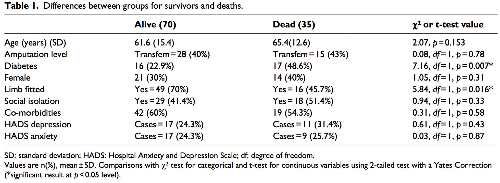
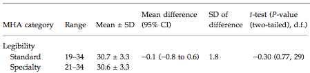
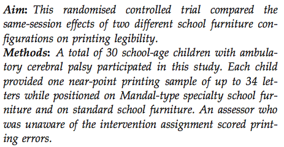
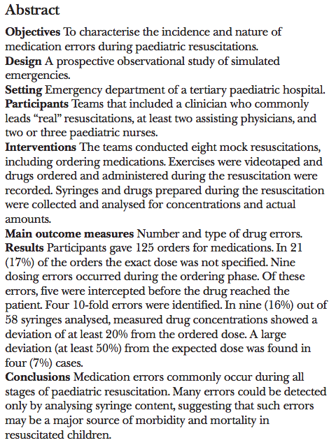
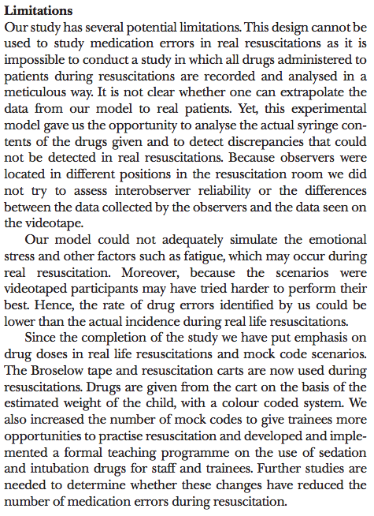

# Teaching Week 12: Tutorial  {#Lecture12}

::: {.objectivesBox .objectives data-latex="{iconmonstr-target-4-240.png}"}
**Topics** covered in this tutorial:
  
* How to read research.
* How to write research.
:::

In this chapter, you will learn and practice the content associated with these chapters of the [textbook](https://bookdown.org/pkaldunn/SRM-Textbook/):

* [Chapter 39 (Writing research)](https://bookdown.org/pkaldunn/SRM-Textbook/WritingResearch.html).
* [Chapter 40 (Reading and critiquing research)](https://bookdown.org/pkaldunn/SRM-Textbook/Reading.html).


## Confidence intervals {#CIConcrete}


<!-- Text wrap from: https://stackoverflow.com/questions/43551312/wrap-text-around-plots-in-markdown -->
<!-- Trick from: https://blog.earo.me/2019/10/26/reduce-frictions-rmd/ -->
`r if (knitr::is_latex_output()) '<!--'`
```{r, echo=FALSE, out.width= "40%", out.extra='style="float:right; padding:10px"'}

```
`r if (knitr::is_latex_output()) '-->'`


In a study of high strength--high ductile concrete [@data:Ranada2015:Concrete], the researchers measured (among other things) the load required to create the first visible cracks in concrete samples under various strains rates.

Under a strain rate of $10$\ s${}^{-1}$, the $n = 6$ concrete samples produced a **mean** first-crack strength of $12.4$\ MPa with a **standard deviation** of $2.8$\ MPa.

One student computes the approximate $95$% CI for the mean first-crack strength as $12.4\pm 2.8$\ MPa.
Another student computes the approximate $95$% CI for the mean first-crack strength as $12.4\pm (2\times 2.8)$, or from $6.8$ to $18.0$\ MPa. 

1. *Both* students are incorrect. 
   Explain *why* the students are incorrect, and explain what they actually have calculated instead.
2. Compute the correct (approximate) $95$% CI.


## Critiquing past students' reports 1 {#CritiqueReports1}

The extracts below are from an actual student Project Report.
Critique these extracts, and suggest better ways of communicating the information.

From a study comparing the mean distance an iron golf club and a wooden golf club can hit the ball:

* **Research question**:
	    For casual golfers, will using a metal club rather than a wooden club result in the ball travelling a further distance?
* **Summaries**:
		  The paired means are different with the iron golf club being moderately higher than the wooden club
* **Results (1)**:
		  The $95$% CI for the difference in distance in metres (wooden verse iron) differes from $34.74$ -- $43.25$ further for shots with the Iron
* **Results (2)**:
	    Very strong evidence exists in the paired sample (paired $t = 18.406$; $n = 50$; two tailed; $P = 0.000$) of a population mean difference between the wooden and iron golf clubs...


## Critiquing past students' reports 2 {#CritiqueReports2}

The extracts below are from an actual student Project Report.
Critique these extracts, and suggest better ways of communicating the information.

From a study comparing resting heart rates between male and female SCI110 students:

* **Null hypothesis**:
      Among current UniSC students studying SCI110, male and female resting heart rates are the same.
* **Results**:
			The sample presents evidence ($\chi^2 = 30.0$; two tailed $P = 0.517$) that the
			mean resting heart rate does not have a significant difference between males and females 
			(males mean: $72.6$\ bpm; females mean: $77.2$\ bpm).


## Critiquing past students' reports 3 {#CritiqueReports3}

The extracts below are from an actual student Project Report.
Critique these extracts, and suggest better ways of communicating the information.

From a study comparing the size of lilly pilly leaves on different sides of the tree:

* **Research question**:
		  Among Weeping Lily Pily trees located at the University of the Sunshine Coast, do leaves that grow on the sunrise (east) side become longer than those growing on the sunset (west) side of the tree?
* **Null hypothesis**:
		  The leaves on the east and west sides of Weeping Lily Pily trees are same, therefore no relationship exists between the sunset (east) and sunrise (west) side of the tree and leaf length.
* **Results**: The table of results in Fig.\ \@ref(fig:BreeTable).
* **Methods**:
			   Chose the $5$\ trees at the university that receive both easterly and westerly sunlight conditions
			   The $4$th leaf on the branch will be chosen $5$ times on each side of the tree


```{r BreeTable, echo=FALSE, fig.cap="A table from a student project", fig.align="center", out.width="70%"}
knitr::include_graphics("ProjectImages/BreeTable.png")
```


## Critiquing past students' reports 4 {#CritiqueReports4}

The extracts below (including typos) are from an actual student Project Report.
Critique these extracts, and suggest better ways of communicating the information.

From a study comparing how well sports-playing students can estimate distance compared to non-sports-playing students:

* **Research question**:
		    Among UniSC Sippy Downs students, are individuals who regularly play sports have closer estimations to the actual measurement when identifying the width of a regular path compared to individuals who don't play sports regularly?
* **Null hypothesis**:
		    The Null Hypophysis for our research question is that students who play sports regularly at the UniSC Sippy down campus have an increased level of perception when it comes to estimating distances.
* **Results**:
		   This sample presents strong evidence in support of the Null Hypothesis that sport status has an affect on distance estimation (regular played sport: mean $176.36$ and non regular played sport: mean $172.34$).

* **Discussion**:
		    From our original research question we have concluded that it supports the Null Hypothesis as it has a large P-value ($0.36$: one-tailed). Therefore we have proven that playing sports regularly has an effect on the accuracy of distance estimation.


## **Optional questions** {#OptionalTW12}


::: {.optionalBox .optional data-latex="{iconmonstr-help-4-240.png}"}
These questions are **optional**; e.g., if you need more practice, or you are studying for the exam.
(Answers appear in Sect.\ \@ref(Lecture12Answers).)
:::


### **Optional**: Deciding which test to use {#WhatTestToUse}

::: {.videoSolutionBox .videoSolution data-latex="{iconmonstr-youtube-10-240.png}"}
This question has a video solution in the online book, so you can hear and see the solution.
:::


A study examined the mortality rates within five years of lower-limb amputation, and factors that may be associated with mortality [@data:Singh:lowerlimb].
A summary of the data are shown in Fig. \@ref(fig:LowerLimbMortality).

Which tests would have been $t$-tests? 
Which tests would have been chi-square tests?
What do the $P$-values tell you?

```{r LowerLimbMortality, echo=FALSE, fig.cap="Summary data from a study of 5-year mortality rates among lower-limb amputees", fig.align="center", out.width="100%"}

```


### **Optional**: Reading research articles {#ReadDesks}

Mastering handwriting is an important skill for children to learn, but children with cerebral palsy have a higher prevalence of handwriting problems.

One study [@data:Ryan:CerebralPalsy] examined the effect of handwriting legibility of children with cerebral palsy using two different types of configuration of the school desks ('standard' or 'speciality').

Each of the $30$ students (aged $6$ to $8$ years old) used both desks.
Legibility (and other aspects of handwriting) was assessed using the quantitative Minnesota Handwriting Assessment (MHA) scale.

Part of Table\ 1 in the paper is shown in Fig.\ \@ref(fig:Ryan2010Table1).


```{r Ryan2010Table1, echo=FALSE, fig.cap="Part of Table 1 in Ryan et al., 2010", fig.align="center", out.width="80%"}

```

1. Read the extract in Fig.\ \@ref(fig:Ryan2010Aims). \tightlist
   Determine P, O, C and I (where possible) for this study.
2. Identify the type of study being used. Is this a paired design or not?  
   Explain.
3. Identify the type of statistical technique that was probably used to compute the test information in Fig.\ \@ref(fig:Ryan2010Table1).
   


```{r Ryan2010Aims, echo=FALSE, fig.cap="Part of the Abstract in Ryan et al., 2010", fig.align="center", out.width="70%"}

```

4. Identify the units of observation and units of analysis.\tightlist
5. Does the study use blinding?
   If so, for what reason?
   If not, why not?  

   What is the implication? 
   What about double blinding?
6. Determine the sample mean and sample standard deviation for the scores when children use the standard furniture configuration.
7. Compute an approximate $95$% CI for the population mean legibility score when children use the standard furniture configuration.
8. Write down a statement communicating the results of the test comparing the two furniture configurations.
9. Based on this study, do you think the speciality desk improves handwriting legibility?


### **Optional**: Reading research articles {#ReadErrors}

As with all endeavours involving humans, medical procedures can be subject to human error.
One study set out to

> ...characterise the incidence and nature of medication errors during paediatric resuscitations
> 
> --- @data:Kozer2004:MedicationErrors, p. 1

The Abstract from this paper is shown in Fig. \@ref(fig:Kozer2004Figure1).
Read this Abstract, then answer the questions that follow.


```{r Kozer2004Figure1, echo=FALSE, fig.cap="The Abstract from Kozer et al. (2004)", fig.align="center", out.width="60%"}

```


1. Identify the possible RQ being answered, identifying (where possible) P, O, C and I.
2. Identify the type of question is being asked: descriptive, relational, repeated-measures or correlational.
3. Explain whether the study is observational or experimental (true or quasi).
4. List the possible limitations can you identify with this study. 
   Then identify the limitations identified by the authors, by reading the extract in Fig. \@ref(fig:Kozer2004Limitations).


```{r Kozer2004Limitations, echo=FALSE, fig.cap="The limitations listed in Kozer et al. (2004)", fig.align="center", out.width="65%"}

```


