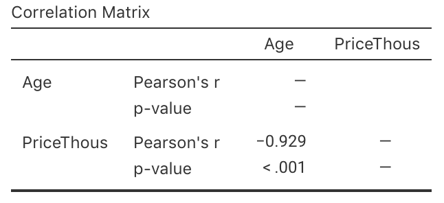
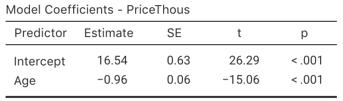

# Teaching Week 11: Tutorial  {#Lecture11}

::: {.objectivesBox .objectives data-latex="{iconmonstr-target-4-240.png}"}
**Topics** covered in this tutorial:

* CIs and tests for correlation coefficients.
* Linear equations and regression.
* CIs and tests for regression coefficients.
:::


::: {.readBox .read data-latex="{iconmonstr-school-15-240.png}"}
You will learn and practice the content associated with these chapters of the [textbook](https://bookdown.org/pkaldunn/SRM-Textbook/):

* [Chapter\ 33 (Correlation and regression)](https://bookdown.org/pkaldunn/SRM-Textbook/CorrelationRegression.html)
:::


## Quick revision {#QuickRevision-Tutorial11}


::: {.preClassBox .preClass data-latex="{iconmonstr-home-7-240.png}"}
We **strongly** recommend trying these *Quick revision* questions **before** your tutorial.
:::


::: {.webex-check .webex-box}
A study of how weeds spread [@khan2018alien] studied various factors about vehicles that might carry seeds.
The researchers found a correlation between the number of grams of mud on a vehicle and the number of seeds carried by the vehicle.

In autumn, the correlation coefficient was given as $r = 0.931$.

1. In this study, what variable would be the $x$-variable? \tightlist  
`r if( knitr::is_html_output() ) {
   webexercises::longmcq( c("The number of seeds", 
          answer = "The grams of mud",
          "The season") )} else {'\\null'}`
\greyboxlines{2}
1. In this study, what variable would be the $y$-variable?
`r if( knitr::is_html_output() ) {
   webexercises::longmcq( c(answer = "The number of seeds", 
          "The grams of mud",
          "The season") )} else {'\\null'}`
\greyboxlines{2}
1. What is the value of $R^2$?
`r if( knitr::is_html_output() ) {
   webexercises::longmcq( c(answer = "86.7%", 
          "93.1%",
          "96.5%") )} else {'\\null'}`
\greyboxlines{2}
1. The regression equation is given as $\hat{y} = 137.4 + 0.3459x$. If 700&nbsp;g of mud is found on the car, how many seeds are predicted to be carried by the vehicle?
`r if( knitr::is_html_output() ) {
   webexercises::longmcq( c(answer = "380", 
          "96422",
          "-104") )} else {'\\null'}`
\greyboxlines{2}
1. In this regression equation, the slope means:
`r if( knitr::is_html_output() ) {
   webexercises::longmcq( c("Each seed is associated with 137.4 extra grams of mud on average",
          "Each seed is associated with 0.3459 extra grams of mud on average",
	        "Each 1g of mud is associated with 137.4 extra seeds on average",
          answer = "Each 1g of mud is associated with 0.3459 extra seeds on average") )} else {'\\null'}`
\greyboxlines{2}
:::


`r if (knitr::is_latex_output()) '<!--'`
`r webexercises::hide()`
1. The $x$-variable (potentially) helps explains the values of the other variables... so the $x$-variable will be the number of grams of mud. 
1. The $y$-variable is the number of seeds.
1. $R^2 = (0.931^2) = 0.86676$, or about $86.7$%.
1. Using $x = 700$, we would have: $\hat{y} = 137.4 + (0.3459\times 700) = 380$ seeds.
1. The *slope* (which is $0.3459$) is how much the average value of $y$ changes (the number of seeds) when the value of $x$ (the amount of mud) increases by one.
`r webexercises::unhide()`
`r if (knitr::is_latex_output()) '-->'`


`r if (knitr::is_latex_output()) '<!--'`
<iframe src='https://www.ferendum.com/en/embeded.php?pregunta_ID=1265036&sec_digit=1243418155&embeded_digit=1746246557' style='width:100%; height:400px; overflow: auto; background: #B3919133' frameBorder='0'></iframe><BR>
<A href='https://www.ferendum.com' target='_blank'>Free Online Poll Maker</A>
`r if (knitr::is_latex_output()) '-->'`
		      

## Understanding correlations and regression {#UnderstandCorrelationsRegressions}

On *each* scatterplot in Fig.\ \@ref(fig:Guesses) for which a linear relationship is appropriate (there are *four*!):

1. Draw or estimate the 'best' straight regression line (where appropriate).
2. From the line in **Part\ 1.** above, estimate the **slope** for each line.
\greyboxlines{4}
3. From the line in **Part\ 1.** above, estimate the **intercept** for each line.
\greyboxlines{4}
4. Then write down an estimate of the regression line equation.
\greyboxlines{4}


```{r Guesses, echo=FALSE, fig.cap="Six different scatterplots.", fig.align="center", fig.width=5, fig.height=8, out.width="85%"}
set.seed(107695)
n <- 50

par( mfrow = c(3, 2))

x0 <- seq(6, 16, 
          length = n)
x1 <- x0 - min(x0)


y1 <- 12 + 4 * x1 + rnorm(length(x1), 0, 3.8)
plot(y1 ~ x1,
   xlab = expression(italic(x)),
   ylab = expression(italic(y)),
   pch = 19,
   col = plot.colour0,
   ylim = c(0, 60),
   main = "Plot 1",
   las = 1 )
grid()


x2 <- seq(-5, 10,
          length = n)
y2 <- 50 - 3 * x1 + rnorm(length(x1), 0, 3)
plot(y2 ~ x2,
   xlab = expression(italic(x)),
   ylab = expression(italic(y)),
   pch = 19,
   col = plot.colour0,
   ylim = c(10, 60),
   main = "Plot 2",
   las = 1  )
grid()


x1 <- x0 - min(x0)
y3 <- 32 + 0.01 * x1 + rnorm(length(x1), 0, 10)
plot(y3 ~ x1,
   xlab = expression(italic(x)),
   ylab = expression(italic(y)),
   pch = 19,
   col = plot.colour0,
   ylim = c(0, 60),
   main = "Plot 3",
   las = 1  )
grid()


x0 <- seq(0, 10, length = n)
mu4 <- -1 + 0.35 * x0
vr4 <- 0.65
y4 <- exp( mu4 + rnorm(length(x0), 0, vr4) )
plot(y4 ~ x0,
   xlab = expression(italic(x)),
   ylab = expression(italic(y)),
   pch = 19,
   col = plot.colour0,
   ylim = c(0, 35),
   main = "Plot 4",
   las = 1  )
grid()


x0 <- seq(0, 1, length=n)
y5 <- 10 + x0 - 50 * (x0 - max(x0))^3 + rnorm(length(x0), 0, 3)
plot(y5 ~ x0,
     xlab = expression(italic(x)),
     ylab = expression(italic(y)),
     pch = 19,
     col = plot.colour0,
     ylim = c(0, 70),
     main = "Plot 5",
     las = 1  )
grid()


x6 <- seq(5, 10, length = n)
y6 <- 16 + 4 * x6 + rnorm(length(x6), 0, 6)
plot(y6 ~ x6,
     xlab = expression(italic(x)),
     ylab = expression(italic(y)),
     pch = 19,
     col = plot.colour0,
     axes = FALSE,
     ylim = c(30, 70),
     xlim = c(5, 10),
     main = "Plot 6",
     las = 1 )
axis(side = 2, 
     las = 1)
axis(side = 1, 
     at = seq(5, 10, by = 1))
box()

grid()
```


## Interpreting regressions {#InterpretRegressions}


<!-- Text wrap from: https://stackoverflow.com/questions/43551312/wrap-text-around-plots-in-markdown -->
<!-- Trick from: https://blog.earo.me/2019/10/26/reduce-frictions-rmd/ -->
`r if (knitr::is_latex_output()) '<!--'`
```{r, echo=FALSE, out.width= "40%", out.extra='style="float:right; padding:10px"'}

```
`r if (knitr::is_latex_output()) '-->'`


I was wondering about how the age of second-hand cars impact their price.
On 25\ June, 2014, I searched
`r if (knitr::is_latex_output()) {
   'Gum Tree'
} else {
   '[Gum Tree](https://www.gumtree.com.au)'
}`,
for `Toyota Corolla` in the 'Cars, Vans \& Utes' category.
The age and the price of each (second-hand) car was recorded from the first two pages of results that were returned.

I then restricted the data to cars $15$ years old or younger
(and removed one $13$-year-old Corolla advertised for sale for $390\,000, assuming this was an error).
I then produced the scatterplot in Fig.\ \@ref(fig:CorollasPriceAge).


```{r CorollasPriceAge, echo=FALSE, fig.cap="The price of second-hand Toyota Corollas as advertised on Gum Tree on 25 June 2014 plotted against age ($n = 38$).", fig.align="center", fig.width=5.5, fig.height=4, out.width="60%"}

data(Corollas)

CP <- Corollas

CP <- rbind(CP, c(2008, 13000, 6) )  ### Add as it looks better

CP <- subset( CP, Age < 16)
CP <- subset( CP, Price < 20000)

CP$PriceThous <- CP$Price/1000


#Year Price Age
plot( Price/1000 ~ Age, 
      data = CP,
      xlab = "Age (in years)",
      ylab = "Price (in thousands of dollars)",
      main = "Prices of second-hand Corollas\non gumtree.com.au in 2014",
      pch = 19,
      col = plot.colour0,
      las = 1,
      xlim = c(0, 16),
      ylim = c(0, 20),
      axes = FALSE
)
axis(side = 1, 
     at = seq(0, 16, by = 2), 
     las = 1 )
axis(side = 2, 
     at = seq(0, 20, by = 2), 
     las = 1 )
box()
```


1. Describe the relationship displayed in the graph in words. \tightlist
\greyboxlines{2}
2. What else could influence the price of a second-hand Corollas? 
\greyboxlines{3}
3. `r if (knitr::is_latex_output()) {
      'With a ruler or another straight edge (such as a book), draw an estimate of the regression line on the scatterplot.'
   } else {
      'From the scatterplot, draw (if you can) or estimate by eye an approximation of the regression line.'
   }`
4. On the scatterplot, locate a seven-year-old Corolla selling for $15\,000.
   Would this be cheap or expensive?
\greyboxlines{2}
5. As stated, I removed one observation: a $13$-year-old Corolla for sale at $390\,000.
   What do you think the price was meant to be listed as, by looking at the scatterplot?
	 Explain.
\greyboxlines{2}
6. *Estimate* the value of\ $b_0$ (the intercept) from the line you drew.
   What does this mean?
   Do you think this value is meaningful?
\greyboxlines{3}
7. *Estimate* the value of\ $b_1$ (the slope) from the line you drew.
   What does this mean?
   Do you think this value is meaningful?
\greyboxlines{3}
8. From the line you drew above, write down an *estimate* of the regression equation.
\greyboxlines{3}
9. Use the software output (Fig.\ \@ref(fig:CorollasPriceAgeCorrelationjamovi) and Fig.\ \@ref(fig:CorollasPriceAgeRegressionjamovi) (jamovi)) relating the price (in thousands of dollars) to age to write down the regression equation.
\greyboxlines{2}
10. Using the software output, write down the value of\ $r$.
    Using this value of\ $r$, compute the value of\ $R^2$.
    What does this mean?
\greyboxlines{3}
11. Use the regression equation from the software output to estimate the sale price of a Corolla that is $20$\ years old, and explain your answer. \tightlist
\greyboxlines{3}
12. Using the software output, perform a suitable hypothesis test to determine if there is evidence that lower prices are associated with older Corollas.
\greyboxlines{4}
13. Compute an approximate $95$% confidence interval for the population slope (use the software output in **Fig.\ \@ref(fig:CorollasPriceAgeRegressionjamovi)**).
\greyboxlines{4}
14. I could have drawn a scatterplot with Price on the vertical (up-and-down) axis and Year of manufacture on the horizontal (left-to-right) axis (**Fig. \@ref(fig:CorollasPriceYear)**).
    For this  graph:

    a. What is the value of the correlation coefficient?
\greyboxlines{2}
    b. How would the value of\ $R^2$ change?
\greyboxlines{2}
    c. How would the value of the slope change?
\greyboxlines{2}
    d. How would the value of the intercept change?
\greyboxlines{2}


```{r CorollasPriceAgeCorrelationjamovi, echo=FALSE, fig.cap="The jamovi correlation output, analysing the Corolla data.", fig.align="center", out.width="57%"}

```
```{r CorollasPriceAgeRegressionjamovi, echo=FALSE, fig.cap="The jamovi regression output, analysing the Corolla data.", fig.align="center", out.width="60%"}

```


```{r CorollasPriceYear, echo=FALSE, fig.cap="The price of second-hand Toyota Corollas as advertised on Gum Tree on 25 June 2014 plotted against the year of manufacture ($n=38$).", fig.align="center", fig.width=5.5, fig.height=4, out.width="60%"}
data(Corollas)

CP <- Corollas


CP <- rbind(CP, c(2008, 13000, 6) )  ### Add as it looks better

CP <- subset( CP, Age < 16)
CP <- subset( CP, Price < 20000)

CP$PriceThous <- CP$Price/1000


#### PRICE vs YEAR

plot( PriceThous ~ Year, 
      data = CP,
      xlab = "Year of manufacture",
      ylab = "Price (in thousands of dollars)",
      main = "Prices of second-hand Corollas\non gumtree.com.au in 2014",
      pch = 19,
      col = plot.colour0,
      las = 1,
      xlim = c(2001, 2012),
      ylim = c(0, 20),
      axes = FALSE
)
axis(side = 1, 
     at = seq(2001, 2012, by = 1), 
     las = 1 )
axis(side = 2, 
     at = seq(0, 20, by = 2), 
     las = 1 )
box()

```


## Regression and correlation {#RegressionCorrelation}

Draw the regression line corresponding to $\hat{y} = 5 + 2x$ for values of $x$ between\ $0$ and\ $10$.

1. Add some points to the scatterplot such that the correlation is approximately $r = 0.9$.
\greyboxlines{5}
2. Add some more points to the scatterplot such that the correlation is approximately $r = 0.3$.
\greyboxlines{5}
