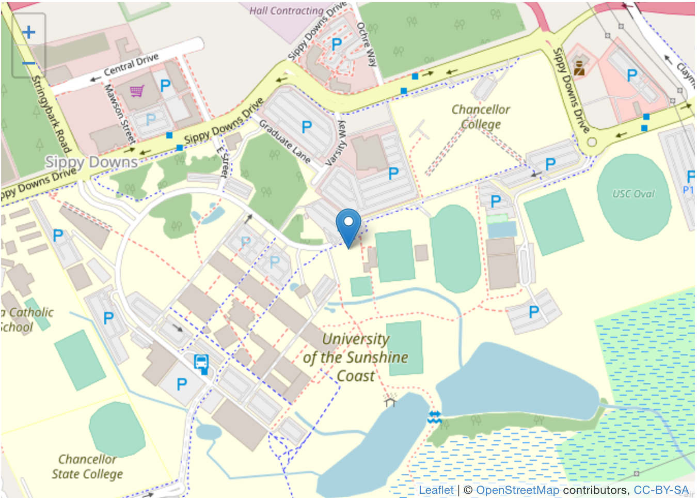
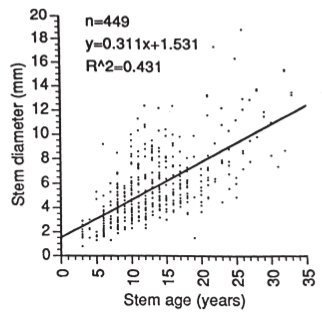

# Optional extra questions {#OptionalExtras}


::: {.optionalBox .optional data-latex="{iconmonstr-help-4-240.png}"}
These questions are **optional**; e.g., if you need more practice, or you are studying for the exam.
(Answers appear in Sect.\ \@ref(Lecture3Answers).)
:::


## Optional extras for Teaching Week 1 {#OptionalExtrasTW1}

### **(Optional)**  Identifying poor RQs {#IdentifyingPoorRQs}

Critique the following research questions, outlining how and why they can be improved (if at all).

1. Among domestic watertanks used in southeast Queensland, are lead concentrations in water in concrete tanks higher than in poly tanks?
2. Are lower-limb amputees more likely to die? 
3. Is the amount of salt the same for homebrand as for non-homebrand beans?
4. Among zoo animals, is the weight of adult elephants greater than that of juvenile kangaroos (joeys)?
5. Is the average reaction time related to gender?

What words or terms might need defining for each RQ?


### **(Optional)**  Understanding the terminology {#TerminologyLead}


<iframe src="https://usc.h5p.com/content/1291038891992762249/embed" width="1088" height="637" frameborder="0" allowfullscreen="allowfullscreen" allow="geolocation *; microphone *; camera *; midi *; encrypted-media *"></iframe><script src="https://usc.h5p.com/js/h5p-resizer.js" charset="UTF-8"></script>


```{r, child = if (knitr::is_latex_output()) './children/TutorialQns/01-TerminologyLead.Rmd'}
```


### **(Optional)**  Units of analysis, and units of observation {#Units2}

<!-- ADAPTED FROM : Oehlert.pdf, p. 8. -->

<iframe src="https://usc.h5p.com/content/1290971658775044979/embed" width="1088" height="637" frameborder="0" allowfullscreen="allowfullscreen" allow="geolocation *; microphone *; camera *; midi *; encrypted-media *"></iframe><script src="https://usc.h5p.com/js/h5p-resizer.js" charset="UTF-8"></script>


```{r, child = if (knitr::is_latex_output()) './children/TutorialQns/01-UnitsIngots.Rmd'}
```


### **(Optional)**  Units of analysis, and units of observation {#Units3}

<iframe src="https://usc.h5p.com/content/1290971662517623069/embed" width="1088" height="480" frameborder="0" allowfullscreen="allowfullscreen" allow="geolocation *; microphone *; camera *; midi *; encrypted-media *"></iframe><script src="https://usc.h5p.com/js/h5p-resizer.js" charset="UTF-8"></script>


```{r, child = if (knitr::is_latex_output()) './children/TutorialQns/01-UnitsFish.Rmd'}
```


## Optional extras for Teaching Week 2 {#OptionalExtrasTW2}

::: {.optionalBox .optional data-latex="{iconmonstr-help-4-240.png}"}
These questions are **optional**; e.g., if you need more practice, or you are studying for the exam.
(Answers appear in Sect.\ \@ref(Lecture2Answers).)
:::


### **(Optional)**  Sampling {#SamplingParking}

Suppose we needed a sample of $80$\ vehicles parked at UniSC (Sippy Downs campus), and we wish to determine the proportion displaying P-plates.

Determine a practical way to find a representative sample.
The map below of the UniSC Sippy Downs campus may prove helpful (areas labelled **P** on the campus grounds are UniSC car parks).


```{r echo=FALSE}
# From : http://rstudio.github.io/leaflet/

m <- leaflet() %>%
   setView(lng=153.064970, lat=-26.716504, zoom=15.5) %>%
  addTiles() %>%  # Add default OpenStreetMap map tiles
  addMarkers(lng=153.064970, lat=-26.716504, popup="UniSC (Sippy Downs Campus)")
if (knitr::is_html_output()){
  m
}
```


```{r, echo=FALSE, out.width= "90%", fig.align="center"}
if (knitr::is_latex_output()){
  
}
```


### **(Optional)**  Understanding terminology {#UnderstandTerminologyStudies}


<iframe src="https://usc.h5p.com/content/1290971648565695759/embed" width="1088" height="637" frameborder="0" allowfullscreen="allowfullscreen" allow="geolocation *; microphone *; camera *; midi *; encrypted-media *"></iframe><script src="https://usc.h5p.com/js/h5p-resizer.js" charset="UTF-8"></script>


```{r, child = if (knitr::is_latex_output()) './children/TutorialQns/02-TerminologyDefinitions.Rmd'}
```


### **(Optional)**  Understanding studies {#UnderstandFishoil}

Fish oil has been touted as helpful to the health of the heart.
A newspaper report of one such study [@data:GISSI1999:Infarction] is shown in Fig.\ \@ref(fig:fishoil).
Answer the questions that follow.


```{r fishoil, echo=FALSE, fig.cap="From The Downs Star, Thursday March 18, 1999.", fig.align="center", out.width="80%"}
include_graphics("ArticleImages/fishoil2.jpg")
```


1. Identify the variables involved.
2. Explain whether the study is observational or experimental.
3. *If the study is experimental*, determine if the principles of randomization, control, blinding and double-blinding, and blocking have been used.
   Also determine if it is a true experiment or a quasi-experiment.  

   *If the study is observational*, determine if the study uses a forward direction (*cohort study*), a backward direction (case-control study), or is non-directional (cross sectional).
4. Which one of the following, if any, would be a potential **lurking** variable?  
   Explain.
    - The general health of the subject.
    - The average amount of water consumed each day by the subjects.
    - Gender.
5. Is a cause-and-effect relationship reasonable? 
   Explain.
6. What are the limitations of the study?
7. Identify the units of observation, and the units of analysis.
8. What did you learn from this report?


### **(Optional)**  Random allocation {#RandomAllocation}

For a small pilot study, Sam allocated $12$ students ($6$ males and $6$ females) to one of two groups.
In the Report associated with the study, Sam stated that the $12$ students were

> ...randomly allocated to one of two groups (Group\ A or Group\ B).

Different interventions were applied to each group.
A reviewer, however, noted that *all* the subjects in Group\ A were male, and *all* the subjects in Group\ B were female.

1. Would this be a problem?
   Why?
2. Do you agree with Sam, that the subjects really were allocated to the groups *at random*?
	 Explain your answer.


### **(Optional)**  Evaluating reports {#EvaluatingReportsSugar}

Many health experts are concerned about the amount of sugary drinks consumed by children.
Part of a newspaper report about a study into this issue is shown in Fig.\ \@ref(fig:SoftDrinks).
Two variables are listed in the extract:

* The type of drink (sweetened with sugar, or with sugarless sweeteners); and
* Weight gain.

1. What words could be used to describe these variables?
2. The sample size is reasonably large: $n = 641$.
   Does this imply high precision or high accuracy?
3. How could the *accuracy* be improved?


```{r SoftDrinks, echo=FALSE, fig.cap="From: www.news.com.au, Tuesday 25 September 2012.", fig.align="center", out.width='75%'}
include_graphics("ArticleImages/SoftDrinks-cut3CloseGap.png")
```

<iframe src="https://usc.h5p.com/content/1291014875599416609/embed" width="1088" height="637" frameborder="0" allowfullscreen="allowfullscreen" allow="geolocation *; microphone *; camera *; midi *; encrypted-media *"></iframe><script src="https://usc.h5p.com/js/h5p-resizer.js" charset="UTF-8"></script>


<!-- Put a tick in the appropriate column(s) of -->
<!-- Table \@ref(tab:SoftDrinkTab). -->

<!-- ```{r SoftDrinkTab, echo=FALSE} -->
<!-- SoftDrinkTable <- array( "", dim=c(7, 3) ) -->

<!-- #rownames(SoftDrinkTable) <- c("Description", "Type of drink", "Weight gain") -->
<!-- rownames(SoftDrinkTable) <- c("Explanatory", "Response",  "Control", "Nominal", "Ordinal", "Quantitative", "Qualitative") -->

<!-- kable(SoftDrinkTable, -->
<!--     col.names=c("Description", "Type of drink", "Weight gain"), -->
<!--     caption="Complete the table", -->
<!--     booktabs=TRUE, -->
<!--     linesep = c("", "\\addlinespace", "", "", "\\addlinespace", "", ""),   ) %>% -->
<!--   column_spec(1, bold=TRUE) %>% -->
<!--   row_spec(0, bold=TRUE) %>% -->
<!--   kable_styling(full_width=FALSE) -->
<!-- ``` -->


### **(Optional)**  Designing and planning studies {#DesignTrees}
<!-- BASED ON Ruxton and Colegrave p. 128 -->

To study the progress of an imported species of beetle, a research group is studying the RQ:

> Is the average number of species of beetle found on trees different between local coniferous and broad leaf forests?

Ten possible forests of each type have been found, and the research budget allows for $100$ trees to be sampled.
Three designs are being considered:

* **A.** Randomly sample $50$\ trees from one randomly selected coniferous forest, and $50$\ trees from one randomly selected broad leaf forest.
* **B.** Randomly sample $5$\ trees from ten randomly sampled coniferous forests, and $5$\ trees from ten randomly selected broad leaf forests.
* **C.** Randomly sample $10$\ trees from five randomly sampled coniferous forests, and $10$\ trees from five randomly selected broad leaf 

The researchers wish to know which design they should use.

1. Identify (with justification) which of these designs will be best for estimating the variation *within* a forest.
2. Identify (with justification) which of these designs will be best for estimating the variation that exists *between* the forest (that is, from one forest to the next).
3. Which design do you think would be best for answering the RQ? Explain your answer.
4. Which design do you think would be the easiest design for data collection?


## Optional extras for Teaching Week 3 {#OptionalExtrasTW3}

### **(Optional)**  Interpreting histograms {#InterpretHistogram}

To assess various lung diseases, many methods are available (including using a spirometer and the $6$-minute walk test).
The fatigue assessment scale (FAS) is one way to measure the fatigue of the patient.
(A high FAS value means more fatigue [@data:Michielsen2003:FAS].)

The histogram in Fig.\ \@ref(fig:Baughman2007-HistogramFig2) comes from a study [@data:Baughman2007:SixMinuteWalk] examining $n = 142$ sarcoidosis patients using the FAS.

1. Critique this histogram. Identify ways to improve the histogram.
2. Describe this histogram in words: what does it tell you?


```{r Baughman2007-HistogramFig2, echo=FALSE, fig.align="center", fig.width=5, fig.cap="The histogram of FAS scores for patients", out.width='45%'}
include_graphics("ArticleImages/Baughman2007-HistogramFig2.png")
```


### **(Optional)**  Understanding graphics {#UnderstandGraphsPizza}


<iframe src="https://usc.h5p.com/content/1290973189768027779/embed" width="1088" height="637" frameborder="0" allowfullscreen="allowfullscreen" allow="geolocation *; microphone *; camera *; midi *; encrypted-media *"></iframe><script src="https://usc.h5p.com/js/h5p-resizer.js" charset="UTF-8"></script>


```{r, child = if (knitr::is_latex_output()) './children/TutorialQns/03-PizzaHistogram.Rmd'}
```


## Optional extras for Teaching Week 4 {#OptionalExtrasTW4}

### **(Optional)**  Percentages and odds {#PercentagesOdds}

Endotracheal intubation (ETI) is a method for maintaining an open airway or as a method for administering certain drugs for ill patients.
The BVM ('ball valve mask') method is also used.

ETI is widely used for airway management of children in the out-of-hospital setting, but for many years little evidence was available on the effect of using ETI.
Table\ \@ref(tab:AirwayTable) comes from a study [@data:Gausche200:Endotracheal] of using different types of endotracheal intubation on children.
Use the table to answer the questions that follow.


```{r AirwayTable, echo=FALSE}
Airways <- array( dim = c(8, 4))

colnames(Airways) <- c("Number", 
                       "%", 
                       "Number", 
                       "%")
rownames(Airways) <- c("Normal, no change from baseline",
                       "No change from baseline",
                       "Mild disability",
                       "Moderate disability",
                       "Severe disability",
                       "Coma/vegetative",
                       "Death",
                       "Total")

Airways[1, ] <- c("39", "(10%)", "33", "(8%)")
Airways[2, ] <- c("33", "(8%)", "25", "(6%)")
Airways[3, ] <- c("20", "(5%)", "27", "(6%)")
Airways[4, ] <- c("6", "(1%)", "7", "(2%)")
Airways[5, ] <- c("10", "(2%)", "6", "(1%)")
Airways[6, ] <- c("15", "(4%)", "12", "(3%)")
Airways[7, ] <- c("281", "(70%)", "306", "(74%)")
Airways[8, ] <- c("404", "", "416", "")

if( knitr::is_latex_output() ) {
  kable(Airways,
        format = "latex",
        align = rep("r", 4),
        booktabs = TRUE,
        linesep = c("", "\\addlinespace", "", "", "\\addlinespace", "","\\addlinespace", ""), 
        caption = "Airway management data.") %>%
    add_header_above(header = c("  " = 1, 
                                "BVM group " = 2, 
                                " ETI group" = 2), 
                     align = "c", 
                     bold = TRUE  ) %>%
    column_spec(1, bold = TRUE) %>%
    row_spec(0, 
             bold = TRUE) %>%
    row_spec(8, 
             bold = TRUE) %>%
    row_spec(7, 
             hline_after = TRUE) %>%
    kable_styling(full_width = FALSE,
                  font_size = 10)
}
if( knitr::is_html_output() ) {
  kable(Airways,
        format = "html",
        align = rep("r", 4),
        booktabs = TRUE,
        linesep = c("", "\\addlinespace", "", "", "\\addlinespace", "","\\addlinespace", ""), 
        caption = "Airway management data.") %>%
    add_header_above(header = c("  " = 1, 
                                "BVM group " = 2, 
                                " ETI group" = 2), 
                     align = "c", 
                     bold = TRUE  ) %>%
    column_spec(1, 
                bold = TRUE) %>%
    row_spec(0, 
             bold = TRUE) %>%
    row_spec(8, 
             bold = TRUE) %>%
    kable_styling(full_width = FALSE)
}

```


1. Among people treated with BVM, compute the *percentage* that died (to the nearest percent). \tightlist  
`r if( knitr::is_html_output() ) {fitb(num=TRUE, tol=0.1, answer=70)}`
2. Among the people treated with BVM, what are the *odds* that someone died?
Explain which one of the following calculations is correct, and **explain what the other calculations compute, and hence _why_ they are wrong**.  
`r if( knitr::is_html_output() ) {longmcq(
c(answer = "281/(404-281) = 2.28",
"(404-281)/404 = 0.304",
"281/404 = 0.696",
"(281+306) / ( 404+416) = 0.716",
"281/306 = 0.918"
))}`
`r if( knitr::is_html_output() ) {"<!--"}`
   * $281/(404 - 281) = 2.28$
   * $(404 - 281)/404 = 0.304$
   * $281/404 = 0.696$
   * $(281 + 306) / ( 404 + 416) = 0.716$
   * $281/306 = 0.918$
`r if( knitr::is_html_output() ) {"-->"}`

3. Among people treated with ETI, the *odds* that someone died is $2.78$.
What does this mean?  
`r if( knitr::is_html_output() ) {longmcq(
c(         "A patient treated with ETI has a 2.78% chance of dying.",
"2.78% of patients treated with ETI in the study died.",
answer = "For patients treated with ETI, about 278 die for every 100 that survive.",
"For patients treated with ETI, about 278 live for every 100 that die."
))}`

4. How many times greater is the odds that a person treated with ETI died compared to the odds that a person treated with BVM died?  
`r if( knitr::is_html_output() ) {fitb(num=TRUE, tol = 0.01, answer = 1.22)}`


### **(Optional)**  Odds {#Odds1}


```{r, child = if (knitr::is_latex_output()) './children/TutorialQns/04-OddsStudents.Rmd'}
```


<iframe src="https://usc.h5p.com/content/1290968278235165709/embed" width="1088" height="637" frameborder="0" allowfullscreen="allowfullscreen" allow="geolocation *; microphone *; camera *; midi *; encrypted-media *"></iframe><script src="https://usc.h5p.com/js/h5p-resizer.js" charset="UTF-8"></script>


### **(Optional)**  Percentages { #PercentagesOdour}

Industries often produce unpleasant odours, but the effects on the health of those impacted is not always clear.
Furthermore, different communities are impacted in different ways.
@data:Deane:OdorRefineries researched the RQ:

> In Carson, California, does the odour from nearby petroleum refineries impact residents in different areas differently?

One aim of the study was to determine if the reports of unpleasant odours were related to measurements made by a dynamic olfactometer (an 'electronic nose').
Part of the data collected are shown in Table \@ref(tab:Odour).

```{r Odour, echo=FALSE}
OdourTab <- array( dim = c(4, 4))

colnames(OdourTab) <- c("Area I", 
                        "Area II",
                        "Area III",
                        "Total")
rownames(OdourTab) <- c("At least once a week", 
                        "Between once a week and once a month", 
                        "Less often than once a month", 
                        "Not at all")

OdourTab[1, ] <- c(48, 48, 16, 112)
OdourTab[2, ] <- c(23, 21, 10, 54)
OdourTab[3, ] <- c(14, 14, 20, 48)
OdourTab[4, ] <- c(12, 12, 53, 77)

if( knitr::is_latex_output() ) {
  kable(pad(OdourTab,
            targetLength = c(2, 2, 2, 3),
            decDigits = 0),
        format = "latex",
        align = "c",
        escape = FALSE,
        booktabs = TRUE,
        caption = "Data on the impact of a local industry.") %>%
    column_spec(1, 
                bold = TRUE) %>%
    column_spec(5, 
                bold = TRUE) %>%
    row_spec(0, 
             bold = TRUE) %>%
    kable_styling(full_width = FALSE,
                  font_size = 10)
}
if( knitr::is_html_output() ) {
  kable(pad(OdourTab,
            targetLength = c(2, 2, 2, 3),
            decDigits = 0),
        format = "html",
        escape = FALSE,
        align = "c",
        booktabs = TRUE,
        caption = "Data on the impact of a local industry.") %>%
    column_spec(1, 
                bold = TRUE) %>%
    column_spec(5, 
                bold = TRUE) %>%
    row_spec(0, 
             bold = TRUE) %>%
    kable_styling(full_width = FALSE)
}
```

1. Explain whether the study is observational or experimental (true or quasi).
2. What would be the meaning of *column* percentages for this table?
3. What would be the meaning of *row* percentages for this table?
4. Would row or column percentages probably be more sensible to use? Why?
5. Compute the percentage of residents in the sample overall not detecting the odour at all.


## Optional extras for Teaching Week 5 {#OptionalExtrasTW5}

## **Optional questions** {#OptionalTW5}

::: {.optionalBox .optional data-latex="{iconmonstr-help-4-240.png}"}
These questions are **optional**; e.g., if you need more practice, or you are studying for the exam.
(Answers appear in Sect.\ \@ref(Lecture5Answers).)
:::


### **(Optional)**  Understanding RQs and variables {#UnderstandRqVariables}

@data:heartbear:radziun2023 compared the mean accuracy with which blind and sighted individuals could count their heartbeats over varying time periods.
For the study, sighted subjects were blindfolded (p.\ 3).
The participants were instructed (p.\ 4):

> Without manually checking, can you silently count each heartbeat you feel in your body from the time you hear 'start' to when you hear 'stop'? 
> Do not take your pulse or feel on your chest with your hand. 
> You are only allowed to feel the sensation of your heart beating.

The process was repeated using time intervals of $25$, $30$, $35$, $40$, $45$, and\ $50\secs$.
The time intervals were presented in random order to the subjects ($34$ blind; $36$ sighted), who received no information about the length of the time interval.

Each subject was assigned a *single* accuracy score (from $0$ to\ $1$ (perfect accuracy)) by combining their results across the various time intervals.
The study, therefore, compared the average accuracy scores blind people to sighted people.

1. What type of RQ is this?
1. What type of study is this?
1. What are the Outcome and the response variable in this study?
1. What are the Comparison and the explanatory variable in this study?
1. Is there an intervention?
   Explain.
1. Describe the response variable (e.g., qualitative nominal; quantitative discrete).
1. Describe the explanatory variable (e.g., qualitative nominal; quantitative discrete).
1. What graph would be used to display the relationship?
1. What are the units of analysis?
1. How many units of analysis are there?
1. How many units of observation are there for each unit of analysis? 


### **(Optional)**  Interpreting and drawing boxplots {#DrawBoxplot}

Environmentally-friendly buildings are often assumed to have a better indoor environmental quality (when occupants rate the comfort) than conventional buildings; in turn, this is assumed to have a positive impact on productivity.

One group of researchers decided to test this assertion. 
Figure\ \@ref(fig:Paul2008Table1) is taken from a study of office temperatures [@data:Paul2008:Comfort] in an environmentally-friendly building at Charles Sturt University.

Operative temperatures were measured in three offices between 8am to 6pm during four weeks near the end of summer; Office\ A is located on the ground floor, while Offices B and C are located on the top floor.
The building is not *air* conditioned.

1. Use this information to construct a boxplot of the range of office temperatures for the three offices.
2. In words, describe the relationship.
3. Do the offices appear to provide a 'comfortable' temperature?
4. Suppose we wanted to compare ground floor offices to top floor offices.
   How many units of analysis would we have for this comparison?

```{r Paul2008Table1, echo=FALSE, fig.align="center", fig.cap="Table 1 from Paul et al. (2008)", out.width='75%'}
include_graphics("ArticleImages/Paul2008Table1.png")
```


### **(Optional)**  Selecting the correct graph {#SelectGraphs1}

<iframe src="https://usc.h5p.com/content/1291016626996338939/embed" width="1088" height="637" frameborder="0" allowfullscreen="allowfullscreen" allow="geolocation *; microphone *; camera *; midi *; encrypted-media *"></iframe><script src="https://usc.h5p.com/js/h5p-resizer.js" charset="UTF-8"></script>


```{r, child = if (knitr::is_latex_output()) './children/TutorialQns/05-SelectCorrectGraph.Rmd'}
```


### **(Optional)**  Identifying appropriate graphs {#IdentifyingGraphs1}

In each of the following cases:
	
* Identify the variables;
* Identify what *type* of variables these are; and
* Hence determine and justify the most appropriate graph for displaying the *relationship* of interest.

In addition, draw a rough example of what the graph may look like.


1. Meadowfoam is a plant from which oil can be extracted from its flowers, so maximising flowering is important.  
   
   @data:seddigh:flowers examined many individual meadowfoam plants and explored the relationship between the number of flowers each plant produced, and the number of hours of light each plant received.
   
   
<iframe src="https://usc.h5p.com/content/1291014902846391579/embed" width="1088" height="637" frameborder="0" allowfullscreen="allowfullscreen" allow="geolocation *; microphone *; camera *; midi *; encrypted-media *"></iframe><script src="https://usc.h5p.com/js/h5p-resizer.js" charset="UTF-8"></script>


2. Early in the $21$st century, moves were made to ban smoking in outdoor areas of restaurants, cafes, pubs and bars.
   However, some people thought this was unnecessary, as they believed that exposure to second-hand smoke was minimal.  
   
   To study this phenomenon and to inform public policy, @data:Stafford2010:Alfresco examined numerous al fresco (open air) restaurants in New Zealand.  
   
   They collected two pieces of information from each individual restaurant: the number of smokers present at the restaurant at the time of observation (restaurants with no smokers; restaurants with one smoker; restaurants with two or more smokers), and the concentrations of fine particulate matter (PM)  measured in the restaurant air at the same time.
   The researchers wish to compare the PM concentrations across the three groups.
   
<iframe src="https://usc.h5p.com/content/1291014905631385249/embed" width="1088" height="637" frameborder="0" allowfullscreen="allowfullscreen" allow="geolocation *; microphone *; camera *; midi *; encrypted-media *"></iframe><script src="https://usc.h5p.com/js/h5p-resizer.js" charset="UTF-8"></script>
   
   
3. To understand the usage of hospital emergency departments (EDs) in Ireland, @data:Curran2011.Stroke examined many individual admissions.  
   
   For each admission to the ED, they recorded if the waiting time was short (within $3\hs$) or long ($3\hs$ or longer), and the time of day of the admission (in three divisions: $9$am to $5$pm; $5$pm to midnight; and midnight to $9$am).


<iframe src="https://usc.h5p.com/content/1291014908484867689/embed" width="1088" height="637" frameborder="0" allowfullscreen="allowfullscreen" allow="geolocation *; microphone *; camera *; midi *; encrypted-media *"></iframe><script src="https://usc.h5p.com/js/h5p-resizer.js" charset="UTF-8"></script>


4. Stress in children is not as well understood as stress in adults.  

   To examine the issue, @data:Saunders1999:Playfulness studied many children, and for each child they determined each child's level of playfulness (measured using a quantitative scale called the *Test of Playfulness*) and each child's level of 'coping' (measured using a quantitative scale called the *Coping Inventory*).

<iframe src="https://usc.h5p.com/content/1291014912258524999/embed" width="1088" height="637" frameborder="0" allowfullscreen="allowfullscreen" allow="geolocation *; microphone *; camera *; midi *; encrypted-media *"></iframe><script src="https://usc.h5p.com/js/h5p-resizer.js" charset="UTF-8"></script>


### **(Optional)**  Selecting graphics {#SelectingGraphsH5P}

<iframe src="https://usc.h5p.com/content/1290971685720511979/embed" width="1088" height="637" frameborder="0" allowfullscreen="allowfullscreen" allow="geolocation *; microphone *; camera *; midi *; encrypted-media *"></iframe><script src="https://usc.h5p.com/js/h5p-resizer.js" charset="UTF-8"></script>


```{r, child = if (knitr::is_latex_output()) './children/TutorialQns/05-SelectingGraphs.Rmd'}
```


### **(Optional)**  Evaluating graphics {#EvaluateGraphsAnts}

A study of the impact of ants on plant communities [@data:Sankovitz2018:nests] produced the boxplot in Fig.\ \@ref(fig:Sankovitz2018), showing the percentage of land covered by plants next to the ant nest, uphill from the ant nest, and downhill from the ant nest.


```{r Sankovitz2018, echo=FALSE, fig.align="center", fig.cap="A graphic from Sankovitz et al. (2018", out.width='70%'}
include_graphics("ArticleImages/Sankovitz2018.png")
```


1. Identify the type of study: experimental or observational.
2. Identify the units of observation, and the units of analysis.
3. Critique this graph.
4. Do you think that a real difference exists between median plant coverage at different locations around the ant nest?
   What other interesting features can be seen from the graph?


### **(Optional)**  Evaluating graphics {#EvaluateGraphs1}

@data:Jennings2012:Morphine studied patients in severe pain and compared two different treatments to determine which to recommend.
Patients were randomly allocated to receive one of two pain treatments: either morphine, or morphine and ketamine.

The pain reduction for each patient was then measured (using the 'pain verbal numeric rating scale': $0$ is no pain, and $10$ the worst pain imaginable, such as Australia losing the Ashes), by taking pain measurements before and after giving the treatment.

The graph in Fig.\ \@ref(fig:Jennings2012) summarises the data.
   
```{r Jennings2012, echo=FALSE, fig.align="center", fig.cap="A graphic from Jennings et al. (2002). 'ED' means 'Emergency Department'", out.width='80%'}
include_graphics("ArticleImages/Jennings2012-Fig2.png")
```

1. Identify the type of study: experimental or observational.
2. Identify the units of observation, and the units of analysis.
3. Critique this graph.
4. What do you think the negative numbers on the graph mean?
5. Do you think that a real difference exists between the median for the two treatments *in the population*?
   Explain


### **(Optional)**  Selecting graphs {#SelectGraph1}

<iframe src="https://usc.h5p.com/content/1290973176373971849/embed" width="1088" height="637" frameborder="0" allowfullscreen="allowfullscreen" allow="geolocation *; microphone *; camera *; midi *; encrypted-media *"></iframe><script src="https://usc.h5p.com/js/h5p-resizer.js" charset="UTF-8"></script>


```{r, child = if (knitr::is_latex_output()) './children/TutorialQns/05-SelectingGraphs2.Rmd'}
```


## Optional extras for Teaching Week 6 {#OptionalExtrasTW6}

None yet.


## Optional extras for Teaching Week 6 {#OptionalExtrasTW6}


### **(Optional)**  General ideas {#GeneralIdeas2}


<iframe src="https://usc.h5p.com/content/1290972394620770569/embed" width="1088" height="637" frameborder="0" allowfullscreen="allowfullscreen" allow="geolocation *; microphone *; camera *; midi *; encrypted-media *"></iframe><script src="https://usc.h5p.com/js/h5p-resizer.js" charset="UTF-8"></script>


```{r, child = if (knitr::is_latex_output()) './children/TutorialQns/07-WhichTermsWhen.Rmd'}
```


### **(Optional)**  CI for one mean {#RoomWidthCI}

::: {.videoSolutionBox .videoSolution data-latex="{iconmonstr-youtube-10-240.png}"}
This question has a video solution in the online book, so you can hear and see the solution.
:::


Shortly after metric units were introduced to Australia in 1977, a lecturer wondered how accurately students could estimate lengths using the metric measurements [@data:hand:handbook].

The aim of the study was to determine if, on average, students could correctly guess the width of the hall (which was $13.1\ms$).


To answer the RQ, a group of $n = 44$ students were asked to estimate the width of the lecture hall to the nearest metre (data provided by Prof. Lewis).
The data are given in Table\ \@ref(tab:GuessesRoom).  
   
The data were entered into software, producing the output in Fig. \@ref(fig:LengthsHallOutputjamovi1) (jamovi).


```{r GuessesRoom, echo=FALSE}
GuessTab <- array( dim = c(3, 15) )

GuessTab[1, ] <- c(8,  9, 10, 10, 10, 10, 10, 10, 11, 11, 11, 11, 12, 12, 13)
GuessTab[2, ] <- c(13, 13, 14, 14, 14, 15, 15, 15, 15, 15, 15, 15, 15, 16, 16)
GuessTab[3, ] <- c(16, 17, 17, 17, 17, 18, 18, 20, 22, 25, 27, 35, 38, 40, "")

if( knitr::is_latex_output() ) {
  kable(GuessTab,
      format = "latex",
      booktabs = TRUE,
      caption = "Guess of the width of a room 13.1 metres wide.",
      align = "r") %>%  
  kable_styling(full_width = FALSE,
                font_size = 10)
}
if( knitr::is_html_output() ) {
  kable(GuessTab,
      format = "html",
      booktabs = TRUE,
      caption = "Guess of the width of a room 13.1 metres wide.",
      align = "r")
}
```

1. What is the value of $\bar{x}$?
2. What are the values of\ $s$ and $\text{s.e.}(\bar{x})$? 
   Explain the difference in the meaning of the two terms.
3. Write down the $95$%\ CI for the population estimate (see Fig.\ \@ref(fig:LengthsHallOutputjamovi1) (jamovi).
4. What conditions must be met for this test to be statistically valid?
5. Is it reasonable to assume the statistical validity conditions are satisfied? 
   How does the histogram in Fig.\ \@ref(fig:LengthsHallHisto1) help, if at all?
6. Do you think students were very good at estimating the width of the hall using metric units? 
   Explain.
   
   
```{r echo=FALSE}
GuessM <- c(8, 9, 10, 10, 10, 10, 10, 10, 11, 11, 11, 11, 12, 12, 13, 13, 
13, 14, 14, 14, 15, 15, 15, 15, 15, 15, 15, 15, 16, 16, 16, 17, 
17, 17, 17, 18, 18, 20, 22, 25, 27, 35, 38, 40)
```

```{r LengthsHallHisto1, echo=FALSE, fig.cap="Histogram for the estimates of the width of a hall by $n = 44$ students. The cross is the actual width of the hall.", fig.align="center", fig.width=6}
hist( GuessM, 
      las = 1,
      main = "Histogram of guesses",
      xlab = "Guess (in metres)",
      col = plot.colour)
points(x = 13.1,
       y = 0,
       pch = 4,
       cex = 1.5)
```

```{r LengthsHallOutputjamovi1, echo=FALSE, fig.cap="jamovi output for the estimates of the width of a hall in metres", fig.align="center", out.width="80%"}
include_graphics("SoftwareImages/LengthsHallOneSampleMetres-jamovi.png")
```


### **(Optional)**  CI for one proportion {#HMMaturing}

::: {.videoSolutionBox .videoSolution data-latex="{iconmonstr-youtube-10-240.png}"}
This question has a video solution in the online book, so you can hear and see the solution.
:::


The timing of pubertal maturation can vary, which can have impacts upon behaviour.
@data:duncan:maturity studied (p.\ 231): 

> ...the relationships between maturational timing and body image, school behavior, and deviance

Sample data were collected from 

> ...children and youth of the entire United States drawn by the National Center for Health Statistics... known as the National Health Examination Survey (1966--1970). 
> Data were collected on $5\,735$ adolescents' physical and psychological status...


1. What type of research question is being answered: descriptive, relational, repeated-measures or correlational? 
   Explain.
2. For the $2\,864$ males in the sample, $352$ were classified as maturing late.
   Compute the sample estimate of the *population* proportion of males who mature late.
3. Compute the precision of this estimate (that is, the *standard error*).
4. Compute an approximate $95$% confidence interval for the population proportion of boys that mature late based on the sample proportion.
5. Confirm that the conditions necessary for this calculation to be statistically valid are met.
6. If the researchers wished to estimate the true proportion of boys that mature late to within give-or-take $0.02$ with $95$% confidence, would a *larger* or *smaller* sample be needed?
   Explain.


## Optional extras for Teaching Week 8 {#OptionalExtrasTW8}

## **Optional questions** {#OptionalTW8}


::: {.optionalBox .optional data-latex="{iconmonstr-help-4-240.png}"}
These questions are **optional**; e.g., if you need more practice, or you are studying for the exam.
(Answers appear in Sect.\ \@ref(Lecture8Answers).)
:::


### **(Optional)**  Tests for one mean {#RoomWidthTest}

::: {.videoSolutionBox .videoSolution data-latex="{iconmonstr-youtube-10-240.png}"}
This question has a video solution in the online book, so you can hear and see the solution.
:::


Shortly after metric units were introduced to Australia in 1977, a lecturer wondered how accurately students could estimate lengths using the metric measurements [@data:hand:handbook].
The aim of the study was to determine if, on average, students could correctly guess the width of the hall (which was $13.1\ms$).

To answer the RQ, a group of $n = 44$ students were asked to estimate the width of the lecture hall to the nearest metre (data provided by Prof. Lewis).
The data are given in Table \@ref(tab:GuessesHT).  
   
The data were entered into software, producing the output in Fig.\ \@ref(fig:LengthsHallOutputjamoviHT1) (jamovi).


```{r GuessesHT, echo=FALSE}
GuessTab <- array( dim = c(3, 15) )

GuessTab[1, ] <- c(8,  9, 10, 10, 10, 10, 10, 10, 11, 11, 11, 11, 12, 12, 13)
GuessTab[2, ] <- c(13, 13, 14, 14, 14, 15, 15, 15, 15, 15, 15, 15, 15, 16, 16)
GuessTab[3, ] <- c(16, 17, 17, 17, 17, 18, 18, 20, 22, 25, 27, 35, 38, 40, "")

if( knitr::is_latex_output() ) {
  kable(GuessTab,
      format = "latex",
      caption = "Guess of the width of a room 13.1 metres wide.",
      booktabs = TRUE,
      align = "r") %>%
  kable_styling(full_width = FALSE,
                font_size = 10)
}
if( knitr::is_html_output() ) {
  kable(GuessTab,
      format = "html",
      caption = "Guess of the width of a room 13.1 metres wide.",
      booktabs = TRUE,
      align = "r") %>%
  kable_styling(full_width = FALSE)
}
```

1. What are the values of $s$ and $\text{s.e.}(\bar{x})$? 
   Explain the difference in the meaning of the two terms.
2. Perform a hypothesis test to determine if the mean guess is the actual distance of $13.1]ms$.
   (The CI was computed in Sect.\ \@ref(RoomWidthCI).)
3. Is it reasonable to assume the conditions are satisfied? 
   How does Fig.\ \@ref(fig:LengthsHallHistoHT) help, if at all?
4. Do you think students were very good at estimating the width of the hall using metric units?

```{r echo=FALSE}
GuessM <- c(8, 9, 10, 10, 10, 10, 10, 10, 11, 11, 11, 11, 12, 12, 13, 13, 
13, 14, 14, 14, 15, 15, 15, 15, 15, 15, 15, 15, 16, 16, 16, 17, 
17, 17, 17, 18, 18, 20, 22, 25, 27, 35, 38, 40)
```

```{r LengthsHallHistoHT, echo=FALSE, fig.cap="Histogram for the estimates of the width of a hall. The actual width is shown by a cross.", fig.align="center", fig.width=6}
hist( GuessM, 
      las = 1,
      main = "Histogram of guesses",
      xlab = "Guess (in metres)",
      col = plot.colour)
points(x = 13.1,
       y = 0,
       pch = 4,
       cex = 1.5)
```

```{r LengthsHallOutputjamoviHT1, echo=FALSE, fig.show="hold", fig.cap="jamovi numerical summary output for the estimates of the width of a hall in metres.", fig.align="center", out.width=c("35%", "80%")}
include_graphics( c("SoftwareImages/LengthsHallOutput-jamovi.png",
                    "SoftwareImages/LengthsHallOneSampleMetres-jamovi.png") )
```


### **(Optional)**  Understanding the language of research and statistics {#LanguageOfSStats}


```{r, child = if (knitr::is_latex_output()) './children/TutorialQns/08-FillInBlanks.Rmd'}
```


<iframe src="https://usc.h5p.com/content/1290972273872030009/embed" width="1088" height="375" frameborder="0" allowfullscreen="allowfullscreen" allow="geolocation *; microphone *; camera *; midi *; encrypted-media *"></iframe><script src="https://usc.h5p.com/js/h5p-resizer.js" charset="UTF-8"></script>


## Optional extras for Teaching Week 9 {#OptionalExtrasTW9}

::: {.optionalBox .optional data-latex="{iconmonstr-help-4-240.png}"}
These questions are **optional**; e.g., if you need more practice, or you are studying for the exam.
(Answers appear in Sect.\ \@ref(Lecture9Answers).)
:::


### **(Optional)**  CIs and tests for paired samples {#PairedTestRunners}


::: {.videoSolutionBox .videoSolution data-latex="{iconmonstr-youtube-10-240.png}"}
This question has a video solution in the online book, so you can hear and see the solution.
:::


After a number of runners collapsed near the finish of the Tyneside annual Great North Run, researchers decided to study the role of $\beta$\ endorphins as a factor in the collapses.
($\beta$\ endorphins are a peptide which suppress pain.) 

A study [@data:Dale:FunRun] examined what happened with plasma $\beta$ endorphins during fun runs: how much do the concentrations change, on average?
The researchers recorded the plasma $\beta$ concentrations in fun runners (participating in the Tyneside Great North Run).
Eleven runners (who did not collapse) had their plasma $\beta$ concentrations measured (in pmol/litre) before and after the race (Table\ \@ref(tab:RunnerTab).)


```{r RunnerTab, echo=FALSE}
RunnerTab <- array( dim = c(11, 3))

RunnerTab[, 1] <- c( 4.3,  4.6,  5.2,  5.2,  6.6,  7.2,  8.4,  9.0, 10.4, 14.0, 17.8)
RunnerTab[, 2] <- c(29.6, 25.1, 15.5, 29.6, 24.1, 37.8, 20.1, 21.9, 14.2, 34.6, 46.2)
RunnerTab[, 3] <- RunnerTab[, 2] - RunnerTab[, 1]

colnames(RunnerTab) <- c("Before race", 
                         "After race",
                         "Increase")
if( knitr::is_latex_output() ) {
  kable(pad(RunnerTab,
            decDigits = 1,
            targetLength = 4),
      format = "latex",
      escape = FALSE,
      booktabs = TRUE,
      align = "c",
      linesep = c("", "", "", "\\addlinespace", "", "", "\\addlinespace", "", "", "", ""),
      caption = "Plasma-beta concentration for runners, before and after the race.") %>%
  row_spec(0, bold = TRUE) %>%
  kable_styling(full_width = FALSE,
                font_size = 10)
}
if( knitr::is_html_output() ) {
  kable(pad(RunnerTab,
            decDigits = 1,
            targetLength = 4),
      format = "html",
      escape = FALSE,
      booktabs = TRUE,
      linesep = c("", "", "", "\\addlinespace", "", "", "\\addlinespace", "", "", "", ""),
      caption = "Plasma-beta concentration for runners, before and after the race.") %>%
  row_spec(0, bold = TRUE) %>%
  kable_styling(full_width = FALSE)
}
```


The 'usual' value for\ $\beta$ endorphines is usually less than about $11$\ pmol/litre. 
      
1. What do\ $\mu_d$ and\ $\bar{d}$ represent in this context? \tightlist
2. Explain why these data should be analysed as mean differences.
3. Compute the changes in plasma $\beta$\ endorphin concentration during the run (i.e. the 'differences').
   (Although it doesn't really matter, why does it probably makes more sense to compute the *after* values minus the *before* values?)
4. Using the statistics mode on your calculator, compute the sample mean difference\ $\bar{d}$ and the sample standard deviation of the differences.
5. Compute the standard error of the mean difference. 
   Explain what this means in this context.
6. If another sample of eleven runners were studied, would the same sample mean difference be computed?
   How much variation would be expected in the sample means found from different samples?
7. Compute an approximate $95$% CI for the population mean difference in plasma $\beta$\ concentrations.
8. Which of the following is the correct null hypothesis for this question? 
   **Why** are the others incorrect?
   Is the test one- or two-tailed?

    a. $\mu_{\text{Before}} = \mu_{\text{After}}$
    b. $\mu_{\text{Difference}} = 0$
    c. $\mu_{\text{Before}} = 0$
    d. $\mu_{\text{After}} = 0$
    e. $\mu_{\text{Before}} < \mu_{\text{After}}$
    f. $\mu_{\text{Difference}} > 0$
    g. $\mu_{\text{Before}} < 0$
    h. $\mu_{\text{After}} > 0$

9. Write down the value of the $t$-statistic, then estimate the $P$-value (using the $68$--$95$--$99.7$ rule).
10. Write a statement that communicates the result of the test.
11. What conditions must be met for this test to be valid?
12. Is it reasonable to assume the assumptions are satisfied? 
   How does the histogram in Fig.\ \@ref(fig:FunRunSPSSHisto) help, if at all?


```{r FunRunjamovi, echo=FALSE, fig.cap="Output from jamovi for the fun run example, partially edited.", fig.align="center", out.width="100%"}
include_graphics("SoftwareImages/FunRunOutputCut3-jamovi.png")
```


```{r FunRunSPSSHisto, echo=FALSE, fig.cap="Histogram of differences for the fun run example.", fig.align="center", out.width="60%", fig.width=5, fig.height = 3}
FRdiffs <- RunnerTab[, 3]
hist( FRdiffs,
      xlab = "Differences in beta endorphins",
      ylab = "Frequency",
      main = "Histogram of increases in beta\nendorphins concentrations",
      las = 1)
```


### **(Optional)**  CI and test for mean differences (paired data) {#CIPairedWaves}

Wave power has been considered as a [source of energy since 1890](http://www.outsidelands.org/wave-tidal3.php), but the engineering necessary to successfully and practically harness this energy is complex. 

To understand one method of harnessing this energy, one study [@data:hand:handbook] examined the bending stress (in Newton--metres) in part of a device used to generate electricity from wave power.
Two different mooring types were compared (Table\ \@ref(tab:mooringCI)) in $n = 18$ different sea states.


```{r echo=FALSE}
inTableWebex <- function(x){
  # Fixes the output of  webex  when used in a table.
  # It appear to replace the leading and trailing <  and  >
  # with the html codes:  &lt;  and  &gt;
  # This function restores them to  <  and  >
 x <- sub("&lt;", "<", x)
 x <- sub("&gt;", ">", x)
 x
}
```

```{r mooringCI, echo=FALSE, warning=FALSE}
WaveTab <- array( dim = c(18, 3) )

WaveTab[, 1] <- c(2.23,  2.55,  7.99,  4.09,  9.62,  1.59,  8.98,  0.82, 10.83,  1.54, 10.75,  5.79,  5.91,  5.79,  5.50,  9.96,  1.92,  7.38)
WaveTab[, 2] <- c(1.82,  2.42,  8.26,  3.46,  9.77,  1.40,  8.88,  0.87, 11.20,  1.33, 10.32,  5.87,  6.44,  5.87,  5.30,  9.82,  1.69,  7.41)

WaveTab[, 3] <- round(WaveTab[, 1] - WaveTab[, 2], 2)


colnames(WaveTab) <- c("Method 1",
                       "Method 2",
                       "Differences")
  
if( knitr::is_html_output() ) {
  WaveTab[15, 3] <- inTableWebex(webexercises::fitb(num = TRUE, 
                                                    tol = 0.001, 
                                                    width = 6, 
                                                    answer = WaveTab[15, 3]))
  WaveTab[16, 3] <- inTableWebex(webexercises::fitb(num = TRUE, 
                                                    tol = 0.001, 
                                                    width = 6, 
                                                    answer = WaveTab[16, 3]))
  WaveTab[17, 3] <- inTableWebex(webexercises::fitb(num = TRUE, 
                                                    tol = 0.001, 
                                                    width = 6, 
                                                    answer = WaveTab[17, 3]))
  WaveTab[18, 3] <- inTableWebex(webexercises::fitb(num = TRUE, 
                                                    tol = 0.001, 
                                                    width = 6, 
                                                    answer = WaveTab[18, 3]))
} else {
  WaveTab[c(15:18), 3 ] <- "\\_\\_\\_\\_"
}

if( knitr::is_latex_output() ) {
  kable(pad(WaveTab,
            decDigits = 2,
            targetLength = 5),
      format = "latex",
      booktabs = TRUE,
      escape = FALSE,
      align = c("c", "c", "c"),
      caption = "The bending stress using two different mooring methods.") %>%
  row_spec(0, bold = TRUE) %>%
  kable_styling(full_width = FALSE,
                font_size = 10)
}
if( knitr::is_html_output() ) {
  kable(WaveTab,
      format = "html",
      booktabs = TRUE,
      escape = FALSE,
      align = c("r", "r", "r"),
      caption = "The bending stress using two different mooring methods.") %>%
  row_spec(0, bold = TRUE) %>%
  kable_styling(full_width = FALSE)
}
```


	
1. Explain *why* these data should be analysed as mean differences.
2. Compute the sample differences (most have been done for you).
3. Using the statistics mode on your calculator, compute the sample mean and the sample standard deviation of these differences.
4. Compute the standard error of the mean difference. 
   What does this value mean?
5. Compute an approximate $95$%\ CI for the population mean difference in two methods.
6. Conduct a hypothesis test to determine if the mean bending stress is different between the two methods.
7. What conditions must be met for this CI and test to be statistically valid?
8. Is it reasonable to assume the CI and test are statistically valid?  
   Draw a stem-and-leaf plot to check.


### **(Optional)**  CI for differences between two means {#PizzaHT}

::: {.videoSolutionBox .videoSolution data-latex="{iconmonstr-youtube-10-240.png}"}
This question has a video solution in the online book, so you can hear and see the solution.
:::

	  
In 2011, *Eagle Boy's Pizza* ran a campaign [@mypapers:Dunn:PizzaSize] that claimed that Eagle Boy's pizzas were larger than *Domino's* large pizzas.
Eagle Boy's made the data behind the campaign publicly available.

Each sample contained similar pizzas types (the three toppings were: supreme, Hawaiian, meat-lovers; the three base types were deep, thin, mid).

Some output from a sample of $125$ of Eagle Boys' and Domino's large pizzas is shown in Fig.\
\@ref(fig:PizzaSizeComparejamovi) (jamovi).

```{r PizzaSizeComparejamovi, echo=FALSE, fig.cap="Summary statistics for the diameter of Eagle Boy's and Domino's large pizzas, from jamovi", fig.align="center", out.width="98%"}
include_graphics("SoftwareImages/PizzaSizeCompare-jamovi.png")
```

1. Explain whether the study is observational or experimental (true or quasi). \tightlist
2. Identify the type of research question is being answered:
   descriptive, relational, repeated-measures or correlational?
   Explain.
3. Two students are arguing about this study.
   One claims that the study compares *two independent samples*, because the pizzas have come from two different companies completely.
   The other student argues that the study has *paired samples*, because each store has the same types of pizzas in the sample (e.g.\ both have supreme, Hawaiian and meat-lovers pizzas).  
	 
   With whom do you agree?
   Why?
4. Write down the CI to estimate the difference in population means.
5. What does the right panel of Fig.\ \@ref(fig:PizzaSizeBoxplots) communicate?
6. Conduct a hypothesis tests to compare the two brands.
7. What condition must hold for the CI to be statistically valid?
8. Is it reasonable to assume these conditions are satisfied? 
   (You may need to refer Fig.\ \@ref(fig:PizzaSizeBoxplots).)
9. *Eagle Boy's* claimed that their pizzas are 'larger' than Domino's pizzas.
   Do you agree or disagree?  
   Why?
   What other information would be helpful for answering this question?


```{r PizzaSizeBoxplots, echo=FALSE, fig.cap="Boxplot (left panel) and error-bar chart (right panel) for the pizza size data.", fig.show="hold", fig.align="center", out.width='90%', fig.width=8, fig.height=4}
data(PizzaSize)

par(mfrow = c(1, 2))

# Boxplot
boxplot( DiameterInches ~ Store,
         data = PizzaSize,
         las = 1,
         names = c("Dominos",
                   "Eagle Boys"),
         main = "Boxplot of pizza\ndiameters",
         xlab = "Company",
         ylab = "Diameter (in inches)")

# Error bar chart
ebline <- 0.15

mns <- tapply( PizzaSize$DiameterInches,
               list(PizzaSize$Store),
               "mean")
ses <- tapply( PizzaSize$DiameterInches,
               list(PizzaSize$Store),
               function(x){ sd(x)/sqrt(length(x))} )
groups <- 1:2

plot( mns ~ groups,
      main = "Error bar chart for pizza\ndiameter data",
      ylim = c(10.5, 11.6),
      xlim = c(0.5, 2.5),
      las = 1,
      axes = FALSE,
      xlab = "Company",
      ylab = "Diameter (in inches)")
axis(side = 2,
     las = 1)
axis(side = 1,
     at = 1:2,
     labels = c("Dominos", 
                "Eagle Boys"))
box()


# Left error bar
lines( x = c(1, 1),
       y = c(mns[1] - 2 * ses[1],
             mns[1] + 2 * ses[1]) )

lines(x = c(1 - ebline,
            1 + ebline),
      y = c(mns[1] - 2 * ses[1],
            mns[1] - 2 * ses[1]) )
lines(x = c(1 - ebline,
            1 + ebline),
      y = c(mns[1] + 2 * ses[1],
            mns[1] + 2 * ses[1]) )

# Right error bar
lines( x = c(2, 2),
       y = c(mns[2] - 2 * ses[2],
             mns[2] + 2 * ses[2]) )
lines(x = c(2 - ebline,
            2 + ebline),
      y = c(mns[2] - 2 * ses[2],
            mns[2] - 2 * ses[2]) )
lines(x = c(2 - ebline,
            2 + ebline),
      y = c(mns[2] + 2 * ses[2],
            mns[2] + 2 * ses[2]) )
#include_graphics("SoftwareImages/PizzaSizeBoxplot.png")
#include_graphics("images/SPACER.png")
#include_graphics("SoftwareImages/PizzaSizeErrorBar.png")
```


### **(Optional)**  Tests for comparing the mean from two independent samples {#TwoMeansBatteriesHT}

*(Answers available in Sect. \@ref(Lecture10Answers))*
	
::: {.videoSolutionBox .videoSolution data-latex="{iconmonstr-youtube-10-240.png}"}
This question has a video solution in the online book, so you can hear and see the solution.
:::


Batteries are expensive, so comparing the performance of expensive and cheap batteries is helpful.

A test on the lifetime of batteries [@data:ALDIBatteryTesting] compared the time for two brands of $1.5\vs$ batteries to reduce their voltage to $1.0\vs$ under standard testing conditions.

The times (in hours) for nine Energizer Max batteries and nine ALDI brand batteries (Ultracell) are shown in Table\ \@ref(tab:BattTableHT).

```{r BattTableHT, echo=FALSE}
BattTab <- array( "", 
                  dim = c(2, 9))

BattTab[1, ] <- c(7.58, 7.46, 7.46, 7.59, 7.46, 7.52, 6.83, 6.89, 7.45)
BattTab[2, ] <- c(7.50, 7.48, 7.47, 7.48, 7.48, 7.41, 7.47, 6.96, 7.48)

rownames(BattTab) <- c("Energizer", 
                       "Ultracell")

if( knitr::is_latex_output() ) {
  kable(BattTab,
      format = "latex",
      booktabs = TRUE,
      caption = "The times taken for batteries to go from $1.5$ volts to $1.0$ volts, in hours).") %>%
  column_spec(1, bold = TRUE) %>%
  kable_styling(font_size = 10)

}
if( knitr::is_html_output() ) {
  kable(BattTab,
      format = "html",
      booktabs = TRUE,
      caption = "The times taken for batteries to go from $1.5$ volts to $1.0$ volts, in hours).") %>%
  column_spec(1, bold = TRUE)
}
```


1. Write the hypotheses for testing the research question of interest. 
   Is the test one- or two-tailed? \tightlist
2. Explain the meaning of the standard error of the mean in this context.
3. The software output for the analysis is shown in Fig.\ \@ref(fig:ALDIBatteriesTwoSampleTjamovi).
   Determine the value of the $t$-statistic and the $P$-value for testing the hypotheses.
4. Write a statement that communicates the result of the test.
5. What conditions must be met for this test to be valid?
6. Is it reasonable to assume the assumptions are satisfied? 
7. What did you learn from this study?  

   At the time of this analysis, a four-pack of the Ultracell Max batteries cost $2.49 from ALDI online, while a four pack of Energizer Max from Woolworths online cost $5.97 on special (usually $8.01)^[Data from 05 September 2012.].  
   
   On the basis of this information, would you be prepared to try the Ultracell batteries?
   Explain your reasoning.
   

```{r ALDIBatteriesTwoSampleTjamovi, echo=FALSE, fig.cap="Output from jamovi for the battery data.", fig.align="center", out.width="100%"}
include_graphics("SoftwareImages/ALDIBatteries-TwoSampleTjamoviOutput.png")
```


### **(Optional)**  Assumptions for two-sample tests {#AssumptionsGraphs}

```{r, child = if (knitr::is_latex_output()) './children/TutorialQns/10-AssumptionsSatisfied.Rmd'}
```

<iframe src="https://usc.h5p.com/content/1290972425279403419/embed" width="1088" height="637" frameborder="0" allowfullscreen="allowfullscreen" allow="geolocation *; microphone *; camera *; midi *; encrypted-media *"></iframe><script src="https://usc.h5p.com/js/h5p-resizer.js" charset="UTF-8"></script>


## Optional extras for Teaching Week 10 {#OptionalExtrasTW10}

::: {.optionalBox .optional data-latex="{iconmonstr-help-4-240.png}"}
These questions are **optional**; e.g., if you need more practice, or you are studying for the exam.
(Answers appear in Sect.\ \@ref(Lecture10Answers).)
:::

### **(Optional)**  Odds and odds ratio {#OddsGMfood}

The use of genetically modified (GM) foods is controversial.
@data:luo:gm decided to study:

> ...whether income level and attitude to genetic engineering of food are dependent.

To answer this relational RQ, the researchers asked 894 Australians about their income (low or high), and  their attitude to GM foods (for or against).

1. The data collected are given in Table\ \@ref(tab:GMfoods).
   Compute the odds that, among *high*-income earners, someone is in favour of GM foods.
1. Compute the odds that, among *low*-income earners, someone is in favour of GM foods.   
   Interpret what this means.
1. The odds of a high-income earner being in favour of GM foods is how many times more than a low-income earner being in favour of GM food?
   This value is called the **odds ratio**.
1. For these data, the output is shown in Fig.\ \@ref(fig:GMfoodsjamovi) (from jamovi).
   Write down the confidence interval for the odds ratio, and interpret what this means.
1. Conduct a hypothesis test to determine if there is  evidence of a difference between high and low income earners.
1. A politician stated that 'any attempt to suggest that the acceptance of GM foods is related to income are clearly bogus'.
   Do you agree or disagree?


```{r GMfoods, echo=FALSE}
GMfoodTab <- array(dim=c(2, 2))

colnames(GMfoodTab) <- c("High income", 
                         "Low income")
rownames(GMfoodTab) <- c("For GM foods", 
                         "Against GM foods")

GMfoodTab[1, ] <- c(263, 258)
GMfoodTab[2, ] <- c(151, 222)

if( knitr::is_latex_output() ) {
  kable(GMfoodTab,
      format = "latex",
      booktabs = TRUE,
      caption = "Opinions of Australians about GM food.") %>%
  column_spec(1, bold = TRUE) %>%
  row_spec(0, bold = TRUE) %>%
  kable_styling(full_width = FALSE,
                font_size = 10)
}
if( knitr::is_html_output() ) {
  kable(GMfoodTab,
      format = "html",
      booktabs = TRUE,
      caption = "Opinions of Australians about GM food.") %>%
  column_spec(1, bold = TRUE) %>%
  row_spec(0, bold = TRUE) %>%
  kable_styling(full_width = FALSE)
}
```

     
```{r GMfoodsjamovi, echo=FALSE, fig.cap="jamovi output for the GM foods data.", fig.align="center", out.width="50%"}
include_graphics("SoftwareImages/GMfood-jamovi.png")
```


### **(Optional)**  Two-way tables {#TablesHepC}

Applying tattoos carries health risks as the skin is broken during application.
@data:Haley2001:Tattoos examined if a relationship existed between having hepatitis\ C and having tattoos.

To study this, $626$ people were interviewed as part of an observational study, and asked about two issues: 

* Whether they had hepatitis\ C ($47$ people) or not ($579$ people); and 
* Whether they had a tattoo ($113$ people), or not ($513$ people).


1. Which **one** of these five sets of hypotheses is *not* valid for this situation? Why?

    a. $H_0$: No association between having hepatitis\ C and having a tattoo *in the population*;  
      $H_1$:  An association between having hepatitis\ C and having a tattoo *in the population*.
    b. $H_0$: The odds of having hepatitis\ C is the same with or without a tattoo *in the population*;  
      $H_1$:  The odds of having hepatitis\ C is *not* the same with or without a tattoo *in the population*.
    c. $H_0$: The mean number of people having hepatitis\ C is the same for those with and without a tattoo *in the population*;  
      $H_1$:  The mean number of people having hepatitis\ C is *not* the same for those with and without a tattoo *in the population*.
    d. $H_0$: The odds ratio of having hepatitis\ C, comparing those with or without a tattoo, is one *in the population*;  
      $H_1$:  The odds ratio of having hepatitis\ C, comparing those with or without a tattoo, is *not* one *in the population*.
    e. $H_0$: The proportion having hepatitis\ C is the same with or without a tattoo *in the population*;  
      $H_1$:  The proportion having hepatitis\ C is *not* the same with or without a tattoo *in the population*.

2. Compute the percentage of people overall in the sample with a tattoo.
3. Assuming the null hypothesis about the population is true,	compute the number of people in the sample *with* hepatitis\ C that you would *expect* have a tattoo.
	Use the information above to answer the question.
4. In the sample, $25$ people had Hep.\ C *and* a tattoo.
   Use this information to create the two-way table summarising the data (Table\ \@ref(tab:TattHepTab)).

```{r echo=FALSE, TattHepTab}
TattHep <- array( "", 
                  dim = c(3, 3) )
colnames(TattHep) <- c("Had Hep. C", 
                       "Did not have Hep. C", 
                       "Total")
rownames(TattHep) <- c("Had tattoo", 
                       "Did not have tattoo",
                       "Total")

TattHep[3,3] <- " "
   
if( knitr::is_latex_output() ) {
   kable(TattHep,
        format = "latex",
        longtable = FALSE,
        booktabs = TRUE,
        # escape = FALSE, # For latex to work in \rightarrow
        linesep = "\\addlinespace", # Add a bit of space between all rows. 
        caption = "Hepatitis\\ C and tattoos.",
        align = c("r", "r", "r", "r"))   %>%
   kable_styling(full_width = FALSE, 
                 font_size = 10) %>%
  row_spec(0, bold = TRUE) %>% # Columns headings in bold
  row_spec(3, bold = TRUE) 
#   column_spec(column=1, width="3cm") %>% 
#   column_spec(column=2, width="5cm") %>%
#   column_spec(column=3, width="5cm") %>%
#   column_spec(column=4, width="2cm")
}

if( knitr::is_html_output() ) {
  TattHep[1, 3] <- webexercises::fitb(num = TRUE, 
                                      tol = 0.001, 
                                      width = 6, 
                                      answer = 113 )
  TattHep[2, 3] <- webexercises::fitb(num = TRUE, 
                                      tol = 0.001, 
                                      width = 6, 
                                      answer = 513 )
  TattHep[3, 1] <- webexercises::fitb(num = TRUE, 
                                      tol = 0.001, 
                                      width = 6, 
                                      answer = 47 )
  TattHep[3, 2] <- webexercises::fitb(num = TRUE, 
                                      tol = 0.001, 
                                      width = 6, 
                                      answer = 579 )
 
  TattHep[1, 1] <- webexercises::fitb(num = TRUE, 
                                      tol = 0.001, 
                                      width = 6, 
                                      answer = 25)
  TattHep[2, 1] <- webexercises::fitb(num = TRUE, 
                                      tol = 0.001, 
                                      width = 6, 
                                      answer = 22)
  TattHep[1, 2] <- webexercises::fitb(num = TRUE, 
                                      tol = 0.001, 
                                      width = 6, 
                                      answer = 88)
  TattHep[2, 2] <- webexercises::fitb(num = TRUE, 
                                      tol = 0.001, 
                                      width = 6, 
                                      answer = 491)
  
  kable(TattHep,
        format = "html",
        align = c("r", "r", "r"),
        escape = FALSE,
        longtable = FALSE,
        caption = "Hepatitis\\ C and tattoos.",
        booktabs = TRUE) # %>%
   #row_spec(row=1, bold=TRUE) %>%
#   column_spec(column=1, bold=TRUE)
   
}

```


5. In the sample, what are the odds that someone has Hep.\ C, among those with a tattoo?
6. In the sample, what are the odds that someone has Hep.\ C, among those *without* a tattoo?
7. From the sample information, compute the odds ratio of having Hep.\ C, comparing students with a tattoo to those without a tattoo.
   Carefully explain what this value means.


### **(Optional)**  CIs and tests for ORs {#ORTestsByss}

@data:higgins:cotton studied byssinosis (a respiratory complaint) among workers in the textile industry.
The researchers were interested, among other things, in exploring the relationship between smoking status and the presence of byssinosis.

More specifically, they wanted to see if the proportion of smokers with byssinosis was *greater* than the proportion of non-smokers with byssinosis, among all textile workers.

The researchers used an observational study.

1. Which one of these is correct as a null hypothesis? Why are the others incorrect? \tightlist

    a. The odds of having byssinosis is the same in the sample of smokers and the sample of non-smokers.
    b. The mean number of workers having byssinosis is the same for smokers and non-smokers.
    c. The population odds of having byssinosis is the same in among smokers and non-smokers.

2. Among those randomly selected to appear in the study, $165$ workers had byssinosis ($40$ were non-smokers) and $5\,254$ did not ($2\,190$ were non-smokers).  
   
   Construct the two-way table showing the number of workers with byssinosis among smokers and non-smokers.
3. Compute the sample *proportion* of workers with byssinosis, among smokers.
   Then, compute the sample *proportion* of workers with byssinosis, among non-smokers.
4. Compute the odds of having byssinosis, among *smokers*.
   Then compute the odds of having byssinosis, among *non-smokers*.
   What do these odds mean?
5. Compute the odds ratio comparing smokers to non-smokers.
   What does this odds ratio mean?
6. A report states that the odds ratio is not one simply due to sampling variation, and not due to smoking.  
   Do you agree or disagree?
   Why?
7. Use the software output in Fig.\ \@ref(fig:ByssOutputjamovi) to test the hypotheses.
   Write a proper conclusion to communicate the results.
8. Are the results likely to be statistically valid? Explain.


```{r ByssOutputjamovi, echo=FALSE, fig.cap="Output from jamovi for the byssinosis example.", fig.align="center", out.width="50%"}
include_graphics("SoftwareImages/Byss-jamovi.png")
```


## Optional extras for Teaching Week 11 {#OptionalExtrasTW11}


### **(Optional)**  Deciding which test to use {#WhatTestToUse}

::: {.videoSolutionBox .videoSolution data-latex="{iconmonstr-youtube-10-240.png}"}
This question has a video solution in the online book, so you can hear and see the solution.
:::


@data:Singh:lowerlimb examined the mortality rates within five years of lower-limb amputation, and factors that may be associated with mortality.
A summary of the data are shown in Fig. \@ref(fig:LowerLimbMortality).

Which tests would have been $t$-tests? 
Which tests would have been chi-square tests?
What do the $P$-values tell you?

```{r LowerLimbMortality, echo=FALSE, fig.cap="Summary data from a study of 5-year mortality rates among lower-limb amputees.", fig.align="center", out.width="100%"}
include_graphics("ArticleImages/Singh2016-Table1.png")
```


### **(Optional)**  Reading research articles {#ReadDesks}

Mastering handwriting is an important skill for children to learn, but children with cerebral palsy have a higher prevalence of handwriting problems.

@data:Ryan:CerebralPalsy examined the effect of handwriting legibility of children with cerebral palsy using two different types of configuration of the school desks ('standard' or 'speciality').

Each of the $30$\ students (aged\ $6$ to\ $8$ years old) used both desks.
Legibility (and other aspects of handwriting) was assessed using the quantitative Minnesota Handwriting Assessment (MHA) scale.

Part of Table\ 1 in the paper is shown in Fig.\ \@ref(fig:Ryan2010Table1).


```{r Ryan2010Table1, echo=FALSE, fig.cap="Part of Table 1 in Ryan et al., 2010.", fig.align="center", out.width="80%"}
include_graphics("ArticleImages/Ryan2010-Table1.png")
```

1. Read the extract in Fig.\ \@ref(fig:Ryan2010Aims). \tightlist
   Determine P, O, C and I (where possible) for this study.
2. Identify the type of study being used. Is this a paired design or not?  
   Explain.
3. Identify the type of statistical technique that was probably used to compute the test information in Fig.\ \@ref(fig:Ryan2010Table1).
   


```{r Ryan2010Aims, echo=FALSE, fig.cap="Part of the Abstract in Ryan et al., 2010.", fig.align="center", out.width="70%"}
include_graphics("ArticleImages/Ryan2010-Aims.png")
```

4. Identify the units of observation and units of analysis.\tightlist
5. Does the study use blinding?
   If so, for what reason?
   If not, why not?  

   What is the implication? 
   What about double blinding?
6. Determine the sample mean and sample standard deviation for the scores when children use the standard furniture configuration.
7. Compute an approximate $95$% CI for the population mean legibility score when children use the standard furniture configuration.
8. Write down a statement communicating the results of the test comparing the two furniture configurations.
9. Based on this study, do you think the speciality desk improves handwriting legibility?


### **(Optional)**  Reading research articles {#ReadErrors}

As with all endeavours involving humans, medical procedures can be subject to human error.
One study set out to

> ...characterise the incidence and nature of medication errors during paediatric resuscitations
> 
> --- @data:Kozer2004:MedicationErrors, p. 1

The Abstract from this paper is shown in Fig.\ \@ref(fig:Kozer2004Figure1).
Read this Abstract, then answer the questions that follow.


```{r Kozer2004Figure1, echo=FALSE, fig.cap="The Abstract from Kozer et al. (2004).", fig.align="center", out.width="60%"}
include_graphics("ArticleImages/Kozer2004Figure1.png")
```


1. Identify the possible RQ being answered, identifying (where possible) P, O, C and\ I.
2. Identify the type of question is being asked: descriptive, relational, repeated-measures or correlational.
3. Explain whether the study is observational or experimental (true or quasi).
4. List the possible limitations can you identify with this study. 
   Then identify the limitations identified by the authors, by reading the extract in Fig.\ \@ref(fig:Kozer2004Limitations).


```{r Kozer2004Limitations, echo=FALSE, fig.cap="The limitations listed in Kozer et al. (2004).", fig.align="center", out.width="65%"}
include_graphics("ArticleImages/Kozer2004Limitations.png")
```


## Optional extras for Teaching Week 12 {#OptionalExtrasTW12}


::: {.optionalBox .optional data-latex="{iconmonstr-help-4-240.png}"}
These questions are **optional**; e.g., if you need more practice, or you are studying for the exam.
(Answers appear in Sect.\ \@ref(Lecture11Answers).)
:::


### **(Optional)**  Identifying the correct analysis {#IdentifyCorrectAnalysisAgain}


```{r, child = if (knitr::is_latex_output()) './children/TutorialQns/11-IdentifyAnalysis2.Rmd'}
```


<iframe src="https://usc.h5p.com/content/1290972483879075319/embed" width="1088" height="637" frameborder="0" allowfullscreen="allowfullscreen" allow="geolocation *; microphone *; camera *; midi *; encrypted-media *"></iframe><script src="https://usc.h5p.com/js/h5p-resizer.js" charset="UTF-8"></script>


### **(Optional)**  Reading scatterplots {#ReadScatterplotHeathers}

::: {.videoSolutionBox .videoSolution data-latex="{iconmonstr-youtube-10-240.png}"}
This question has a video solution in the online book, so you can hear and see the solution.
:::


Researchers in New Zealand were interested in:

> ...the behaviour of heather (*Calluna vulgaris*) in Tongariro National Park...:  the potential for herbicidal control; likely changes in secondary vegetation if biological control is effective; some aspects of its demography; and, finally, whether heather acts to facilitate or impede rates of native shrub invasion of red tussock grassland.
>
> --- @data:Rogers1996:Heather

The graph in Fig.\ \@ref(fig:Stems) comes from this study examining heather in the central North Island of New Zealand.

```{r Stems, echo=FALSE, fig.cap="Figure 2 (top panel) from Rogers (1996).", fig.align="center", out.width="45%"}

```

1. Identify a possible research question being answered by the graph.
2. Critique the graph.
3. Compute the value of\ $r$, and interpret.
4. What are the values of\ $b_0$ and\ $b_1$.
5. For a stem age of $20$\ years, what does the regression model predict as the mean stem diameter?
6. Interpret the meaning of the slope and intercept in the regression equation.
   Comment on these interpretations.


