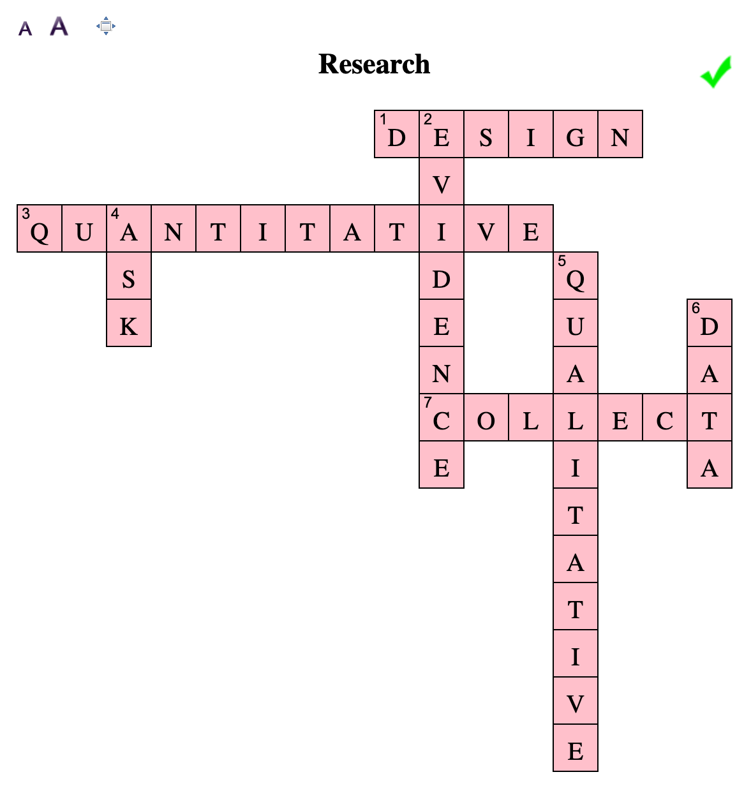
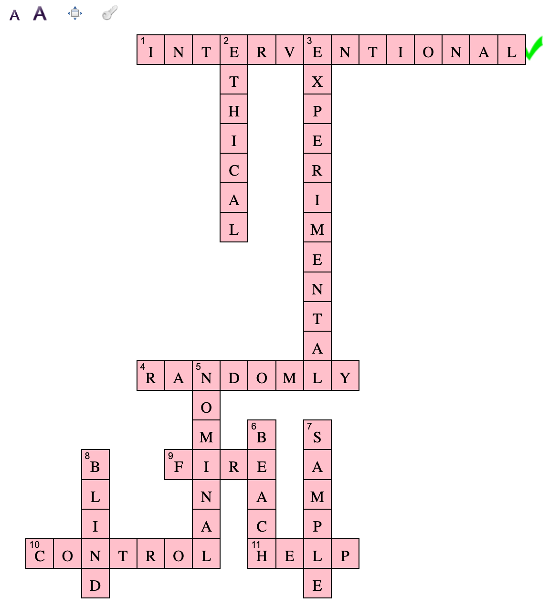

\part{Appendices}

# (APPENDIX) Appendices {-}


# Answers to exercises {#OptionalAnswers}

This Appendix contains answers to *most* (not all) exercises.
Some are fully worked, and some are only brief solutions.

* Answers to Teaching Week tutorial \@ref(Lecture1) (Teaching Week 1): Sect. \@ref(Lecture1Answers).
* Answers to Teaching Week tutorial \@ref(Lecture2) (Teaching Week 2): Sect. \@ref(Lecture2Answers).
* Answers to Teaching Week tutorial \@ref(Lecture3) (Teaching Week 3): Sect. \@ref(Lecture3Answers).
* Answers to Teaching Week tutorial \@ref(Lecture4) (Teaching Week 4): Sect. \@ref(Lecture4Answers).
* Answers to Teaching Week tutorial \@ref(Lecture5) (Teaching Week 5): Sect. \@ref(Lecture5Answers).
* Answers to Teaching Week tutorial \@ref(Lecture6) (Teaching Week 6): Sect. \@ref(Lecture6Answers).
* Answers to Teaching Week tutorial \@ref(Lecture7) (Teaching Week 7): Sect. \@ref(Lecture7Answers).
* No Optional Exercises in the Break week.
* Answers to Teaching Week tutorial \@ref(Lecture8) (Teaching Week 8): Sect. \@ref(Lecture8Answers).
* Answers to Teaching Week tutorial \@ref(Lecture9) (Teaching Week 9): Sect. \@ref(Lecture9Answers).
* Answers to Teaching Week tutorial \@ref(Lecture10) (Teaching Week 10): Sect. \@ref(Lecture10Answers).
* Answers to Teaching Week tutorial \@ref(Lecture11) (Teaching Week 11): Sect. \@ref(Lecture11Answers).


## Answers to Teaching Week 1 tutorial {#Lecture1Answers}


### Answer to Sect. \@ref(ResearchProcess) {.unlisted .unnumbered}

The process is:

1. **Ask** the question.
2. **Design** the study.
3. **Collect** the data.
4. **Describe** and **summarize** the data.
5. **Analyse** the data.
6. **Report** the results.
 
 
 
### Answers to Sect. \@ref(FormingRQs) {.unlisted .unnumbered}

1. Either is OK; they are just different. Note the different way a study can be addressed.  
   But importantly: neither RQ is actually helping answer the issue of the cafe owner!  
   For example, I  may be able to tell the difference between diet and regular cola...
   but I may like them both equally (i.e., the test rating is the same).
2. The cafe owner would *not allocate* drinkers to drink either diet or regular softdrinks,
   but just find those who were drinking either and ask them to rate the taste.
   I guess retrospective would be best.
3. The cafe owner would need to allocate drinkers to either diet or regular.
   Ideally, the drinkers would not know which they had consumed (really, that's next week's work).
   Ideally, the drinks would be allocated at random to receive diet or regular (next week too).
   Ideally a true experiment.
4. Experimental would be better;
   fewer things out of the researchers control.  
   Besides, people buy what they like...


### Answers to Sect. \@ref(UnderstandingTerminology1) {.unlisted .unnumbered}

You can use the **Glossary** in the textbook!


### Answers to Sect. \@ref(UnderstandingTerminology2) {.unlisted .unnumbered}

Answers implied by H5P.

More directly:

* P: People at an American college.
* O: The *average* time taken to walk 50m.
* C: Between the way subjects were using their phone.
* I: None: an observational study.
* Explanatory variable: The way that the phone is being used.
* Response variable: The time taken to walk 50&nbsp;m.
* Unit of observation: **Individual** subjects.
* Unit of analysis: **Individual** subjects.


### Answers to Sect. \@ref(CreateRQs) {.unlisted .unnumbered}

1. Many populations are possible. The "best" population: the easiest, or cheapest to get?
   All of the options are possibilities.  
2. "Relaxing":  Many options possible for quantifying this
   (heart rate? breathing rate? survey? *change* in heart rate before and after drinking the tea?).
3. Again, many options are possible, Some options for comparing to Earl Grey tea: 
   coffee; hot water; black tea; nothing at all; anything else but Early Grey; etc.
4. "Between before and after drinking Earl Grey tea" is *not* a comparison
   because everyone in the population (sample) is treated the same way:
   There are not two groups in the population being compared.
5. An example RQ might be:  

   "Among USC students (P),
   the average heart rate 30 minutes after drinking (O)
   is different between those who drink a cup of Earl Grey tea 
   and those who drinking a cup of hot coffee (C)
   when the drink is provided to them (I)".  
   
   I'm not saying this is the best;
   it is just an example.
6. Get volunteers; 
   place into one of the groups (Earl Grey and coffee); 
   give the beverage; measure heart rate after 30 mins.
   Note that many design issues are not covered until the next lecture,
   but you can introduce, and encourage, discussion 
   about some of the ideas if you wish (e.g. blinding).
7. An example RQ might be:  

   "Among USC students (P),
   the average heart rate 30 minutes after drinking (O)
   is different between those who drink a cup of Earl Grey tea 
   and those who drinking a cup of hot coffee (C)".
   I'm not saying this is the best;
   it is just an example.
8. Based on the above RQ:
   Find USC students who drink Earl Grey tea, and others who drink coffee,
   and measure their heart rate 30 minutes after they drink.  
   
   It would have a lot of confounding effects to account for.
9. For my RQ above:
   The volume of tea or coffee; brand of tea or coffee; how made; when beverage taken; 
   how long steeped for; how heart rate is measured; student (full-time only?); etc.
   You don't need to *define* these, but if you have time you can have a go at one or two definitions.
10. Many options, but for the RQ above: 
    Type of beverage; heart rate after 30 mins (or better, the *change* in heart rate).
    
    
    
    


### Answers to Sect. \@ref(Units) {.unlisted .unnumbered}

1. The unit of analysis is the *floorboard*: 
   because one board is compared to another;
	 because the hardness is a feature of each board, not each test;
	 because the two measurements on each board are not independent of each other (from the same board).
2. There are 5 units of analysis.
3. There are 10 units of observation.
4. Now, only one unit of analysis.
5. *Within* boards, the variation is small, apart from Board 1.  
   *Between* boards it is larger.


### Answers to Sect. \@ref(TypesOfStudies) {.unlisted .unnumbered}

Answers implied by H5P.

More directly:

1. Observational.
2. Quasi-experimental. The classes are determined by the *students*, 
   but the lecturer decides which class gets which treatment.


### Answers to Sect. \@ref(TerminologyLect1) {.unlisted .unnumbered}

Answers implied by the crossword:

```{r, echo=FALSE, out.width= "70%", fig.align="center"}

```


### Answers to Sect. \@ref(IdentifyingPoorRQs) {.unlisted .unnumbered}

1. Should be in terms of averages or means. So perhaps
   "Among watertanks used in southeast Queensland,
   are the **average** lead levels in tank water in concrete tanks higher than in poly tanks?"
2. *Everyone* dies!  So a time-frame is probably meant (i.e., twelve months after amputation). And compared to what?
   Perhaps something like: "Are lower-limb amputees more likely to die 12 months after amputation compared to upper-limb amputees?" or something. 
3. No defined population (frozen beans? fresh butter beans? tinned kidney beans? jelly beans? coffee beans? can sizes?); 
   "amount" of salt should be, for example, the "average" amount (or concentration) of salt, and per 100&nbsp;g or similar.
   "Is the mean amount of salt in tinned butter beans  the same for Woolworth's Select brand as for Edgells brand?"
   Anyway: You can look at the label (unless, of course, you wish to query those values).
4. Silly: elephants are huge, and joeys are tiny. No-one needs to test this.
   Also,the RQ talks about "weight" rather than "**mean** weight" too.
5. Needs to be more specific!
   Perhaps:
   "Is the mean reaction time different for males and females?" or similar.


### Answers to Sect. \@ref(TerminologyLead)


```{block2, type="answer"}
**1.** The *population* is: *a.* 2-year-old infants in Cincinnati.
**2.** The *outcome*: *c.* The average of the indexes of the 2-year neurobehavioural development.
**3.** The *comparison*: *b.* Between low-to-moderate pre/post exposure to lead and no pre/post exposure.
**4.** The *intervention*: *d.* There is no intervention.
**5.** The *unit of observation*: *b.* The children.
**6.** The *unit of analysis*: *b.* The children.
```


### Answers to Sect. \@ref(Units2)

```{block2, type="answer"}
**1.** The *units of analysis*:  *a.* The individuals ingots.
**2.** The *sample size* for his study: *d.* 80.
```


### Answers to Sect. \@ref(Units3)

```{block2, type="answer"}
**1.** The units of analysis: The fish tanks.
**2.** The type of experiment: True experiment.
```


## Answers to Teaching Week 2 tutorial {#Lecture2Answers}


### Answers to Sect. \@ref(LanguageReport) {.unlisted .unnumbered}

Answers implied by the crossword:


```{r, echo=FALSE, out.width= "70%", fig.align="center"}

```


### Answers to Sect. \@ref(AssessReport) {.unlisted .unnumbered}

1. **Outcome**: mortality *rate* or similar;
   **Response variable**: whether or not an *individual* baby survived.
2. **Comparison**: Between home and hospital births;
	 **Explanatory variable**: Where the baby is born (this is what *varies*)
3. Observational (retrospective) study.
4. Some are up for debate... 
   The point here is that confounding variables
	 are (potentially) related to **both** the response and explanatory variables.
    a. The maximum temperature on the day of giving birth: Neither? Possibly confounding?
    b. The health of the mother; Confounding (and hence extraneous, according to our definitions).
    c. The distance to the nearest hospital: Confounding (and hence extraneous, according to our definitions).
    d. The number of previous births by the mother: Not sure.  Possibly confounding.  I'd have to think more.
    e. Baby's gender: Probably neither. Related to mortality (male babies have higher infant mortality) but not to the place of birth.

5. Not experimental.
6. Observational (retrospective) study.
7. Possible RQ: "Among American mothers' births (P), is the neo-mortality rate (O) the same when giving birth at home
   compared to giving birth in hospital (C)?"
8. Cause-and-effect not reasonable (observational study).
9. Voluntary response.
   Data volunteered are likely to be more favourable than the data that was not volunteered.
   Limitations: many. For example, 
   mothers who have been told to expect a difficult birth would probably opt for an in-hospital birth.
10. This report doesn't suggest it is safer.
11. The headline is acccurate, but is certainly **not the complete story** as it implies cause-and-effect.


### Answers to Sect. \@ref(StudyFeatures) {.unlisted .unnumbered}

1. Yes: "They were randomly allocated to take palmolein ("B9") or canola ("T4") crisps for the first 3 weeks, 
   then (without a washout period) changed over to the other type, canola or palmolein for another 2 weeks".
2. It has: "the type of oil was known only by the food scientist..."
3. "the type of oil was known only by the food scientist..."
4. Probably.


### Answers to Sect. \@ref(SamplingParking)


```{block2, type="answer"}
Use a multi-stage sample:
Select a carpark at random, 
then a row of cars at random, 
then cars at random.
```

### Answers to Sect. \@ref(UnderstandTerminologyStudies)

```{block2, type="answer"}
**1.** The 'who' or 'what' which are observed, and for which data are collected: *F. Units of observation*.
**2.** A study where the researcher creates differences in the explanatory variable and measures the change in the response variable: *G. Experimental study*.
**3.** The result or effects of interest, across the population: *B. Outcome*.
**4.** What we 'do' to the individuals in the study: *H. Intervention*.
**5.** The question of interest to be answered by the study: *D. Research question*.
**6.** The larger group of individuals that are the focus of the study: *E. Population*.
**7.** The smallest independent 'who' or 'what' about which generalisations and conclusions are made, and for which information is analysed: *C. Units of analysis*.
**8.** A study where the researcher observes difference in the explanatory variable, and notices if these are related to changes in the response:  *A. Observational study*.
```


### Answers to Sect. \@ref(UnderstandFishoil)

```{block2, type="answer"}
**1.** Variables: risk of dying from heart disease (or mortality rate? It's a bit ambiguous) as response; whether they get fish oil and/or Vitamin E as explanatory.
**2.** True experimental, as  fish oil and Vitamin E are *given* to subjects, and the groups are determined by the researchers.
**3.** Randomization is not mentioned but probably used (a reporting issue); Control used (there is a placebo).
       Blinding: Not stated. Blocking: None indicated. Study seems well done, so no obvious lurking variables
       (however,
       all subjects did change their diet).
       Group allocated by researchers, so a true experiment.
**4.** Since experiment, lurking variables not an issue (if study well done).
**5.** Cause-and-effect relationship likely (if experiment well done).
**6.** Limitations: Study only looked at people who have had a heart attack, were on heart medication, and looks like all subjects were Italian, and *all* subjects changed to a healthy diet.
**7.** Units of observation: The individuals in the study. Units of analysis: The individuals in the study, as we are comparing the outcomes from each individual, and the outcome from each individual is independent of others. 
```


### Answer to Sect. \@ref(RandomAllocation)

```{block2, type="answer"}
**1.** Quite possibly: Confounding!
**2.** They could have been... though it would be unlikely.
```


### Answer to Sect. \@ref(EvaluatingReportsSugar)

```{block2, type="answer"}
**1.** Type of drink: Explanatory variable; nominal variable; qualitative variable.
**2.** Response variable; quantitative variable.
```


### Answers to Sect. \@ref(DesignTrees)

```{block2, type="answer"}
**1.** The first design (A).
**2.** The third design (C).
**3.** Depends on the research focus, but the second probably strikes a balance.
       The key identifying the source of variation that is likely to be the greatest, and allocate relatively more units there because that
       is the source of variation that is more important to quantify. 
**4.** Easiest would be the design using the smallest number of forests (Design A), as collecting data within a forest is likely to be more convenient than moving around to many forests.
```


## Answers to Teaching Week 3 tutorial {#Lecture3Answers}


### Answers to Sect. \@ref(UnderstandingHistograms) {.unlisted .unnumbered}

Answers implied by H5P.

1. Volume of drinks in 375ml: **Graph D**. (Students sometimes say Graph A, thinking that most cans have very similar amounts.)
2. Time in exam for **short** or **easy** exam: **Graph C**.
3. Time in exam for **long** or **hard** exam: **Graph B**.
4. The heights of females USC students: **Graph D**.
5. The *starting* salaries: **Graph C**. (Students sometimes say Graph B, thinking that salaries rise over time.)


### Answers to Sect. \@ref(IdentifyingGraphs1) {.unlisted .unnumbered}

Answers implied by H5P.

1. For this scenario, the **explanatory** variable is the number of hours of light each plant received.  
   For this scenario, the **response** variable is the number of flowers each plant received.  
   The units of **observation** are the individual plants.

2. For this scenario, the **explanatory** variable is the number of smokers at the restaurant.  
   For this scenario, the **response** variable is the concentration of fine particulate matter.

3. For this scenario, the **response** variable is the waiting time.  
   For this scenario, the **explanatory** variable is the time of admission.

3. For this scenario, the **explanatory** variable is the "Level of Playfulness".  
   For this scenario, the **response** variable is the "Level of Coping".


### Answers to Sect. \@ref(InterpretingGraphs) {.unlisted .unnumbered}

1. Female Weddell: about 260--270 cm long, vary from about 200 to 310 cm.
   Slight negative skewness; possible small outlier at about 170--180 cm.  
2. Dotchart.  (Too much data for a useful stem-and-leaf plot probably.)
3. Better with a title; some more labelled tick marks would be better.


### Answers to Sect. \@ref(CritiqueStudentGraphs1) {.unlisted .unnumbered}

1. A few issues...
   * The vertical axis is not labelled.  Presumably burn time in seconds.
   * The horizontal axis is not labelled.  We have no way of knowing what is happening there.

2. A few issues...
    * This is not a summary: This shows the burn-time of every individual candle. This makes it hard to compare *means*, which is the RQ.
   * Why is every bar labelled?  That just adds unnecessary clutter.
   * Fonts are hard too read (small). 
   * A boxplot (or dotchart) would be the appropriate graph.
   * The largest value is over 70 minutes! Do a *quick* project!
		
3. A few issues...
   * Compares just two numbers (means) using lots of ink.  
   * No indication of variation in the data.
   * A boxplot (or dotchart) would be appropriate.


### Answer to Sect. \@ref(HistogramBars)

```{block2, type="answer"}
*Histogram*: for quantitative (usually continuous) data;
*Bar chart*: for qualitative data.
```


### Answer to Sect. \@ref(SelectingGraphsH5P)


```{block2, type="answer"}

**1.** To display the relationship between the age of athletes, and the times taken for each athlete to complete the `beep test': *Scatterplot*
**2.** To display the percentage of elderly people in nursing homes that can independently complete
   a given task, for each of the seven tasks on a given list: *Bar chart* or *Dot chart*
**3.** To display the relationship between the type of fertiliser applied to a vegetable crop (either A, B or C)
   and the yield per hectare, measured over numerous plots:
   *Boxplot*
**4.** To display the distribution of the hardness measurements taken of 250 samples of bamboo: *Histogram* 
**5.** To display the relationship between the age of concrete test cylinders (under 5 years; 5 years and older)
   and their strength (fit for purpose; or not fit for purpose): *Side-by-side or stacked bar chart*
```


### Answers to Sect. \@ref(EvaluateGraphsAnts)

**1.** Observational; the ant nest would be pre-existing.
**2.** Both are 'ant nests'.
**3.** Looks good!
**4.** Uphill looks different to the other two. Also: the lower dots comprise mostly blue dots (Sourdough Trial), so perhaps a difference between locations too.


### Answers to Sect. \@ref(EvaluateGraphs1)


```{block2, type="answer"}
**1.** True experiment: Treatments given (experiment), and the researchers selected the groups, groups did not previously existed (so *true* experiment).
**2.** Observation: Each  patient. Analysis: The patient.
**3.** Pretty good.  A label on the horizontal axis would be better, but the caption does contain that information.
**4.** Pain is *reduced*.
**5.** Yes, probably. We cannot be sure due to randomness...
```


### Answer to Sect. \@ref(UnderstandGraphsPizza)

```{block2, type="answer"}
**Centre**: About 11.4 inches;
**Variation**: Most are between 11.0 and 12.3 inches;
**Shape**: Slightly skewed right (apart from that outlier...);
A small outlier (near 10.5 inches)
```


### Answer to Sect. \@ref(SelectGraph1)

```{block2, type="answer"}
**1.** Boxplot. **2.** Scatterplot.
```


## Answers to Teaching Week 4 tutorial {#Lecture4Answers}


### Answers to Sect. \@ref(UnderstandingBoxplots) {.unlisted .unnumbered}

1. The smallest jellyfish has a breadth of (approx.) 6mm. A median of 4mm is silly! The median is somewhere between 8 and 10mm
2. A typical Dangar Island jellyfish has a breadth of about 10mm,
   but the variation is from about 6 to 16mm.
   The data are slightly skewed to the right (most jellyfish have smaller breadths, but some have larger breadths), 
   but the shape is a bit funny 
   (more data would smooth it out). 
3. Site A is Dangar Island.  

   Jellyfish at Salamander Bay generally have a larger breadth:
   The median breadth at Salamander Bay (about 16mm) is greater than almost *all* the jellyfish at Dangar Island.  
   
   Jellyfish at Salamander Bay are a little less variable in terms of breadth.
   The distributions look slightly skewed right at both sites.


### Answers to Sect. \@ref(StatsMode) {.unlisted .unnumbered}


1. Descriptive RQ.
2. $\bar{x}=102.62$MPa; $s=5.356$MPa.  
3. The median is $101.1$MPa.
   The range is from $97.6$ to $111.2$, or $13.6$MPa.
4. Report none based on five values!  Too few data points! In any case, both the median and the mean have very similar values.
5. If all five measurements came from one board, we would not have a good representation of 'bamboo floorboards' in general. We would have just *one unit of analysis*.


### Answers to Sect. \@ref(UnderstandingVariation) {.unlisted .unnumbered}

Answers implied by H5P.

1. Median largest: **Class D**
2. Median smallest: **Class C**
3. Standard deviation largest: **Class A**
4. Standard deviation smallest: **Class D**


### Answers to Sect. \@ref(CritiqueStudentSummaries) {.unlisted .unnumbered}

1. A few issues...
    * Five decimal places is to the nearest 0.01 of a mm!
		* The standard deviation of the difference is *not* the difference between the individual standard deviations.
		* A standard deviation cannot be negative. (Same applies to standard errors, but we aren't there yet.)
		* Note that there is a sample size of 0 for the difference!
2. A few issues...
    * Five decimal places: That's accuracy to 0.00001 of a millimetre per second.  I don't think so...
		* There is no numerical measures of the most important thing and the thing the RQ (presumably) concerns:
		* The *differences* between the two brands.
		
		
		


### Answers to Sect. \@ref(CalculatorBatteries)

```{block2, type="answer"}
**1.** Observational: The 'treatment' (brand of battery) is not assigned; we simply take measurements from the batteries that exist.
**2.** Units of observation and units of analysis: The individual batteries.
**3.** *Energizer*: mean: $7.36$ hours; std dev: $0.289$.
	      *Ultracell*: mean: $7.41$ hours; std dev: $0.172$.
	      So Ultracell batteries are *slightly* better (last longer) on average, and more consistent performers.
**4.** *Energizer*: median: 7.46 hours.
	      *Ultracell*: median: 7.48 hours.
  	    So Ultracell batteries are *slightly* better (last longer) on average.
**5.** Probably median (outliers?), but mean and median are similar in any case.
**6.** Values are close.  Certainly no practically importance difference. Energizer batteries take, on average, *less* time to reach 1.0 volts, so are 'worse' in this regard.
	      They also have a lot more variation. But in practical terms, the difference is minimal.
	      (Based on means, the difference is 0.05 hrs, or 3 mins in over 7 hrs use!
	      Based on medians, the difference is 0.02 hours, or 1.2 mins!)
	      **The *practical* difference is negligible.**
**7.** Quite possibly, some very low values for both brands.
**8.** Yes: At the time of the study, the Ultracell batteries were substantially cheaper, and hence much better value.
```


### Answers to Sect. \@ref(InterpretHistogram)

```{block2, type="answer"}
FAS here is about 20--25 in general, ranging from 10 to 50 (which are actually the smallest and largest possible scores).
Here's is a detailed explanation.
**You are not expected to go to this detail!**
   The FAS is about 25 on average,
   ranging from about 10 to 50,
   slightly skewed right with no outliers.
   The distribution is unimodal.
   (The heights of the bars are,
   as best as I can figure,
   3; 14; 44; 34; 22; 17; 5; 3.)
   With $n=142$,
   the median is observation number 71.5,
   which is in the 25--30 bar.
   The quartiles will have about 35 in them,
   so $Q_1$ will be in the 20--25 bar,
   and $Q_3$ will be in the 30--35 bar.
   Histogram is pretty good; 
   bars really should be touching.
```


### Answers to Sect. \@ref(DrawBoxplot)
 
```{block2, type="answer"}
The median temperatures similar; a slight increase from Office A to C.
IQR similar for each office, and range similar for Offices A and C (slightly larger for Office B).
```
 
 
 
 
### Answers to Sect. \@ref(DrawBoxplot)

```{block2, type="answer"}
**1.** Not shown.
**2.** Office a a bit different (cooler) on average.
**3.** Perhaps Office A. 
```


### Answers to Sect. \@ref(SelectGraphs1)

```{block2, type="answer"}
**1.** Stacked or side-by-side barcharts;  whether bird injured or not, and whether upper or lower are both qualitative variables.
**2.** Boxplots would be OK; one quantitative (length-of-stay) and one qualitative (therapy type) variable.
**3.** Scatterplots; two quantitative variables (frequency; amount wheat consumed).   
**4.** Two-way table or stacked/side-by-side barchart, or table; two qualitative variables vars (30 mins of physical activity or not; vigorous physical activity or not).
```
 
 
 
### Answers to Sect. \@ref(Chapter4Drills)

```{block2, type="answer"}
**1.** Mean: 168.5714, or 168.57&nbsp;m. 
Standard deviation: 6.966279, or 6.97&nbsp;m. (Specifically, it is **not** 6.44952.)
The median: 169.9&nbsp;m.
**2.** Mean: 990.0791, or 990.079&nbsp;tonnes.
Standard deviation: 1588.514579, or 1588.5146&nbsp;tonnes. (Specifically, it is **not** 1485.919327.)
Median: 180.516&nbsp;tonnes.
**3.** Mean: 13.88778, or 13.888%.
Standard deviation: 2.617402, or 2.617%.
Median: 13.35%.
```

 
 

## Answers to Teaching Week 5 tutorial {#Lecture5Answers}


### Answers to Sect. \@ref(PercentagesOdds) {.unlisted .unnumbered}

Answers embedded.

1. 70% directly from the table.
2. $281/(404 - 281) - 2.28$.
3. For patients treated with ETI, about 278 die for every 100 that survive.
4. $2.78/2.28 = 1.22$.


### Answers to Sect. \@ref(WhichSummaryToUse) {.unlisted .unnumbered}

Answers implied by H5P.

1. Five variables. ('Participants' would not be summarised, it is technically an *identifier* and not a *variable*, as each person has a unique value).
2. Age; Height; Weight and quantitaive **continuous**.
3. Gender (**nominal**; two levels); GMFCS (**ordinal**; three levels)
4. As follows:
    * 'Gender': Percentages (or number) F and M
    * 'Age': Mean/median; standard deviation/IQR
    * 'Height':  Mean/median; standard deviation/IQR
    * 'Weight':  Mean/median; standard deviation/IQR
    * 'GMFCS': Percentages (or numbers) in each group
5. As follows:
    * 'Gender': Barchart (not really needed)
    * 'Age': Histogram/stemplot
    * 'Height':  Histogram/stemplot
    * 'Weight':  Histogram/stemplot
    * 'GMFCS': Barchart/piechart
6. As follows:
    * Between Gender and Height: Boxplot
    * Between Gender and GMFCS: Side-by-side or stacked bar chart.


 
 
 

### Answers to Sect. \@ref(TwoWayTables) {.unlisted .unnumbered}

1. $45\div 240=18.75$\% of all college students in the sample have received one concussion,
   the same for all student types.
2. Not sure which is best; they do different things. I'd probably prefer (c) (bottom left graph).
3. Odds (non-athlete receiving 2+ concussions) is $21\div(81-21) = 21\div 60 = 0.35$.
   Non-athletes are 0.35 times as likely to receive two or more concussions than fewer than two.
	 Or: For every 100 students with fewer than two concussions, there are 35 with two or more.
4. Odds (soccer player receiving 2+ concussions) is $13\div(63-13) = 13\div 50 = 0.26$.
	 Soccer players are 0.26 times more likely to receive two or more concussions than fewer than two concussions.
5. OR: $0.35 \div 0.26$, or about $1.35$.
	 The odds of a non-athlete receiving two or more concussions is about 1.35 times the odds
	 of a soccer player receiving two or more concussions (that is, smaller odds for soccer players).
6. Not given.
7. Not given.	
8. The better table is probably row percentages:
   The percentages of each type of students with given number of concussions.


### Answers to Sect. \@ref(Probability2) {.unlisted .unnumbered}

Answers embedded.

1. Relative frequency.
2. Relative frequency.
3. Subjective.
4. Relative frequency.
5. Classical.


### Answers to Sect. \@ref(DecisionMakingProcess) {.unlisted .unnumbered}

Answers implied by H5P.

1. The decision-making process begin with making an assumption about the population **parameter**.  
This means we know what to **expect** from the sample **statistic**. We never know exactly what value of the statistic we will see in the sample, because of **sampling variation**. But we can have some of idea of what values are reasonable to expect.  
Then we take the **sample** (that is, we make the observations).  
Then we **compare** the sample statistic that we observed... to the sample statistic we expected.  
If what we observe is inconsistent with what was expected, then the the assumption is **unlikely to be** true.  
However, if what we observe is **consistent** with what was expected, then the the assumption is **probably** true.

2. Step 1:  Assumption about population parameter  
   Step 2: Expectation for sample statistic  
   Step 3: Observation of sample statistic  
   Decision: Consistent?  
   Conclusion A: Yes, supports assumption  
   Conclusion B: No, doesn't support assumption

### Answers to Sect. \@ref(Odds1) {.unlisted .unnumbered}

Answers embedded.

1. Odds **less than** one.
1. Odds **less than** one.
1. Odds **greater than** one.
1. Odds **greater than** one.


### Answers to Sect. \@ref(WorkingWithOdds)

```{block2, type="answer"}
**1.** The *percentage* of bridges collapsing due to deterioration is *36* divided by *433*, or 8.3%.
**2.** The *odds* of a bridge collapsing due to deterioration is *36* divided by *397*, or 0.091.
**3.** The odds of a bridge collapsing due to deterioration is 0.091; this means:
*b. For every 100 bridges that do not collapse due to deterioration, about 9.1 bridges do collapse*.
**4.** The percentage of bridges *not* collapsing due to deterioration is *397* divided by *433*, or 91.7%.
**5.** The odds of a bridge *not* collapsing due to deterioration is *397* divided by *36*, or 11.0.
**6.** The percentage of bridge collapses due to collisions is *82* divided by *433*, or 18.9%.
**7.** The odds of a bridge collapsing due to collisions is *83* divided by *351*, or 0.234.
**8.** The odds of an event cannot be larger than one: *FALSE*.
**9.** The odds of an event cannot be smaller than one. *FALSE*.
**10.** The following statement is true:
*c. Odds cannot be negative*
```


### Answers to Sect. \@ref(OddsRatioSMND)


```{r, child = if (knitr::is_html_output()) 'Solution-SMND.Rmd'}
```


```{block2, type="answer"}
**1.** See Table \@ref(tab:SMNDAnswerTable).
**2.** $60/320 = 0.1875$. A worker with SMND is 0.1875 times as likely to have worked with metal than not. 
**3.** $33/344 = 0.096$.  A worker with SMND is 0.096 times as likely to have worked with metal than not. 
**4.** $0.1875/0.096 = 1.95$; the odds are about twice as great.
**5.** $60 \div 380 = 15.8$%.
**6.** $33\div 377 = 8.8$%.
**7.** Probably not: big difference seen in a large size sample.
```

```{r echo=FALSE, SMNDAnswerTable}
SMNDData <- array( dim=c(3, 3) )
colnames(SMNDData) <- c("Worked with metals", "Did not work with metals", "Total")
rownames(SMNDData) <- c("SMND cases", "Controls", "Total")

SMNDData[1,] <- c(60, 320, 380)
SMNDData[2,] <- c(33, 344, 377)
SMNDData[3,] <- c(93, 664, 757)

if( knitr::is_latex_output() ) {
   kable(SMNDData,
        format="latex",
        longtable=FALSE,
        booktabs=TRUE,
       # escape=FALSE, # For latex to work in \rightarrow
       #linesep = c( "\\addlinespace"), # Add a bit of space between all rows. 
       caption="SMND cases, and whether they had worked with metals",
        align=c("r", "r", "r", "r"))   %>%
   kable_styling(full_width=FALSE, font_size=10) %>%
  row_spec(0, bold=TRUE) #%>% # Columns headings in bold
#   column_spec(column=1, width="3cm") %>% 
#   column_spec(column=2, width="5cm") %>%
#   column_spec(column=3, width="5cm") %>%
#   column_spec(column=4, width="2cm")
}

if( knitr::is_html_output() ) {
  kable(SMNDData,
        format="html",
        align=c("r", "r", "r"),
        escape=FALSE,
        longtable=FALSE,
        caption="SMND cases, and whether they had worked with metals",
        booktabs=TRUE) # %>%
   #row_spec(row=1, bold=TRUE) %>%
#   column_spec(column=1, bold=TRUE)
   
}

```

### Answers to Sect. \@ref(PercentagesOdour)

```{block2, type="answer"}
**1.** Observational.
**2.** The percentage of residents in each area that detected the smell at the given frequency.
      So, for example, the first number in the first column would become $48\div 97\times 100 = 49.5$.
      This means that $49.5$% *of the sample that lived in Area I* detected the odour at least once a week.
**3.** For example, the percentage of residents who detected an odour at least once a week, who lived in Area I.
**4.** Probably column percentages.
**5.** $77\div291 = 26.46\%$.
```


### Answer to Sect. \@ref(Chapter5Drills)


```{block2, type="answer"}
**1.** 
a. $(381 + 345)/1347 = 0.53898$, or about 53.9%.
b. $(381 + 345)/(295 + 326) = 1.1691$, or about 1.17.
c. $345/326 = 1.05828$, or about 1.06.
d. $381/295 = 1.29153$, or about 1.29.
e. $1.05828 / 1.29153 = 0.81940$, or about 0.819.

**2.** 
a: $(240 + 138)/960 = 0.39375$, or 39.4%.
b: $(240 + 342)/960 = 0.60625$, or 60.6%.
c: $(240 + 240)/960 = 0.5000$, or 50%.
d: $(240 + 138)/(240 + 342) = 0.64948$, or about 0.649.
e: $240/240 = 1.000$.
f. $138/342 = 0.40351$ or about 0.404.
g. $0.40351/ 1.000 = 0.40351$ (i.e., the answer to f divided by the answer to e).
```


## Answers to Teaching Week 6 tutorial {#Lecture6Answers}


### Answers to Sect. \@ref(NormalIQs) {.unlisted .unnumbered}

Answers embedded.
Some answers:

1. In order from left to right:
   70; 85; 100; 115; 130.
3. 30 points above the mean.
4. Two standard deviations above the mean.
5. About 2.5%.

A person with an IQ of 85 has an IQ that is **15** points **below** the mean.  
This is equivalent to **1** standard deviation(s) **below** the mean IQ.  
Using the **68**--95--99.7 rule, this means that the proportion of the population with an IQ less than 85 is about **32**%. In addition, the proportion of the population with an IQ **above** 85 is about **68**%.


### Answers to Sect. \@ref(NormalHeights) {.unlisted .unnumbered}

1. Answers vary.
2. Answers vary.
3. Answers vary.
4. Answers vary.
   You probably cannot be very accurate using the 68--95--99.7 rule.
5. Answers vary.
6. Two standard deviations from the mean is $2\times 6.7 = 13.4$, so 95% of females aged 18 and over  have a measured height
   between $161.4 \pm13.4$ approximately, or from $148.0$cm to $174.8$cm.
7. As follows:
    * $z=(171-161.4)/6.7 = 1.43$, so the probability is $0.9236$ or about 92%.
    * So the odds are $92.36/(100-92.36) = 12.1$.
    * The answer is just $1-0.9236 = 0.0764$ or about 7.6%.
    * The probability of **over 171cm** is $7.64$%.
    * So the odds are $7.64/(100-7.64)= 0.084$.
    *  $z$-scores are $1.28$ and $2.78$, so the answer is $0.9973 - 0.8997 = 0.0976$,
      or about 9.8%. 
    * So the odds are $9.8/(100-9.8)=0.11$.

8. Use the Tables: $z=-0.84$; then using unstandardising formula,
   the height is $x=\mu+(z\times\sigma) = 161.4 + (-0.84\times6.7) = 155.772$,
   or about 156cm.

 

### Answers to Sect. \@ref(SEproportions) {.unlisted .unnumbered}

Answers implied by H5P.

\[
   \text{s.e.}(\hat{p}) = \sqrt{\frac{\hat{p}\times(1 - \hat{p})}{n}}
\]

* $\hat{p}$ is the *sample proportion*.
* $n$ is the *sample size*.
* "s.e." stands for "standard error".

### Answers to Sect. \@ref(CIPropBVM) {.unlisted .unnumbered}

1. $123/(404-123) = 123/281 = 0.44$.
2. $\hat{p} = 123/404 = 0.304455$.
3. The **odds**: The likelihood of surviving is about 0.44 times the probability of dying (ie. it is lower).
	Or: For every 100 that die, about 44 survive.
4. No: sampling variation!
5. $\text{s.e.}(\hat{p}) = \sqrt{0.304455 \times (1-0.304455)/404} = \sqrt{0.00052416} = 0.022894$, or about 0.023.
6. The values of $\hat{p}$ will have an approximate normal distribution,
   with a standard deviation equal to standard error ($0.023$) and centred around
   the true proportion $p$.
   Since we don't know $p$,
   we need to centre it around our best guess of $p$,
   which is $\hat{p}=0.304$. 
   So something like this:
7. A 95% CI: $0.304455 \pm (2\times0.022894)$,
   or $0.30446\pm0.04579$,
   or $0.26$ to $0.35$.
8. (Answer not yet provided.)
9. The number of surviving and non surviving both exceed 5.
10. Larger, to get a tighter (more precise) CI than the one calculated.
11. $n = 1/(0.01)^2 = 10\,000$ patients.
12. No answer given.
13. Use a stacked or side-by-side barchart, for example.
    But a chart is not really needed:
    Just give the information in text.
14. Odds of *not* surviving in ETI group is $(306/110) = 2.8$,
    so the OR is $(2.3/2.8) = 0.82$.
    The odds of a BV patient not surviving are 0.8 times as great as 
    the odds of an ETI patient not surviving.


### Answers to Sect. \@ref(NormalSOI)


```{r, child = if (knitr::is_html_output()) 'Solution-SOI.Rmd'}
```


```{block2, type="answer"}
**2.** $z=(20-0)/10 = 2$. The area or probability to the *right* is $0.0228$, or about $2.3$%.
**3.** The probability the SOI exceeds 20: $2.3$%. So odds: $2.3\div(100-2.3)$, or about $0.024$.
**4.** $z=(-25-0)/10 = -2.5$. The area to the *left* is $0.0062$, or about $0.6$%.
**5.** $z=(-12-0)/10 = -1.2$. The area to the *right* is $0.8849$, or about $88.5$%.
**6.** The two $z$-scores: $(-10-0)/10 = -1$ and $(20-0)/10 = 2$. The area *between* these is $0.9772 - 0.1587 = 0.8185$, or about $81.9$%.
**7.** The $z$ score corresponds to an area of $0.80$ to the *left*; from the tables, about $z=0.84$. This corresponds to an SOI of $0 + (0.84\times 10)$, or an SOI of about $8.4$.
```   


### Answers to Sect. \@ref(HM:Maturing)

```{r, child = if (knitr::is_html_output()) 'Solution-MatureLate.Rmd'}
```


```{block2, type="answer"}
**1.** Relational.
**2.** $\hat{p} = 352/2,864=0.12291$. 
**3.** $\text{s.e.(}\hat{p}) = \sqrt{0.12291 \times (1-0.12291)/2864} = 0.006135$.
**4.** An approximate 95\% CI is $0.12291 \pm (2\times0.006135)$, or $0.12291\pm0.01227$,
       or from $0.111$ to $0.135$.
       Either the '$0.123\pm 0.012$' form or the '$0.111$ to $0.135$' form is fine;
       percentages or proportions are fine
       (but **the calculations must done with the proportions, not the percentages**).
**5.** We need the number of boys who are late maturers and who are *not* late maturers to both be greater than 5.
       This is true, so the calculations are valid.
**6.** Smaller; the current sample size estimates $p$ to within $1.2\%$, and less accuracy needs fewer in the sample.
**7.** $n = 1/(0.02)^2 = 2500$ boys.
```


### Answers to Sect. \@ref(Chapter6Drills)

```{block2, type="answer"}
**1.** $\sqrt{0.70\times(1 - 0.70)/25} = \sqrt{0.084} = 0.2898275$, or about 0.2898.
**2.** $\sqrt{0.25\times(1 - 0.25)/100} = \sqrt{0.001875} = 0.04330127$, or about 0.04330.
**3.** 0.08724964, or about 0.08725.
**4.** 0.0534479, or about 0.05345.

**Note**: Students commonly forget to take the square root.

**Note**: If you calculator gives an answer something like `1.875 E-03` or similar, 
it is using **scientific notation**.
It means $1.875\times 10^{-3}$, or $0.001875$.
```


## Answers to Teaching Week 7 tutorial {#Lecture7Answers}


### Answers to Sect. \@ref(ConceptsMatches) {.unlisted .unnumbered}

1. This is just one box (one *observation*), but the claim is about the *population mean*.
   Some boxes will have more than 45, and some fewer.
2. Jake is correct in one sense: You can't have 0.9 of a match.
   But the value is the *mean* number, and that *can* be a decimal.
	 Suppose 10 boxes had 49 matches, and 10 boxes had 50 matches.... 
	 is the mean 49, or is it 50? Neither are correct; the mean is 49.5.     
3. Jake is confusing the *sample* and *population* mean.
   The claim is that the \emph{population} mean is $45$.
   The sample produced a mean of $44.9$.
   a *sample* mean and a *population* mean.
   Why should the mean of two different things be the same?
   It's like expecting your height and your Mum's height to be the same:
   they are both heights, but of different things.
   Why should they be the same?  

   Of course, every sample will produce a different sample mean.
   This sample may just have an unusually low number of matches.
4. The manufacturer is lying,
   or a sample that just happens to have a smaller number of matches: (bad) luck.
5. A CI gives some indication of the variation implied by the sample.
6. The standard error for the mean is $0.11\div\sqrt{20} = 0.0246$.
   So the approximate 95% CI is: $44.9 \pm (2\times 0.0246)$, or $44.9\pm 0.049$, or from $44.85$ to $44.95$.
7. No. A 95% CI may or may not contain the population mean.
   Of course, the manufacturer *may* indeed be lying...
   but we'd need to be cautious about making such a bold claim on just this evidence.
   Ideally, we would repeat this study a few times or take a larger sample.
   But it *is* looking suspicious...  

   If we had many, many sets of 20 matches boxes,
   95% of these sets of 20 would have a mean between 44.85 and 44.95.
8. $\bar{x}$ is the mean of the sample, so $\bar{x} = 44.9$.
9. $\mu$ is the mean of the population; the true mean if you like.
   $\mu$ is *claimed* to be 45, but the the value of $\bar{x}$ will, of course, vary.


      
      
### Answers to Sect. \@ref(CIPizzas) {.unlisted .unnumbered}

1. $\mu$ is the population mean diameter size of *all* EB pizzas;
   $\bar{x}$ is the mean diameter of the pizzas in the sample.
2. $\bar{x} = 11.486$ inches;
	 It's not sensible to quote the diameter
	 to $0.001$ of a cm; what is sensible?  

   We don't know the value of $\mu$, and we never will.
	 Our best *estimate* is the value of $\bar{x}$.
3. $s=0.24658$ inches.
   It's not sensible to quote the diameter
	 to $0.001$ of a cm though.  

   $\sigma$ is the standard deviation of the population.
	 We don't know the value of $\sigma$, and we never will.
4. $\displaystyle\text{s.e.}(\bar{x}) = s/\sqrt{n} = 0.24658/\sqrt{125} = 0.02205$.
5. The first measures the variation in the diameters of individual pizzas;
	 the second measures the precision of the sample mean when used to estimate the population mean.
6. Almost certainly not the same.
   Probably close to $\bar{x}=11.486$ inches.
   More precisely,
   probably within three standard errors ($3\times 0.022$) of $\bar{x}$.
7. Normal; mean $\mu$; std. dev is the standard error of 0.02205.
8. The approximate 95% CI is
   $11.486\pm (2\times 0.02205)$ or $11.486\pm0.044$,
   which is from 11.44 to 11.53 inches.
9. Based on the sample,
	a 95% confidence interval for the population mean for the pizza diameter
	is between $11.44$ and $11.53$ inches.
10. $n>25$ **or** $n\le 25$ and population has normal distribution.
11. We do not need to **assume** that $n>25$ because we know that it is.
			(We do *not* require that the sample or the population has a normal distribution.
			We require that the *sample means* have an approximate normal distribution,
			which they will if $n>25$.)
			So the CI is statistically valid.
12. Population mean diameter probably not 12 inches based on the CI.
13. Compute: \[n=\left(\frac{2\times 0.24658}{0.04}\right)^2 = 152.004\] at least, so we would need 153 pizzas.


### Answers to Sect. \@ref(CIImplant) {.unlisted .unnumbered}

1. **Descriptive**:
   Every subject is treated the same way; we are not comparing two groups that have been treated differently.
2. $\mu_d$ is the mean difference in the target population; $\bar{d}$ is the mean difference in this sample.
3. Each measurement is measured after and before on the same subject.
4. $32$; $12$; $24$; $30$; $8$; $14$; $14$; $28$; $38$; $49$.
   (Differences in the other direction are also acceptable;
   it just changes the signs of these differences snd so on.
   **Importantly,
   the direction should be stated somewhere.**)
5. It makes more sense to define directions this way,
   so that the difference is the *increase* in 2MWT.
6. $\bar{d} = 24.9$; $s_d=13.03372$
7. $\text{s.e.}(\bar{d}) = s_d/\sqrt{n} = 13.03372/\sqrt{10} = 4.121623$.
   This is the standard deviation of the sample mean difference,
   a measurement of how precisely the sample mean difference measures
   the population mean difference.
8. Almost impossible.
   Sample means vary every time we take a sample around the true mean difference,
   with a normal distribution with standard error $4.12$.
   Since we don't know $\mu$,
   the best we can say is that the sample mean will vary about our best guess of the
   population mean; in other words,
   the sample means vary around $24.9$ with a standard deviation of about $4.12$. 
9. Normal; mean $\mu$, std deviation is the standard error of 4.121.
10. $24.9\pm (2\times 4.121623)$, or $24.9\pm 8.243246$, or from $16.65675$ to $33.143245$m.
11. We are 95% confident that the population 2MWT *increases* by a mean amount between $16.7$ and $33.1$m.
12. Either (or both) of these must be true:
    (i) the population has a normal distribution,
    and/or 
    (ii) the sample size is large enough so that the sample means have a normal distribution,
    so about larger than 25.
13. Since $n<25$, we need to assume the population of differences has a normal distribution.
    A stem-and-leaf plot suggests this is not unreasonable,
    so the sample means quite possibly have an approx.\ normal distribution:
14. (Recall we haven't done hypothesis testing in this context yet!)
    Looks pretty likely that the 2MWT distances are higher after receiving the implant.
15. $n=(2\times 13.03372\div 5)^2 = 27.18$, so need data from at least $28$ amputees.


### Answers to Sect. \@ref(RoomWidthCI)


```{r, child = if (knitr::is_html_output()) 'Solution-RoomWidth.Rmd'}
```


```{block2, type="answer"}
**1.** $\bar{x}=16.02$m.
**2.** $s=7.145$m; $\text{s.e.}(\bar{x}) = s/\sqrt{n} = 7.145/\sqrt{44} =  1.077$m. The first is a measure of the variation in the original data;
       the second is a measure of the precision of the sample mean when estimating the population mean.
**3.** The CI is from 13.85 to 18.19m.
**4.** 95% CI for population mean guess: 13.85 to 18.19m.
**5.** The population of differences has a normal distribution, and/or $n>30$ or so.
**6.** Since $n>30$, all OK if the histogram isn't severely skewed. Probably OK.
**7.** Not really; the CI doesn't contain the true width.
       But was this just due to the metric units... or perhaps students are just very poor at estimating widths in general!
       In fact, the Professor also had the students estimate the width of the hall in imperial units also, as a comparison.
```


### Answers to Sect. \@ref(RoomWidthCISampleSize)

```{r, child = if (knitr::is_html_output()) 'Solution-RoomWidthSS.Rmd'}
```


```{block2, type="answer"}
$n=(2\times 7.145\div 0.5)^2 = 816.8$, so use guesses from 817 students.
```


### Answers to Sect. \@ref(LanguageOfSStats)

```{block2, type="answer"}
1. Researchers [@data:Nataraja1999:concrete] examined the strength of fibre reinforced concrete,
   by using a study design called an *experiment*.  
   
   In batch 1, a *sample* of size 30 was used; 
  the sample mean number of blows till the first crack appeared in the test cylinders was 98, 
  and the amount of variation in the number of blows was measured using the *standard* deviation as 54.  
  Because the data are a sample, the sample mean will estimate the population mean with some sampling *error*.


2. A type of study called an *experiment* compared the handwriting legibility for school children (Ryan et al., 2010)
   having cerebral palsy when using specialty school furniture with standard school furniture 
   (which acted as a *control*).  

   They used a *random* sample of size 30 from children registered at their facility in Canada.  

   The *sample* mean for the difference in legibility was -0.1, and a 95% *confidence* interval 
   was from $-0.8$ to $0.6$.  
   
   Using the standard equipment, the smallest value recorded for legibility was 19, 
   and the largest was 34, so the *range* was 15.
  
```


### Answers to Sect. \@ref(CIPairedWaves)
	
```{block2, type="answer"}
**1.** Because each method is used in each sea state.
**3.** $\bar{d}=0.06167$; $s_d = 0.2901$. The mean difference is positive: Method 1 measurements slightly higher (on average) than Method 2.
**4.** $\text{s.e.}({\bar{d}})= s_d/\sqrt{n} = 0.2901/\sqrt{18} = 0.0684$. 
			$\text{s.e.}({\bar{d}})$ measures the precision with which the sample mean difference	estimates the population mean difference.
**5.** $0.06167\pm(2\times 0.0684)$, which is $0.06167 \pm 0.137$, or from $-0.075$ to $0.199$ Newton--metres.
**6.** Since $n<30$, we require that the *differences* in the population have a normal distribution.
**7.** The stem-and-leaf plot of the *sample* doesn't suggest the *population* is non-normal.
**8.** Since the CI includes zero, possibly the population mean difference could be zero.
```


### Answers to Sect. \@ref(CIPairedRunners)

```{r, child = if (knitr::is_html_output()) 'Solution-RunnerCI.Rmd'}
```


```{block2, type="answer"}
**1.** $\mu_d$ is the mean difference in the target population; $\bar{d}$ is the mean difference in this sample.
**2.** Each plasma $\beta$ measurement is measured after and before on the same runner.
**3.** The *direction* of the difference should be clearly stated.
**4.** $\bar{d} = 18.736$; $s_d=8.3297$
**5.** $\text{s.e.}(\bar{d}) = s_d/\sqrt{n} = 8.3297/\sqrt{11} = 2.5115$.
       This is the standard deviation of the sample mean difference,
       a measurement of how precisely the sample mean difference measures
       the population mean difference.
**6.** Almost impossible.
         The sample means would vary every time we took a sample,
         around the true mean difference
         with a normal distribution having a standard error of about $2.51$.
         Since we don't know the population mean,
         the best we can say is that the sample mean will vary about our best guess of the
         population mean; in other words,
         the sample means will vary around $8.33$ with a standard deviation of about $2.51$. 
**7.** $18.736\pm (2\times 2.5115)$, or $18.736\pm5.023$, or from $13.7$ to $23.8$ pmol/litre.
**8.** We are 95% confident that the population $\beta$ plasma concentration *increases* by a mean amount between $13.7$ and $23.8$ pmol/litre, during the fun run.
**9.** Either (or both) of these must be true: the population has a normal distribution,
         and/or the sample size is large enough so that the sample means have a normal distribution,
         so about larger than 25.
**10.** Since $n<25$, we need to assume the population of differences has a normal distribution.
        The stem-and-leaf plot suggests this is not unreasonable,
        so the sample means quite possibly have an approx. normal distribution:
**11.**  Looks likely that the plasma $\beta$ concentrations are higher after the race.
**12.** $n=(2\times 8.3297\div 2.5)^2 = 43.45$, so need data from $44$ runners.
```


## Answers to Teaching Week 8 tutorial {#Lecture8Answers}


## Answers to Teaching Week 9 tutorial {#Lecture9Answers}

### Answers to Sect. \@ref(CIRatLifetimes) {.unlisted .unnumbered}

1. The two groups are completely different.
1. The **parameter** of interest is the *difference between the population mean lifetimes*, say $\mu_R - \mu_F$.
2. The 95% CI is the *bottom* one: from $223.34$ to $346.13$ days.
3. The best of these is Option (e)...
   but in practice,
   we usually think about CIs in terms of Option (d).
4. The CI explanation can be improved by:
   (i) indicating *which* diet leads to larger average lifetimes; and 
   (ii) providing sample summary info.  
   
   Here is a better answer:  
   
   "The 95\% confidence interval for the difference between the populations mean lifetimes of rats
   on the restricted diet
   (sample mean: 968.8 days; std dev: 284.6 days)
   and
   on the free-eating diet 
   (684.0 days; std dev: 134.1 days)
   is that rats on a restricted diet live between
   $223.34$ and $346.13$ days longer."
5. Since the sample is large,
   we must have that the two samples are independent (which is reasonable).
   (**The figure is not needed.**)
6. The boxplots show the variation in the lifetimes of individual rats.
   The error bar chart displays the variation that the sample means would be expected to show
   from sample to sample. 
 
   
   
   
   
   
### Answers to Sect. \@ref(OddsSoftware) {.unlisted .unnumbered}

Some answers embedded.

1. See Table \@ref(tab:MaturationDataANS).
1. Use a side-by-side barchart, for example, if necessary.
1. Odds of boys  maturing late: $352\div(2\,864-352) =  0.1401$.
   Thus boys are 0.1401 times more likely to mature late than not. 
1. Odds of girls  maturing late: $336\div(2\,328) =  0.1443$.
   Thus girls are 0.1443 times more likely to mature late than not. 
1. Hence, to compare boys to girls: $0.1401\div 0.1443 = 0.971$.
1. The **parameter** of interest is the *population odds ratio* of late maturing, comparing boys to girls.
1. From software: OR is 0.971, and 95% CI is from 0.828 to 1.139.
1. See Table \@ref(tab:MaturationSummaryANS).
1, The difference could be explained by sampling variation, or because there is a real difference...

```{r echo=FALSE, MaturationDataANS}
MaturationData <- array( dim=c(3, 3) )
colnames(MaturationData) <- c("Matured late", "Did not mature late", "Total")
rownames(MaturationData) <- c("Males", "Females", "Total")

MaturationData[3,3] <- 2864+2664
MaturationData[1,1] <- ""
   
if( knitr::is_latex_output() ) {
   kable(MaturationData,
        format="latex",
        longtable=FALSE,
        booktabs=TRUE,
       # escape=FALSE, # For latex to work in \rightarrow
       #linesep = c( "\\addlinespace"), # Add a bit of space between all rows. 
       caption="Maturation and gender",
        align=c("r", "r", "r", "r"))   %>%
   kable_styling(full_width=FALSE, font_size=10) %>%
  row_spec(0, bold=TRUE) #%>% # Columns headings in bold
#   column_spec(column=1, width="3cm") %>% 
#   column_spec(column=2, width="5cm") %>%
#   column_spec(column=3, width="5cm") %>%
#   column_spec(column=4, width="2cm")
}

if( knitr::is_html_output() ) {
  MaturationData[1,3] <- 2864
  MaturationData[2,3] <- 2664
  MaturationData[3,1] <- 352+336 
  MaturationData[3,2] <- (2864-352) + (2664-336)

  MaturationData[1,1] <- 352
  MaturationData[2,1] <- 336
  MaturationData[1,2] <- 2864-352
  MaturationData[2,2] <- 2664-336
  
  kable(MaturationData,
        format="html",
        align=c("r", "r", "r"),
        escape=FALSE,
        longtable=FALSE,
       caption="Maturation and gender",
      booktabs=TRUE) # %>%
   #row_spec(row=1, bold=TRUE) %>%
#   column_spec(column=1, bold=TRUE)
   
}

```


```{r echo=FALSE, MaturationSummaryANS}
MaturationSumm <- array( dim=c(3, 3) )
colnames(MaturationSumm) <- c("Percentage maturing late", "Odds  maturing late", "Sample size")
rownames(MaturationSumm) <- c("Males", "Females", "Odds ratio")

MaturationSumm[3,3] <- "626"
   
if( knitr::is_latex_output() ) {
   kable(MaturationSumm,
        format="latex",
        longtable=FALSE,
        booktabs=TRUE,
       # escape=FALSE, # For latex to work in \rightarrow
       #linesep = c( "\\addlinespace"), # Add a bit of space between all rows. 
       caption="Maturation and gender: Numerical summary",
        align=c("r", "r", "r", "r"))   %>%
   kable_styling(full_width=FALSE, font_size=10) %>%
  row_spec(0, bold=TRUE) #%>% # Columns headings in bold
#   column_spec(column=1, width="3cm") %>% 
#   column_spec(column=2, width="5cm") %>%
#   column_spec(column=3, width="5cm") %>%
#   column_spec(column=4, width="2cm")
}

if( knitr::is_html_output() ) {
  MaturationSumm[3,1] <- ""
  MaturationSumm[3,3] <- ""
  
  MaturationSumm[1,3] <- 2864 
  MaturationSumm[2,3] <- 2664 
  
#  MaturationSumm[3,1] <- webex::fitb(num=TRUE, tol=0.001, width=6, answer=47 )
#  MaturationSumm[3,2] <- webex::fitb(num=TRUE, tol=0.001, width=6, answer=579 )

  MaturationSumm[1,1] <- round(352/2864*100, 1)
  MaturationSumm[2,1] <- round(336/2664*100, 1)

  MaturationSumm[1,2] <- round(352/2512, 4)
  MaturationSumm[2,2] <- round(336/2328, 4)

  MaturationSumm[3,2] <- round( (352/2512)/(336/2328), 5)

  kable(MaturationSumm,
        format="html",
        align=c("r", "r", "r"),
        escape=FALSE,
        longtable=FALSE,
       caption="Maturation and gender: Numerical summary (Enter percentages to one decimal place. Enter odds and odds ratio to three decimal places)",
      booktabs=TRUE) # %>%
   #row_spec(row=1, bold=TRUE) %>%
#   column_spec(column=1, bold=TRUE)
   
}

```


### Answers to Sect. \@ref(HTOneMean-A) {.unlisted .unnumbered}

1. The **parameter** of interest is the *population mean pizza diameter*, say $\mu$.
1. From the output: $\bar{x} = 11.486$ and $s=0.247$.
1. Use $\text{s.e.}(\bar{x}) = s/\sqrt{n} = 0.247/\sqrt{125} = 0.02205479$.
1. $s$ tells us the variation in diameter from pizza to pizza.
   $\text{s.e.}(\bar{x})$ tells us how much the sample mean is likely to vary from sample to sample, in sample of size 125.
1. The hypotheses are:  

   $H_0$: The mean diameter is 12 inches; or $\mu=12$.  
   $H_1$: The mean diameter is not 12 inches; or $\mu\ne 12$
1. Two-tailed, because the RQ asks if the diameter is 12 inches, or not.
1. The normal distribution has a mean of 12, and a 
   standard deviation of $\text{s.e.}(\bar{x}) = 0.02205$.
1. $t = -23.3$.
1. $t=(11.486-12)/0.02205 = -23.3$.
1. The $t$-value is *huge* (and negative), so the $P$-value is *very* small.
   (Two-tailed $P<0.001$ from the table or from software.)
1. Very strong evidence exists in the sample
   ($t=-23.3$; $\text{df}=124$; two-tailed $P$ less than 0.001)
   that the population mean pizza diameter
   of pizzas from Eagle Boys' is less than 12 inches
   (sample mean diameter: $11.49$ inches; std. dev.: $0.246$;
   95% CI from $11.44$ to $11.53$ inches; approximate 95% CI is $11.486\pm 0.0441$)
   (Note: The CI was computed in the Week~8 tutorial; or use $t=1.98$.)
1. Since $n$ is much larger than $30$,
   we do not require that the population has a normal distribution,
   just that the population is not grossly non-normal;
   the sample means will still have an approximate normal distribution.
1. *Very* unlikely!


### Answers to Sect. \@ref(RoomWidthTest)

```{r, child = if (knitr::is_html_output()) 'Solution-RoomWidthHT.Rmd'}
```


```{block2, type="answer"}
**1.** $s=7.145$m; $\text{s.e.}(\bar{x}) = s/\sqrt{n} = 7.145/\sqrt{44} =  1.077$m.  The first measures variation in the original data;
         the second measures precision of the sample mean when estimating the population mean.
**2.** The CI is from 13.85 to 18.19m.
**3.**  Strong to moderate evidence exists in the sample (one sample $t=2.714$; $\text{df}=43$; two-tailed $P=0.010$)
         that the population mean guess (mean: 16.02m; standard deviation: 7.145m)
         of the students is not 13.1m (95% CI for population mean guess: 13.85 to 18.19m).
**4.** The population of differences has a normal distribution, and/or $n>30$ or so.
**5.** Since $n>30$, all OK if the histogram isn't severely skewed. Probably OK.
**6.** Not really! But was this just due to using metric units? Perhaps students are just very poor at estimating widths...
       In fact, the Professor also had the students estimate the width of the hall in imperial units also, as a comparison.

```


### Answers to Sect. \@ref(PizzaHT).

```{r, child = if (knitr::is_html_output()) 'Solution-PizzaWidthHT.Rmd'}
```


```{block2, type="answer"}
**1.** Observational.
**2.** Relational.
**3.** Two completely separate samples are compared.
**4.** $-0.774$ to $-0.560$ inches (differences are Dominos less Eagle Boys).
**5.** The 95% CI for the difference in population means pizza diameters between EB and DOM pizzas from $0.774$ to $0.560$ inches, larger for EB.
**6.** Since the sample sizes are large (both 125), we *do not require that the populations have normal distributions*.
**7.** The sample sizes are large ($n=125$ in each), so we don't need the populations to be normally distributed; **we don't need the histogram**.
**8.** Probably yes. Amount of topping on the pizza? Which *tastes* better? Whether the samples were randonly selected or not?
```


### Answers to Sect. \@ref(GeneralIdeas2)


```{r TermsANSWER, echo=FALSE}
Terms <- array( "No", dim=c(6, 2))

colnames(Terms) <- c("Applies to $\\mu$",
              "Applies to $\\bar{x}$")

rownames(Terms) <- c("Has a standard error",
              "Refers to the population",
              "Refers to the sample",
              "Value is known before the sample is taken",
              "Value is unknown until sample is taken",
              "Value is estimated")


Terms[c(2,4,6) ,1] <- "YES"
Terms[c(1,3,5) ,2] <- "YES"


if( knitr::is_latex_output() ) {
  kable(Terms,
      format="latex",
      booktab=TRUE,
      align=c("r", "r"),
      escape = FALSE, # Makes the  $\\mu$ (e.g.) work in latex
      linesep=c("\\addlinespace", "", "\\addlinespace", "", "\\addlinespace", ""),
      caption="Which terms apply when? Tick the appropriate places in the table") %>%
  kable_styling(full_width=FALSE) %>%
  kable_styling(full_width=FALSE) %>%
  row_spec(0, bold=TRUE)
}
```


### Answers to Sect. \@ref(OddsGMfood)

```{r, child = if (knitr::is_html_output()) 'Solution-GMFoodsCI.Rmd'}
```


```{block2, type="answer"}
**1.** $H_0$: No association between income level and opinion of GM foods in the population;
       $H_1$:  An association between income level and opinion of GM foods in the population.
**2.** Odds HIE: $263/151 = 1.742$. HIE is 1.74 times more likely to be for GM foods than against.
**3.** Odds LIE: $258\div222 = 1.162$. LIE is 1.16 times more likely to be for GM foods than against.
**4.** $\text{OR}(\text{HIE in favour})\div\text{OR}(\text{LIE in favour}) = 1.742/ 1.162 = 1.5$ ($1.499$ in table). The odds of HIE being for GM food 1.5 times the odds that a LIE for GM foods.
**5.** From the sample, we estimate the OR in the population to be between $1.145$ to $1.961$.
       (Loosely, though technically incorrect: the true OR is likely to be between 1.145 and 1.961.) Importantly, this interval does not include 1.
```


## Answers to Teaching Week 10 tutorial {#Lecture10Answers}


### Answers to Sect. \@ref(HT-TwoMeans-A) {.unlisted .unnumbered}

1. The two groups are completely different; cannot determine how to pair. Indeed, the sample sizes are different.  

   Each rat, of course, must be in just one group (they measure lifetimes!).  

   It is paired: For each unit of analysis, there are two observations.
2. The null hypothesis is that there is no difference in the mean lifetimes of the two groups of rats.
   In symbols (where $\mu$ represents the mean lifetime in the population):  
   
   $H_0$: $\mu_R = \mu_{FE}$; and $H_1$: $\mu_R > \mu_{FE}$; **one**-tailed, because of the RQ.
3. If we took many samples of the same size from the population,
   the mean differences would vary from sample to sample.
   The 'standard error of the difference' tells us how much the sample mean will vary from sample to sample.
   It is is the standard deviation of this variation in sample means.
4. The variation in the sample means is small:
   The population means are estimated quite precisely. The means look different.
5. Either sampling variation, or the diets really are different.
6. We always use the not-equal variance (Welch's test) row:
   $t=9.161$; $\text{df}=154.94$; one-tailed $P<0.0005$ (test is one-tailed).
   The evidence contradicts $H_0$.
7. The differences are defined as the *Mean restricted-diet lifetime* minus the *Mean Free-eating diet lifetime*;
   we see this as the (poorly-labelled) "Mean difference" column is positive,
   and the only way to get this value positive is to subtract them in this order.
8. Very strong evidence exists in the sample
   ($t=9.161$ for two independent samples; $\text{df}=154.94$; one-tailed $P<0.0005$) 
   that the population mean lifetime of
   rats on a restricted diet (mean lifetime: 968.75 days; std. dev.: 284.6)
   is greater than rats on a free-eating diet (684.01 days; 134.1)
   (95% CI for the difference from 223.3 to 346.1 days).
9. The two samples are independent; the sample means have a normal distribution,
   so:
   the population has a normal distribution, and/or $n>30$ or so.
10. The sample sizes here are quite large so we should be OK, 
   as the Figure suggests not very severe non-normality.
11. Rats from the same litter are likely to be similar to each other.
   The litter would probably be the unit of analysis then, not the individual rat.


### Answers to Sect. \@ref(PValues) {.unlisted .unnumbered}

1. *Less than* 0.05.
2. Greater than 0.05.
3. *Less than* 0.003.
4. Greater than 0.05.
5. Greater than 0.05.
6. Very small.


### Answers to Sect. \@ref(TestsPairedImplants) {.unlisted .unnumbered}

1. Before and after measurement on same amputee.
2. $H_0$: $\mu_d=0$, differences defined as 'with' minus 'without'. 
   $H_1$: $\mu_d>0$ the way I defined differences.  

   We are explicitly seeking to test for an *improvement*, so the test is one-tailed.
   (Diffs in the other direction are also OK;
   the signs of the differences and some other subsequent things change.)
3. The standard error of the mean is the standard deviation of the sample mean diff in plasma concentrations,
   a measurement of how precisely the sample mean difference estimates the population mean diff.
4. Mean increase: $\bar{x} = 24.9$m; Standard deviation: $s=813.034$m; standard error: $4.122$m.
5. $t=6.041$ and since $t$ is very large, expect $P$ to be very small.
   (The one-tailed $P$ less than $0.0005$ from Table A.2.)  
   
   The differences have just been defined in the opposite directions.
   (Notice the $P$-values are the same.)
6. Very strong evidence exists in the sample
   (paired $t=6.041$; one-tailed $P$ less than $0.0005$)
   that the population mean 2MWT are higher after receiving the implant
   compared to without the implant
   (mean difference: $24.9$m higher after receiving the implant; standard deviation: 13.034m;
   95% CI from $15.58$ to $34.224$m).
7. The population of differences has a normal distribution,
   and/or $n>25$ or so.
8. Since $n<25$, must assume the population of differences has a normal distribution.
   The histogram suggests this is not unreasonable.


### Answers to Sect. \@ref(MatchRQHypothesis) {.unlisted .unnumbered}

Answers implied by H5P.

*Null* hypotheses:

* At Subway, is the mean length of a 12-inch sub really 12 inches?  
  $\mu = 12$
* At Subway, is the mean length of a 12-inch sub different for white and wholemeal subs?  
  $\mu_{\text{white}} = \mu_{\text{wholemeal}}$
* At Subway, is the proportion of 12-inch subs that are shorter than 12 inches different
for white and wholemeal subs?  
  $p_{\text{white}} = p_{\text{white}}$
* At Subway, is the mean length of a 12-inch sub longer for white (compared to wholemeal) subs?
  $\mu_{\text{white}} = \mu_{\text{wholemeal}}$

*Alternative* hypotheses:

* At Subway, is the mean length of a 12-inch sub really 12 inches?  
  $\mu \ne 12$
* At Subway, is the mean length of a 12-inch sub different for white and wholemeal subs?  
  $\mu_{\text{white}} \ne \mu_{\text{wholemeal}}$
* At Subway, is the proportion of 12-inch subs that are shorter than 12 inches different
for white and wholemeal subs?  
  $p_{\text{white}} \ne p_{\text{white}}$
* At Subway, is the mean length of a 12-inch sub longer for white (compared to wholemeal) subs?
  $\mu_{\text{white}} > \mu_{\text{wholemeal}}$


### Answers to Sect. \@ref(TestsForORs) {.unlisted .unnumbered}

Some answers embedded.

1. See Table \@ref(tab:ArtLimbMortalityANS).
2. Using artificial limb: $49/16 = 3.0625$.
   Not using artificial limb: $21/19 = 1.105263$.
   The OR is $3.0625/1.105263 = 2.771$;
   that is, the odds of being alive after five years is almost three times
   higher for those using an artificial limb compared to those who do not.  
   
   See Table \@ref(tab:ArtLimbSummaryANS).
3. The CI for the OR is from $1.198$ to $6.411$.
4. Chi-squared: $5.836$; like $z = \sqrt{5.836/1} = 2.42$: large; $P$ about $0.016$.  

   The *sample* provides evidence to suggest that the odds of dying within five years
   is not the same 
   between having a wearing an artificial limb and the five-year mortality rate *in the population*
   ($\text{chi-square}=5.836$; $\text{df}=1$; $P=0.016$; OR: $2.771$ and 95% CI from 1.198 to 6.411).


```{r echo=FALSE, ArtLimbMortalityANS}
ArtLimb <- array( dim=c(3, 3) )
colnames(ArtLimb) <- c("Alive", "Dead", "Total")
rownames(ArtLimb) <- c("Used art. limb", "Did not use art. limb", "Total")

  ArtLimb[1,3] <- 65
  ArtLimb[2,3] <- 40
  ArtLimb[3,1] <- 70
  ArtLimb[3,2] <- 35

  ArtLimb[1,1] <- 49
  ArtLimb[2,1] <- 21
  ArtLimb[1,2] <- 16
  ArtLimb[2,2] <- 19
  
ArtLimb[3,3] <- 105
   
if( knitr::is_latex_output() ) {
   kable(ArtLimb,
        format="latex",
        longtable=FALSE,
        booktabs=TRUE,
       # escape=FALSE, # For latex to work in \rightarrow
       #linesep = c( "\\addlinespace"), # Add a bit of space between all rows. 
       caption="Five-year mortality for artifical limb users",
        align=c("r", "r", "r", "r"))   %>%
   kable_styling(full_width=FALSE, font_size=10) %>%
  row_spec(0, bold=TRUE) #%>% # Columns headings in bold
}

if( knitr::is_html_output() ) {

  
  kable(ArtLimb,
        format="html",
        align=c("r", "r", "r"),
        escape=FALSE,
        longtable=FALSE,
       caption="Five-year mortality for artifical limb users",
      booktabs=TRUE) # %>%
   #row_spec(row=1, bold=TRUE) %>%
#   column_spec(column=1, bold=TRUE)
   
}

```


```{r echo=FALSE, ArtLimbSummaryANS}
ArtLimbSumm <- array( dim=c(3, 3) )
colnames(ArtLimbSumm) <- c("Percentage alive after 5 years", "Odds alive after 5 years", "Sample size")
rownames(ArtLimbSumm) <- c("Use artificial limb", "Did not use artifical limb", "Odds ratio")

  ArtLimbSumm[3,1] <- ""
  ArtLimbSumm[3,3] <- ""
  
  ArtLimbSumm[1,3] <- 65
  ArtLimbSumm[2,3] <- 40
  
  ArtLimbSumm[1,1] <- round(49/65*100, 1)
  ArtLimbSumm[2,1] <- round(21/40*100, 1)

  ArtLimbSumm[1,2] <- round(49/16, 2)
  ArtLimbSumm[2,2] <- round(21/19, 2)

  ArtLimbSumm[3,2] <- 2.771

  
ArtLimbSumm[3,3] <- 626
   
if( knitr::is_latex_output() ) {
   kable(ArtLimbSumm,
        format="latex",
        longtable=FALSE,
        booktabs=TRUE,
       # escape=FALSE, # For latex to work in \rightarrow
       #linesep = c( "\\addlinespace"), # Add a bit of space between all rows. 
       caption="Five-year mortality and use of an artificial limb: Numerical summary",
        align=c("r", "r", "r", "r"))   %>%
   kable_styling(full_width=FALSE, font_size=10) %>%
  row_spec(0, bold=TRUE) #%>% # Columns headings in bold
#   column_spec(column=1, width="3cm") %>% 
#   column_spec(column=2, width="5cm") %>%
#   column_spec(column=3, width="5cm") %>%
#   column_spec(column=4, width="2cm")
}

if( knitr::is_html_output() ) {

  kable(ArtLimbSumm,
        format="html",
        align=c("r", "r", "r"),
        escape=FALSE,
        longtable=FALSE,
       caption="Five-year mortality and use of an artificial limb: Numerical summary",
      booktabs=TRUE) # %>%
   #row_spec(row=1, bold=TRUE) %>%
#   column_spec(column=1, bold=TRUE)
   
}

```


### Answers for Sect. \@ref(PvalueStatement)

```{block2, type="answer"}
The difference in odds is statistically significant, so 
**either 2. or 4. is consistent with this conclusion**...
and we cannot tell which.
The size of the OR is not the issue here: 
if the sample OR is statistically different from 1, it does not tell us much about the population OR except that it is (most likely) not one.

**2.** The odds are quite different, but not statistically significant, so chance cannot be ruled out as the reason why the OR is different from one. (This likely has a smaller sample size.)
**3.** The odds are a little different, but not statistically significant, so chance cannot be ruled out as the reason why the OR is different from one.
```


### Answers for Sect. \@ref(TablesHepC)

```{block2, type="answer"}
**1.** Incorrect is the one about means.
**2.** $113/626 = 18.05\%$.
**4.** 18.05% of 47 is 8.48. See Table \@ref(tab:TattHepTabANS).
**5.** $25\div 88 = 0.284$.
**6.** $22\div 491 = 0.0448$.
**7.** The OR is $0.284\div 0.0448 = 6.3$. This OR means that the odds of having Hep. C is 6.3 times greater
       for students who have a tattoo, compared to those who do not have a tattoo.
       
```


```{r echo=FALSE, TattHepTabANS}
TattHep <- array( dim=c(3, 3) )
colnames(TattHep) <- c("Had Hep. C", "Did not have Hep. C", "Total")
rownames(TattHep) <- c("Had tattoo", "Did not have tattoo", "Total")

  TattHep[1,3] <- 113
  TattHep[2,3] <- 513
  TattHep[3,1] <- 47
  TattHep[3,2] <- 579

  TattHep[1,1] <- 25
  TattHep[2,1] <- 22
  TattHep[1,2] <- 88
  TattHep[2,2] <- 491
  
TattHep[3,3] <- 626
   
if( knitr::is_latex_output() ) {
   kable(TattHep,
        format="latex",
        longtable=FALSE,
        booktabs=TRUE,
       # escape=FALSE, # For latex to work in \rightarrow
       #linesep = c( "\\addlinespace"), # Add a bit of space between all rows. 
       caption="Five-year mortality for artifical limb users",
        align=c("r", "r", "r", "r"))   %>%
   kable_styling(full_width=FALSE, font_size=10) %>%
  row_spec(0, bold=TRUE) #%>% # Columns headings in bold
#   column_spec(column=1, width="3cm") %>% 
#   column_spec(column=2, width="5cm") %>%
#   column_spec(column=3, width="5cm") %>%
#   column_spec(column=4, width="2cm")
}

if( knitr::is_html_output() ) {

  kable(TattHep,
        format="html",
        align=c("r", "r", "r"),
        escape=FALSE,
        longtable=FALSE,
       caption="Five-year mortality for artifical limb users",
      booktabs=TRUE) # %>%
   #row_spec(row=1, bold=TRUE) %>%
#   column_spec(column=1, bold=TRUE)
   
}

```


### Answers to Sect. \@ref(IdentifyCorrectAnalyses)

```{block2, type="answer"}
**1.** Two-sample $t$-test.
**2.** A $\chi^2$ test.
**3.** A paired $t$-test.
**4.** A two-sample $t$-test.
**5.** None of the other options are correct: requires regression or correlation.
```


### Answer for Sect. \@ref(TwoMeansHurricanes)

```{block2, type="answer"}
No evidence  of a difference in the mean number fatalities
between female- and male-named hurricanes.
```


### Answer to Sect. \@ref(AssumptionsGraphs)

```{block2, type="answer"}
The sample sizes are both much *larger* than 25,
so neither sample needs to be normally distributed
for **statistical validity**:
The *sample means* will have an approximate normal distribution.
**None of the graphs are needed.**
```


### Answers for Sect. \@ref(TwoMeansBatteriesHT)

```{r, child = if (knitr::is_html_output()) 'Solution-BatteryHT.Rmd'}
```


```{block2, type="answer"}
**1.** $H_0$: $\mu_E = \mu_U$ (that is, the means are the same in the two populations) and $H_1$: $\mu_E\ne\mu_U$,
      which can also be expressed in words. Two-tailed.
**2.** The precision with which the sample mean battery life estimate the population mean battery life.
**3.** Use the second row (though it matters little here): $t=-0.486$; $\text{df}=13.1$ and $P=0.635$.
**4.** The sample presents no evidence ($t=-0.486$; $\text{df}=13.0$ and $P=0.635$) of a difference in the mean lifetimes 
      (mean difference: $-0.0544$; s.e.: $0.112$) of the batteries in the population.
      (95% CI for the difference from $-0.30$ to $0.19$mins
      in favour of Ultracell.)
**5.** Both population have a normal distribution,
      and/or $n>30$ or so.
**6.** Since $n<30$ for both samples, we must assume the populations both have a normal distribution.
      Stem-and-leaf plots aren't convincing (possible outliers)
      but the samples are too small to know anything for sure.
```


### Answers to Sect. \@ref(ORTestsByss)

```{block2, type="answer"}
**1.** The third one. The first is about samples. The  second is about means.
$H_0$: $\text{Pop. odds having byss.}_{\text{Smokers}} = \text{Pop. odds having byss.}_{\text{Non-Smokers}}$ or $\text{OR}=1$;
$H_1$: $\text{Pop. odds having byss.}_{\text{Smokers}} > \text{Pop. odds having byss.}_{\text{Non-Smokers}}$ or $\text{OR}>1$ for the OR suitably defined.  (One-tailed, from RQ).
**3.** Smokers: $\hat{p} = 125/3,189 = 0.0392$; Non-smokers: $\hat{p} = 40/2,230 = 0.0179$.
**4.** For smokers: $\text{Odds having byssinosis} = 125/3,064 = 0.0408$.   
       This means:
			 smokers are 0.041 times as likely to have byssinosis than not
			 (or, inverting the ratio, 24.5 times as likely not to have byssinosis than have it).
       For non-smokers: $\text{odds} = 40/2,190 = 0.01826$.
			 Non-smokers are 0.018 times as likely to have byssinosis than not
			 (or, inverting the ratio, 54.8 times as likely not to have byssinosis than have it).
**5.** The OR is $0.04080/0.01826 = 2.2$, so the odds of a smoker having byssinosis are 2.2 times the odds of a non-smoker having byssinosis. 
**6.** OR not one could be due to chance or because of a real difference in the population, due to smoking and/or other reasons.
**7.** The sample provides strong evidence 
			 (one-tailed $P<0.001)$; $\text{df}=1$; $\text{chi-square}=20.092$; OR: $2.234$ ($95$% CI: $1.6$ to $3.2$))
			 that the population proportion of smokers with byssinosis ($\hat{p} = 0.0392$) is greater than
       the population proportion of non-smokers with byssinosis ($\hat{p} = 0.0179$).
**8.** Valid, since expected counts all exceed five (which they do: no SPSS warnings given for example).
```


### Answers to Sect. \@ref(ORAirways)

```{r, child = if (knitr::is_html_output()) 'Solution-AirwaysHT.Rmd'}
```


```{block2, type="answer"}
**1.** The null hypothesis is that the proportion (or the odds) of successful attempts is the same using EGTA and LM, in the two populations.
**2.** Using symbols, based on using proportions: $H_0$: $p_{\text{EGTA}} =   p_{\text{LM}}$; $H_1$:  $p_{\text{EGTA}} \ne p_{\text{LM}}$ (two-tailed).
**3.** The sample presents insufficient evidence ($\text{chi-square}=2.63$; $\text{df}=1$; $P=0.104$) that the success rates between EGTA and LM are different in the population.
**4.** Yes: All expected counts are greater than 5 (no SPSS warning messages).
**5.** No evidence of a difference, so perhaps consider other issues such as cost, longevity, pain associated with insertion etc.
```


### Answers to Sect. \@ref(PairedTestRunners)

```{r, child = if (knitr::is_html_output()) 'Solution-RunnerHT.Rmd'}
```


```{block2, type="answer"}
**1.** Before and after measurement on same runner.
**2.** $H_0$: $\mu_d=0$, differences defined as 'after' minus 'before'. $H_1$: $\mu_d>0$ the way I defined the differences.  
       We are explicitly seeking to test for an *increase*, so the test is one-tailed.
       (Diffs in the other direction are also OK; the signs of the differences and some other subsequent things change.)
**3.** Mean increase: $\bar{x} = 18.73$ pmol/litre; Standard deviation: $s=8.3297$ pmol/litre; standard error: $2.511$ pmol/litre.
**4.** $t=7.46$ and $\text{df}=11-1=10$. Since $t$ is very large, expect $P$ to be very small.
       (The one-tailed $P$ less than $0.0005$ from Table A.2.)
**5.** Very strong evidence exists in the sample (paired $t=7.46$; $\text{df}=10$; one-tailed $P$ less than $0.0005$)
       that the population mean $\beta$ plasma concentrations are higher after the race compared to before the race
       (mean difference: $18.73$ pmol/litre higher after the race; std. dev.: 8.33 pmol/litre;
       95% CI from $13.14$ to $24.33$ pmol/litre).
**6.** The population of differences has a normal distribution, and/or $n>30$ or so.
**7.** Since $n<30$, must assume the population of differences has a normal distribution. The histogram suggests this is not unreasonable.
```


## Answers to Teaching Week 11 tutorial {#Lecture11Answers}


### Answers to Sect. \@ref(UnderstandCorrelations) {.unlisted .unnumbered}

1. The correlations:

   **Plot 1**: $0.94$ (correlation **A**);  
   **Plot 2**: $-0.95$ (correlation **D**);  
   **Plot 3**: $0.12$ (correlation **B**):  
   **Plot 6**: $0.75$ (correlation **C**).  
   
   Correlation is inappropriate for **Plot 4**) (non-linear) and **Plot 5** (non-linear).
2. Examples of the direction in **Plot 1**:
   Any two variables moderately positively correlated,
   such as  height and weight,
   distance lived from university and travel time, etc.
3. Examples of direction in **Plot 2**:
   Any two variables moderately negatively correlated, such as 
   hours of weekly exercise and body weight,
   number of SCI110 tutorial missed and final mark, etc.
4. These are:  
   
   **Plot 1**: $88.4$%;  
   **Plot 2**: $90.3$%;  
   **Plot 3**: $1.4$%;  
   **Plot 6**: $56.3$%.
5. The answers:

    a. No answer. But a line is fine for **Plot 1**, **Plot 2**, **Plot 3** (but very weak!) and **Plot 6**, 
       but not for **Plot 4** and **Plot 6**. 
    b. My **very rough** slope estimates are:  
       **Plot 1**: $(50-10)/10 \approx 4$;  
       **Plot 2**: $(20 - 50)/15 \approx -2$;  
       **Plot 3**: $0$;  
       **Plot 6**: $(55 - 35)/5 = 4$.
    c. My **very rough** intercept estimates are:  
       **Plot 1**: $8$;  
       **Plot 2**: $40$;  
       **Plot 3**: $32$;  
       **Plot 6**: $10$.
    d. My very rough estimates are:  
       **Plot 1**; $\hat{y} = 8 + 4x$;  
	     **Plot 2**: $\hat{y} = 40 -2x$;  
	     **Plot 3**: $\hat{y} = 32$;  
	     **Plot 6**: $\hat{y} = 10 + 4x$. 		


### Answers to Sect. \@ref(InterpretRegressions) {.unlisted .unnumbered}

1. Approximately linear, negative, reasonably strong.
2. Condition, extras (air con, etc.), sedan/hatch, colour, when rego due, new/old tyres, location, etc.
3. No answer.
4. Looks to be expensive, as $15,000 would be above the line (at least for the line I'd draw).
5. Probably $3900.
6. My guess is about $b_0\approx 17$ or $17,000.
	This would mean the average price of a 2014 second-hand Corolla
	can be expected to be about $17,000.  
7. $b_1 = (1 - 17)/(16-0)\approx -1$. That is,
   the price reduces by about $1000 each year older the Corolla gets.
8. Using the above, we have $\hat{y} = 17 - x$ approximately.
   Guessing the regression line won't, 
   of course,
   produce this level of precision, so anything close-ish to this is fine.
9. $\hat{y} = 16.54 - 0.96x$ (jamovi) or $\hat{y} = 16.536 - 0.963x$ (SPSS),
	where $y$ is the price in thousands of dollars,
	and $x$ is the age in years.
10. $r = -0.929$, and so $R^2 = (-0.929)^2 = 0.863$, or about 86%, 
    so about 86% of the variation in prices can be explained by age alone.
    The rest can be explained by the car's condition,
	 odometer reading, accessories, service history, etc.
11. jamovi: $\hat{y} = 16.54 - (0.96\times 20) = -2.66$, or -\$2660.  
    SPSS: $\hat{y} = 16.536 - (0.963\times 20) = -2.72$, or -\$2720.  
	 This is clearly silly, as we are extrapolating.
12. jamovi: $\hat{y} = 16.54 - (0.96\times 6) = 10.78$, or \$10,780.  
    SPSS: $\hat{y} = 16.536 - (0.963\times 6) = 10.76$, or \$10,760.  
	 So the price seems a bit steep,
	 unless it is highly specified and in great condition.
13. Hardly need a test...
    $H_0$: $\beta_1=0$ vs $H_1$: $\beta_1<0$.
	 From output, $t=-15.059$, and $P=0.000/2=0.000$:
	 very strong evidence that older cars fetch lower second-hand prices, on average.
14. $-0.963\pm(2\times 0.064)$, or $-0.963\pm 0.128$, or from $-1.091$ to $-0.835$.
15. Looks the same really, just reflected left-to-right.
    * *Size* of $r$ won't change, sign from negative to positive; i.e. $r=0.93$.
    * Value of $R^2$ will be the same.
	 * Slope will be the same except sign will change (in both cases, the values on the horizontal axis are one year apart).
    * Intercept will change a lot... it is the predicted value of the price if the line is extended to year 0 
      (which is, of course, meaningless).

     	 


### Answers to Sect. \@ref(IdentifyCorrectAnalysisAgain).


```{r, child = if (knitr::is_latex_output()) 'Solutions/Lect10-A4.Rmd'}
```


### Answers to Sect. \@ref(ReadScatterplotHeathers)

```{r, child = if (knitr::is_html_output()) 'Solution-Heather.Rmd'}
```


```{block2, type="answer"}
**1.** 'What is the relationship between stem age and stem diameter in heather in the central north island of NZ?'
**2.** Pretty good!  Too many tick marks; horizontal-axis labels would be better horizontal.  
**3.** $r = \sqrt{0.431} = 0.6565$, or about $r=0.66$. Positive linear relationship, reasonably strong.
**4.** $\hat{y} = (0.311 \times 20) + 1.531 = 7.751$.
**5.** Slope of $0.311$: For each extra year of age, the stem diameter increases by about $0.311$&nbsp;mm on average.
       Intercept of $1.531$: For stems of zero years of age, the average stem diameter is about $1.531$&nbsp;mm.
       This interpretation is silly. A close look at the graph shows that this is extrapolation anyway: the data only start at about 3 years of age.
```


## Answers to Teaching Week 12 tutorial {#Lecture12Answers}

### Answers to Sect. \@ref(CIConcrete) {.unlisted .unnumbered}

1. Both students are incorrect as they used $s$ rather than $\text{s.e.}(\bar{x})$.
    * Student A:
      This is an approximate 68% CI for the values of individual concrete samples, not for the mean,
      **assuming the individual first-crack strengths have an approximate normal distribution**.
    * Student B:
      This is an approximate 95% CI for the values of individual concrete samples, not for the mean,
      **assuming the individual first-crack strengths are approximately normally distributed**.
2.  We need to use the *standard error* because the question asks
      about a sample mean... and standard errors tells us how much the sample means are likely to vary.
      $12.4\pm(2\times 2.8\div\sqrt{6})$, or $12.4\pm 2.286$ MPa, or from $10.11$ to $14.69$ MPa.


### Answers to Sect. \@ref(CritiqueReports1) {.unlisted .unnumbered}

* **Research question:** Use *mean* distance.
  So more directly:  
  
> For casual golfers, 
> is the *mean* distance travelled by a golf ball the same 
> when hit by a wooden or metal club?

* **Summaries:** 
  There is no mention of the distance travelled by the ball.
  It really doesn't make sense to say 'the iron golf club' is 'moderately higher than the wooden golf club'.
  That sounds like the height of the clubs are different!
* **Results (1):**
  Spelling/grammar errors ('verse'; 'differes').
  Is two decimal places suitable? Certainly no more.
  The CI is for the difference between the *means* of hitting distances. 
* **Results (2):**
  The results just say there is a difference between metal and wooden clubs (of course!);
  there is no mention of hitting distance.


### Answers to Sect. \@ref(CritiqueReports2) {.unlisted .unnumbered}

* **Null hypothesis:** The *mean* heart rates.
* **Results:** A $\chi^2$ test is inappropriate for comparing means.


### Answers to Sect. \@ref(CritiqueReports3) {.unlisted .unnumbered}

* **Research question**: Spelling error ('lily pily'); *mean* size.
  It sounds odd, too, to ask if they 'become' longer.
  We are just comparing the mean length of leaves of eastern and western sides.
* **Null hypothesis**: Spelling again; and the hypothesis should be explicitly comparing the *means*:
  "For weeping lilly pilly trees at USC,
   it the mean leaf length the same for leaves on the western and eastern sides of the tree?"
* **Results**: Cannot find the mean of a qualitative variable ('Side of tree');
  the table should give the mean, standard deviation and standard error
  for leaves taken from the west side (one row) and the east side (second row),
  plus information about the *difference*.
* **Methods**: There are only five units of analysis.
  Leaves taken from the same tree are likely to share a lot in common:
  genetics; sunlight, watering regime, soil condition, etc.
  The students should have used 50 trees.  

  Alternatively, I suppose they could have used one tree (so the RQ was about what happens on one tree only),
  and compared 50 leaves on either side.
  While this is kinda OK, I do **not** recommend it.


### Answers to Sect. \@ref(CritiqueReports4) {.unlisted .unnumbered}

* **Research question**: Cumbersome wording...; *mean* estimates.
* **Null hypothesis**: Spelling/grammar errors; *mean* again;	where does 'increased level of perception' come from?
  We are just comparing estimation distances; perception is much more than just that.
* **Results**: This doesn't answer the question.
  This is comparing the estimates from both groups---and yes, there may be a difference.
  But the RQ was about which group could estimate closer (on average) to the actual true width of the path.
  We still don't know: The RQ was not answered.
* **Discussion**: You don't *prove* anything like this...
  Again, what was tested doesn't help answer the RQ.
  
  
  
  
### Answers to Sect. \@ref(WhatTestToUse)

$t$-test: Age as it is the only quantitative variable.  The rest would use a chi-square test.
Between the 'alive' and 'dead' groups,
there is evidence that the proportion with diabetes is different and whether or not a (prosthetic) limb was fitted.

```{r, child = if (knitr::is_html_output()) 'Solution-WhichTest.Rmd'}
```


### Answers to Sect. \@ref(ReadDesks)

**1.** P: school age children with ambulatory cerebral palsy; O: In this case, the hand-writing legibility;
       C: Between scores made when using standard and specialty furniture; I: The furniture configurations imposed.
**2.** True experiment, as treatments were imposed (experiment), and the researchers allocated children to the groups (true experiment).
**3.** Unit of observation: Each students.
       Unit of analysis: Each student, as the two measurements from each student are related to the same person.
       The students are compared.
       So this is a paired analysis.
       A paired-$t$ test.
**4.** Blinding not used, as students would know the desk configurations were different.
       No blinding, so double blinding is not used.
       However:
       The assessors are blinded to the intervention,
       as assessor unaware of furniture configuration,
       so assessor does not influence outcomes (unintentionally).
**5.** Sample mean: $30.7$; $s=3.3$.
**6.** Standard errors $\text{s.e.}(\bar{x})=3.3\div\sqrt{30} = 0.60249$; the approximate CI is $30.7\pm(2\times0.60249)$, or $30.7\pm 1.2$; from $29.5$ to $31.9$.
**7.** The sample provides no evidence (paired $t$: $-0.30$; $\text{df}=29$; two-tailed $P=0.77$) of a population mean difference
         between the handwriting legibility when performed using standard 
         ($30.7$; standard deviation: $3.3$) and speciality furniture configurations ($30.6$; $3.3$; 95% CI for the difference from $-0.8$ to $0.6$).
**8.** No.


### Answer to Sect. \@ref(ReadErrors)

**1.** P: Medical 'teams' working in paediatric resuscitations; O: Number and type of drug errors; C: None; I: None.
**2.** Descriptive.
**3.** Prospective observational.
**4.** For example: Study is only a mock (not real) situation, due to ethics. Hawthorne effect: subjects know they are being watched.

