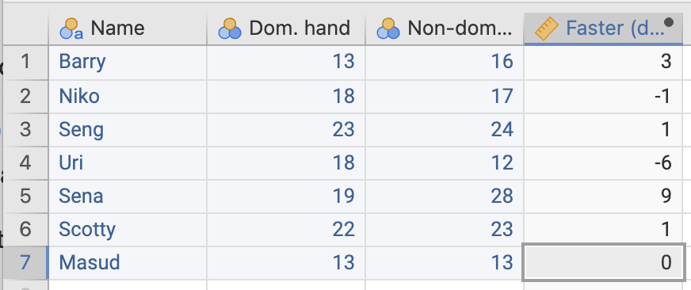

# Thoughts for teaching {#NonOptionalAnswers}

Some information for tutors only.
`r if (knitr::is_html_output()) {
   '[<span style="color: white;">.</span>](#TutorInfo)'
}`


## Tutor information {#TutorInfo .unlisted .unnumbered}

This Appendix contains some thoughts on teaching in the tutorial.

* [Introductory information](#IntroInfoTutor) for use in the Teaching Week \@ref(Lecture1) Tutorial.
* [Information](#Lecture1ThoughtsForTutors) for Teaching Week \@ref(Lecture1) Tutorial.
* [Information](#Lecture2ThoughtsForTutors) for Teaching Week \@ref(Lecture2) Tutorial.
* [Information](#Lecture3ThoughtsForTutors) for Teaching Week \@ref(Lecture3) Tutorial.
* [Information](#Lecture4ThoughtsForTutors) for Teaching Week \@ref(Lecture4) Tutorial.
* [Information](#Lecture5ThoughtsForTutors) for Teaching Week \@ref(Lecture5) Tutorial.
* [Information](#Lecture6ThoughtsForTutors) for Teaching Week \@ref(Lecture6) Tutorial.
* [Information](#Lecture7ThoughtsForTutors) for Teaching Week \@ref(Lecture7) Tutorial.
* Break from new material in Teaching Week \@ref(Lecture8).
* [Information](#Lecture9ThoughtsForTutors) for Teaching Week \@ref(Lecture9) Tutorial
* [Information](#Lecture10ThoughtsForTutors) for Teaching Week \@ref(Lecture10) Tutorial.
* [Information](#Lecture11ThoughtsForTutors) for Teaching Week \@ref(Lecture11) Tutorial.
* [Information](#Lecture12ThoughtsForTutors) for Teaching Week \@ref(Lecture12) Tutorial.


## Introductory information for use in the Teaching Week 1 tutorial {#IntroInfoTutor .unlisted .unnumbered}


[**Return to index of tutor information.**](#TutorInfo)

As part of the first tutorial, you **may** wish to use some introductory activities
so students can get to know each other.
This is important for helping students to form groups (for their group work assignments).


### Introduction to course {.unlisted .unnumbered}

* **Course introduction**:
  Briefly introduce the course if necessary,
  but remember that I have instructed students to read the Course Outline
  and the Canvas information,
  and have emailed them lots of information too.
  
* **Approach**:
  Most SCI110 students are in their first year at USC, and everything is new!
  Be gentle, caring, patient, helpful, personable.
* **Structure**:
  Here is one way to structure this class (you don’t have to use (or like) it):

  * Explain why they are doing SCI110.
  * Group them according to where they live (may be helpful for finding near-by group members): 
    Chat and learn three names.
  * Line up by hours per week they think is needed for this course.
    (USC courses are designed for 10--12 hours per week, including classes, every week; 
    a lot of work is needed outside class times!)
  * Line up by the average number of hours of paid work they expect to do per week.
  * Line up by what they think the cost of SCI110 is
    (remind them they don't have \$1000 to waste, 
    so take advantage of all that we offer).
  * Then discuss the pre-semester fun survey (see below).
  * You may even like to open Canvas and show students where the 
    Modules, Discussions, Check your Progress questions, etc. are located.
  * Then do some content questions.
  
  
### Fun survey {#FunSurvey .unlisted .unnumbered}

Before the start of the semester, students were sent a link to a short, mainly fun, online survey. 

We can use it to open some discussions.
Here’s an example, using the percentage of females/males:

* Ask them to guess the percentage of males or females in SCI110 *this* semester. 
  Some will look at their class: is this a good guesstimate? Why or why not?
* Reveal that about 65% of USC students are female. Does this change their guess?
* Then reveal the survey results. 
  Have students comment on the closeness or otherwise of their guesses.
* Point out that the survey results are not from the whole class. 
  How close do they think the survey percentages are to the true percentage? 
  Within 1%? 5% 10% of the true value? 
  How many would we need in our sample to get a percentage to within 1% of the true percentage?
  What if (say) males were less likely to answer the survey than females?
  Does the voluntary aspect cause you to doubt the accuracy and precision of the answers?
* How could you ensure that the sample results were as close as possible to the true answers?

That covers a lot of good territory really...


[**Return to index of tutor information.**](#TutorInfo)


## Thoughts on Teaching Week 1 tutorial  {#Lecture1ThoughtsForTutors .unlisted .unnumbered}

<!-- Lecture1ThoughtsForTutors -->

[**Return to index of tutor information.**](#TutorInfo)


### Thoughts on Sect. \@ref(CreateRQs) {.unlisted .unnumbered}

```{block2, type="rmdTutorInfo"}
One way to manage this:
Arrange students into groups, 
and have each group discuss Parts 1, 2 and 3 separately.
Then have each group share their answer with the class and discuss.
	
Or: Have one person from each of Group 1, 2 and 3 form new groups
(all containing someone from each group) to discuss the parts.
	
The last two parts of this question can be done by groups separately,
then have the groups share with other groups.


*Encourage and promote student discussion and debate about the answers.*
The point is that there are many possible options,
all of which are acceptable,
and all of which lead to different RQs.


1. Note that Jane's actual assertion in the last sentence explicitly refers to "people",
   though the context really is (USC?) students as she asserts earlier.
   Encourage this discussion!
2. In some ways, the answer is not important. But clearly stating what you are doing is important!
3. Again, many options are possible, Some options for comparing to Earl Grey tea: 
   coffee; hot water; black tea; nothing at all; anything else but Early Grey; etc.
4. "Between before and after drinking Earl Grey tea" is *not* a comparison
   because everyone in the population (sample) is treated the same way:
   There are not two groups in the population being compared.
```
    
    


### Thoughts on Sect. \@ref(Units) {.unlisted .unnumbered}

```{block2, type="rmdTutorInfo"}
Encourage and promote student discussion and debate about the answers,
within and then between groups.
Then let the groups share their answers with another group(s).
```


[**Return to index of tutor information.**](#TutorInfo)


## Thoughts on Teaching Week 2 tutorial {#Lecture2ThoughtsForTutors .unlisted .unnumbered}

[**Return to index of tutor information.**](TutorInfo.html)


### Thoughts on Sect. \@ref(LanguageReport) {.unlisted .unnumbered}

```{block2, type="rmdTutorInfo"}
Remind students that there is a Glossary in the textbook!
```


### Thoughts on Sect. \@ref(AssessReport) {.unlisted .unnumbered}

```{block2, type="rmdTutorInfo"}
For newspaper articles,
remember that the *reporting* may not be very good,
even though the research itself may be good.
Sometimes we need to assume answers or just state that we don't know.
```


### Thoughts on Sect. \@ref(PlanStudy2) {.unlisted .unnumbered}

```{block2, type="rmdTutorInfo"}
The purpose of this question is to get students thinking about *study design* for Assessment Task 2A.
It is **very important**!

**In online classes**, you may just need to **talk** about the issues, rather than **do** the study.

There are many correct ways to do this activity.
However, for many reasons, we suggest following the suggestions here in teh end
(though having students suggest other ideas first is a great idea too).

You could show the Project Proposal form on the overhead screen,
and get the students to work through it one page at a time.

**Resources**: Rulers.
   
We *plan* a study that we will continue next week (i.e., collect the data).
The whole class will do the same study,
and contribute data.
   
**We will compare the 'average ruler reaction time' for students after using their dominant and non-dominant hands**:
Being a  little vague at this stage:

* **P**opulation: Could be SCI110 students, USC students, ...
* **O**utcome: The average amount that the dominant hand is faster than the non-dominant hand
* **C**: None.
* **I**ntervention: None.

Seeing that there is no C is important!
This is a descriptive RQ,
because there is no C
(there are not two subsets (that are naturally different, or will be treated differently) being compared,
as per our definition of a **C**omparison.

As a result,
**a Task 2 project like this is not permitted: There is no C**.

Some points:

* To begin, state that we will compare left-hand reaction 'time' to right-hand reaction 'time'.
  This is not the best idea, as some people and left-handed and some are right-handed,
  and it is better is to compare dominant and non-dominant hands.
  But start like this, and lead a discussion that encourages students to come to this realisation.
* Initially tell them what you want in very general terms ("we'll measure the reaction time in left and right hands"),
  and tell them to *Go!*
  They'll probably all start measuring without any planning.
  So let them go for one or two minutes,
  then pull them up and start ranting and raving:
  "*What about the planning process that we've been learning about!?*"
  Even observe and then tell the student how different groups were doing things differently to make your point.
* Then have the students discuss planning as a class.
  Form a class consensus on how to proceed,
  and **keep a record of what the class decides**.
  You will actually **collect** this data, either this week or next weeks (probably more likely),
  so also be practical!
* You may like to prepare a Word document with this info (during class time; ask a student to be the scribe),
  then over the following weeks as we compile more about the study
  (e.g., numerical and graphical summaries)
  add to this Word document. 
* Things to decide upon (some are arbitrary; some will have better answers than others):
  - How do we decide which hand goes first? 
  - How will we dine *dominant hand*? (Perhaps easiest: Hand we write with.)
  - What if someone is ambidexterous? (Use exclusion criteria!)
  - How will be grab the ruler? Anyway we like, or with index finger and thumb? 
  - How do we measure the reaction time on the ruler? What is grabbing finger/thumb is not horizontal exactly? Top of thumb?
  - Where will we start the ruler relative to fingers?
  - When will we release the ruler? After (say) 3 seconds? After a random time?
  - Will catchers be sitting or standing?
  - What of the catcher drops their hand while catching? (Maybe arm should rest on a table?)
  - How far apart should fingers be?
  - Just one catch per hand, or more? If more, what (single) number to rport: the slowest? Fastest? Median? Mean?
  - What if the catchers fails to catch the ruler: Have another go? Or just their bad luck: They miss a measurement?
  - Can we manage Hawthorne (no), observer effect (ask which hand is dominant *after* collecting data), etc.
* For example, we may decide to toss a coin to start (Heads: Start with left; Tails: Start with right), then alternate to have three tries each hand.
  Report the median for each hand. 
  *After* the toss, ask which hand is dominant.

Notes:

* The unit of analysis is the *person*,
  and each person gets two units of observation.
  Remember: jamovi and SPSS like data arranged with one unit of analysis (i.e. person in this case) per row.
* If you have time, you can collect the data in class.
  But this activity often takes me about an hour, so we collect data next week.

**Save the protocol!**
```


[**Return to index of tutor information.**](#TutorInfo)


## Thoughts on Teaching Week 3 tutorial {#Lecture3ThoughtsForTutors .unlisted .unnumbered}


<!-- Lecture3ThoughtsForTutors -->


[**Return to index of tutor information.**](TutorInfo.html)


### Thoughts on Sect. \@ref(IdentifyingGraphs1) {.unlisted .unnumbered}

```{block2, type="rmdTutorInfo"}
You can have different groups (two or four) do different parts,
and then explain their answers to other groups.  

Promote discussion, don't just give answers.   Ask **why**!
```


### Thoughts on Sect. \@ref(CritiqueStudentGraphs1) {.unlisted .unnumbered}

```{block2, type="rmdTutorInfo"}
Have students work in groups, and then share their answers.
```


### Thoughts on Sect. \@ref(PlanStudy3) {.unlisted .unnumbered}

```{block2, type="rmdTutorInfo"}
Following on from the ruler-drop planning activity from Week 2
(Sect. \@ref(PlanStudy2)):
Use the protocol established then, and have students actually collect data.

I suggest starting jamovi
(remember: each unit of analysis (student) is a row; the columns will be `Left` and `Right` hand timings),
and showing students how to set up the variables,
and have them come to the computer and enter their own data.

Then compute the differences (automatically; see me if unsure), and then show them how to produce an appropriate graph
(e.g., histogram of differences).

**Save the data!**
```


[**Return to index of tutor information.**](#TutorInfo)


## Thoughts on Teaching Week 4 tutorial {#Lecture4ThoughtsForTutors .unlisted .unnumbered}

[**Return to index of tutor information.**](TutorInfo.html)

### Thoughts on Sect. \@ref(UnderstandingBoxplots) {.unlisted .unnumbered}

```{block2, type="rmdTutorInfo"}
With 22 observations,
the median is halfway between the 11th and 12th ordered observations
(observation number $(22+1)/2=11.5$):
both be in the second bar, 
so the median is somewhere between 8 and 10mm
(we cannot be sure based on the histogram, as information is lost).
If they understand the histogram,
they should also see that the smallest breadth is about 6mm,
so a median of 4mm makes no sense.  

If you have the time: **Ask**  *how* to explain why they are wrong,
and **ask approximately what the median would be**.
```


### Thoughts on Sect. \@ref(StatsMode) {.unlisted .unnumbered}


```{block2, type="rmdTutorInfo"}
At present, exams are online.  

This means that the need for studemts to use a calculator is diminished;
they can use whatever they want (e.g., spreadhseet) I guess. 
We have no way of knowing.  

For that reason, 
you may wish to reconsider how this is taught.
```


```{block2, type="rmdTutorInfo"}
You may like to suggest that students search on YouTube for some tutorials on using their calculator's
**Statistics Mode**.

Students need to know how to use their calculator's statistics mode,
including for the exam.
The Course Outline indicates that a calculator is needed.
Help students as much as you can, 
but you cannot be expected to know how to work every type of calculator that is out there.
You can perhaps direct students to work with other students having similar calculators.


If students use the wrong standard deviation button,
they will get $\sigma=4.79$MPa in error.
**This is one important outcome of this question:
That students know what button to press *on their calculator* to get the sample standard deviation.**
```


### Thoughts on Sect. \@ref(UnderstandingVariation) {.unlisted .unnumbered}

```{block2, type="rmdTutorInfo"}
You can have groups answer each part separately,
then share their explanations with the class.

You may wish to quiz the students about means and IQRs too.

For your info only (note the means and medians are very similar),
see Table \@ref(tab:NumericalSummary).
```


```{r NumericalSummary, echo=FALSE}
NumSum <- array( dim=c(4, 4))

colnames(NumSum) <- c("A", "B", "C", "D")
rownames(NumSum) <- c("Std devs",
                       "IQRs",
                       "Medians",
                       "Means")

NumSum[1, ] <- c("7.04", 
                 "5.90", 
                 "5.10", 
                 "2.84")
NumSum[2, ] <- c("12.10", 
                 "7.96", 
                 "5.82", 
                 "4.71")
NumSum[3, ] <- c("27.13", 
                 "25.19", 
                 "20.07", 
                 "45.03")
NumSum[4, ] <- c("27.15", 
                 "25.26", 
                 "21.49", 
                 "44.95")

kable(NumSum,
      align = rep("r", 4),
      booktabs = TRUE,
      caption = "Some statistics from the graphs") %>%
  column_spec(1, bold = TRUE) %>%
  row_spec(0, bold = TRUE) %>%
  kable_styling(full_width = FALSE)
```


### Thoughts on Sect. \@ref(PlanStudy4) {.unlisted .unnumbered}

```{block2, type="rmdTutorInfo"}
This activity follows on from the ruler-drop planning activity from Week 2
(Sect. \@ref(PlanStudy2)) and the data collection (Sect. \@ref(PlanStudy3):
Use jamovi and the data file to create the numerical summary.

You can save this info to add to later if you wish.

In this activity,
have students actually collect the data (quickly),
according to the plan prepared in Sect. \@ref(PlanStudy2),
at least as best as you can.

The data themselves aren't actually that important:
it is more about *using* the data to show how to 

* enter the data into software;
* draw graphs; and
* compute numerical summaries.

They are **not** meant to become experts in the software, but it useful for them to see.

I suggest having students enter their data into jamovi (Fig. \@ref(fig:RulerDrop-jamovi)),
and then you show them how to do some basic stuff.

If you have collect data from each person left and right hand
(to study the average difference between left and right hand reaction, for instance),
remember that the unit of analysis is the *person*,
and each person gets two units of observation: 
jamovi and SPSS like data arranged with one unit of analysis (i.e. person in this case) per row.
 (Fig. \@ref(fig:RulerDrop-jamovi)).
```


```{r, RulerDrop-jamovi, echo=FALSE, fig.cap = "Data entered in jamovi for the ruler-drop study", fig.align = "center" }

```
 
 
[**Return to index of tutor information.**](#TutorInfo)

 

## Thoughts on Teaching Week 5 tutorial {#Lecture5ThoughtsForTutors .unlisted .unnumbered}

[**Return to index of tutor information.**](TutorInfo.html)

### Thoughts on Sect. \@ref(NormalHeights) {.unlisted .unnumbered}

```{block2, type="rmdTutorInfo"}
Encourage drawing diagrams!
A common error: plugging numbers into calculators wrongly,
and effectively computing
$z=x-(\mu/\sigma)$
rather than $z=(x-\mu)/\sigma$.

Notice that students cannot be very accurate using the 68--95--99.7 rule,
which is one of the points to be made:
Only a guess can be made, but using $z$-scores leads to more accurate answers.
```


```{block2, type="rmdTutorInfo"}
**You could have a discussion about rounding:**
Is it sensible to quote to the nearest millimetre, or tenth of a millimetre?
```
        
[**Return to index of tutor information.**](TutorInfo.html)


## Thoughts on Teaching Week 6 tutorial {#Lecture6ThoughtsForTutors .unlisted .unnumbered}

[**Return to index of tutor information.**](TutorInfo.html)


### Thoughts on Sect. \@ref(CIPropBVM) {.unlisted .unnumbered}

```{block2, type="rmdTutorInfo"}
**Students commonly forget the square root.**
Furthermore, 
**the calculators may use scientific notation** to display the results from some calculations
(e.g. $2.2894\times 10^{-2}$ or $2.2894^{-2}$ as it displays on some calculators);
many students will have no idea what's going on.
```


### Thoughts on Sect. \@ref(PlanStudy7) {.unlisted .unnumbered}

```{block2, type="rmdTutorInfo"}
If you wish,
you can form a CI for the ruler-drop (using jamovi).

In particular, if you get a negative number for one (or both) of the CI limits,
you can discuss what the negative number means.
```


[**Return to index of tutor information.**](#TutorInfo)


## Thoughts on Teaching Week 7 tutorial {#Lecture7ThoughtsForTutors .unlisted .unnumbered}

[**Return to index of tutor information.**](TutorInfo.html)


## Thoughts on Teaching Week 8 tutorial {#Lecture8ThoughtsForTutors .unlisted .unnumbered}

[**Return to index of tutor information.**](TutorInfo.html)


## Thoughts on Teaching Week 9 tutorial {#Lecture9ThoughtsForTutors .unlisted .unnumbered}

[**Return to index of tutor information.**](TutorInfo.html)


### Thoughts on Sect. \@ref(PValues) {.unlisted .unnumbered}

```{block2, type="rmdTutorInfo"}
We only need to use the 68--95--99.7 rule.
The one-tailed $P$-values are *half* of the two-tailed $P$-values.
```


### Thoughts on Sect. \@ref(PlanStudy8) {.unlisted .unnumbered}

```{block2, type="rmdTutorInfo"}
If you wish,
you can conduct a hypothesis test for the ruler-drop (using jamovi).
```


[**Return to index of tutor information.**](TutorInfo.html)


## Thoughts on Teaching Week 10 tutorial {#Lecture10ThoughtsForTutors .unlisted .unnumbered}

[**Return to index of tutor information.**](TutorInfo.html)


## Thoughts on Teaching Week 11 tutorial {#Lecture11ThoughtsForTutors .unlisted .unnumbered}

[**Return to index of tutor information.**](TutorInfo.html)


### Thoughts on Sect. \@ref(InterpretRegressions) {.unlisted .unnumbered}

```{block2, type="rmdTutorInfo"}
If you count the dots on the scatterplot, 
you won't find $n=38$ dots, because of overplotting.
For example,
there are two Corolla's from 2006 selling for $9500.

If you have time,
you can ask students about this,
and even ask for suggestions to improve this
(such as jittering).


**Note**: Since all the cars in the sample are second-hand,
technically the results only generalise to second-hand cars,
so that $b_0$ really is the estimated price of a second-hand 2014 Corolla.
```


### Thoughts on Sect. \@ref(RegressionCorrelation) {.unlisted .unnumbered}

```{block2, type="rmdTutorInfo"}
The point is that the same regression line can be associated with a high correlation,
or a poor correlation.  
Regression and correlation are not the same thing!
```

[**Return to index of tutor information.**](#TutorInfo)


## Thoughts on Teaching Week 12 tutorial {#Lecture12ThoughtsForTutors .unlisted .unnumbered}

[**Return to index of tutor information.**](TutorInfo.html)


