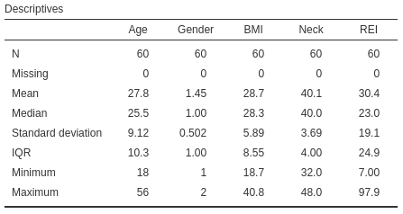
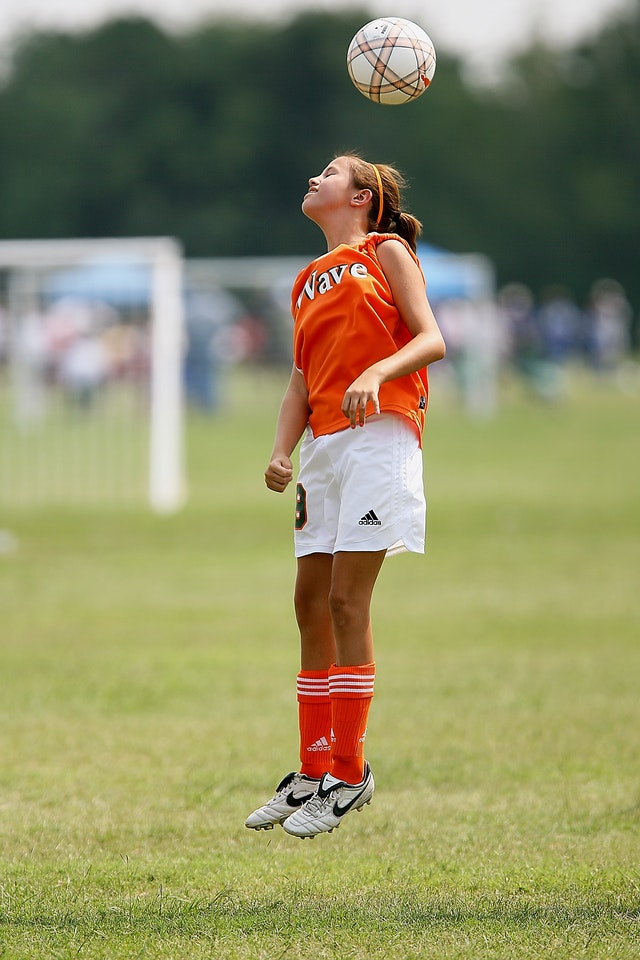
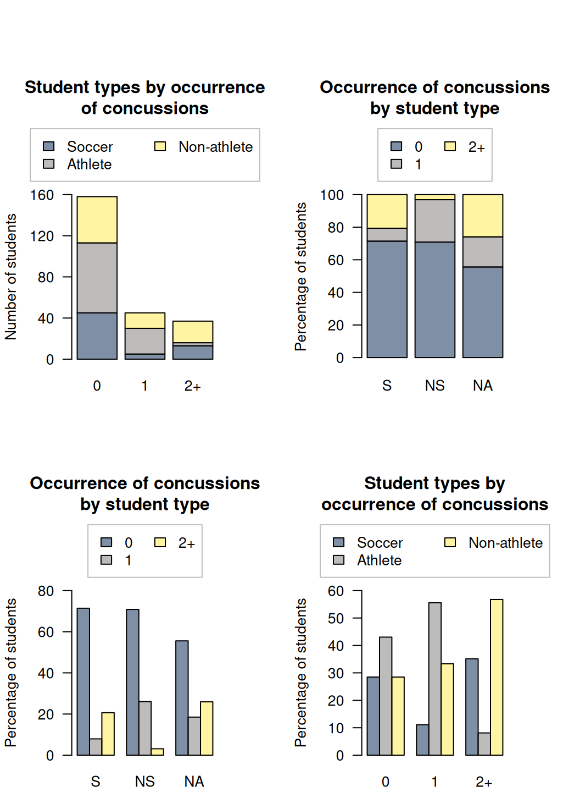

# Teaching Week 4: tutorial  {#Lecture4}


::: {.objectivesBox .objectives data-latex="{iconmonstr-target-4-240.png}"}
You will learn to:

* produce and understand graphical summaries for **qualitative** data.
* produce and understand numerical summaries for **qualitative** data (e.g., odds, proportions).
* produce and understand graphical summaries for comparing **qualitative** data.
* produce and understand numerical summaries for comparing **qualitative** data (e.g., odds ratios, difference in proportions).
:::


::: {.assessmentBox .assessment data-latex="{iconmonstr-text-check-list-lined-240.png}"}
The Week\ 4 content is essential for:

* **Task\ 2A**, which requires you to *suggest appropriate numerical summaries, and suggest appropriate graphs*;
* **Task\ 2B**, which requires you to *produce and interpret appropriate numerical summaries and produce and interpret appropriate graphs*;
* **Quiz\ 2**, which includes questions about *numerical summaries and graphs*; and
* the **Exam**, which will contain questions about *numerical summaries and graphs*.
:::


::: {.readBox .read data-latex="{iconmonstr-school-15-240.png}"}
You will learn and practice the content associated with these chapters of the [textbook](https://peterkdunn.github.io/SRM-Textbook/):

* [Chapter\ 12 (Summarising qualitative data)](https://peterkdunn.github.io/SRM-Textbook/SummariseQualData.html).
* [Chapter\ 15 (Comparing qualitative data between individuals](https://peterkdunn.github.io/SRM-Textbook/CompareQualData.html).

Take careful note of which chapters are covered in this tutorial!
:::


::: {.tipBox .tip data-latex="{iconmonstr-info-6-240.png}"}
You should bring your calculator to tutorials from this week onwards.
:::


\pagebreak


## Quick revision {#QuickRevision-Tutorial4}


::: {.preClassBox .preClass data-latex="{iconmonstr-home-7-240.png}"}
We **strongly** recommend trying these *Quick revision* questions **before** your tutorial.
:::


::: {.webex-check .webex-box}
A study of obstructive sleep apnoea (OSA) in adults with Down Syndrome [@carvalho2020stop] had $n = 60$ adults ($27$\ females; $33$\ males) undergo a sleep study.
The data are shown in Fig.\ \@ref(fig:OSADT3).
(REI is the Respiratory Event Index; an REI under\ $5$ refers to no sleep apnoea; an REI of $30$\ or over refers to severe sleep apnoea.)

1. Which of these would be an **inappropriate** numerical summary for the age of the participants? \tightlist  
<div class='webex-radiogroup' id='radio_LWMGFWYXBY'><label><input type="radio" autocomplete="off" name="radio_LWMGFWYXBY" value=""></input> <span>Median</span></label><label><input type="radio" autocomplete="off" name="radio_LWMGFWYXBY" value=""></input> <span>Mean</span></label><label><input type="radio" autocomplete="off" name="radio_LWMGFWYXBY" value="answer"></input> <span>Odds</span></label><label><input type="radio" autocomplete="off" name="radio_LWMGFWYXBY" value=""></input> <span>Standard deviation</span></label></div>

2. What might be an **appropriate** way to numerically describe the amount of *variation* in the ages of participants?
<div class='webex-radiogroup' id='radio_DHZHSJQULH'><label><input type="radio" autocomplete="off" name="radio_DHZHSJQULH" value="answer"></input> <span>Standard deviation</span></label><label><input type="radio" autocomplete="off" name="radio_DHZHSJQULH" value=""></input> <span>Median</span></label><label><input type="radio" autocomplete="off" name="radio_DHZHSJQULH" value=""></input> <span>Mean</span></label><label><input type="radio" autocomplete="off" name="radio_DHZHSJQULH" value=""></input> <span>Odds</span></label></div>

\greyboxlines{1}
3. What might be an **appropriate** way to numerically describe the average  Respiratory Event Index (REI) of participants?
<div class='webex-radiogroup' id='radio_PXZGFKWCSQ'><label><input type="radio" autocomplete="off" name="radio_PXZGFKWCSQ" value=""></input> <span>Standard deviation</span></label><label><input type="radio" autocomplete="off" name="radio_PXZGFKWCSQ" value="answer"></input> <span>Median</span></label><label><input type="radio" autocomplete="off" name="radio_PXZGFKWCSQ" value=""></input> <span>Odds</span></label><label><input type="radio" autocomplete="off" name="radio_PXZGFKWCSQ" value=""></input> <span>Percentages</span></label></div>

\greyboxlines{1}
4. What might be an **appropriate** way to numerically describe the gender of the participants?
<div class='webex-radiogroup' id='radio_DFTRCICKIM'><label><input type="radio" autocomplete="off" name="radio_DFTRCICKIM" value=""></input> <span>Standard deviation</span></label><label><input type="radio" autocomplete="off" name="radio_DFTRCICKIM" value=""></input> <span>Median</span></label><label><input type="radio" autocomplete="off" name="radio_DFTRCICKIM" value=""></input> <span>IQR</span></label><label><input type="radio" autocomplete="off" name="radio_DFTRCICKIM" value="answer"></input> <span>Percentages</span></label></div>

\greyboxlines{1}
5. In the sample of $n = 60$, what **percentage** of individuals are females?
<div class='webex-radiogroup' id='radio_AWKNOOPUTA'><label><input type="radio" autocomplete="off" name="radio_AWKNOOPUTA" value=""></input> <span>0.45</span></label><label><input type="radio" autocomplete="off" name="radio_AWKNOOPUTA" value="answer"></input> <span>45%</span></label><label><input type="radio" autocomplete="off" name="radio_AWKNOOPUTA" value=""></input> <span>0.55</span></label><label><input type="radio" autocomplete="off" name="radio_AWKNOOPUTA" value=""></input> <span>55%</span></label><label><input type="radio" autocomplete="off" name="radio_AWKNOOPUTA" value=""></input> <span>1.22</span></label><label><input type="radio" autocomplete="off" name="radio_AWKNOOPUTA" value=""></input> <span>0.82</span></label></div>

\greyboxlines{1}
6. In the sample of $n = 60$, what are the **odds** that an individual is female?
<div class='webex-radiogroup' id='radio_GYTHLNDAAH'><label><input type="radio" autocomplete="off" name="radio_GYTHLNDAAH" value=""></input> <span>0.45</span></label><label><input type="radio" autocomplete="off" name="radio_GYTHLNDAAH" value=""></input> <span>45%</span></label><label><input type="radio" autocomplete="off" name="radio_GYTHLNDAAH" value=""></input> <span>0.55</span></label><label><input type="radio" autocomplete="off" name="radio_GYTHLNDAAH" value=""></input> <span>55%</span></label><label><input type="radio" autocomplete="off" name="radio_GYTHLNDAAH" value=""></input> <span>1.22</span></label><label><input type="radio" autocomplete="off" name="radio_GYTHLNDAAH" value="answer"></input> <span>0.82</span></label></div>

\greyboxlines{1}
7. Use the jamovi output in Fig.\ \@ref(fig:OSAoutput) to find the mean of *Gender*, and explain what this mean.
\greyboxlines{3}
:::


<div class='webex-solution'><button>Solution</button>

1. *Age* is quantitative, so odds are not appropriate (odds are used with qualitative data).
1. Variation is measured using standard deviation or IQR.
1. The average value (of a quantitative variable) can be described using a mean or a median.
1. Percentages or odds can be used to numerically summarise a qualitative variable like *gender*.
1. $27/60\times 100 = 45$%.
1. $27/33 = 0.8181$.
1. Note the *mean* is meaningless for qualitative variables!

</div>


<div class="figure" style="text-align: center">

<p class="caption">(\#fig:OSAoutput)A numerical summary of the OSA data: jamovi</p>
</div>


<div class="figure" style="text-align: center">

```{=html}
<div class="datatables html-widget html-fill-item" id="htmlwidget-64017b524e6b01476d06" style="width:100%;height:auto;"></div>
<script type="application/json" data-for="htmlwidget-64017b524e6b01476d06">{"x":{"filter":"none","vertical":false,"caption":"<caption>The Obstructive sleep apnoea data set.<\/caption>","data":[["1","2","3","4","5","6","7","8","9","10","11","12","13","14","15","16","17","18","19","20","21","22","23","24","25","26","27","28","29","30","31","32","33","34","35","36","37","38","39","40","41","42","43","44","45","46","47","48","49","50","51","52","53","54","55","56","57","58","59","60"],[21,24,26,39,21,29,20,21,19,27,29,25,20,53,31,22,21,28,19,18,18,36,36,38,18,24,21,18,33,19,23,31,29,23,35,27,28,20,29,38,22,56,50,24,36,44,25,49,18,19,27,31,21,22,20,29,35,22,28,32],["Male","Male","Male","Female","Female","Male","Male","Male","Female","Male","Female","Male","Female","Male","Male","Male","Female","Female","Female","Female","Male","Female","Female","Male","Female","Male","Male","Male","Male","Male","Female","Male","Male","Male","Female","Female","Male","Male","Female","Male","Female","Female","Female","Male","Male","Female","Female","Female","Male","Male","Male","Male","Female","Male","Female","Male","Male","Female","Female","Female"],[20.3,24.1,25.2,40.8,35,29.2,25.8,20.9,20.5,22.4,24.4,20.5,30.5,27.3,32.6,37.2,29.9,36.5,27.7,27.1,19.5,36.8,39.9,20.3,28.6,21.8,31.9,29.2,32,27,25.6,18.7,32.5,24.7,35.6,31.1,24.8,23.9,36.8,34.6,28,29.2,31.4,38.3,26,34.3,27,30.6,21.6,37.6,35.4,24.2,19.3,27.1,31.5,33.8,31.2,26,36.9,22.1],[37,40.5,38,41,37,41,42,37,32,39,37.5,38,39,44.5,46.5,43,34,37,34,36,39,41,37,38,38,36,40,41,46,42,40.3,38,47,38,36,36,44,43,40.5,45,40,38,40,43,41,38,40,40,38,48,46,39,35.5,48,41,47,47,39,40,40],[46,19.3,12.4,58.6,12.7,38.8,24.4,7,37.6,21.7,7.3,32.4,61.3,25.1,42.2,53.6,13.9,22.6,15.6,8.699999999999999,18.5,40.7,25.4,11.3,13.6,59.4,26.2,31,47.1,13,17.5,17.7,45.4,73.3,19.7,23.4,13.9,16.9,13.4,54.2,19.9,16.5,58.1,29.3,41.5,48.8,32.8,19.4,15.8,26.8,31.6,60.4,15.7,22.5,18,97.90000000000001,22.4,16.8,66.09999999999999,19.1]],"container":"<table class=\"display\">\n  <thead>\n    <tr>\n      <th> <\/th>\n      <th>Age<\/th>\n      <th>Gender<\/th>\n      <th>BMI<\/th>\n      <th>Neck<\/th>\n      <th>REI<\/th>\n    <\/tr>\n  <\/thead>\n<\/table>","options":{"scrollX":true,"scrollY":true,"ordering":false,"columnDefs":[{"className":"dt-right","targets":[1,3,4,5]},{"orderable":false,"targets":0},{"name":" ","targets":0},{"name":"Age","targets":1},{"name":"Gender","targets":2},{"name":"BMI","targets":3},{"name":"Neck","targets":4},{"name":"REI","targets":5}],"order":[],"autoWidth":false,"orderClasses":false}},"evals":[],"jsHooks":[]}</script>
```

<p class="caption">(\#fig:OSADT3)The Obstructive Sleep Apnoea (OSA) data set</p>
</div>


## Class discussion {#TW4-Class-Discussion}

::: {.discussBox .discuss data-latex="{iconmonstr-speech-bubble-26-240.png}"}
**Discuss**: The raw data is more useful than a graphical summary.
:::


## Percentages and odds {#PercentOddsStroke}

In a study of how well emergency dispatchers recognised signs of stroke [@oostema2018emergency], the data in Table\ \@ref(tab:Stroke) were collected.


<table>
<caption>(\#tab:Stroke)How well emergency dispatchers recognised signs of stroke.</caption>
 <thead>
<tr>
<th style="empty-cells: hide;border-bottom:hidden;" colspan="1"></th>
<th style="border-bottom:hidden;padding-bottom:0; padding-left:3px;padding-right:3px;text-align: center; font-weight: bold; " colspan="1"><div style="">Dispatcher</div></th>
<th style="border-bottom:hidden;padding-bottom:0; padding-left:3px;padding-right:3px;text-align: center; font-weight: bold; " colspan="1"><div style="">Dispatcher</div></th>
</tr>
  <tr>
   <th style="text-align:left;font-weight: bold;">   </th>
   <th style="text-align:center;font-weight: bold;"> suspected stroke </th>
   <th style="text-align:center;font-weight: bold;"> missed stroke </th>
  </tr>
 </thead>
<tbody>
  <tr>
   <td style="text-align:left;"> Males </td>
   <td style="text-align:center;"> 67 </td>
   <td style="text-align:center;"> 43 </td>
  </tr>
  <tr>
   <td style="text-align:left;"> Females </td>
   <td style="text-align:center;"> 97 </td>
   <td style="text-align:center;"> 39 </td>
  </tr>
</tbody>
</table>


1. *Why* are the levels 'Male' and 'Female' placed in the rows of the table, rather than the columns?
\greyboxlines{2}
2. What proportion of patients had their stroke symptoms missed? \tightlist
\greyboxlines{2}
3. Sketch a side-by-side or stacked bar chart to display the data.
\greyboxlines{4}
4. Of the *male* patients, what *proportion* had their stroke symptoms missed by the dispatcher?
<div class='webex-radiogroup' id='radio_EBSOLBHNGS'><label><input type="radio" autocomplete="off" name="radio_EBSOLBHNGS" value="answer"></input> <span>0.391</span></label><label><input type="radio" autocomplete="off" name="radio_EBSOLBHNGS" value=""></input> <span>0.609</span></label><label><input type="radio" autocomplete="off" name="radio_EBSOLBHNGS" value=""></input> <span>0.524</span></label><label><input type="radio" autocomplete="off" name="radio_EBSOLBHNGS" value=""></input> <span>0.333</span></label></div>

\greyboxlines{2}
5. Of the *female* patients, what *proportion*  had their stroke symptoms missed by the dispatcher?
<div class='webex-radiogroup' id='radio_UEFXCTNPIH'><label><input type="radio" autocomplete="off" name="radio_UEFXCTNPIH" value=""></input> <span>0.713</span></label><label><input type="radio" autocomplete="off" name="radio_UEFXCTNPIH" value=""></input> <span>0.476</span></label><label><input type="radio" autocomplete="off" name="radio_UEFXCTNPIH" value="answer"></input> <span>0.287</span></label><label><input type="radio" autocomplete="off" name="radio_UEFXCTNPIH" value=""></input> <span>0.333</span></label></div>

\greyboxlines{2}
6. For the *male* patients, what are the *odds* that they had their stroke symptoms missed by the dispatcher?
<div class='webex-radiogroup' id='radio_PKHSXYUKHV'><label><input type="radio" autocomplete="off" name="radio_PKHSXYUKHV" value=""></input> <span>39.1</span></label><label><input type="radio" autocomplete="off" name="radio_PKHSXYUKHV" value="answer"></input> <span>0.642</span></label><label><input type="radio" autocomplete="off" name="radio_PKHSXYUKHV" value=""></input> <span>0.907</span></label><label><input type="radio" autocomplete="off" name="radio_PKHSXYUKHV" value=""></input> <span>0.50</span></label></div>

\greyboxlines{2}
7. For the *female* patients, what are the *odds* that they had their stroke symptoms missed by the dispatcher?
<div class='webex-radiogroup' id='radio_ZWLTBDNLGA'><label><input type="radio" autocomplete="off" name="radio_ZWLTBDNLGA" value="answer"></input> <span>0.402</span></label><label><input type="radio" autocomplete="off" name="radio_ZWLTBDNLGA" value=""></input> <span>2.49</span></label><label><input type="radio" autocomplete="off" name="radio_ZWLTBDNLGA" value=""></input> <span>1.10</span></label><label><input type="radio" autocomplete="off" name="radio_ZWLTBDNLGA" value=""></input> <span>1.24</span></label></div>

\greyboxlines{2}
8. What is the *difference between the proportions* of stroke symptoms being missed by the dispatcher, comparing *males* to *females*?
<div class='webex-radiogroup' id='radio_BETDJLKJQH'><label><input type="radio" autocomplete="off" name="radio_BETDJLKJQH" value=""></input> <span>0.391</span></label><label><input type="radio" autocomplete="off" name="radio_BETDJLKJQH" value=""></input> <span>1.6</span></label><label><input type="radio" autocomplete="off" name="radio_BETDJLKJQH" value="answer"></input> <span>0.104</span></label><label><input type="radio" autocomplete="off" name="radio_BETDJLKJQH" value=""></input> <span>0.287</span></label></div>

\greyboxlines{2}
9. What is the *odds ratio* that a patients had their stroke symptoms missed by the dispatcher, comparing *males* to *females*?
<div class='webex-radiogroup' id='radio_BLGGTHLAPN'><label><input type="radio" autocomplete="off" name="radio_BLGGTHLAPN" value=""></input> <span>0.63</span></label><label><input type="radio" autocomplete="off" name="radio_BLGGTHLAPN" value=""></input> <span>0.402</span></label><label><input type="radio" autocomplete="off" name="radio_BLGGTHLAPN" value=""></input> <span>0.50</span></label><label><input type="radio" autocomplete="off" name="radio_BLGGTHLAPN" value="answer"></input> <span>1.6</span></label></div>

\greyboxlines{2}
10. Construct a numerical summary table by completing Table\ \@ref(tab:StrokeSymptomsSummary).


<table>
<caption>(\#tab:StrokeSymptomsSummary)Numerical summary table: emergency dispatchers and missing stroke symptoms. Enter PROPORTIONS and ODDS to TWO decimal places.</caption>
 <thead>
<tr>
<th style="empty-cells: hide;border-bottom:hidden;" colspan="1"></th>
<th style="border-bottom:hidden;padding-bottom:0; padding-left:3px;padding-right:3px;text-align: right; font-weight: bold; " colspan="1"><div style="">Proportion</div></th>
<th style="border-bottom:hidden;padding-bottom:0; padding-left:3px;padding-right:3px;text-align: right; font-weight: bold; " colspan="1"><div style="">Odds</div></th>
<th style="border-bottom:hidden;padding-bottom:0; padding-left:3px;padding-right:3px;text-align: right; font-weight: bold; " colspan="1"><div style="">Sample</div></th>
</tr>
  <tr>
   <th style="text-align:left;">   </th>
   <th style="text-align:right;"> symptoms missed </th>
   <th style="text-align:right;"> symptoms missed </th>
   <th style="text-align:right;"> size </th>
  </tr>
 </thead>
<tbody>
  <tr>
   <td style="text-align:left;"> Males </td>
   <td style="text-align:right;"> <input class="webex-solveme nospaces" data-tol="0.01" size="6" data-answer='["0.39",".39"]'> </td>
   <td style="text-align:right;"> <input class="webex-solveme nospaces" data-tol="0.01" size="6" data-answer='["0.64",".64"]'> </td>
   <td style="text-align:right;"> <input class="webex-solveme nospaces" size="6" data-answer='["110"]'> </td>
  </tr>
  <tr>
   <td style="text-align:left;"> Females </td>
   <td style="text-align:right;"> <input class="webex-solveme nospaces" data-tol="0.01" size="6" data-answer='["0.29",".29"]'> </td>
   <td style="text-align:right;"> <input class="webex-solveme nospaces" data-tol="0.01" size="6" data-answer='["0.4",".4"]'> </td>
   <td style="text-align:right;"> <input class="webex-solveme nospaces" size="6" data-answer='["136"]'> </td>
  </tr>
  <tr>
   <td style="text-align:left;font-style: italic;"> \null </td>
   <td style="text-align:right;font-style: italic;"> Difference: <input class="webex-solveme nospaces" data-tol="0.01" size="6" data-answer='["0.1",".1"]'> </td>
   <td style="text-align:right;font-style: italic;"> Odds ratio: <input class="webex-solveme nospaces" data-tol="0.01" size="6" data-answer='["1.6"]'> </td>
   <td style="text-align:right;font-style: italic;"> \null </td>
  </tr>
</tbody>
</table>


## Two-way tables {#TwoWayTables}


<div style="float:right; width: 222x; border: 1px; padding:10px">

</div>

Soccer (football) is a unique in that one aspect is 'the purposeful use of the unprotected head for controlling and advancing the ball' [@kirkendall2001heading].
Some researchers suspect that repeatedly 'heading' the ball may impair brain function. 

A study [@kirkendall2001heading] was conducted to determine (p.\ 157)

> ...whether long-term or chronic neuropsychological dysfunction (i.e. concussion) was present in collegiate soccer players

Data were collected from $240$\ college students for two variables:

* The student type: one of 'soccer player', 'non-soccer athlete', or 'non-athlete'.
* The number of head concussions: each student was asked about the number of head concussions they had experienced; 'zero' , 'one', or 'two or more' concussions.

Use the study data (Table\ \@ref(tab:SoccerTable)) to answer the following questions.


<table class="table" style="width: auto !important; margin-left: auto; margin-right: auto;">
<caption>(\#tab:SoccerTable)Data on concussions experienced by college students.</caption>
 <thead>
<tr>
<th style="empty-cells: hide;border-bottom:hidden;" colspan="1"></th>
<th style="border-bottom:hidden;padding-bottom:0; padding-left:3px;padding-right:3px;text-align: center; font-weight: bold; " colspan="3"><div style="border-bottom: 1px solid #ddd; padding-bottom: 5px; ">Num. concussions</div></th>
<th style="empty-cells: hide;border-bottom:hidden;" colspan="1"></th>
</tr>
  <tr>
   <th style="text-align:left;font-weight: bold;">   </th>
   <th style="text-align:left;font-weight: bold;"> 0 </th>
   <th style="text-align:left;font-weight: bold;"> 1 </th>
   <th style="text-align:left;font-weight: bold;"> 2 or more </th>
   <th style="text-align:left;font-weight: bold;"> Total </th>
  </tr>
 </thead>
<tbody>
  <tr>
   <td style="text-align:left;font-weight: bold;"> Soccer players </td>
   <td style="text-align:left;"> $\phantom{0}45$ </td>
   <td style="text-align:left;"> $\phantom{0}\phantom{0}5$ </td>
   <td style="text-align:left;"> $\phantom{0}13$ </td>
   <td style="text-align:left;font-weight: bold;"> $\phantom{0}63$ </td>
  </tr>
  <tr>
   <td style="text-align:left;font-weight: bold;"> Non-soccer athletes </td>
   <td style="text-align:left;"> $\phantom{0}68$ </td>
   <td style="text-align:left;"> $\phantom{0}25$ </td>
   <td style="text-align:left;"> $\phantom{0}\phantom{0}3$ </td>
   <td style="text-align:left;font-weight: bold;"> $\phantom{0}96$ </td>
  </tr>
  <tr>
   <td style="text-align:left;font-weight: bold;"> Non-athletes </td>
   <td style="text-align:left;"> $\phantom{0}45$ </td>
   <td style="text-align:left;"> $\phantom{0}15$ </td>
   <td style="text-align:left;"> $\phantom{0}21$ </td>
   <td style="text-align:left;font-weight: bold;"> $\phantom{0}81$ </td>
  </tr>
  <tr>
   <td style="text-align:left;font-weight: bold;font-weight: bold;"> Total </td>
   <td style="text-align:left;font-weight: bold;"> $158$ </td>
   <td style="text-align:left;font-weight: bold;"> $\phantom{0}45$ </td>
   <td style="text-align:left;font-weight: bold;"> $\phantom{0}37$ </td>
   <td style="text-align:left;font-weight: bold;font-weight: bold;"> $240$ </td>
  </tr>
</tbody>
</table>

1. *Why* is the number of concussions placed in the columns of the table, rather than the rows?
\greyboxlines{2}
1. Classify the two variables.
\greyboxlines{2}
2. Compute the percentage of college students in the *sample* that have received exactly one concussion.
\greyboxlines{2}
3. Compute the percentage of college students in the population that have received two or more concussions.
\greyboxlines{2}
4. Many possible graphs exists to display the data; four are shown in Fig.\ \@ref(fig:SoccerGraph).
   What is the main message from each graph?
   Which graph do you think is best?
   Why?
\greyboxlines{2}
5. Among **non-athletes**, compute the odds of receiving two or more concussions.
   Interpret what this means.
\greyboxlines{2}
6. Among **soccer players**, compute the odds of receiving two or more concussions.
   Interpret what this means.
\greyboxlines{2}
7. Compute the odds ratio comparing the odds of a non-athlete receiving two or more concussions to the odds of a soccer player receiving two or more concussions.
\greyboxlines{2}
8. Create a table of **column** percentages.
   What do these tell you?
\greyboxlines{4}
9. Create a table of **row** percentages.
   What do these tell you?
\greyboxlines{4}
10. Which one of these tables is probably more sensible?
   Why?
\greyboxlines{2}
11. What did you learn from this study?
\greyboxlines{2}


<div class="figure" style="text-align: center">

<p class="caption">(\#fig:SoccerGraph)Four different graphs displaying the soccer-data. 'S' mean a soccer player; 'NS' means a non-soccer athlete; 'NA' means a non-athlete.</p>
</div>


## Working with odds {#WorkingWithOdds}


<iframe src="https://usc.h5p.com/content/1291091497189826599/embed" width="1088" height="637" frameborder="0" allowfullscreen="allowfullscreen" allow="geolocation *; microphone *; camera *; midi *; encrypted-media *"></iframe><script src="https://usc.h5p.com/js/h5p-resizer.js" charset="UTF-8"></script>


## **Optional drills**: Computational exercises {#Chapter4Drills}

*(Answers appear in Sect. \@ref(Lecture4Answers))*

::: {.drillBox .drill data-latex="{iconmonstr-pencil-9-240.png}"}
These *optional* **Drill** exercises (repeated practice) give you practice at getting computations correct, and using your calculator.
These drill questions are more about practising the underlying *mathematics* rather than the *statistics*.
If you need help, please **ask**.
:::


1. A study of drivers [@data:mcevoy2006:phoneuse] in New South Wales (NSW) and Western Australia (WA) were asked if they use their phone while driving (Table \@ref(tab:PDTable)).

   a. What **percentage** of people use their phone while driving?
\greyboxlines{1}
   b. What are the **odds** that a person uses their phone while driving?
\greyboxlines{1}
   c. What are the **odds** that a WA resident uses their phone while driving?
\greyboxlines{1}
   d. What are the **odds** that a NSW resident uses their phone while driving?
\greyboxlines{1}
   e. What are the **odds ratio** that a person uses their phone while driving, comparing WA residents to NSW residents?
\greyboxlines{2}

<table class="table" style="width: auto !important; margin-left: auto; margin-right: auto;">
<caption>(\#tab:PDTable)The number of drivers who use their phone while driving.</caption>
 <thead>
  <tr>
   <th style="text-align:left;">   </th>
   <th style="text-align:center;"> Uses phone </th>
   <th style="text-align:center;"> Does not use phone </th>
  </tr>
 </thead>
<tbody>
  <tr>
   <td style="text-align:left;"> NSW </td>
   <td style="text-align:center;"> 381 </td>
   <td style="text-align:center;"> 295 </td>
  </tr>
  <tr>
   <td style="text-align:left;"> WA </td>
   <td style="text-align:center;"> 345 </td>
   <td style="text-align:center;"> 326 </td>
  </tr>
</tbody>
</table>


2. The data in Table \@ref(tab:RSTable) give the number of plum cuttings that were alive or dead, and whether the rootstock was long or short [@bartlett1935contingency].
   a. Compute the **percentage** of cuttings that were *alive* at the end of the study.
\greyboxlines{1}
   b. Compute the **percentage** of cuttings that were *dead* at the end of the study.
\greyboxlines{1}
   c. Compute the **percentage** of cuttings that were *long*.
\greyboxlines{1}
   d. Compute the **odds** that a cuttings was *alive* at the end of the study.
\greyboxlines{1}
   e. Compute the **odds** that a cuttings was *alive* at the end of the study, only for the *long* cuttings.
\greyboxlines{1}
   f. Compute the **odds** that a cuttings was *alive* at the end of the study, only for the *short* cuttings.
\greyboxlines{1}
   g. Compute the **odds ratio** that a cutting was *alive* at the end of the study, comparing the *short* cuttings to the *long* cuttings.
\greyboxlines{1}


<table class="table" style="width: auto !important; margin-left: auto; margin-right: auto;">
<caption>(\#tab:RSTable)The relationship between length and condition of plum rootstocks.</caption>
 <thead>
  <tr>
   <th style="text-align:left;">   </th>
   <th style="text-align:right;"> Alive </th>
   <th style="text-align:right;"> Dead </th>
  </tr>
 </thead>
<tbody>
  <tr>
   <td style="text-align:left;"> Long </td>
   <td style="text-align:right;"> 240 </td>
   <td style="text-align:right;"> 240 </td>
  </tr>
  <tr>
   <td style="text-align:left;"> Short </td>
   <td style="text-align:right;"> 138 </td>
   <td style="text-align:right;"> 342 </td>
  </tr>
</tbody>
</table>


## **Optional questions** {#OptionalTW4}


::: {.optionalBox .optional data-latex="{iconmonstr-help-4-240.png}"}
These questions are **optional**; e.g., if you need more practice, or you are studying for the exam.
(Answers appear in Sect.\ \@ref(Lecture4Answers).)
:::


### **(Optional)**  Odds ratios {#OddsRatioSMND}

::: {.videoSolutionBox .videoSolution data-latex="{iconmonstr-youtube-10-240.png}"}
This question has a video solution in the online book, so you can hear and see the solution.
:::


The impact of environmental toxins is not well understood.
@data:Pamphlett:toxins examined the association between the environmental exposure of toxins and sporadic motor neuron disease (SMND).
A total of $380$\ SMND cases and $377$ controls were studied.
Of the $380$\ SMND cases, $60$ had worked with metal in the past; of the $377$ controls, $33$ had worked with metal in the past.

1. What is the *direction* of this study?
\greyboxlines{1}
2. Construct a two-way table showing the relationship between disease group, and whether not the specific person had worked with metal, in the sample.
\greyboxlines{4}
3. Using your table, compute the *odds* that a person *with* SMND had worked with metal.
   Interpret what this means.
\greyboxlines{2}
4. Using your table, compute the *odds* that a person *without* SMND had worked with metal.
   Interpret what this means.
\greyboxlines{2}
5. How many times greater is the odds that a person *with* SMND having worked with metal, compared to the odds that a person *without* SMND having worked with metal?
   (This is an *odds ratio*.)
\greyboxlines{2}
6. Using your table, compute the *percentage* of people *with* SMND that had worked with metal.
\greyboxlines{1}
7. Using your table, compute the *percentage* of people *without* SMND that had worked with metal.
\greyboxlines{1}
8. A newspaper report states SMND rates are almost the same between those worked with metal and those who did not.
   Do you agree or disagree?
\greyboxlines{1}
9. Sketch a bar chart to display the data.
\greyboxlines{4}


