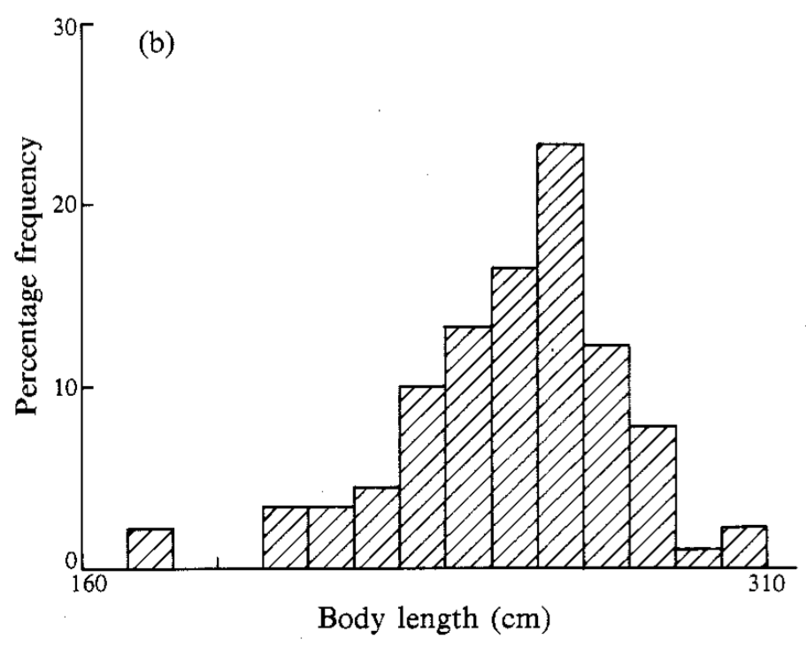

# Teaching Week 3: tutorial {#Lecture3}


::: {.objectivesBox .objectives data-latex="{iconmonstr-target-4-240.png}"}
You will learn to:

* collect data.
* classify data.
* produce and understand graphical summaries for quantitative data.
* produce and understand numerical summaries for quantitative data.
:::


::: {.assessmentBox .assessment data-latex="{iconmonstr-text-check-list-lined-240.png}"}
The Week\ 3 content is essential for:

* **Task\ 2A**, which requires you to *classify variables and suggest appropriate numerical and appropriate graphical summaries*;
* **Task\ 2B**, which requires you to *collect your own data, classify variables, produce appropriate numerical summaries, and produce appropriate graphs*;
* **Quiz\ 2**, which includes questions about *classifying variables, numerical summaries and graphs*; and
* the **Exam**, which will contain questions about *classifying variables, numerical summaries and graphs*.
:::


::: {.readBox .read data-latex="{iconmonstr-school-15-240.png}"}
You will learn and practice the content associated with these chapters of the [textbook](https://peterkdunn.github.io/SRM-Textbook/):

* [Chapter 9 (Collecting data)](https://peterkdunn.github.io/SRM-Textbook/CollectingDataProcedures.html).
* [Chapter 10 (Classifying data and variables)](https://peterkdunn.github.io/SRM-Textbook/DescribingVars.html).
* [Chapter 11 (Summarising quantitative data)](https://peterkdunn.github.io/SRM-Textbook/SummariseQuantData.html).
:::

::: {.tipBox .tip data-latex="{iconmonstr-info-6-240.png}"}
You should bring your calculator to tutorials from this week onwards.
:::


::: {.tipBox .tip data-latex="{iconmonstr-info-6-240.png}"}
You can search on YouTube for tutorials on using your calculator's **Statistics Mode**.
Here are some links that may prove useful.

* [**TI**-30 XS](https://www.youtube.com/watch?v=I437u8PxV2M)
* [**TI**-84](https://www.youtube.com/watch?v=gTOVeAf3HA4)
* [**Casio** fx cp 400](https://www.youtube.com/watch?v=df2hQUVMbMo)
* [**Casio** CG20](https://www.youtube.com/watch?v=O-v00SvwHIE)
* [**Casio** fx82](https://www.youtube.com/embed/PiJ9B7L7V2A)

In YouTube, I searched for `"statistics" "mean" "standard deviation"` together with the calculator make and model; for example:  
`"statistics" "mean" "standard deviation" Casio fx82`
:::


<!--
::: {.tipBox .tip data-latex="{iconmonstr-info-6-240.png}"}
You can search on YouTube for tutorials on using your calculator's **Statistics Mode**.
For example:

`"statistics" "mean" "standard deviation" Casio fx82`
:::
-->


For example, see the embedded video below for help in using the Casio fx82:

<div style="text-align:center;">
<iframe width="560" height="315" src="https://www.youtube.com/embed/PiJ9B7L7V2A" frameborder="0" allow="accelerometer; autoplay; encrypted-media; gyroscope; picture-in-picture" allowfullscreen></iframe>
</div>


\pagebreak


## Quick revision {#QuickRevision-Tutorial3}


::: {.mentiQuestion data-latex="{iconmonstr-computer-6-240.png}"}
\null
:::


::: {.webex-box}
In a study of obstructive sleep apnoea (OSA) in adults with Down Syndrome [@carvalho2020stop], $n = 60$ adults underwent a sleep study.
The data are shown in Fig.\ \@ref(fig:OSADT).
(REI is the Respiratory Event Index; REI under\ $5$ refers to no sleep apnoea; REI of $30$\ or over refers to severe sleep apnoea.)

1. How would you *classify* the variable `Age`? \tightlist
\greyboxlines{1}
2. How would you *classify* the variable `Gender`? \tightlist
\greyboxlines{1}
3. How would you *classify* the variable `BMI`? \tightlist
\greyboxlines{1}
4. How would you *classify* the variable `REI`? \tightlist
\greyboxlines{1}
5. What did you learn from this study?
\greyboxlines{1}
:::


<div class="figure" style="text-align: center">

```{=html}
<div class="datatables html-widget html-fill-item" id="htmlwidget-aa0c8f9e1bab88bbb392" style="width:100%;height:auto;"></div>
<script type="application/json" data-for="htmlwidget-aa0c8f9e1bab88bbb392">{"x":{"filter":"none","vertical":false,"caption":"<caption>The Obstructive sleep apnoea data set.<\/caption>","data":[["1","2","3","4","5","6","7","8","9","10","11","12","13","14","15","16","17","18","19","20","21","22","23","24","25","26","27","28","29","30","31","32","33","34","35","36","37","38","39","40","41","42","43","44","45","46","47","48","49","50","51","52","53","54","55","56","57","58","59","60"],[21,24,26,39,21,29,20,21,19,27,29,25,20,53,31,22,21,28,19,18,18,36,36,38,18,24,21,18,33,19,23,31,29,23,35,27,28,20,29,38,22,56,50,24,36,44,25,49,18,19,27,31,21,22,20,29,35,22,28,32],["Male","Male","Male","Female","Female","Male","Male","Male","Female","Male","Female","Male","Female","Male","Male","Male","Female","Female","Female","Female","Male","Female","Female","Male","Female","Male","Male","Male","Male","Male","Female","Male","Male","Male","Female","Female","Male","Male","Female","Male","Female","Female","Female","Male","Male","Female","Female","Female","Male","Male","Male","Male","Female","Male","Female","Male","Male","Female","Female","Female"],[20.3,24.1,25.2,40.8,35,29.2,25.8,20.9,20.5,22.4,24.4,20.5,30.5,27.3,32.6,37.2,29.9,36.5,27.7,27.1,19.5,36.8,39.9,20.3,28.6,21.8,31.9,29.2,32,27,25.6,18.7,32.5,24.7,35.6,31.1,24.8,23.9,36.8,34.6,28,29.2,31.4,38.3,26,34.3,27,30.6,21.6,37.6,35.4,24.2,19.3,27.1,31.5,33.8,31.2,26,36.9,22.1],[37,40.5,38,41,37,41,42,37,32,39,37.5,38,39,44.5,46.5,43,34,37,34,36,39,41,37,38,38,36,40,41,46,42,40.3,38,47,38,36,36,44,43,40.5,45,40,38,40,43,41,38,40,40,38,48,46,39,35.5,48,41,47,47,39,40,40],[46,19.3,12.4,58.6,12.7,38.8,24.4,7,37.6,21.7,7.3,32.4,61.3,25.1,42.2,53.6,13.9,22.6,15.6,8.699999999999999,18.5,40.7,25.4,11.3,13.6,59.4,26.2,31,47.1,13,17.5,17.7,45.4,73.3,19.7,23.4,13.9,16.9,13.4,54.2,19.9,16.5,58.1,29.3,41.5,48.8,32.8,19.4,15.8,26.8,31.6,60.4,15.7,22.5,18,97.90000000000001,22.4,16.8,66.09999999999999,19.1]],"container":"<table class=\"display\">\n  <thead>\n    <tr>\n      <th> <\/th>\n      <th>Age<\/th>\n      <th>Gender<\/th>\n      <th>BMI<\/th>\n      <th>Neck<\/th>\n      <th>REI<\/th>\n    <\/tr>\n  <\/thead>\n<\/table>","options":{"scrollX":true,"scrollY":true,"ordering":false,"columnDefs":[{"className":"dt-right","targets":[1,3,4,5]},{"orderable":false,"targets":0},{"name":" ","targets":0},{"name":"Age","targets":1},{"name":"Gender","targets":2},{"name":"BMI","targets":3},{"name":"Neck","targets":4},{"name":"REI","targets":5}],"order":[],"autoWidth":false,"orderClasses":false}},"evals":[],"jsHooks":[]}</script>
```

<p class="caption">(\#fig:OSADT)The obstructive sleep apnoea data set</p>
</div>


## Class discussion {#TW3-Class-Discussion}

::: {.discussBox .discuss data-latex="{iconmonstr-speech-bubble-26-240.png}"}
**Discuss**: Two datasets can have the same numerical summaries but tell very different stories.
:::


## Using the calculator statistics mode for a small data set {#StatsMode}


Table\ \@ref(tab:PolyTable) shows the polythene usage, in tonnes, by eight UK cosmetic companies [@gilchrist2000regression].

1. Using your calculator's *Statistics Mode*, find the **mean** and **standard deviation** of these numbers.
\greyboxlines{2}
2. Without using a calculator, find the **median** of the data.
\greyboxlines{2}
3. Without using a calculator, find the **IQR** of the data.
\greyboxlines{2}

<table class="table" style="width: auto !important; margin-left: auto; margin-right: auto;">
<caption>(\#tab:PolyTable)The amount of polythene (in tonnes) used by a sample of eight UK cosmetic companies.</caption>
<tbody>
  <tr>
   <td style="text-align:left;"> $\phantom{0}\phantom{0}\phantom{0}8.001$ </td>
   <td style="text-align:left;"> $\phantom{0}\phantom{0}29.400$ </td>
   <td style="text-align:left;"> $\phantom{0}266.532$ </td>
   <td style="text-align:left;"> $4298.700$ </td>
   <td style="text-align:left;"> $\phantom{0}\phantom{0}94.500$ </td>
   <td style="text-align:left;"> $2547.300$ </td>
   <td style="text-align:left;"> $\phantom{0}676.200$ </td>
   <td style="text-align:left;"> $\phantom{0}\phantom{0}\phantom{0}0.000$ </td>
  </tr>
</tbody>
</table>


::: {.importantBox .important data-latex="{iconmonstr-warning-8-240.png}"}
Most calculators have **two buttons** that compute the standard deviation when in **Statistics Mode**: one computes the standard deviation if the data are a sample, and one if the data are a population.
In practice, data are almost *never* a population.  
\  
  
If you are using your calculator correctly, you should get (before rounding) $\bar{x} = 990.0791$ and $s = 1588.514579$.
If you get $s = 1485.919327$ for the *standard deviation*, you are using your calculator incorrectly, so please **ask for help**.
You are probably pressing the incorrect button to get the standard deviation.
:::

   

## Understanding centre and variation {#UnderstandingVariation}


<iframe src="https://usc.h5p.com/content/1290996647109217689/embed" width="1088" height="909" frameborder="0" allowfullscreen="allowfullscreen" allow="geolocation *; microphone *; camera *; midi *; encrypted-media *"></iframe><script src="https://usc.h5p.com/js/h5p-resizer.js" charset="UTF-8"></script>


## Understanding histograms {#UnderstandingHistograms}


::: {.mentiQuestion data-latex="{iconmonstr-computer-6-240.png}"}
\null
:::


<iframe src="https://usc.h5p.com/content/1291014887759753099/embed" width="1088" height="637" frameborder="0" allowfullscreen="allowfullscreen" allow="geolocation *; microphone *; camera *; midi *; encrypted-media *"></iframe><script src="https://usc.h5p.com/js/h5p-resizer.js" charset="UTF-8"></script>

::: {.importantBox .important data-latex="{iconmonstr-warning-8-240.png}"}
**NOTE**: The first bar of the histogram is not necessarily at zero; it is the **shape** of the histogram that is of interest here: right skewed, left skewed, symmetric, etc.
:::


## Collecting data {#PlanStudy3}

Your tutor will have information.


## Interpreting graphs {#InterpretingGraphs}

A study of Weddell seals [@data:Bryden1984:WeddellSeals] measured, among other things, the seal body length.
A histogram of the body length of $90$\ female seals is shown in Fig.\ \@ref(fig:Bryden1984Fig3b).

1. Describe this histogram in words (average; variation; shape; outliers).
\greyboxlines{3}
2. What alternative graphical displays could be used to display these data?
\greyboxlines{2}
3. Critique the graph.
\greyboxlines{3}
4. Write a one-sentence summary of the body length of female Weddell seals suitable for a publicity brochure.
\greyboxlines{2}


<div class="figure" style="text-align: center">

<p class="caption">(\#fig:Bryden1984Fig3b)A histogram of the body length of female Weddell seals</p>
</div>


## **Optional drills**: computational exercises {#Chapter3Drills}

*(Answers appear in Sect. \@ref(Lecture3Answers))*

::: {.drillBox .drill data-latex="{iconmonstr-pencil-9-240.png}"}
These *optional* **Drill** exercises (repeated practice) give you practice at getting computations correct, and using your calculator.
These drill questions are more about practising the underlying *mathematics* rather than the *statistics*.
If you need help, please **ask**.
:::


1. The data in Table\ \@ref(tab:AISTable) give the heights of $n = 7$ female tennis players at the *Australian Institute of Sport* (AIS) in metres [@telford1991sex].
   a. Using your calculator's *Statistics Mode*, find the **mean** and **standard deviation** of the data.
\greyboxlines{2}
   b. Without using a calculator, find the **median** of the data.
\greyboxlines{2}
   c. Compute the IQR for the data.
\greyboxlines{2}


<table class="table" style="width: auto !important; margin-left: auto; margin-right: auto;">
<caption>(\#tab:AISTable)The heights (in metres) of female tennis players at the AIS.</caption>
<tbody>
  <tr>
   <td style="text-align:left;"> $167.9$ </td>
   <td style="text-align:left;"> $177.5$ </td>
   <td style="text-align:left;"> $162.5$ </td>
   <td style="text-align:left;"> $172.5$ </td>
   <td style="text-align:left;"> $166.7$ </td>
   <td style="text-align:left;"> $175.0$ </td>
   <td style="text-align:left;"> $157.9$ </td>
  </tr>
</tbody>
</table>


2. Bamboo is a fast-growing, strong grass useful for environmentally-friendly building practices.
   A small research study explored the properties of bamboo when used as flooring material, including the bending strength (the Modulus of Rupture, or MOR, in MPa).
   Five different bamboo floorboards were provided by Bamboo Flooring Australia Pty Ltd and assessed by the Queensland Department of Primary Industries [@data:Gerber:BambooFlooring].
   The five MOR test results (in MPa) are shown in Table \@ref(tab:MORTable).
   a. Identify the type of RQ being answered: descriptive, relational, cross-sectional or correlational.
   Justify your answer.
\greyboxlines{2}
   b. Use your calculator's statistics mode to compute the mean and the standard deviation.
\greyboxlines{2}
   c. Without using a calculator, find the **median** of the data.
\greyboxlines{2}


<table class="table" style="width: auto !important; margin-left: auto; margin-right: auto;">
<caption>(\#tab:MORTable)The MOR (in MPa) for five bamboo boards.</caption>
<tbody>
  <tr>
   <td style="text-align:left;"> 99.2 </td>
   <td style="text-align:left;"> 111.2 </td>
   <td style="text-align:left;"> 97.6 </td>
   <td style="text-align:left;"> 101.1 </td>
   <td style="text-align:left;"> 104 </td>
  </tr>
</tbody>
</table>


3. The data in Table\ \@ref(tab:AISTable) give the percentage body fat of $n = 9$ female swimmers at the *Australian Institute of Sport* (AIS)  [@telford1991sex].
   a. Using your calculator's *Statistics Mode*, find the **mean** and **standard deviation** of the data.
   b. Without using a calculator, find the **median** of the data.
   c. Compute the IQR.
\greyboxlines{4}
   


<table class="table" style="width: auto !important; margin-left: auto; margin-right: auto;">
<caption>(\#tab:AISTable2)The percentage body fat of female swimmers at the AIS.</caption>
<tbody>
  <tr>
   <td style="text-align:left;"> 14.52 </td>
   <td style="text-align:left;"> 11.47 </td>
   <td style="text-align:left;"> 17.71 </td>
   <td style="text-align:left;"> 18.48 </td>
   <td style="text-align:left;"> 11.22 </td>
   <td style="text-align:left;"> 13.61 </td>
   <td style="text-align:left;"> 12.78 </td>
   <td style="text-align:left;"> 11.85 </td>
   <td style="text-align:left;"> 13.35 </td>
  </tr>
</tbody>
</table>


	
	
## **Optional questions** {#OptionalTW3}


::: {.optionalBox .optional data-latex="{iconmonstr-help-4-240.png}"}
These questions are **optional**; e.g., if you need more practice, or you are studying for the exam.
(Answers appear in Sect.\ \@ref(Lecture3Answers).)
:::


### **(Optional)**  Using the calculator Statistics Mode {#CalculatorBatteries}

Batteries are expensive, so comparing the performance of expensive and cheap batteries is helpful.
A test on the lifetime of batteries [@data:ALDIBatteryTesting] compared the time for two brands of $1.5$\ volt batteries to reduce their voltage to $1.0$\ volts under standard testing conditions.

The times (in hours) for nine Energizer Max batteries and nine ALDI brand batteries (Ultracell) are shown in Table\ \@ref(tab:BattTable).

<table class="table" style="width: auto !important; margin-left: auto; margin-right: auto;">
<caption>(\#tab:BattTable)The times taken for batteries to go from $1.5\vs$ to $1.0\vs$, in hours)</caption>
<tbody>
  <tr>
   <td style="text-align:left;font-weight: bold;"> Energizer </td>
   <td style="text-align:left;"> $7.58$ </td>
   <td style="text-align:left;"> $7.46$ </td>
   <td style="text-align:left;"> $7.46$ </td>
   <td style="text-align:left;"> $7.59$ </td>
   <td style="text-align:left;"> $7.46$ </td>
   <td style="text-align:left;"> $7.52$ </td>
   <td style="text-align:left;"> $6.83$ </td>
   <td style="text-align:left;"> $6.89$ </td>
   <td style="text-align:left;"> $7.45$ </td>
  </tr>
  <tr>
   <td style="text-align:left;font-weight: bold;"> Ultracell </td>
   <td style="text-align:left;"> $7.50$ </td>
   <td style="text-align:left;"> $7.48$ </td>
   <td style="text-align:left;"> $7.47$ </td>
   <td style="text-align:left;"> $7.48$ </td>
   <td style="text-align:left;"> $7.48$ </td>
   <td style="text-align:left;"> $7.41$ </td>
   <td style="text-align:left;"> $7.47$ </td>
   <td style="text-align:left;"> $6.96$ </td>
   <td style="text-align:left;"> $7.48$ </td>
  </tr>
</tbody>
</table>


1. The type of research study is  
<div class='webex-radiogroup' id='radio_FNEOGIWLSR'><label><input type="radio" autocomplete="off" name="radio_FNEOGIWLSR" value=""></input> <span>a true experimental.</span></label><label><input type="radio" autocomplete="off" name="radio_FNEOGIWLSR" value=""></input> <span>a quasi-experimental study.</span></label><label><input type="radio" autocomplete="off" name="radio_FNEOGIWLSR" value="answer"></input> <span>an observational study.</span></label></div>

   Justify your answer. \tightlist
\greyboxlines{2}
2. What are the *units of observation* and *units of analysis*?
\greyboxlines{2}
3. Use your calculator's *Statistics mode* to compute the following. (Check your answers to ensure you are using your calculator correctly.)
   a. Compute the mean times for the *Energizer* batteries (to two decimal places).
   <input class='webex-solveme nospaces' data-tol='0.01' size='4' data-answer='["7.36"]'/>
   a. Compute the standard deviation of the *Energizer* battery times (to three decimal places).
   <input class='webex-solveme nospaces' data-tol='0.001' size='5' data-answer='["0.289",".289"]'/>
   a. Compute the mean times for the *Ultracell* batteries (to two decimal places).
   <input class='webex-solveme nospaces' data-tol='0.01' size='4' data-answer='["7.41"]'/>
   a. Compute the standard deviation of the *Ultracell* battery times (to three decimal places).
   <input class='webex-solveme nospaces' data-tol='0.01' size='5' data-answer='["0.172",".172"]'/>
\greyboxlines{4}
4. Explain what these calculations tell you.
\greyboxlines{2}
5. Compute the median lifetime for each brand, explain what this tells you. (Many calculators cannot compute medians.)
   a. Compute the median of the *Energizer* batteries (to two decimal places).
   <input class='webex-solveme nospaces' data-tol='0.01' size='4' data-answer='["7.46"]'/>
   b. Compute the median of the *Ultracell* batteries (to two decimal places).
   <input class='webex-solveme nospaces' data-tol='0.01' size='4' data-answer='["7.48"]'/>
\greyboxlines{3}
6. Determine (and justify) if the mean or median would be a more appropriate measure of centre.
\greyboxlines{2}
7. Do you the average time to reach 1.0 volts is the same for each brand?
   Explain.
\greyboxlines{2}
8. Information about the cost of the batteries would also be important information to know (see below).
   What advice would you give about buying batteries based on these data?
\greyboxlines{2}

::: {.tipBox .tip data-latex="{iconmonstr-info-6-240.png}"}
The cost of the batteries, at the time of publication (05\ September, 2012), was: 
  
* *Ultracell*: A four-pack cost $2.49 from ALDI online
* *Energizer Max*: A four-pack cost $5.97 from Woolworths online, *on special*; the normal price was $8.01 for the four-pack.
:::


