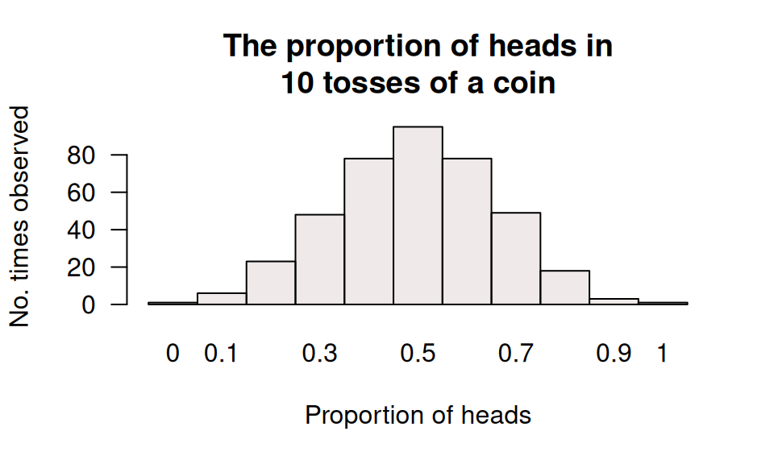

# Teaching Week 6: tutorial {#Lecture6}

::: {.objectivesBox .objectives data-latex="{iconmonstr-target-4-240.png}"}
You will learn to:

* identify different methods for computing probabilities.
* compute probabilities in simple situations.
* understand the role of probability models for describing sampling variation.
* describe sampling variation, and understand the role played by the sample size.
* find the probability associated with a value on a normal distribution.
* find the value associated with a probability in a normal distribution.
:::

::: {.assessmentBox .assessment data-latex="{iconmonstr-text-check-list-lined-240.png}"}
The Week\ 6 content is essential for:

* understanding the content that follows, *all* of which relies on probability, understanding sampling variation, and using normal distributions;
* **Quiz\ 3**, which includes questions about *probability, sampling variation, and normal distributions*; and
* the **Exam**, which will contain questions about *probability, sampling variation, and normal distributions*.
:::

::: {.readBox .read data-latex="{iconmonstr-school-15-240.png}"}
You will learn and practice the content associated with these chapters of the [textbook](https://peterkdunn.github.io/SRM-Textbook/):

* [Chapter\ 18 (Probability)](https://peterkdunn.github.io/SRM-Textbook/Probability.html).
* [Chapter\ 19 (Sampling variation)](https://peterkdunn.github.io/SRM-Textbook/SamplingVariation.html).
* [Chapter\ 20 (Models and normal distributions)](https://peterkdunn.github.io/SRM-Textbook/SamplingDistributions.html).
:::

::: {.tipBox .tip data-latex="{iconmonstr-info-6-240.png}"}
You will need to access the normal distribution tables for this tutorial.
These Tables can be found in the textbook appendices, and in this document in
Appendices\ \@ref(ZTablesOnline)\ and\ \@ref(ZTablesOnlineBackwards), and Appendix\ \@ref(ZTablesOnlineBackwards).
:::

\pagebreak

## Quick revision {#QuickRevision-Tutorial6}

::: {.mentiQuestion data-latex="{iconmonstr-computer-6-240.png}"}
\null
:::

::: {.webex-box}
A new method for evaluating bridge loads [@obrien2018probabilistic] used a simulation to compare the new method to an existing method.
For the simulation, they modelled the gross vehicle mass (GVM) of trucks as having a normal distribution, with a mean of $13$\ tonnes and a standard deviation of $1.3$\ tonnes.

The 
[Isuzu F-Series trucks](https://isuzu.com.au/)
are rated as having a GVM between $10.7$ and $26.0$\ tonnes (depending on the configuration; in 2024). 

1. What is the $z$-score for the lightest truck of $10.7$\ tonnes? \tightlist
\greyboxlines{2}
1. What is the $z$-score for the heaviest truck of $26.0$\ tonnes?
\greyboxlines{2}
1. What does a *negative* $z$-score mean in this context?
\greyboxlines{2}
1. **True** or **false**:
   A standard error measures the size of the difference between the **sample** proportion and the **population** proportion.
   Explain.
\greyboxlines{2}
:::

## Class discussion {#TW6-Class-Discussion}

::: {.discussBox .discuss data-latex="{iconmonstr-speech-bubble-26-240.png}"}
**Discuss**: Outliers should always be removed from a dataset before analysis.
:::

## Normal distributions and IQs {#NormalIQs}

::: {.mentiQuestion data-latex="{iconmonstr-computer-6-240.png}"}
\null
:::

Standard IQs in current use (despite their flaws) are designed so that the IQ scores of the *population* have a normal distribution with a mean of\ $100$, and a standard deviation of\ $15$.

Use this information to answer the following questions.

<iframe src="https://usc.h5p.com/content/1290968343185265779/embed" width="1088" height="637" frameborder="0" allowfullscreen="allowfullscreen" allow="geolocation *; microphone *; camera *; midi *; encrypted-media *"></iframe>

## Normal distributions and heights {#NormalHeights}

In the \textit{National Nutrition Survey} (NNS) (conducted with the 1995\ *National Health Survey* (NHS)), trained nutritionists measured the heights of the respondents [@data:ABS1995:MeasureUp].

The values quoted are the population means\ $\mu$ and standard deviations\ $\sigma$ of the models used for heights. 

1. Take a wild guess: What percentage of your peers (people your age and gender) do you think would be *shorter* than you?
<input class='webex-solveme nospaces' data-tol='50' size='2' data-answer='["50"]'/>%.
2. Write down your own height:
<input class='webex-solveme nospaces' data-tol='70' size='3' data-answer='["170"]'/>cm.
3. From Fig.\ \@ref(fig:Ht), write down the mean and standard deviation for people in your *age group* and *gender*.
   Using this information, compute the $z$-score for your height, relative to people in your age group and gender.
   Explain what this means.
\greyboxlines{4}

(\#fig:Ht)Part of the ABS report on heights of Australians.

4. Heights have an approximate normal (bell-shape) distribution, so the $68$--$95$--$99.7$ rule applies.  
   **Using the $68$--$95$--$99.7$ rule**, *roughly* estimate the percentage of people of your age and gender that are *shorter* than you.
   (Hint: Draw a picture!)
\greyboxlines{4}
5. Using **the normal distribution tables** in the Appendix, together with the information from **Fig.\ \@ref(fig:Ht)**, compute the percentage of people of your age and gender that are *shorter* than you.
\greyboxlines{3}
6. Using the $68$--$95$--$99.7$ rule, the middle $95$% of *females $18$\ and over* are within what height range?
   (For this group, the mean is $\mu = 161.4\cms$, and the standard deviation is $\sigma = 6.7\cms$, drawn from Fig.\ \@ref(fig:Ht).)
\greyboxlines{4}
7. For this part, we want to just look at *females $18$\ and over* again.
   Answer the following questions.

   a. Compute the *percentage* of females $18$\ and over that are *shorter* than $171\cms$.
\greyboxlines{2}
   b. What are the *odds* that a female $18$\ and over is *shorter* than $171\cms$?
\greyboxlines{2}
   c. Compute the *percentage* of females $18$\ and over that are *taller* than $171\cms$?
\greyboxlines{2}
   d. What are the *odds* that a female $18$\ and over is *taller* than $171\cms$?
\greyboxlines{2}
   e. Compute the *percentage* of females $18$\ and over that are *between* $170$ and $180\cms$?
\greyboxlines{2}
   f. What are the *odds* that a female $18$\ and over is *between* $170$ and $180\cms$?
\greyboxlines{2}

8. Approximately $20$% of females $18$\ and over are shorter than what height?
\greyboxlines{2}

## Probability {#Probability2}

::: {.mentiQuestion data-latex="{iconmonstr-computer-6-240.png}"}
\null
:::

For the following, indicate *how* you could estimate the probability (classical; relative frequency; subjective) in these situations.
(**Note:** You are not asked to *compute* the probability.)

1. The probability that a given UniSC student lives in Nambour.\tightlist  

<label><input type="radio" autocomplete="off" name="radio_NABPPWAUGY" value=""></input> Classical approach.</label><label><input type="radio" autocomplete="off" name="radio_NABPPWAUGY" value="answer"></input> Relative frequency approach.</label><label><input type="radio" autocomplete="off" name="radio_NABPPWAUGY" value=""></input> Subjective approach.</label>

\greyboxlines{1}
2. The probability that a given Nambour resident is a UniSC student.

<label><input type="radio" autocomplete="off" name="radio_IJPXDDLWSF" value=""></input> Classical approach.</label><label><input type="radio" autocomplete="off" name="radio_IJPXDDLWSF" value="answer"></input> Relative frequency approach.</label><label><input type="radio" autocomplete="off" name="radio_IJPXDDLWSF" value=""></input> Subjective approach.</label>

\greyboxlines{1}
3. The probability that Labor wins the next federal election.

<label><input type="radio" autocomplete="off" name="radio_TAIFFKELFH" value=""></input> Classical approach.</label><label><input type="radio" autocomplete="off" name="radio_TAIFFKELFH" value=""></input> Relative frequency approach.</label><label><input type="radio" autocomplete="off" name="radio_TAIFFKELFH" value="answer"></input> Subjective approach.</label>

\greyboxlines{1}
4. The probability that you will throw a dart and hit the bullseye.

<label><input type="radio" autocomplete="off" name="radio_FFIRFNCNPT" value=""></input> Classical approach.</label><label><input type="radio" autocomplete="off" name="radio_FFIRFNCNPT" value="answer"></input> Relative frequency approach.</label><label><input type="radio" autocomplete="off" name="radio_FFIRFNCNPT" value=""></input> Subjective approach.</label>

\greyboxlines{1}
5. The probability that a roulette wheel spins a $33$.

<label><input type="radio" autocomplete="off" name="radio_LKUZIIKENW" value="answer"></input> Classical approach.</label><label><input type="radio" autocomplete="off" name="radio_LKUZIIKENW" value=""></input> Relative frequency approach.</label><label><input type="radio" autocomplete="off" name="radio_LKUZIIKENW" value=""></input> Subjective approach.</label>

\greyboxlines{1}

Explain the difference between the meaning of the **first two** statements.
\greyboxlines{2}

## Random coin tosses {#RandomCardDraws}

\begin{wrapfigure}[5]{R}{.25\textwidth} % The first optional input is the number of lines allowed for the image to be placed in
  \centering%
  \vspace{-30pt}% This removes some white space
  \includegraphics[width=.24\textwidth]{QRcodes/RandomOrgCoinToss.png}%
\end{wrapfigure}

In this activity, we see an example of a sampling distribution that can be described by a normal distribution. 

Use 
[this website at RANDOM.org](https://www.random.org/coins/?num=10&cur=60-aud.1dollar) (at the bottom of the page, keep pressing *Flip again* to repeat)
to flip **ten** Australian one-dollar coins at random (see Fig.\ \@ref(fig:CoinTosser)).

Repeat this process numerous times (if you are in a class, each student can repeat the process numerous times so you get a large number of tosses), and complete 
the following table:

(\#fig:CoinTosser)Using the online random coin-tosser.

<table>
<caption>(\#tab:CoinDataTable)Tossing coins.</caption>
 <thead>
  <tr>
   <th style="text-align:right;"> Proportion of heads in 10 tosses </th>
   <th style="text-align:right;"> How many times observed </th>
  </tr>
 </thead>
<tbody>
  <tr>
   <td style="text-align:right;"> 0.0 (0 heads) </td>
   <td style="text-align:right;"> <input class='webex-solveme nospaces' data-tol='0.001' size='6' data-answer='["0","1","2","3","4","5","6","7","8","9","10","11","12","13","14","15","16","17","18","19","20","21","22","23","24","25","26","27","28","29","30","31","32","33","34","35","36","37","38","39","40","41","42","43","44","45","46","47","48","49","50","51","52","53","54","55","56","57","58","59","60","61","62","63","64","65","66","67","68","69","70","71","72","73","74","75","76","77","78","79","80","81","82","83","84","85","86","87","88","89","90","91","92","93","94","95","96","97","98","99","100","101","102","103","104","105","106","107","108","109","110","111","112","113","114","115","116","117","118","119","120","121","122","123","124","125","126","127","128","129","130","131","132","133","134","135","136","137","138","139","140","141","142","143","144","145","146","147","148","149","150","151","152","153","154","155","156","157","158","159","160","161","162","163","164","165","166","167","168","169","170","171","172","173","174","175","176","177","178","179","180","181","182","183","184","185","186","187","188","189","190","191","192","193","194","195","196","197","198","199","200","201","202","203","204","205","206","207","208","209","210","211","212","213","214","215","216","217","218","219","220","221","222","223","224","225","226","227","228","229","230","231","232","233","234","235","236","237","238","239","240","241","242","243","244","245","246","247","248","249","250","251","252","253","254","255","256","257","258","259","260","261","262","263","264","265","266","267","268","269","270","271","272","273","274","275","276","277","278","279","280","281","282","283","284","285","286","287","288","289","290","291","292","293","294","295","296","297","298","299","300","301","302","303","304","305","306","307","308","309","310","311","312","313","314","315","316","317","318","319","320","321","322","323","324","325","326","327","328","329","330","331","332","333","334","335","336","337","338","339","340","341","342","343","344","345","346","347","348","349","350","351","352","353","354","355","356","357","358","359","360","361","362","363","364","365","366","367","368","369","370","371","372","373","374","375","376","377","378","379","380","381","382","383","384","385","386","387","388","389","390","391","392","393","394","395","396","397","398","399","400","401","402","403","404","405","406","407","408","409","410","411","412","413","414","415","416","417","418","419","420","421","422","423","424","425","426","427","428","429","430","431","432","433","434","435","436","437","438","439","440","441","442","443","444","445","446","447","448","449","450","451","452","453","454","455","456","457","458","459","460","461","462","463","464","465","466","467","468","469","470","471","472","473","474","475","476","477","478","479","480","481","482","483","484","485","486","487","488","489","490","491","492","493","494","495","496","497","498","499","500"]'/> </td>
  </tr>
  <tr>
   <td style="text-align:right;"> 0.1 (1 head) </td>
   <td style="text-align:right;"> <input class='webex-solveme nospaces' data-tol='0.001' size='6' data-answer='["0","1","2","3","4","5","6","7","8","9","10","11","12","13","14","15","16","17","18","19","20","21","22","23","24","25","26","27","28","29","30","31","32","33","34","35","36","37","38","39","40","41","42","43","44","45","46","47","48","49","50","51","52","53","54","55","56","57","58","59","60","61","62","63","64","65","66","67","68","69","70","71","72","73","74","75","76","77","78","79","80","81","82","83","84","85","86","87","88","89","90","91","92","93","94","95","96","97","98","99","100","101","102","103","104","105","106","107","108","109","110","111","112","113","114","115","116","117","118","119","120","121","122","123","124","125","126","127","128","129","130","131","132","133","134","135","136","137","138","139","140","141","142","143","144","145","146","147","148","149","150","151","152","153","154","155","156","157","158","159","160","161","162","163","164","165","166","167","168","169","170","171","172","173","174","175","176","177","178","179","180","181","182","183","184","185","186","187","188","189","190","191","192","193","194","195","196","197","198","199","200","201","202","203","204","205","206","207","208","209","210","211","212","213","214","215","216","217","218","219","220","221","222","223","224","225","226","227","228","229","230","231","232","233","234","235","236","237","238","239","240","241","242","243","244","245","246","247","248","249","250","251","252","253","254","255","256","257","258","259","260","261","262","263","264","265","266","267","268","269","270","271","272","273","274","275","276","277","278","279","280","281","282","283","284","285","286","287","288","289","290","291","292","293","294","295","296","297","298","299","300","301","302","303","304","305","306","307","308","309","310","311","312","313","314","315","316","317","318","319","320","321","322","323","324","325","326","327","328","329","330","331","332","333","334","335","336","337","338","339","340","341","342","343","344","345","346","347","348","349","350","351","352","353","354","355","356","357","358","359","360","361","362","363","364","365","366","367","368","369","370","371","372","373","374","375","376","377","378","379","380","381","382","383","384","385","386","387","388","389","390","391","392","393","394","395","396","397","398","399","400","401","402","403","404","405","406","407","408","409","410","411","412","413","414","415","416","417","418","419","420","421","422","423","424","425","426","427","428","429","430","431","432","433","434","435","436","437","438","439","440","441","442","443","444","445","446","447","448","449","450","451","452","453","454","455","456","457","458","459","460","461","462","463","464","465","466","467","468","469","470","471","472","473","474","475","476","477","478","479","480","481","482","483","484","485","486","487","488","489","490","491","492","493","494","495","496","497","498","499","500"]'/> </td>
  </tr>
  <tr>
   <td style="text-align:right;"> 0.2 (2 heads) </td>
   <td style="text-align:right;"> <input class='webex-solveme nospaces' data-tol='0.001' size='6' data-answer='["0","1","2","3","4","5","6","7","8","9","10","11","12","13","14","15","16","17","18","19","20","21","22","23","24","25","26","27","28","29","30","31","32","33","34","35","36","37","38","39","40","41","42","43","44","45","46","47","48","49","50","51","52","53","54","55","56","57","58","59","60","61","62","63","64","65","66","67","68","69","70","71","72","73","74","75","76","77","78","79","80","81","82","83","84","85","86","87","88","89","90","91","92","93","94","95","96","97","98","99","100","101","102","103","104","105","106","107","108","109","110","111","112","113","114","115","116","117","118","119","120","121","122","123","124","125","126","127","128","129","130","131","132","133","134","135","136","137","138","139","140","141","142","143","144","145","146","147","148","149","150","151","152","153","154","155","156","157","158","159","160","161","162","163","164","165","166","167","168","169","170","171","172","173","174","175","176","177","178","179","180","181","182","183","184","185","186","187","188","189","190","191","192","193","194","195","196","197","198","199","200","201","202","203","204","205","206","207","208","209","210","211","212","213","214","215","216","217","218","219","220","221","222","223","224","225","226","227","228","229","230","231","232","233","234","235","236","237","238","239","240","241","242","243","244","245","246","247","248","249","250","251","252","253","254","255","256","257","258","259","260","261","262","263","264","265","266","267","268","269","270","271","272","273","274","275","276","277","278","279","280","281","282","283","284","285","286","287","288","289","290","291","292","293","294","295","296","297","298","299","300","301","302","303","304","305","306","307","308","309","310","311","312","313","314","315","316","317","318","319","320","321","322","323","324","325","326","327","328","329","330","331","332","333","334","335","336","337","338","339","340","341","342","343","344","345","346","347","348","349","350","351","352","353","354","355","356","357","358","359","360","361","362","363","364","365","366","367","368","369","370","371","372","373","374","375","376","377","378","379","380","381","382","383","384","385","386","387","388","389","390","391","392","393","394","395","396","397","398","399","400","401","402","403","404","405","406","407","408","409","410","411","412","413","414","415","416","417","418","419","420","421","422","423","424","425","426","427","428","429","430","431","432","433","434","435","436","437","438","439","440","441","442","443","444","445","446","447","448","449","450","451","452","453","454","455","456","457","458","459","460","461","462","463","464","465","466","467","468","469","470","471","472","473","474","475","476","477","478","479","480","481","482","483","484","485","486","487","488","489","490","491","492","493","494","495","496","497","498","499","500"]'/> </td>
  </tr>
  <tr>
   <td style="text-align:right;"> 0.3 (3 heads) </td>
   <td style="text-align:right;"> <input class='webex-solveme nospaces' data-tol='0.001' size='6' data-answer='["0","1","2","3","4","5","6","7","8","9","10","11","12","13","14","15","16","17","18","19","20","21","22","23","24","25","26","27","28","29","30","31","32","33","34","35","36","37","38","39","40","41","42","43","44","45","46","47","48","49","50","51","52","53","54","55","56","57","58","59","60","61","62","63","64","65","66","67","68","69","70","71","72","73","74","75","76","77","78","79","80","81","82","83","84","85","86","87","88","89","90","91","92","93","94","95","96","97","98","99","100","101","102","103","104","105","106","107","108","109","110","111","112","113","114","115","116","117","118","119","120","121","122","123","124","125","126","127","128","129","130","131","132","133","134","135","136","137","138","139","140","141","142","143","144","145","146","147","148","149","150","151","152","153","154","155","156","157","158","159","160","161","162","163","164","165","166","167","168","169","170","171","172","173","174","175","176","177","178","179","180","181","182","183","184","185","186","187","188","189","190","191","192","193","194","195","196","197","198","199","200","201","202","203","204","205","206","207","208","209","210","211","212","213","214","215","216","217","218","219","220","221","222","223","224","225","226","227","228","229","230","231","232","233","234","235","236","237","238","239","240","241","242","243","244","245","246","247","248","249","250","251","252","253","254","255","256","257","258","259","260","261","262","263","264","265","266","267","268","269","270","271","272","273","274","275","276","277","278","279","280","281","282","283","284","285","286","287","288","289","290","291","292","293","294","295","296","297","298","299","300","301","302","303","304","305","306","307","308","309","310","311","312","313","314","315","316","317","318","319","320","321","322","323","324","325","326","327","328","329","330","331","332","333","334","335","336","337","338","339","340","341","342","343","344","345","346","347","348","349","350","351","352","353","354","355","356","357","358","359","360","361","362","363","364","365","366","367","368","369","370","371","372","373","374","375","376","377","378","379","380","381","382","383","384","385","386","387","388","389","390","391","392","393","394","395","396","397","398","399","400","401","402","403","404","405","406","407","408","409","410","411","412","413","414","415","416","417","418","419","420","421","422","423","424","425","426","427","428","429","430","431","432","433","434","435","436","437","438","439","440","441","442","443","444","445","446","447","448","449","450","451","452","453","454","455","456","457","458","459","460","461","462","463","464","465","466","467","468","469","470","471","472","473","474","475","476","477","478","479","480","481","482","483","484","485","486","487","488","489","490","491","492","493","494","495","496","497","498","499","500"]'/> </td>
  </tr>
  <tr>
   <td style="text-align:right;"> 0.4 (4 heads) </td>
   <td style="text-align:right;"> <input class='webex-solveme nospaces' data-tol='0.001' size='6' data-answer='["0","1","2","3","4","5","6","7","8","9","10","11","12","13","14","15","16","17","18","19","20","21","22","23","24","25","26","27","28","29","30","31","32","33","34","35","36","37","38","39","40","41","42","43","44","45","46","47","48","49","50","51","52","53","54","55","56","57","58","59","60","61","62","63","64","65","66","67","68","69","70","71","72","73","74","75","76","77","78","79","80","81","82","83","84","85","86","87","88","89","90","91","92","93","94","95","96","97","98","99","100","101","102","103","104","105","106","107","108","109","110","111","112","113","114","115","116","117","118","119","120","121","122","123","124","125","126","127","128","129","130","131","132","133","134","135","136","137","138","139","140","141","142","143","144","145","146","147","148","149","150","151","152","153","154","155","156","157","158","159","160","161","162","163","164","165","166","167","168","169","170","171","172","173","174","175","176","177","178","179","180","181","182","183","184","185","186","187","188","189","190","191","192","193","194","195","196","197","198","199","200","201","202","203","204","205","206","207","208","209","210","211","212","213","214","215","216","217","218","219","220","221","222","223","224","225","226","227","228","229","230","231","232","233","234","235","236","237","238","239","240","241","242","243","244","245","246","247","248","249","250","251","252","253","254","255","256","257","258","259","260","261","262","263","264","265","266","267","268","269","270","271","272","273","274","275","276","277","278","279","280","281","282","283","284","285","286","287","288","289","290","291","292","293","294","295","296","297","298","299","300","301","302","303","304","305","306","307","308","309","310","311","312","313","314","315","316","317","318","319","320","321","322","323","324","325","326","327","328","329","330","331","332","333","334","335","336","337","338","339","340","341","342","343","344","345","346","347","348","349","350","351","352","353","354","355","356","357","358","359","360","361","362","363","364","365","366","367","368","369","370","371","372","373","374","375","376","377","378","379","380","381","382","383","384","385","386","387","388","389","390","391","392","393","394","395","396","397","398","399","400","401","402","403","404","405","406","407","408","409","410","411","412","413","414","415","416","417","418","419","420","421","422","423","424","425","426","427","428","429","430","431","432","433","434","435","436","437","438","439","440","441","442","443","444","445","446","447","448","449","450","451","452","453","454","455","456","457","458","459","460","461","462","463","464","465","466","467","468","469","470","471","472","473","474","475","476","477","478","479","480","481","482","483","484","485","486","487","488","489","490","491","492","493","494","495","496","497","498","499","500"]'/> </td>
  </tr>
  <tr>
   <td style="text-align:right;"> 0.5 (5 heads) </td>
   <td style="text-align:right;"> <input class='webex-solveme nospaces' data-tol='0.001' size='6' data-answer='["0","1","2","3","4","5","6","7","8","9","10","11","12","13","14","15","16","17","18","19","20","21","22","23","24","25","26","27","28","29","30","31","32","33","34","35","36","37","38","39","40","41","42","43","44","45","46","47","48","49","50","51","52","53","54","55","56","57","58","59","60","61","62","63","64","65","66","67","68","69","70","71","72","73","74","75","76","77","78","79","80","81","82","83","84","85","86","87","88","89","90","91","92","93","94","95","96","97","98","99","100","101","102","103","104","105","106","107","108","109","110","111","112","113","114","115","116","117","118","119","120","121","122","123","124","125","126","127","128","129","130","131","132","133","134","135","136","137","138","139","140","141","142","143","144","145","146","147","148","149","150","151","152","153","154","155","156","157","158","159","160","161","162","163","164","165","166","167","168","169","170","171","172","173","174","175","176","177","178","179","180","181","182","183","184","185","186","187","188","189","190","191","192","193","194","195","196","197","198","199","200","201","202","203","204","205","206","207","208","209","210","211","212","213","214","215","216","217","218","219","220","221","222","223","224","225","226","227","228","229","230","231","232","233","234","235","236","237","238","239","240","241","242","243","244","245","246","247","248","249","250","251","252","253","254","255","256","257","258","259","260","261","262","263","264","265","266","267","268","269","270","271","272","273","274","275","276","277","278","279","280","281","282","283","284","285","286","287","288","289","290","291","292","293","294","295","296","297","298","299","300","301","302","303","304","305","306","307","308","309","310","311","312","313","314","315","316","317","318","319","320","321","322","323","324","325","326","327","328","329","330","331","332","333","334","335","336","337","338","339","340","341","342","343","344","345","346","347","348","349","350","351","352","353","354","355","356","357","358","359","360","361","362","363","364","365","366","367","368","369","370","371","372","373","374","375","376","377","378","379","380","381","382","383","384","385","386","387","388","389","390","391","392","393","394","395","396","397","398","399","400","401","402","403","404","405","406","407","408","409","410","411","412","413","414","415","416","417","418","419","420","421","422","423","424","425","426","427","428","429","430","431","432","433","434","435","436","437","438","439","440","441","442","443","444","445","446","447","448","449","450","451","452","453","454","455","456","457","458","459","460","461","462","463","464","465","466","467","468","469","470","471","472","473","474","475","476","477","478","479","480","481","482","483","484","485","486","487","488","489","490","491","492","493","494","495","496","497","498","499","500"]'/> </td>
  </tr>
  <tr>
   <td style="text-align:right;"> 0.6 (6 heads) </td>
   <td style="text-align:right;"> <input class='webex-solveme nospaces' data-tol='0.001' size='6' data-answer='["0","1","2","3","4","5","6","7","8","9","10","11","12","13","14","15","16","17","18","19","20","21","22","23","24","25","26","27","28","29","30","31","32","33","34","35","36","37","38","39","40","41","42","43","44","45","46","47","48","49","50","51","52","53","54","55","56","57","58","59","60","61","62","63","64","65","66","67","68","69","70","71","72","73","74","75","76","77","78","79","80","81","82","83","84","85","86","87","88","89","90","91","92","93","94","95","96","97","98","99","100","101","102","103","104","105","106","107","108","109","110","111","112","113","114","115","116","117","118","119","120","121","122","123","124","125","126","127","128","129","130","131","132","133","134","135","136","137","138","139","140","141","142","143","144","145","146","147","148","149","150","151","152","153","154","155","156","157","158","159","160","161","162","163","164","165","166","167","168","169","170","171","172","173","174","175","176","177","178","179","180","181","182","183","184","185","186","187","188","189","190","191","192","193","194","195","196","197","198","199","200","201","202","203","204","205","206","207","208","209","210","211","212","213","214","215","216","217","218","219","220","221","222","223","224","225","226","227","228","229","230","231","232","233","234","235","236","237","238","239","240","241","242","243","244","245","246","247","248","249","250","251","252","253","254","255","256","257","258","259","260","261","262","263","264","265","266","267","268","269","270","271","272","273","274","275","276","277","278","279","280","281","282","283","284","285","286","287","288","289","290","291","292","293","294","295","296","297","298","299","300","301","302","303","304","305","306","307","308","309","310","311","312","313","314","315","316","317","318","319","320","321","322","323","324","325","326","327","328","329","330","331","332","333","334","335","336","337","338","339","340","341","342","343","344","345","346","347","348","349","350","351","352","353","354","355","356","357","358","359","360","361","362","363","364","365","366","367","368","369","370","371","372","373","374","375","376","377","378","379","380","381","382","383","384","385","386","387","388","389","390","391","392","393","394","395","396","397","398","399","400","401","402","403","404","405","406","407","408","409","410","411","412","413","414","415","416","417","418","419","420","421","422","423","424","425","426","427","428","429","430","431","432","433","434","435","436","437","438","439","440","441","442","443","444","445","446","447","448","449","450","451","452","453","454","455","456","457","458","459","460","461","462","463","464","465","466","467","468","469","470","471","472","473","474","475","476","477","478","479","480","481","482","483","484","485","486","487","488","489","490","491","492","493","494","495","496","497","498","499","500"]'/> </td>
  </tr>
  <tr>
   <td style="text-align:right;"> 0.7 (7 heads) </td>
   <td style="text-align:right;"> <input class='webex-solveme nospaces' data-tol='0.001' size='6' data-answer='["0","1","2","3","4","5","6","7","8","9","10","11","12","13","14","15","16","17","18","19","20","21","22","23","24","25","26","27","28","29","30","31","32","33","34","35","36","37","38","39","40","41","42","43","44","45","46","47","48","49","50","51","52","53","54","55","56","57","58","59","60","61","62","63","64","65","66","67","68","69","70","71","72","73","74","75","76","77","78","79","80","81","82","83","84","85","86","87","88","89","90","91","92","93","94","95","96","97","98","99","100","101","102","103","104","105","106","107","108","109","110","111","112","113","114","115","116","117","118","119","120","121","122","123","124","125","126","127","128","129","130","131","132","133","134","135","136","137","138","139","140","141","142","143","144","145","146","147","148","149","150","151","152","153","154","155","156","157","158","159","160","161","162","163","164","165","166","167","168","169","170","171","172","173","174","175","176","177","178","179","180","181","182","183","184","185","186","187","188","189","190","191","192","193","194","195","196","197","198","199","200","201","202","203","204","205","206","207","208","209","210","211","212","213","214","215","216","217","218","219","220","221","222","223","224","225","226","227","228","229","230","231","232","233","234","235","236","237","238","239","240","241","242","243","244","245","246","247","248","249","250","251","252","253","254","255","256","257","258","259","260","261","262","263","264","265","266","267","268","269","270","271","272","273","274","275","276","277","278","279","280","281","282","283","284","285","286","287","288","289","290","291","292","293","294","295","296","297","298","299","300","301","302","303","304","305","306","307","308","309","310","311","312","313","314","315","316","317","318","319","320","321","322","323","324","325","326","327","328","329","330","331","332","333","334","335","336","337","338","339","340","341","342","343","344","345","346","347","348","349","350","351","352","353","354","355","356","357","358","359","360","361","362","363","364","365","366","367","368","369","370","371","372","373","374","375","376","377","378","379","380","381","382","383","384","385","386","387","388","389","390","391","392","393","394","395","396","397","398","399","400","401","402","403","404","405","406","407","408","409","410","411","412","413","414","415","416","417","418","419","420","421","422","423","424","425","426","427","428","429","430","431","432","433","434","435","436","437","438","439","440","441","442","443","444","445","446","447","448","449","450","451","452","453","454","455","456","457","458","459","460","461","462","463","464","465","466","467","468","469","470","471","472","473","474","475","476","477","478","479","480","481","482","483","484","485","486","487","488","489","490","491","492","493","494","495","496","497","498","499","500"]'/> </td>
  </tr>
  <tr>
   <td style="text-align:right;"> 0.8 (8 heads) </td>
   <td style="text-align:right;"> <input class='webex-solveme nospaces' data-tol='0.001' size='6' data-answer='["0","1","2","3","4","5","6","7","8","9","10","11","12","13","14","15","16","17","18","19","20","21","22","23","24","25","26","27","28","29","30","31","32","33","34","35","36","37","38","39","40","41","42","43","44","45","46","47","48","49","50","51","52","53","54","55","56","57","58","59","60","61","62","63","64","65","66","67","68","69","70","71","72","73","74","75","76","77","78","79","80","81","82","83","84","85","86","87","88","89","90","91","92","93","94","95","96","97","98","99","100","101","102","103","104","105","106","107","108","109","110","111","112","113","114","115","116","117","118","119","120","121","122","123","124","125","126","127","128","129","130","131","132","133","134","135","136","137","138","139","140","141","142","143","144","145","146","147","148","149","150","151","152","153","154","155","156","157","158","159","160","161","162","163","164","165","166","167","168","169","170","171","172","173","174","175","176","177","178","179","180","181","182","183","184","185","186","187","188","189","190","191","192","193","194","195","196","197","198","199","200","201","202","203","204","205","206","207","208","209","210","211","212","213","214","215","216","217","218","219","220","221","222","223","224","225","226","227","228","229","230","231","232","233","234","235","236","237","238","239","240","241","242","243","244","245","246","247","248","249","250","251","252","253","254","255","256","257","258","259","260","261","262","263","264","265","266","267","268","269","270","271","272","273","274","275","276","277","278","279","280","281","282","283","284","285","286","287","288","289","290","291","292","293","294","295","296","297","298","299","300","301","302","303","304","305","306","307","308","309","310","311","312","313","314","315","316","317","318","319","320","321","322","323","324","325","326","327","328","329","330","331","332","333","334","335","336","337","338","339","340","341","342","343","344","345","346","347","348","349","350","351","352","353","354","355","356","357","358","359","360","361","362","363","364","365","366","367","368","369","370","371","372","373","374","375","376","377","378","379","380","381","382","383","384","385","386","387","388","389","390","391","392","393","394","395","396","397","398","399","400","401","402","403","404","405","406","407","408","409","410","411","412","413","414","415","416","417","418","419","420","421","422","423","424","425","426","427","428","429","430","431","432","433","434","435","436","437","438","439","440","441","442","443","444","445","446","447","448","449","450","451","452","453","454","455","456","457","458","459","460","461","462","463","464","465","466","467","468","469","470","471","472","473","474","475","476","477","478","479","480","481","482","483","484","485","486","487","488","489","490","491","492","493","494","495","496","497","498","499","500"]'/> </td>
  </tr>
  <tr>
   <td style="text-align:right;"> 0.9 (9 heads) </td>
   <td style="text-align:right;"> <input class='webex-solveme nospaces' data-tol='0.001' size='6' data-answer='["0","1","2","3","4","5","6","7","8","9","10","11","12","13","14","15","16","17","18","19","20","21","22","23","24","25","26","27","28","29","30","31","32","33","34","35","36","37","38","39","40","41","42","43","44","45","46","47","48","49","50","51","52","53","54","55","56","57","58","59","60","61","62","63","64","65","66","67","68","69","70","71","72","73","74","75","76","77","78","79","80","81","82","83","84","85","86","87","88","89","90","91","92","93","94","95","96","97","98","99","100","101","102","103","104","105","106","107","108","109","110","111","112","113","114","115","116","117","118","119","120","121","122","123","124","125","126","127","128","129","130","131","132","133","134","135","136","137","138","139","140","141","142","143","144","145","146","147","148","149","150","151","152","153","154","155","156","157","158","159","160","161","162","163","164","165","166","167","168","169","170","171","172","173","174","175","176","177","178","179","180","181","182","183","184","185","186","187","188","189","190","191","192","193","194","195","196","197","198","199","200","201","202","203","204","205","206","207","208","209","210","211","212","213","214","215","216","217","218","219","220","221","222","223","224","225","226","227","228","229","230","231","232","233","234","235","236","237","238","239","240","241","242","243","244","245","246","247","248","249","250","251","252","253","254","255","256","257","258","259","260","261","262","263","264","265","266","267","268","269","270","271","272","273","274","275","276","277","278","279","280","281","282","283","284","285","286","287","288","289","290","291","292","293","294","295","296","297","298","299","300","301","302","303","304","305","306","307","308","309","310","311","312","313","314","315","316","317","318","319","320","321","322","323","324","325","326","327","328","329","330","331","332","333","334","335","336","337","338","339","340","341","342","343","344","345","346","347","348","349","350","351","352","353","354","355","356","357","358","359","360","361","362","363","364","365","366","367","368","369","370","371","372","373","374","375","376","377","378","379","380","381","382","383","384","385","386","387","388","389","390","391","392","393","394","395","396","397","398","399","400","401","402","403","404","405","406","407","408","409","410","411","412","413","414","415","416","417","418","419","420","421","422","423","424","425","426","427","428","429","430","431","432","433","434","435","436","437","438","439","440","441","442","443","444","445","446","447","448","449","450","451","452","453","454","455","456","457","458","459","460","461","462","463","464","465","466","467","468","469","470","471","472","473","474","475","476","477","478","479","480","481","482","483","484","485","486","487","488","489","490","491","492","493","494","495","496","497","498","499","500"]'/> </td>
  </tr>
  <tr>
   <td style="text-align:right;"> 1.0 (10 heads) </td>
   <td style="text-align:right;"> <input class='webex-solveme nospaces' data-tol='0.001' size='6' data-answer='["0","1","2","3","4","5","6","7","8","9","10","11","12","13","14","15","16","17","18","19","20","21","22","23","24","25","26","27","28","29","30","31","32","33","34","35","36","37","38","39","40","41","42","43","44","45","46","47","48","49","50","51","52","53","54","55","56","57","58","59","60","61","62","63","64","65","66","67","68","69","70","71","72","73","74","75","76","77","78","79","80","81","82","83","84","85","86","87","88","89","90","91","92","93","94","95","96","97","98","99","100","101","102","103","104","105","106","107","108","109","110","111","112","113","114","115","116","117","118","119","120","121","122","123","124","125","126","127","128","129","130","131","132","133","134","135","136","137","138","139","140","141","142","143","144","145","146","147","148","149","150","151","152","153","154","155","156","157","158","159","160","161","162","163","164","165","166","167","168","169","170","171","172","173","174","175","176","177","178","179","180","181","182","183","184","185","186","187","188","189","190","191","192","193","194","195","196","197","198","199","200","201","202","203","204","205","206","207","208","209","210","211","212","213","214","215","216","217","218","219","220","221","222","223","224","225","226","227","228","229","230","231","232","233","234","235","236","237","238","239","240","241","242","243","244","245","246","247","248","249","250","251","252","253","254","255","256","257","258","259","260","261","262","263","264","265","266","267","268","269","270","271","272","273","274","275","276","277","278","279","280","281","282","283","284","285","286","287","288","289","290","291","292","293","294","295","296","297","298","299","300","301","302","303","304","305","306","307","308","309","310","311","312","313","314","315","316","317","318","319","320","321","322","323","324","325","326","327","328","329","330","331","332","333","334","335","336","337","338","339","340","341","342","343","344","345","346","347","348","349","350","351","352","353","354","355","356","357","358","359","360","361","362","363","364","365","366","367","368","369","370","371","372","373","374","375","376","377","378","379","380","381","382","383","384","385","386","387","388","389","390","391","392","393","394","395","396","397","398","399","400","401","402","403","404","405","406","407","408","409","410","411","412","413","414","415","416","417","418","419","420","421","422","423","424","425","426","427","428","429","430","431","432","433","434","435","436","437","438","439","440","441","442","443","444","445","446","447","448","449","450","451","452","453","454","455","456","457","458","459","460","461","462","463","464","465","466","467","468","469","470","471","472","473","474","475","476","477","478","479","480","481","482","483","484","485","486","487","488","489","490","491","492","493","494","495","496","497","498","499","500"]'/> </td>
  </tr>
  <tr>
   <td style="text-align:right;">  </td>
   <td style="text-align:right;">  </td>
  </tr>
</tbody>
</table>

1. Use this data to create a histogram of the proportion of heads.
   How would you describe the histogram?
\greyboxlines{4}
1. I also 'tossed' $10$\ coins, but repeated this random process $400$\ times.
   My histogram is shown in Fig.\ \@ref(fig:HistCoinToss).
   How would you describe the histogram?
\greyboxlines{2}
1. Sketch the theoretical *sampling distribution* of the sampling proportion.
   What does this sketch show you?
\greyboxlines{4}
1. How would this *sampling distribution* change if we looked the proportion of heads in $50$\ tosses of a coin (rather than $10$\ tosses)?
\greyboxlines{2}

(\#fig:HistCoinToss)The histogram of the proportion of heads in $10$ tosses, for $400$ repetitions.

## **Optional questions** {#OptionalTW6}

::: {.optionalBox .optional data-latex="{iconmonstr-help-4-240.png}"}
These questions are **optional**; e.g., if you need more practice, or you are studying for the exam.
(Answers appear in Sect.\ \@ref(Lecture6Answers).)
:::

### **(Optional)**  Working with normal distributions {#NormalSOI}

::: {.videoSolutionBox .videoSolution data-latex="{iconmonstr-youtube-10-240.png}"}
This question has a video solution in the online book, so you can hear and see the solution.
:::

The Southern Oscillation Index (SOI) is a unitless^[That is, it is not measured in kilograms or seconds etc. It is just a number; in fact, it is a bit like a $z$-score.] climatological measure that is easily computed, and has been shown to be related to the weather conditions in eastern Australia  [@climate:stone:1992; @mypapers:Dunn:bootstrap:2001].

The daily SOI has an approximate normal distribution, and is designed to have a mean of\ $0$ and a standard deviation of\ $10$.

1. Draw a rough, labelled sketch of the theoretical distribution of the SOI values.
\greyboxlines{4}
2. What is the probability that the daily SOI exceeds\ $20$?
\greyboxlines{2}
3. What are the *odds* that the daily SOI exceeds\ $20$?
\greyboxlines{2}
4. What is the probability that the daily SOI is less than\ $-25$?
\greyboxlines{2}
5. What is the probability that the daily SOI is greater than\ $-12$?
\greyboxlines{2}
6. What is the probability that the daily SOI is between\ $-10$ and\ $20$?
\greyboxlines{2}
7. The SOI is *less than* what value about\ $80$% of the time?
\greyboxlines{2}
8. The SOI is *greater* than what value about\ $35$% of the time?
\greyboxlines{2}
9. What is the probability that the daily SOI exceeds\ $55$?
\greyboxlines{2}
10. The SOI is *greater* than what value about\ $50$% of the time?
\greyboxlines{2}

