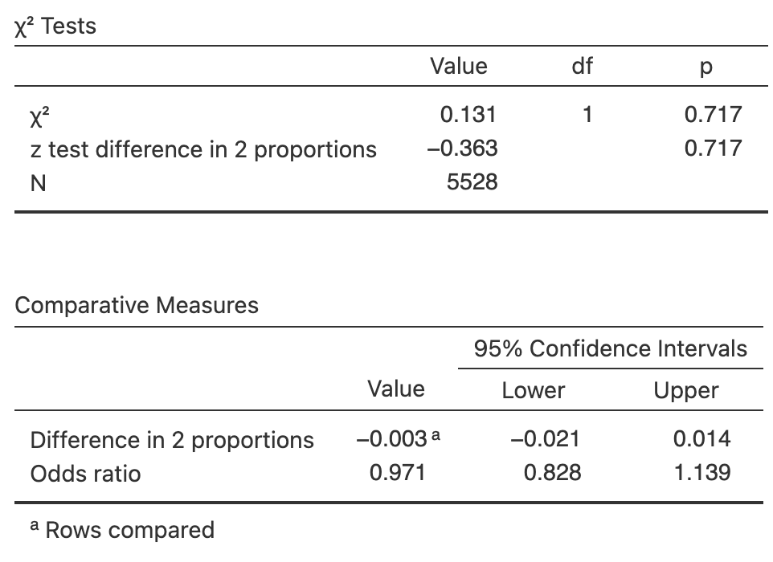
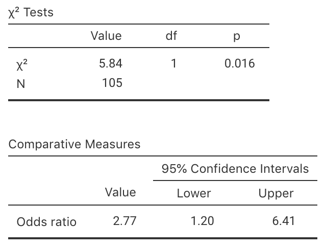

# Teaching Week 10: tutorial  {#Lecture10}

::: {.objectivesBox .objectives data-latex="{iconmonstr-target-4-240.png}"}
You will learn to:

* construct CIs and conduct hypothesis tests for ORs.
* construct CIs and conduct hypothesis tests for the difference between two proportions.
* estimate sample sizes for finding CIs.
* selecting an appropriate analysis for a given situation.
:::

::: {.assessmentBox .assessment data-latex="{iconmonstr-text-check-list-lined-240.png}"}
The Week\ 10 content is essential for:

* **Task\ 2B**, which requires you to *produce CIs and conduct a hypothesis test for your data*;
* **Quiz\ 4**, which includes questions about *understanding and producing CIs, understanding and conducting hypothesis tests, and estimating sample sizes*; and
* the **Exam**, which will contain questions about *understanding and producing CIs, understanding and conducting hypothesis tests, and estimating sample sizes*.
:::

::: {.readBox .read data-latex="{iconmonstr-school-15-240.png}"}
You will learn and practice the content associated with these chapters of the [textbook](https://peterkdunn.github.io/SRM-Textbook/):

* [Chapter\ 31 (CIs and tests: comparing two odds or proportions)](https://peterkdunn.github.io/SRM-Textbook/AnalysisOddsRatio.html)
* [Chapter\ 32 (Finding sample sizes for CIs)](https://peterkdunn.github.io/SRM-Textbook/EstimatingSampleSize.html)
* [Chapter\ 34 (Selecting an analysis)](https://peterkdunn.github.io/SRM-Textbook/SelectTest.html)

Take careful note of which chapters are covered in this tutorial!
:::

\pagebreak

## Quick revision {#QuickRevision-Tutorial10}

::: {.mentiQuestion data-latex="{iconmonstr-computer-6-240.png}"}
\null
:::

::: {.webex-box}
An ecologist is studying two different grasses to help combat soil salinity, by comparing to a new grass (Grass\ A) to a native grass (Grass\ B).
She uses $50$\ different sites, allocating the two grasses at random to the sites ($25$\ sites for each grass).

After $12$\ months, the ecologist records whether the soil salinity at each site has improved, and hence computes the *odds* that each grass will improve the salinity.
She finds a statistically significant difference between the odds in the two groups.

Which of these statements is *consistent* with this conclusion?

1. The $\text{OR} = 4.1$ and $P = 0.36$. \tightlist 
2. The $\text{OR} = 4.1$ and $P = 0.0001$.
3. The $\text{OR} = 0.91$ and $P = 0.36$.
4. The $\text{OR} = 0.91$ and $P = 0.0001$.  
\greyboxlines{3}
How would the other statements be interpreted then?
\greyboxlines{3}
:::

## Class discussion {#TW10-Class-Discussion}

::: {.discussBox .discuss data-latex="{iconmonstr-speech-bubble-26-240.png}"}
**Discuss**: When comparing two groups, is it better to focus on differences in *proportions*, *odds*, or *percentages*?
:::

## Consistency {#Consistency}

Suppose a researcher asked the RQ:

> For Australians, are the *odds* of people with mosquito bites the same for people sitting near a citronella candle as for people sitting near an ordinary wax candle?

1. Which would be the appropriate null hypothesis?

<label><input type="radio" autocomplete="off" name="radio_XXQSFWSBXM" value="answer"></input> The odds of a person being bitten by a mosquito is the same for people near citronella candles and wax candles</label><label><input type="radio" autocomplete="off" name="radio_XXQSFWSBXM" value=""></input> The proportion of people being bitten by a mosquito is the same for people near citronella candles and wax candles</label><label><input type="radio" autocomplete="off" name="radio_XXQSFWSBXM" value=""></input> Either of the above</label>

<!--
   a. The odds of a person being bitten by a mosquito is the same for people near citronella candles and wax candles.
   b. The proportion of people being bitten by a mosquito is the same for people near citronella candles and wax candles. 
   c. Either of the above.
-->
2. Which would be the appropriate CI to produce?

<label><input type="radio" autocomplete="off" name="radio_KBALNGCFCT" value="answer"></input> A CI for the odds ratio</label><label><input type="radio" autocomplete="off" name="radio_KBALNGCFCT" value=""></input> A CI for the difference in proportions</label><label><input type="radio" autocomplete="off" name="radio_KBALNGCFCT" value=""></input> Either of the above</label>

<!--
   a. A CI for the odds ratio.
   b. A CI for the difference in proportions.
   c. Either of the above.
-->
3. Which would be the appropriate hypothesis test?

<label><input type="radio" autocomplete="off" name="radio_WPRPVUNADB" value=""></input> A hypothesis tests for the difference between proportions</label><label><input type="radio" autocomplete="off" name="radio_WPRPVUNADB" value="answer"></input> A hypothesis tests for the odds ratio</label><label><input type="radio" autocomplete="off" name="radio_WPRPVUNADB" value=""></input> Either of the above</label>

<!--
   a. A hypothesis tests for the difference between proportions.
   b. A hypothesis tests for the odds ratio.
   c. Either of the above.
-->

   
## CI and test for odds ratios {#OddsSoftware}

<!-- Text wrap from: https://stackoverflow.com/questions/43551312/wrap-text-around-plots-in-markdown -->
<!-- Trick from: https://blog.earo.me/2019/10/26/reduce-frictions-rmd/ -->

The timing of pubertal maturation can vary, which can have impacts upon behaviour.
@data:duncan:maturity studied 'the relationships between maturational timing and body image, school behavior, and deviance.'
Sample data were collected from

> ...children and youth of the entire United States drawn by the National Center for Health Statistics... known as the National Health Examination Survey (1966--1970). 
> Data were collected on... adolescents' physical and psychological status...

The researchers asked the RQ;

> For US children, is the odds of a boy maturing late the *same* as the odds of a girl maturing late?

Part of the data are shown entered into jamovi (Fig.\ \@ref(fig:MaturationData-jamova-SPSS))

(\#fig:MaturationData-jamova-SPSS)Some of the maturation-data entered into jamovi.

1. For the $2\,864$ males in the sample, $352$ were classified as maturing late.  
   For the girls, $336$ of the $2\,664$ matured late.
   Use this information to construct a two-way table of sex against maturation time (Table\ \@ref(tab:MaturationData)).
   
<table>
<caption>(\#tab:MaturationData)Maturation and gender.</caption>
 <thead>
  <tr>
   <th style="text-align:left;">   </th>
   <th style="text-align:right;"> Matured late </th>
   <th style="text-align:right;"> Did not mature late </th>
   <th style="text-align:right;"> Total </th>
  </tr>
 </thead>
<tbody>
  <tr>
   <td style="text-align:left;"> Males </td>
   <td style="text-align:right;"> <input class='webex-solveme nospaces' data-tol='0.001' size='6' data-answer='["352"]'/> </td>
   <td style="text-align:right;"> <input class='webex-solveme nospaces' data-tol='0.001' size='6' data-answer='["2512"]'/> </td>
   <td style="text-align:right;"> <input class='webex-solveme nospaces' data-tol='0.001' size='6' data-answer='["2864"]'/> </td>
  </tr>
  <tr>
   <td style="text-align:left;"> Females </td>
   <td style="text-align:right;"> <input class='webex-solveme nospaces' data-tol='0.001' size='6' data-answer='["336"]'/> </td>
   <td style="text-align:right;"> <input class='webex-solveme nospaces' data-tol='0.001' size='6' data-answer='["2328"]'/> </td>
   <td style="text-align:right;"> <input class='webex-solveme nospaces' data-tol='0.001' size='6' data-answer='["2664"]'/> </td>
  </tr>
  <tr>
   <td style="text-align:left;"> Total </td>
   <td style="text-align:right;"> <input class='webex-solveme nospaces' data-tol='0.001' size='6' data-answer='["688"]'/> </td>
   <td style="text-align:right;"> <input class='webex-solveme nospaces' data-tol='0.001' size='6' data-answer='["4840"]'/> </td>
   <td style="text-align:right;"> 5528 </td>
  </tr>
</tbody>
</table>

2. What graphical summary could be used to display the information?
   Sketch this display.
\greyboxlines{4}
3. Among the boys, compute the *odds* of maturing late.
   Interpret this value.
\greyboxlines{2}
4. Among the girls, compute the *odds* of maturing late.
   Interpret this value.
\greyboxlines{2}
5. From the table, compute the odds ratio of a boy maturing late compared to a girl maturing late.
   Interpret this value, using the software output (Fig.\ \@ref(fig:BoysMaturejamovi)).
\greyboxlines{2}
6. What is the **parameter** of interest (make sure you specify the direction)?
\greyboxlines{2}
7. Write down the OR and the $95$%\ CI for the OR from the jamovi output. 
   What does it mean?
\greyboxlines{2}
8. Compile the numerical summary table for these data (Table\ \@ref(tab:MaturationSummary)).
9. Are boys generally more likely to mature later than girls? 
   Perform a hypothesis test.
\greyboxlines{4}

   **Vote below.**

  

(\#fig:BoysMaturejamovi)The jamovi output from the maturation study

(ref:MaturationSummaryCaption) Maturation and gender: numerical summary. (Enter proportions, odds and odds ratios **rounded** to **three** decimal places.)

<table>
<caption>(\#tab:MaturationSummary)(ref:MaturationSummaryCaption)</caption>
 <thead>
  <tr>
   <th style="text-align:left;">   </th>
   <th style="text-align:right;"> Proportion maturing late </th>
   <th style="text-align:right;"> Odds  maturing late </th>
   <th style="text-align:right;"> Sample size </th>
  </tr>
 </thead>
<tbody>
  <tr>
   <td style="text-align:left;"> Males </td>
   <td style="text-align:right;"> <input class='webex-solveme nospaces' data-tol='0.1' size='6' data-answer='["0.123",".123"]'/> </td>
   <td style="text-align:right;"> <input class='webex-solveme nospaces' data-tol='0.001' size='6' data-answer='["0.14",".14"]'/> </td>
   <td style="text-align:right;"> <input class='webex-solveme nospaces' data-tol='0.1' size='6' data-answer='["2864"]'/> </td>
  </tr>
  <tr>
   <td style="text-align:left;"> Females </td>
   <td style="text-align:right;"> <input class='webex-solveme nospaces' data-tol='0.1' size='6' data-answer='["0.126",".126"]'/> </td>
   <td style="text-align:right;"> <input class='webex-solveme nospaces' data-tol='0.001' size='6' data-answer='["0.144",".144"]'/> </td>
   <td style="text-align:right;"> <input class='webex-solveme nospaces' data-tol='0.1' size='6' data-answer='["2664"]'/> </td>
  </tr>
  <tr>
   <td style="text-align:left;">  </td>
   <td style="text-align:right;"> Diff: <input class='webex-solveme nospaces' data-tol='0.0025' size='6' data-answer='["-0.003","-.003"]'/> </td>
   <td style="text-align:right;"> OR: <input class='webex-solveme nospaces' data-tol='0.0025' size='6' data-answer='["0.971",".971"]'/> </td>
   <td style="text-align:right;">  </td>
  </tr>
</tbody>
</table>

## CIs and tests for ORs {#TestsForORs}

<!-- Text wrap from: https://stackoverflow.com/questions/43551312/wrap-text-around-plots-in-markdown -->
<!-- Trick from: https://blog.earo.me/2019/10/26/reduce-frictions-rmd/ -->

@data:Singh:lowerlimb examined the mortality rates of lower-limb amputation, and factors that may be associated with mortality.
As part of the study, the researchers recorded the five-year mortality rate (the number of amputees who died within five years of amputation) and whether or not the person used an artificial limb.

The RQ was:

> For this type of amputees, is the odds of being alive after five years the same for those who used an artificial limb, and those who did not?

A total of $105$ subjects were used: $35$ died within five years, and $70$ were still alive after five years.
In addition, $65$ subjects used an artificial limb, and $40$ did not.
	
1. After five years, $49$ people using an artificial limb were alive.
   Construct the $2\times 2$ table (Table\ \@ref(tab:ArtLimbMortality)) displaying the number of people alive or dead after five years (in columns, say) and whether or not they used an artificial limb or not (in rows).

<table>
<caption>(\#tab:ArtLimbMortality)Five-year mortality for artifical limb users.</caption>
 <thead>
  <tr>
   <th style="text-align:left;">   </th>
   <th style="text-align:right;"> Alive </th>
   <th style="text-align:right;"> Dead </th>
   <th style="text-align:right;"> Total </th>
  </tr>
 </thead>
<tbody>
  <tr>
   <td style="text-align:left;"> Used artificial limb </td>
   <td style="text-align:right;"> <input class="webex-solveme nospaces" data-tol="0.001" size="6" data-answer='["49"]'> </td>
   <td style="text-align:right;"> <input class="webex-solveme nospaces" data-tol="0.001" size="6" data-answer='["16"]'> </td>
   <td style="text-align:right;"> <input class="webex-solveme nospaces" data-tol="0.001" size="6" data-answer='["65"]'> </td>
  </tr>
  <tr>
   <td style="text-align:left;"> Did not use artificial limb </td>
   <td style="text-align:right;"> <input class="webex-solveme nospaces" data-tol="0.001" size="6" data-answer='["21"]'> </td>
   <td style="text-align:right;"> <input class="webex-solveme nospaces" data-tol="0.001" size="6" data-answer='["19"]'> </td>
   <td style="text-align:right;"> <input class="webex-solveme nospaces" data-tol="0.001" size="6" data-answer='["40"]'> </td>
  </tr>
  <tr>
   <td style="text-align:left;font-weight: bold;"> Total </td>
   <td style="text-align:right;font-weight: bold;"> <input class="webex-solveme nospaces" data-tol="0.001" size="6" data-answer='["70"]'> </td>
   <td style="text-align:right;font-weight: bold;"> <input class="webex-solveme nospaces" data-tol="0.001" size="6" data-answer='["35"]'> </td>
   <td style="text-align:right;font-weight: bold;"> 105 </td>
  </tr>
</tbody>
</table>

2. In Table\ \@ref(tab:ArtLimbMortality), *why* is the use (or not) of artificial limbs listed in the *rows* (rather than the *columns*)?
3. For a person using an artificial limb, compute the odds of being alive after five years.
   For a person *not* using an artificial limb, compute the odds of being alive after five years.
   Then compute the odds ratio, complete Table\ \@ref(tab:ArtLimbSummary), and carefully explain what the OR means.
\greyboxlines{4}
4. Write down the $95$%\ CI for the population OR using the software output (Fig.\ \@ref(fig:limbsOutputjamovi)). 
\greyboxlines{2}
5. Perform a hypothesis test to compare the odds of being alive after five years for both groups (Fig.\ \@ref(fig:limbsOutputjamovi)):

    a. Write the hypotheses.
\greyboxlines{2}
    b. Write down the value of\ $\chi^2$.
\greyboxlines{2}
    c. What $z$-score is this equivalent to?
\greyboxlines{2}
    d. What is the approximate $P$-value using the $68$--$95$--$99.7$ rule?
\greyboxlines{2}
    e. What is the exact $P$-value as reported by software?
\greyboxlines{2}
    f. Write a conclusion.
\greyboxlines{2}

<table>
<caption>(\#tab:ArtLimbSummary)Five-year mortality and use of an artificial limb: numerical summary.</caption>
 <thead>
<tr>
<th style="empty-cells: hide;border-bottom:hidden;" colspan="1"></th>
<th style="border-bottom:hidden;padding-bottom:0; padding-left:3px;padding-right:3px;text-align: right; font-weight: bold; " colspan="1">
Proportion alive
</th>
<th style="border-bottom:hidden;padding-bottom:0; padding-left:3px;padding-right:3px;text-align: right; font-weight: bold; " colspan="1">
Odds of being alive
</th>
<th style="border-bottom:hidden;padding-bottom:0; padding-left:3px;padding-right:3px;text-align: right; font-weight: bold; " colspan="1">
Sample
</th>
</tr>
  <tr>
   <th style="text-align:left;">   </th>
   <th style="text-align:right;"> after 5 years </th>
   <th style="text-align:right;"> after 5 years </th>
   <th style="text-align:right;"> size </th>
  </tr>
 </thead>
<tbody>
  <tr>
   <td style="text-align:left;"> Use artificial limb </td>
   <td style="text-align:right;"> <input class="webex-solveme nospaces" data-tol="0.002" size="6" data-answer='["0.754",".754"]'> </td>
   <td style="text-align:right;"> <input class="webex-solveme nospaces" data-tol="0.001" size="6" data-answer='["3.062"]'> </td>
   <td style="text-align:right;"> <input class="webex-solveme nospaces" data-tol="0.1" size="6" data-answer='["65"]'> </td>
  </tr>
  <tr>
   <td style="text-align:left;"> Did not use artifical limb </td>
   <td style="text-align:right;"> <input class="webex-solveme nospaces" data-tol="0.002" size="6" data-answer='["0.525",".525"]'> </td>
   <td style="text-align:right;"> <input class="webex-solveme nospaces" data-tol="0.001" size="6" data-answer='["1.105"]'> </td>
   <td style="text-align:right;"> <input class="webex-solveme nospaces" data-tol="0.1" size="6" data-answer='["40"]'> </td>
  </tr>
  <tr>
   <td style="text-align:left;">  </td>
   <td style="text-align:right;"> Diff in proportions: <input class="webex-solveme nospaces" data-tol="0.002" size="6" data-answer='["0.229",".229"]'> </td>
   <td style="text-align:right;"> OR:  <input class="webex-solveme nospaces" data-tol="0.005" size="6" data-answer='["2.771"]'> </td>
   <td style="text-align:right;">  </td>
  </tr>
</tbody>
</table>

(\#fig:limbsOutputjamovi)The jamovi output for the question on lower-limb amputees.

## Identify the correct analysis {#IdentifyCorrectAnalyses}

<iframe src="https://usc.h5p.com/content/1290972415580046319/embed" width="1088" height="511" frameborder="0" allowfullscreen="allowfullscreen" allow="geolocation *; microphone *; camera *; midi *; encrypted-media *"></iframe>

## Sample size calculations {#RoomWidthCISampleSize}

::: {.videoSolutionBox .videoSolution data-latex="{iconmonstr-youtube-10-240.png}"}
This question has a video solution in the online book, so you can hear and see the solution.
:::

Shortly after metric units were introduced to Australia in 1977, a lecturer wondered how accurately students could estimate lengths using the metric measurements [@data:hand:handbook].

The aim of the study was to determine if, on average, students could correctly guess the width of the hall (which was $13.1\ms$).

The $44$ individual students' guesses had a standard deviation of $7.145\ms$.
Suppose the Professor wanted to try the study again with another groups of students, and wanted to estimate the population mean to within $0.5\ms$.

What size sample would Prof. Lewis need?
\greyboxlines{4}

