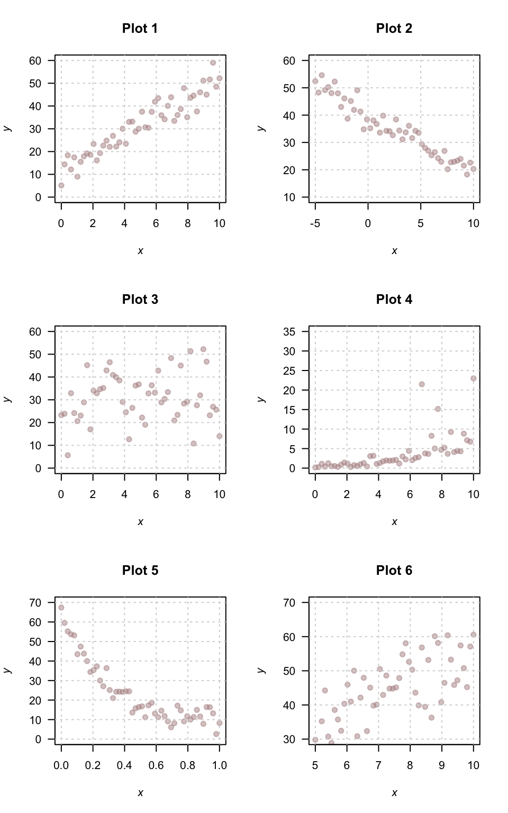
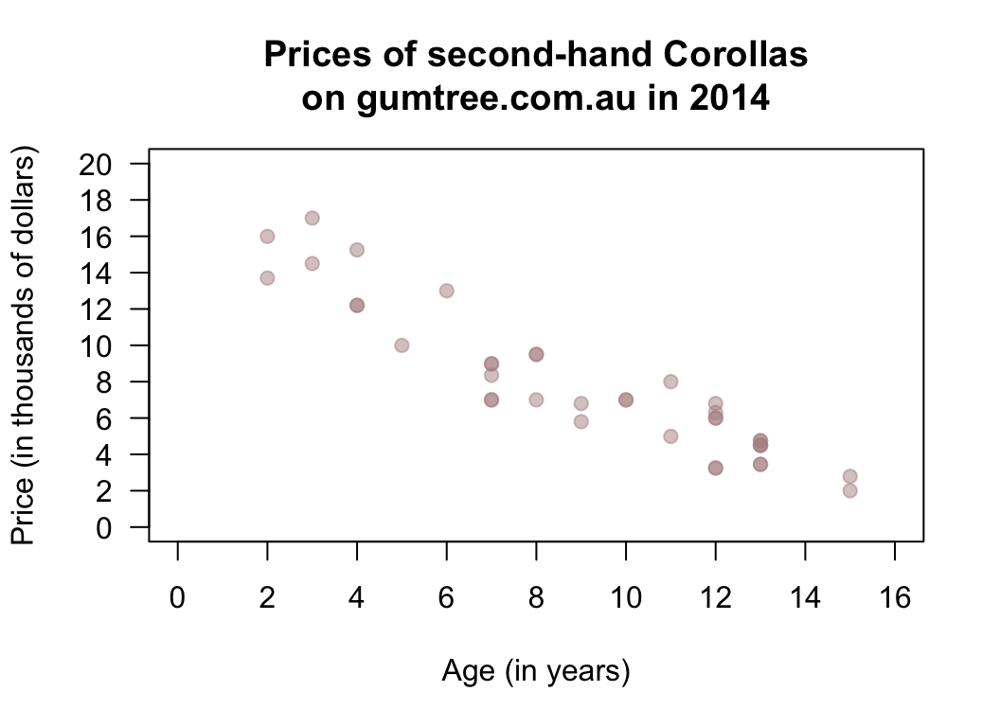
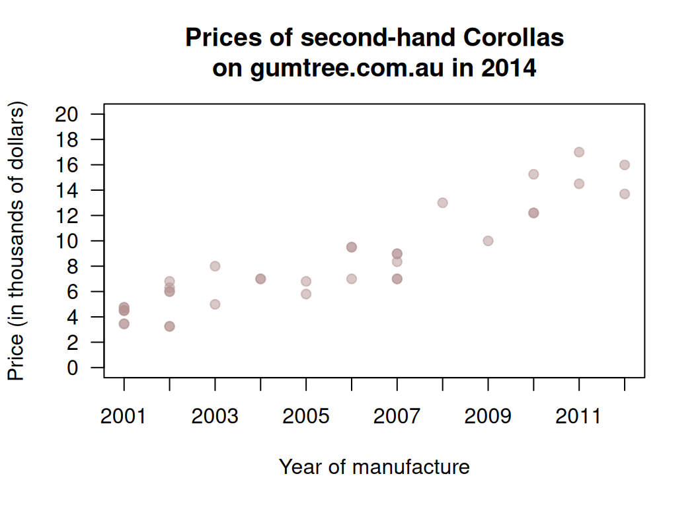

# Teaching Week 12: Tutorial  {#Lecture12}

::: {.objectivesBox .objectives data-latex="{iconmonstr-target-4-240.png}"}
You will learn to:

* construct CIs and conduct hypothesis tests for correlation coefficients.
* understand linear equations.
* estimate the parameters in simple linear regression models.
* find the parameters in simple linear regression models from software.
* construct CIs and conduct hypothesis tests for regression coefficients.
:::

::: {.assessmentBox .assessment data-latex="{iconmonstr-text-check-list-lined-240.png}"}
The Week\ 12 content is essential for:

* the **Exam**, which will contain *many* questions about *understanding correlation and regression*.
:::

::: {.readBox .read data-latex="{iconmonstr-school-15-240.png}"}
You will learn and practice the content associated with these chapters of the [textbook](https://peterkdunn.github.io/SRM-Textbook/):

* [Chapter\ 33 (Correlation and regression)](https://peterkdunn.github.io/SRM-Textbook/CorrelationRegression.html)
:::

\pagebreak

## Quick revision {#QuickRevision-Tutorial12}

::: {.mentiQuestion data-latex="{iconmonstr-computer-6-240.png}"}
\null
:::

::: {.webex-box}
A study of how weeds spread [@khan2018alien] studied various factors about vehicles that might carry seeds.
The researchers found a correlation between the number of grams of mud on a vehicle and the number of seeds carried by the vehicle.

In autumn, the correlation coefficient was given as $r = 0.931$.

1. In this study, what variable would be the $x$-variable? \tightlist  
\greyboxlines{1}
2. In this study, what variable would be the $y$-variable?
\greyboxlines{1}
3. What is the value of $R^2$?
\greyboxlines{1}
4. The regression equation is given as $\hat{y} = 137.4 + 0.3459x$. 
   If $700\\gs$ of mud is found on the car, how many seeds are predicted to be carried by the vehicle?
\greyboxlines{2}
5. In this regression equation, the slope means:
\greyboxlines{2}
6. The $P$-value for the regression slope was $0.002$. 
   What does this mean?
\greyboxlines{2}
:::

## Class discussion {#TW12-Class-Discussion}

::: {.discussBox .discuss data-latex="{iconmonstr-speech-bubble-26-240.png}"}
**Discuss**: The values of $y$ (the data) and $\hat{y}$ (the model predictions) should be as close as possible.
:::

## Understanding correlations and regression {#UnderstandCorrelationsRegressions}

On *each* scatterplot in Fig.\ \@ref(fig:Guesses) for which a linear relationship is appropriate (there are *four*!):

1. Draw or estimate the 'best' straight regression line (where appropriate).
2. From the line in **Part\ 1.** above, estimate the **slope** for each line.
\greyboxlines{4}
3. From the line in **Part\ 1.** above, estimate the **intercept** for each line.
\greyboxlines{4}
4. Then write down an estimate of the regression line equation.
\greyboxlines{4}

(\#fig:Guesses)Six different scatterplots.

## Interpreting regressions {#InterpretRegressions}

<!-- Text wrap from: https://stackoverflow.com/questions/43551312/wrap-text-around-plots-in-markdown -->
<!-- Trick from: https://blog.earo.me/2019/10/26/reduce-frictions-rmd/ -->

I was wondering about how the age of second-hand cars impact their price.
On 25\ June, 2014, I searched
[Gum Tree](https://www.gumtree.com.au),
for `Toyota Corolla` in the 'Cars, Vans \& Utes' category.
The age and the price of each (second-hand) car was recorded from the first two pages of results that were returned.

I then restricted the data to cars $15$ years old or younger
(and removed one $13$-year-old Corolla advertised for sale for $390\,000, assuming this was an error).
I then produced the scatterplot in Fig.\ \@ref(fig:CorollasPriceAge).

(\#fig:CorollasPriceAge)The price of second-hand Toyota Corollas as advertised on Gum Tree on 25 June 2014 plotted against age ($n = 38$).

1. Describe the relationship displayed in the graph in words. \tightlist
\greyboxlines{2}
2. What else could influence the price of a second-hand Corollas? 
\greyboxlines{3}
3. From the scatterplot, draw (if you can) or estimate by eye an approximation of the regression line.
4. On the scatterplot, locate a seven-year-old Corolla selling for $15\,000.
   Would this be cheap or expensive?
\greyboxlines{2}
5. As stated, I removed one observation: a $13$-year-old Corolla for sale at $390\,000.
   What do you think the price was meant to be listed as, by looking at the scatterplot?
	 Explain.
\greyboxlines{2}
6. *Estimate* the value of\ $b_0$ (the intercept) from the line you drew.
   What does this mean?
   Do you think this value is meaningful?
\greyboxlines{3}
7. *Estimate* the value of\ $b_1$ (the slope) from the line you drew.
   What does this mean?
   Do you think this value is meaningful?
\greyboxlines{3}
8. From the line you drew above, write down an *estimate* of the regression equation.
\greyboxlines{3}
9. Use the software output (Fig.\ \@ref(fig:CorollasPriceAgeCorrelationjamovi) and Fig.\ \@ref(fig:CorollasPriceAgeRegressionjamovi) (jamovi)) relating the price (in thousands of dollars) to age to write down the regression equation.
\greyboxlines{2}
10. Using the software output, write down the value of\ $r$.
    Using this value of\ $r$, compute the value of\ $R^2$.
    What does this mean?
\greyboxlines{3}
11. Use the regression equation from the software output to estimate the sale price of a Corolla that is $20$\ years old, and explain your answer. \tightlist
\greyboxlines{3}
12. Using the software output, perform a suitable hypothesis test to determine if there is evidence that lower prices are associated with older Corollas.
\greyboxlines{4}
13. Compute an approximate $95$% confidence interval for the population slope (use the software output in **Fig.\ \@ref(fig:CorollasPriceAgeRegressionjamovi)**).
\greyboxlines{4}
14. I could have drawn a scatterplot with Price on the vertical (up-and-down) axis and Year of manufacture on the horizontal (left-to-right) axis (**Fig. \@ref(fig:CorollasPriceYear)**).
    For this  graph:

    a. What is the value of the correlation coefficient?
\greyboxlines{2}
    b. How would the value of\ $R^2$ change?
\greyboxlines{2}
    c. How would the value of the slope change?
\greyboxlines{2}
    d. How would the value of the intercept change?
\greyboxlines{2}

(\#fig:CorollasPriceAgeCorrelationjamovi)The jamovi correlation output, analysing the Corolla data.

(\#fig:CorollasPriceAgeRegressionjamovi)The jamovi regression output, analysing the Corolla data.

(\#fig:CorollasPriceYear)The price of second-hand Toyota Corollas as advertised on Gum Tree on 25 June 2014 plotted against the year of manufacture ($n = 38$).

## Regression and correlation {#RegressionCorrelation}

Draw the regression line corresponding to $\hat{y} = 5 + 2x$ for values of $x$ between\ $0$ and\ $10$.

1. Add some points to the scatterplot such that the correlation is approximately $r = 0.9$.
\greyboxlines{5}
2. Add some more points to the scatterplot such that the correlation is approximately $r = 0.3$.
\greyboxlines{5}
